> ## Documentation Index
>
> Fetch the complete documentation index at: https://docs.guild.com.ng/llms.txt
> Use this file to discover all available pages before exploring further.

# It starts with Musa.

> Receipts for the people the banks forgot.

He is twenty-eight. A bricklayer in Modakeke, just outside Ile-Ife. On a good day he lays block until his hands crack and walks home with ₦4,000 in his pocket — cash, always cash. On a bad day he sits at the junction with the other men, waiting on a foreman who skims twenty percent off the top before he passes the rest down.

Musa cannot read or write. When there is a form, a neighbour fills it. When there is work nearby, he hears about it by luck — or he doesn't, and someone else gets the day.

Last year he needed ₦15,000. Just enough for his own set of tools, so he could stop renting Sule's. The bank asked for a transaction history he does not have. The cash was real. The sweat was real. But to the people who decide who gets credit, Musa does not exist.

There are **forty-one million** Nigerians like Musa. The work is real. The money is real. The proof is not.

### And there is Mama Bisi

She has sold from the same corner of the market for years. Money moves through her hands every single day — a sachet here, a measure of rice there, naira folded into the hem of her wrapper. She has raised children on it. She has not missed a day in longer than she can remember.

Ask her bank for a small loan to restock and it asks for statements she cannot produce. Every kobo she has ever earned ran through her fingers and left no trace a system could read. The most dependable trader on the street is, to a lender, a complete stranger.

Guild is for both of them.

## What Guild is

Guild gives Musa a receipt for every day he works.

Engr. Adekunle Ogundimu, a site contractor in Bodija, posts a job through his dashboard — five bricklayers, three days, ₦4,000 a day, Yoruba preferred. The moment he hits submit, ₦60,000 leaves his Access Bank account (OPay direct debit) and lands in escrow tied to this exact job. The money is committed before the first brick is laid.

Our matching model puts Musa, a bricklayer in Modakeke who speaks Yoruba, at the top of Adekunle's list. WhatsApp pings Musa: _"Adekunle dey hire bricklayers for Bodija, ₦4,000/day. Reply YES to apply."_ He replies YES. Adekunle approves.

Three days, three shifts. Each day Musa shows up, the foreman marks attendance, ₦4,000 releases from escrow to Musa's Guild wallet automatically. End of the third day, Musa has ₦12,000. He sends _withdraw_ on WhatsApp and OPay pays out to his Access Bank account in under ten seconds.

Every step — the escrow fund, each shift release, the final payout — writes to an append-only ledger nobody can edit. Not Adekunle. Not us.

Three months of this, and Musa walks into a bank with the receipts.

That is Guild.

<Note>
  **Receipts for the people the banks forgot.**

Every job, every kobo, every conversation runs through OPay and lands in a ledger a lender can verify.
</Note>

## What Guild actually connects

Three sides. One ledger.

<CardGroup cols={3}>
  <Card title="Job Seekers" icon="user">
    Bricklayers, tailors, drivers, mechanics, cleaners, traders' apprentices. Anyone whose income arrives in cash on uneven days. They get visibility, voice in their own language, and a record that compounds into credit identity.
  </Card>

  <Card title="Employers" icon="briefcase">
    Site contractors, hospitality operators, retail owners, smallholder agribusinesses. They get verified candidates ranked by skill and location, attendance proof on the ledger, and per-shift releases that go to zero ghost workers.
  </Card>

  <Card title="Banks & financial services" icon="building-columns">
    Commercial banks, microfinance institutions, credit fintechs, insurers. They get consent-gated signed snapshots of real economic activity — the data a bank could never read from cash transactions, now in a format their underwriting model understands.
  </Card>
</CardGroup>

Connecting any two of these solves a piece of the problem. Connecting all three is the loop that closes — work creates receipts, receipts unlock credit, credit funds more work.

## What is underneath

Every payment runs through **OPay**. We wrap twenty-three OPay surfaces — direct debit, payouts, virtual accounts, webhooks, transactional SMS, card linking, bills, reconciliation. The five that matter most fire in every payment story you'll read on this site.

And the intelligence runs on **Google Gemini** — it transcribes voice notes across five languages and reads a photo of a paper sales notebook, turning scattered, spoken proof into one structured record a lender can verify. OPay moves the money; Gemini reads the work.

Every conversation runs through one of five rails. Which rails are open to a person depends on who they are.

<CardGroup cols={2}>
  <Card title="Voice" icon="phone" href="/channels/voice">
    **For Job Seekers.** Tola, our voice agent, answers in Nigerian English. A bricklayer in Modakeke on a Tecno Spark dials the Guild number. Six tools live on the call: sign up, find work, get job details, apply, update profile, set skills. Tola code-switches into Pidgin, Yoruba, Igbo, Hausa when the caller does.
  </Card>

  <Card title="WhatsApp text" icon="whatsapp" href="/channels/whatsapp-text">
    **For everyone.** Our intent engine understands twenty-three intents across five languages. Send a voice note and we transcribe it. Reply YES and we read your conversation state, find the job you were offered, and apply for you.
  </Card>

  <Card title="WhatsApp Calling" icon="phone-volume" href="/channels/whatsapp-calling">
    **For everyone.** Tap the call button inside your WhatsApp chat with Guild. Meta dials our SIP bridge on TLS 5061; we transcode the audio and route the call straight to Tola.
  </Card>

  <Card title="SMS" icon="message" href="/channels/sms">
    **For Job Seekers and Traders.** Two-way conversational SMS over our own gateway infrastructure. Direct device-level rails, not a third-party API.
  </Card>

  <Card title="Web" icon="window" href="/channels/web">
    **For everyone.** Job Seeker, trader, and employer dashboards at guild.com.ng. Partner Dashboard at partners.guild.com.ng. Phone plus one-time passcode. No password. Same identity record across every channel.
  </Card>
</CardGroup>

Behind the channels: a standing model that reads the ledger and assigns a tier. A matching model that ranks candidates the moment a job goes live. A negotiation engine that adapts from every accept and decline. A transcription model that reads voice notes in five languages.

The architecture is built for a national footprint. The work is built for one informal job seeker at a time.

## Why this is personal

We did not meet Musa and Mama Bisi in a research deck. We grew up in their homes.

Guild is built by five students at Obafemi Awolowo University — children of bricklayers and traders, raised on borrowed phones and cybercafé hours. One of us carried block on his head at ten, beside his father. One watched his father run a savings cooperative for the unbanked out of a filling station, marking paper cards by hand late into the night. We are not building for a persona. We are building for the people who raised us.

<Card title="Meet Team BlockX" icon="users" href="/team">
  Five builders from OAU — and the families that put us here.
</Card>

Guild runs on **OPay** rails, thinks with **Google Gemini**, and was designed with **Canva**.

## Where to go from here

<CardGroup cols={2}>
  <Card title="How it works" icon="route" href="/how-it-works">
    Adekunle posts a job. Musa applies. OPay moves the money. The score updates. Walk through the whole arc, end to end, in one page.
  </Card>

  <Card title="Quick start" icon="bolt" href="/quick-start">
    Three ways to feel Guild in five minutes — call Tola, post a test job, fetch a snapshot.
  </Card>

  <Card title="Standing score" icon="chart-line" href="/standing/how-it-works">
    Four tiers, calibrated to Nigerian informal-economy patterns. Building, Emerging, Trusted, Established. How the ledger feeds the model.
  </Card>

  <Card title="Partner Portal" icon="building-columns" href="/partners/overview">
    Read consent-gated snapshots of a worker's standing tier and audit-ledger window. Underwrite on signed data, not vouching letters.
  </Card>
</CardGroup>

<Tip>
  Every page on this site is written to give you something useful in the first thirty seconds, and depth if you stay. If you came in cold, start with [How it works](/how-it-works). If you came in technical, start with [Architecture](/architecture/services).
</Tip>

Documentation Index
Fetch the complete documentation index at: /llms.txt

Use this file to discover all available pages before exploring further.

Skip to main content

Search...
⌘K
Dashboard

Documentation
API Reference
Get Started
Introduction
The mission
How it works
The team
Quick start
For Job Seekers
Overview
Sign up
Find work
Get paid
Standing score
Savings
For Traders
Overview
Virtual account
Take payments
Sales velocity
Bills
For Employers
Overview
Post a job
Link a bank
Pay Job Seekers
Escrow
Reports
For Partners
Overview
API keys
Consent
Snapshots
Webhooks
Rate limits
Channels
Voice
WhatsApp text
WhatsApp Calling
SMS
Web
Standing & the Ledger
How it works
The four tiers
Audit ledger
Feedback loop
Architecture
Overview
Services
OPay integration
OPay reference
ML layer
Data flow
Infrastructure
SMS infrastructure
SIP infrastructure
Inter-service comms
Resilience & scale
Observability
Security & Trust
Overview
Webhook verification
Audit ledger
KYC tiers
NDPR

On this page
The problem we set out to solve
The five capabilities at Guild’s core
How we hit each of the four pillars
How it scales
Three additional commitments the brief implicitly assumes
What to read next
Get Started
The mission
OPay Scholars 2026. How Guild maps to the challenge.

This page exists so anyone evaluating Guild for the OPay Scholars 2026 National Innovation Challenge can verify the alignment in two minutes.
​
The problem we set out to solve
A mid-sized African nation is experiencing high youth unemployment and a fragmented informal economy. Design an intelligent economic system powered by data and AI that connects informal traders, job seekers, and financial services in one ecosystem. What does it look like, how does it work, and how does it scale?
Forty-one million Nigerians work in the informal economy. They earn every day. They spend every day. They keep families running. But to a bank’s underwriting model, they don’t exist — because there is no transaction trail a system can read.
The fragmentation runs across three sides at once. Job Seekers can’t prove their work history. Employers lose ten to fifteen percent of their labour cost to ghost workers and middlemen. Financial institutions, even the ones who want to lend, have no way to underwrite people whose income is real but invisible.
Connecting any two of those sides is incrementally useful. Connecting all three is the bet.
​
The five capabilities at Guild’s core
Guild was built to deliver five core capabilities for informal-economy inclusion. Each one is a real surface in the product today.

1. Identify and digitally onboard informal traders and job seekers
   Three onboarding rails so nobody is excluded by their device:
   Voice (offline phone call). A bricklayer in Modakeke on a Tecno Spark dials Guild. Tola, our voice agent, asks three questions in Nigerian English: name, location, what they do. Account created.
   WhatsApp. A trader at Oje Market sends “I want to join.” A five-step Flow inside the chat completes the signup.
   Web. Phone + OTP. No password.
   Same identity record across all three. Tier 1 is phone + OTP. Tier 2 adds profile + payout bank. Tier 3 adds BVN, NIN, and address verification — at which point the user is eligible for the full partner consent flow.
   More detail: Sign up, Trader onboarding, Employer onboarding.
2. Match job seekers to opportunities using AI
   The four factors are exactly the four the brief names: skill, location, language, economic context.
   Our matching model is a learning-to-rank tree ensemble (lambdarank objective). It runs the moment any job posts, scores every plausible candidate, and surfaces the top names to the employer’s dashboard while pinging the top candidates on the rails they use (WhatsApp, SMS, outbound voice call).
   Skill: trade category match, skill-tag overlap, experience level fit, past similar-job completion count.
   Location: distance in km, state match, area-within-city match, distance-decay weighting.
   Language: preferred language vs spoken languages, with strict-match and partial-match scoring.
   Economic context: standing tier, on-time rate, average review, recent activity, tenure, repeat-employer count.
   Inference takes under 100ms for a typical candidate pool. Retrained nightly on the day’s new completed-job and review data.
   More detail: Matching model, Find work.
3. Connect traders and workers to financial services
   Credit, savings, insurance, and payments — all on the same ledger, all underwritten on alternative data and behavioural signals rather than traditional credit history.
   Payments. Live today through OPay. Direct debit from employer to Job Seeker’s wallet to Job Seeker’s bank in seconds.
   Savings. Rules-based automatic transfers from wallet to a separate savings balance. Goal tracking. Withdraw to bank.
   Credit. The Partner API surfaces signed snapshots of a user’s standing tier, behavioural signals, and audit ledger to partner financial institutions. They underwrite on what we send. Inventory advances for traders. Tool-equipment loans for skilled Job Seekers.
   Insurance. Same ledger, future product surface.
   The standing score is the alternative-data underwriting signal. A Job Seeker who has completed 38 jobs in 90 days with an average review of 4.7 is creditable. A trader with ₦95k daily inflow velocity across 47 distinct customers is creditable. The data says so.
   More detail: Standing score, Sales velocity, Partner Portal, Partner API → Snapshots.
4. Learn and improve over time as data flows
   Four models, each one calibrated by the platform’s continuous activity.
   Standing model. Retrained nightly on new ledger rows. The longer Guild runs, the sharper the tier assignment.
   Matching model. Retrained nightly on the day’s accept/decline/complete signals. Employer approvals and Job Seeker completions are direct training signal.
   Negotiation engine. Online Thompson-sampling bandit. Posterior updates immediately on every accept or decline. Each (segment × bucket) pair gets sharper with every interaction.
   Transcription model. Calibrated to Nigerian English, Pidgin, Yoruba, Igbo, Hausa.
   The data flywheel is not aspirational. It is the operating mode.
   More detail: ML layer.
5. Integrate OPay API as a core transactional and data layer
   Not optional, per the brief. Not optional in our architecture either.
   Twenty-three OPay surfaces wrapped in one client. Five fire on every payment story you’ll read on this docs site:
   Direct Debit (Mandates). Employers link a bank once via the ₦50 confirmation transfer. After that, every job posting auto-funds escrow.
   Payouts. NIBSS-backed transfers to any Nigerian bank in seconds.
   Webhooks. Three signature schemes verified, reconcile-guarded against OPay’s authoritative verify endpoint before any wallet credit.
   Virtual Accounts. Static B2B accounts for traders. Dynamic VAs for invoice-specific collections.
   Transactional SMS. OTPs, balance alerts, payment confirmations.
   The other eighteen cover card linking, direct-payment fallbacks, bills (airtime, data, electricity), and reconciliation. Wired. Production-grade. Every OPay call carries a ULID idempotency key with Postgres-durable + Redis fast-path replay protection. Every OPay call is wrapped in an opossum circuit breaker. Every webhook is verified with crypto.timingSafeEqual before processing.
   More detail: OPay integration, OPay reference.
   ​
   How we hit each of the four pillars
   The OPay Scholars 2026 National Innovation Challenge weighs solutions across four innovation pillars. Guild engages all four — meaningfully, not symbolically. Here’s how each surfaces in the system today.
   AI Automation
   AI-powered workflows that automate the future of financial technology.
   Tola, our voice agent. Inbound and outbound calls in Nigerian English with code-switching into Pidgin, Yoruba, Igbo, Hausa. Six tools fire on a single call — sign up, list jobs, get details, apply, update profile, set skills.
   WhatsApp intent engine. Twenty-three conversational intents across five languages. Voice notes interpreted by our transcription model and routed to the same intent engine as typed messages.
   WhatsApp Calling. Tap-to-call Tola from inside the chat. SIP bridge with Opus-to-PCMU transcoding. No separate dial.
   Auto-funded escrow. A job posts, escrow funds, releases fire per shift as attendance is marked. Zero employer taps after submit.
   Outbound nudges. The matching model surfaces a high-fit candidate; voice-svc places the outbound call.
   No human in the loop for any of these workflows.
   Use of Data
   Predictive, data-driven solutions that protect communities and keep transactions secure in real time.
   Append-only audit ledger. Every job, every shift, every payment, every webhook is a row. BEFORE UPDATE OR DELETE triggers reject mutation. The history is structurally immutable.
   Standing model. Four-tier classifier reading the ledger. Recomputed nightly. Surfaces to the dashboard and to the Partner API as a signed snapshot.
   Matching model. Lambdarank, four factors (skill, location, language, economic context), retrained nightly on accept/decline/complete signals.
   Negotiation engine. Online Thompson-sampling bandit, per-segment Beta posteriors, updates on every interaction.
   Webhook reconcile guard. Every credit-bearing webhook is re-verified against OPay’s authoritative endpoint before any wallet credit. Defends against signature-replay even if a secret leaks.
   Encrypted PII. BVN, NIN, address — envelope-encrypted, AAD-bound to user ULID. A database leak alone gives only ciphertext.
   OPay APIs
   Smart financial services scaling on OPay’s powerful API stack.
   23 surfaces wrapped in one client. Direct debit (mandates), payouts, virtual accounts (static + dynamic), reconciliation, transactional SMS, hosted checkout, card linking, direct-payment fallbacks, bills (airtime/data/electricity).
   5 surfaces fire on every payment story. Direct debit, payouts, webhooks, virtual accounts, transactional SMS.
   Three signature schemes verified on inbound webhooks. Timing-safe comparison every time.
   Idempotency end to end. ULID keys on every OPay call. Postgres-durable + Redis fast-path. No double debits, ever.
   Circuit breakers with cached-response fallback on read-only endpoints. Demo-resilience without sacrificing correctness.
   Full reference: OPay: complete surface reference.
   Financial Innovation
   Bold solutions that transform how money moves.
   Receipts for the people the banks forgot. Every kobo through OPay lands in a ledger a lender can verify. Three months of activity becomes credit identity.
   Three-way marketplace. Job Seekers ↔ Employers ↔ Banks & financial services. Connecting any two is incrementally useful; connecting all three closes the loop.
   Escrow-on-post. Employer’s bank is debited at the moment a job posts, not the moment it ends. Funds release per shift as attendance is marked. Zero ghost workers.
   The Partner API. Consent-gated, signed snapshots. Underwriting on alternative data, not credit-bureau lookups. Inventory advances for traders. Tool-equipment loans for skilled Job Seekers.
   One ledger, four products. Payments today. Credit through the standing score. Savings through wallet-source rules. Insurance on the same ledger when it ships.
   ​
   How it scales
   The brief asks for a path from a 10,000-user pilot to national deployment. Our architecture was designed for it from day one.
   Concern Path from 10K to national
   Compute PM2 cluster mode on a single VPS handles ~50K daily-active users. From there, horizontal scaling: multiple VPS with a load balancer in front of nginx, stateless services let us add capacity by adding hosts.
   Database One Postgres cluster with read replicas covers ~500K users. Partitioning by user-ID range comes online when individual schemas approach 100M rows; the application is partition-aware in its query patterns already.
   Redis One Redis instance handles the platform through ~200K daily-active users for sessions, idempotency, queues. Shard by purpose (sessions vs queues vs bandit) at higher scale.
   R2 Cloudflare-native; scales without our intervention.
   OPay rate limits OPay’s published limits accommodate millions of merchants. We’ve stress-tested up to our committed initial usage. Above that, OPay provisions dedicated capacity per enterprise contract.
   ML inference ml-service is stateless. Add replicas behind a load balancer when latency-sensitive inference (matching at job-post time) approaches the single-instance ceiling.
   Voice (Tola) Voice runtime infrastructure scales horizontally per call concurrency. Our SIP bridge (Asterisk) is single-host today; clustering is a known capacity-planning task at the 10K-concurrent-call threshold.
   SMS Two-way SMS goes through our gateway (paired Android devices with Nigerian SIMs). We add devices as volume grows. One-way transactional SMS goes through OPay and scales with OPay’s infrastructure.
   More detail: Resilience & scale.
   ​
   Three additional commitments the brief implicitly assumes
   The brief mentions ethics and viability. We took those seriously.
   Commitment What it means
   Consent is the user’s, not the platform’s. Every partner read happens through a per-user, per-partner, scope-bounded consent the user explicitly granted. The user can revoke at any time from their dashboard. We don’t sell data. We don’t pool it across our user base for unrelated downstream uses.
   The audit ledger is structurally immutable. BEFORE UPDATE OR DELETE triggers on the audit tables reject mutation. Even Guild’s own engineers cannot alter the history. That permanence is what makes the receipts trustable as a credit signal.
   PII never sits plaintext. BVN, NIN, last name, full address — all envelope-encrypted with a master key in environment, AAD-bound to the user’s ULID. A database leak alone gives an attacker ciphertext, not readable PII.
   More detail: Security & trust.
   ​
   What to read next
   Introduction
   The Musa story. The thesis. The five rails.
   How it works
   Adekunle posts a job. Musa applies. Money moves. The score updates. The lender reads.
   Architecture
   Eight services, sixteen shared packages, the OPay client at the centre.
   The Partner Portal
   The third side of the connection — banks and financial services reading signed snapshots.
   Introduction
   How it works
   Powered by
   This documentation is built and hosted on Mintlify, a developer documentation platform
   The mission - Guild

> ## Documentation Index
>
> Fetch the complete documentation index at: https://docs.guild.com.ng/llms.txt
> Use this file to discover all available pages before exploring further.

# How it works

> Adekunle posts a job. Musa applies. OPay moves the money. The score updates. The whole arc, end to end, in one page.

Pretend you're standing at the back of a small site office in Bodija, Ibadan. It's Tuesday morning. Engr. Adekunle Ogundimu has his laptop open at the desk; his foreman is calling from a site in Mokola; the generator is running outside. He needs five bricklayers for a three-day patch job starting Thursday. Last time, two of the men his foreman brought didn't show up after day one and he paid for ghosts. He doesn't want to do that again.

This is what happens when he opens guild.com.ng.

```mermaid theme={null}
graph LR
    A["1. Adekunle posts a job<br/>(escrow funds immediately)"]
    B["2. Matching model<br/>ranks candidates"]
    C["3. Musa hears<br/>on WhatsApp"]
    D["4. Adekunle approves"]
    E["5. Work happens<br/>attendance marked"]
    F["6. Per-shift release<br/>from escrow"]
    G["7. Musa withdraws<br/>to his bank"]
    H["8. Standing score updates"]
    I["9. Lender reads<br/>signed snapshot"]

    A --> B --> C --> D --> E --> F --> G --> H --> I

    style A fill:#0B6E4F,color:#fff
    style F fill:#0B6E4F,color:#fff
    style I fill:#E8A33D,color:#fff
```

## 1. He posts the job (and the money moves)

<Steps>
  <Step title="He opens the dashboard">
    `guild.com.ng/overview`. He signed up last week, linked his Access Bank account through a direct-debit mandate, sent the ₦50 confirmation transfer OPay asked for, got the *Mandate ready* notification three minutes later. His bank is now a payment rail he can tap, once, with one finger.
  </Step>

  <Step title="He fills the form">
    Five bricklayers. Bodija. Three days starting Thursday. ₦4,000 a day. Yoruba preferred. Total budget ₦60,000. Submit.
  </Step>

  <Step title="The escrow funds, immediately">
    The moment he hits submit, ₦60,000 is debited from his Access Bank account via OPay direct debit. It lands in an escrow balance tied to this exact job. A ₦500 posting fee is added on top. The money is committed before any worker even sees the job.

    This is the part most platforms skip 👀. We don't wait until the job is done to find out the employer can't pay. The money is on our side before the first WhatsApp ping fires.

  </Step>

  <Step title="The job goes live">
    Posted at 9:02 AM. Available across voice, WhatsApp, SMS, and the marketplace at `guild.com.ng/jobs`.
  </Step>
</Steps>

## 2. Our matching model ranks the candidates

The moment Adekunle's job posts, our matching model runs over every Job Seeker who could plausibly do it. Four factors weigh in:

<CardGroup cols={2}>
  <Card title="Skill" icon="hammer">
    Bricklayer matches bricklayer. The skill tags on a Job Seeker's profile are exact; the trade category is a fallback. A tiler can apply, but they rank lower.
  </Card>

  <Card title="Location" icon="location-dot">
    Bodija is the centre of the search. We expand outward by area, by city, by state, with distance decay. Modakeke is forty minutes by danfo. Still in range.
  </Card>

  <Card title="Language" icon="language">
    Adekunle asked for Yoruba. Musa speaks Yoruba and Pidgin. He's a fit. A Hausa-only speaker drops down the list.
  </Card>

  <Card title="Economic context" icon="chart-line">
    Standing tier. On-time rate. Repayment streak. Employer feedback. Recent activity. A Job Seeker who shows up and finishes ranks above one who doesn't.
  </Card>
</CardGroup>

Musa lands at the top of the list. Eight other names follow. The whole call takes under a hundred milliseconds.

## 3. Musa hears about it on WhatsApp

His phone vibrates at 9:04 AM. WhatsApp message:

> _Adekunle dey hire 5 bricklayers for Bodija. ₦4,000/day, 3 days. Reply YES to apply._

He replies **YES**. The intent engine recognises the affirmative, looks at the conversation state, posts the application. Done in under a second.

<Note>
  A Job Seeker who isn't on WhatsApp would hear about the same job by SMS. Tola can also place an outbound voice call to a high-fit candidate (*"You get one bricklayer job for Bodija, ₦4,000 daily, you want apply?"*) — or the Job Seeker can dial Tola themselves and ask: *"Wetin work dey for Bodija?"* Same matching model. Different rails.

Whether it arrives as a typed **YES**, a Pidgin voice note, or a spoken reply on a call, **Google Gemini** does the understanding underneath — one brain behind every rail.
</Note>

## 4. Adekunle approves

His dashboard shows a notification: _Musa Bello (bricklayer, Modakeke) applied._ He taps the row, sees Musa's profile — standing tier **Emerging**, twelve completed jobs in the last sixty days, average review 4.7. He taps **Approve**.

Approval writes to the audit ledger. The matching model gets a positive signal. The next time Adekunle posts, candidates similar to Musa rank a notch higher.

## 5. The work happens, releases fire automatically

Thursday morning, Musa shows up at the Bodija site at 7:30 AM. The foreman opens his dashboard and marks him present. Two more bricklayers show, two more, one more. All five present. Work starts.

That evening, our scheduler reads the day's attendance against the escrowed budget. For every Job Seeker marked present, one day's wage releases from escrow to their wallet. Five releases of ₦4,000 each. Five SMS notifications. Five wallets crediting inside a few seconds of each other.

Friday: same thing. Saturday: same thing.

Each attendance entry is its own audit row. Each release is its own audit row. The foreman cannot retroactively edit attendance once it's marked — the triggers reject every `UPDATE` and `DELETE` on the audit tables. The history is structurally immutable.

By Saturday evening, Musa has ₦12,000 in his Guild wallet without Adekunle ever tapping a Pay button. The money was committed when the job posted; the releases flowed as the work happened.

## 6. The reconcile path (security in the background)

You might wonder: how do we know the OPay debit from step 1 actually settled? How do we know the per-shift releases are safe to fire?

Hold on — this is the part most platforms skip 👀.

<Steps>
  <Step title="The initial escrow debit triggers a OPay webhook">
    OPay fires `charge_successful` to our webhook receiver. Our middleware verifies the HMAC-SHA512 signature against the raw body. `crypto.timingSafeEqual` for the comparison. We accept three signature schemes OPay uses; the right one is detected per request.
  </Step>

  <Step title="The reconcile guard runs against OPay's authoritative endpoint">
    Before we mark the escrow as funded, we re-verify the transaction directly against OPay. Status must match success. Amount must match the webhook body to the kobo. Anything off, the escrow stays unfunded — and no shift releases can fire because there's nothing in escrow to release from.
  </Step>

  <Step title="Per-shift release writes to the ledger atomically">
    The release is an internal ledger move (escrow row debited, Job Seeker wallet credited) with a ULID idempotency key. Postgres-durable + Redis fast-path replay protection. A replayed release is a no-op.
  </Step>

  <Step title="Notification fires through OPay SMS">
    *"₦4,000 added by Adekunle Ogundimu. Balance: ₦4,000."* Sub-second delivery.
  </Step>
</Steps>

## 7. Musa withdraws to his bank

Saturday night, Musa taps the SMS link. WhatsApp opens. He sends **withdraw**. The intent engine routes him to the withdrawal flow. ₦10,000, Access Bank, the account he linked last month. Confirms.

OPay's payout API fires. Beneficiary name pre-validated by OPay's name-enquiry service before the transfer goes out. OPay responds with approval and a NIP reference in the same call — we mark the payout `SUCCESS` synchronously, no need to wait for a follow-up webhook. Seven seconds end to end.

His phone buzzes: _"₦10,000 sent to Access Bank ••••3911."_

## 8. The standing score updates

That evening Musa opens `guild.com.ng/overview`. His standing tier sits at **Emerging**, but the chart shows the tick upward — completed jobs +1, on-time rate held at 100%, employer review pending.

Sunday morning Adekunle leaves a 5-star review. The standing model recomputes. Musa moves from Emerging to **Trusted**.

This is the moment the work compounds. Three months of jobs like this, and Musa has a transaction history a lender can verify. Not a vouching letter. Not a foreman's word. OPay-backed receipts in an immutable ledger.

## 9. A lender reads the signal

Months later — let's say Musa needs ₦25,000 for a new wheelbarrow. He applies through a partner lender who's integrated with our **Partner API**. The lender asks Musa to grant consent in his Guild dashboard. He taps yes. Consent record written.

The lender hits `GET /partner/v1/users/usr_01HMFB.../snapshot`. We return a signed JSON document:

```json theme={null}
{
  "userId": "usr_01HMFB...",
  "standingTier": "Trusted",
  "standingScore": 612,
  "signals": {
    "completedJobsLast90d": 38,
    "averageReviewLast90d": 4.7,
    "onTimeRate": 0.96,
    "repaymentStreak": 12,
    "lifetimeEarnedKobo": "458200000"
  },
  "ledgerWindowDays": 90,
  "signedAt": "2026-08-14T11:02:33Z",
  "signature": "ed25519:..."
}
```

The lender verifies the signature, runs their underwriting, approves the loan. Disbursement runs over OPay payout. Repayments run over OPay direct debit on the schedule Musa accepted.

That's the loop.

## The three roles, one ledger

<CardGroup cols={3}>
  <Card title="Job Seekers" icon="user" href="/job-seekers/sign-up">
    Sign up by voice, WhatsApp, or web. Find work in their language. Get paid same-day. Build a standing score that compounds.
  </Card>

  <Card title="Traders" icon="store" href="/traders/virtual-account">
    Open a OPay virtual account. Take customer transfers. Sales velocity unlocks inventory advance offers.
  </Card>

  <Card title="Employers" icon="briefcase" href="/employers/post-a-job">
    Link a bank by direct debit. Post jobs. See attendance proof, day by day. Pay per-shift without middlemen.
  </Card>
</CardGroup>

Same ledger. Same standing model. Different doors.

<Card title="Read the architecture" icon="diagram-project" href="/architecture/services">
  Eight services, sixteen shared packages, one Postgres cluster, one Redis. Built for a national footprint, in service of one informal job seeker at a time.
</Card>

Documentation Index
Fetch the complete documentation index at: /llms.txt

Use this file to discover all available pages before exploring further.

Skip to main content

Search...
⌘K
Dashboard

Documentation
API Reference
Get Started
Introduction
The mission
How it works
The team
Quick start
For Job Seekers
Overview
Sign up
Find work
Get paid
Standing score
Savings
For Traders
Overview
Virtual account
Take payments
Sales velocity
Bills
For Employers
Overview
Post a job
Link a bank
Pay Job Seekers
Escrow
Reports
For Partners
Overview
API keys
Consent
Snapshots
Webhooks
Rate limits
Channels
Voice
WhatsApp text
WhatsApp Calling
SMS
Web
Standing & the Ledger
How it works
The four tiers
Audit ledger
Feedback loop
Architecture
Overview
Services
OPay integration
OPay reference
ML layer
Data flow
Infrastructure
SMS infrastructure
SIP infrastructure
Inter-service comms
Resilience & scale
Observability
Security & Trust
Overview
Webhook verification
Audit ledger
KYC tiers
NDPR

On this page
The builders
Where we come from
Get Started
Team BlockX
Five builders from Obafemi Awolowo University, building for the people they grew up with.

Guild is built by Team BlockX — five students at Obafemi Awolowo University (OAU) — for the OPay Scholars 2026 National Innovation Challenge (categories: SME & Informal Sector as lead, Fintech & Digital Payments, and AI & Automation).
We did not meet in a boardroom. We met in lecture halls, practical groups, and library corners — five people who kept ending up in the same rooms, chasing the same thing. What held us together was not only skill. It was where we came from. The man Guild opens with — Musa, a bricklayer the banks cannot see — is not a persona to us. He is family.
​
The builders
Temitope Akinsunmade
Coordinator · Project Lead — Computer Engineering
Keeps five people aligned, on scope, and on deadline. Owns delivery: the timeline, the task split, and the submission itself.
Treasure Uvietobore
Storyteller · Pitch & Design + Platform — Computer Science with Economics
Builds the OPay payment rails and the SIP voice infrastructure, then tells the story on stage. GitHub · treasureuvietobore.com
Idowu Enoch
Builder · Product & Tech + AI — Computer Engineering
Owns the engine: the Gemini identity pipeline that reads voice notes and notebook photos, the matching model, and the standing score. GitHub
Adisa Naheem
Strategist · Business + Frontend — Computer Engineering
Shapes the business model and builds the frontend every worker, trader, and employer touches. GitHub
Ogechukwu Okoli
Researcher · Insight & Data — Computer Science with Mathematics
Owns the field research and the data layer behind the standing score. The rule: if we cannot prove it, we do not say it. GitHub
​
Where we come from
Talent is everywhere in Nigeria. The infrastructure that makes it visible is not. We know, because we grew up on the wrong side of that gap.
Treasure — the boy who carried block
At ten, he carried block on his head at the site, beside his father, to add to what the family made that week. He fell in love with computers before he owned one, and taught himself to code on a ₦512MB Itel phone bought with the prize from a school debate. The boy who carried the blocks grew up to build the system that finally sees the man who lays them.
Ogechukwu — built back from zero
Her father reached Lagos as a young man, had his savings stolen, and slept under a bridge — walking to the Seme border each dawn to carry loads for strangers, building a life back from nothing all the way to public office. She wrote her first lines of code on a Tecno Pop 3, rationing data by the megabyte.
Sunmade — the cooperative run by hand
His father ran a savings cooperative for unbanked traders out of a filling station in Akure — marking paper cards by hand, late into the night, carrying the losses himself when the arithmetic went wrong. Guild is that cooperative, rebuilt to reach millions instead of one street.
Naheem — one act of belief
His mother took out a loan to buy him his first laptop. Most people never get that one act of belief — never meet the person willing to vouch for them. Guild is built so they no longer have to wait for one.
Enoch — a screen too small to practise on
He borrowed his father’s phone to learn to code on a screen too small to practise on, and traded cybercafé errands for internet hours. He builds for the people blocked by lack of access — because he was one of them.
We have watched the people Guild is for our whole lives. This is not a class project. It is personal.
Guild is built with OPay — the rails money moves on — Google Gemini, the intelligence that reads a voice note and a notebook photo, and Canva, the design that tells the story.
How it works
Quick start
Powered by
This documentation is built and hosted on Mintlify, a developer documentation platform
Team BlockX - Guild

> ## Documentation Index
>
> Fetch the complete documentation index at: https://docs.guild.com.ng/llms.txt
> Use this file to discover all available pages before exploring further.

# Quick start

> Three ways to feel Guild in five minutes. Call Tola, post a test job, fetch a snapshot.

If you only have five minutes, pick one of these and go.

<CardGroup cols={1}>
  <Card title="Talk to Tola (Job Seekers)" icon="phone">
    Dial **+234 (TBD)** from any Nigerian number. Or open WhatsApp, find the Guild contact, and tap the call button — that lands on Tola too, through Meta's WhatsApp Calling rails bridged to our SIP server.

    Try one of these:

    * *"I dey find work for Ibadan. I be tailor."*
    * *"What jobs dey for Bodija?"*
    * *"Apply me to that one."*

    Tola speaks Nigerian English. She'll code-switch into Pidgin if you do. Six tools live on the call: sign up, list open jobs, get job details, apply, update profile, set skills.

    Voice is the Job Seeker rail. An employer or trader who calls the same number gets a polite deflect — their flows live on WhatsApp and the web.

  </Card>
</CardGroup>

<CardGroup cols={1}>
  <Card title="Post a test job from the employer dashboard" icon="briefcase">
    Open `guild.com.ng/sign-up`. Choose **Employer**. Sign in with your phone — one-time passcode by SMS. Complete the five-question Tier 2 conversational profile inside WhatsApp (business name, industry, staff count). Skip Tier 3 KYC for the demo.

    Then post a job:

    * **Title:** 3 bricklayers
    * **Location:** Bodija, Ibadan
    * **Pay:** ₦4,000 a day
    * **Duration:** 2 days
    * **Language preference:** Yoruba

    Submit. Watch the matching model rank candidates in the right panel. Watch the WhatsApp messages fire to the top three.

    To pay a Job Seeker once the work is done, the employer dashboard needs a linked bank. The link flow walks you through OPay's mandate authorization. After the ₦50 confirmation transfer, the *Mandate ready* webhook fires within a few minutes and you can debit any time.

  </Card>
</CardGroup>

<CardGroup cols={1}>
  <Card title="Fetch a standing snapshot via the Partner API" icon="building-columns">
    Get a sandbox API key from `partners.guild.com.ng/keys`. Use it to fetch a sample snapshot:

    ```bash theme={null}
    curl https://api.guild.com.ng/partner/v1/users/usr_demo_musa/snapshot \
      -H "Authorization: Bearer gld_live_..." \
      -H "X-Guild-Consent-Token: cnst_demo_musa_grants_..."
    ```

    Response:

    ```json theme={null}
    {
      "userId": "usr_demo_musa",
      "standingTier": "Trusted",
      "standingScore": 612,
      "signals": {
        "completedJobsLast90d": 38,
        "averageReviewLast90d": 4.7,
        "onTimeRate": 0.96,
        "repaymentStreak": 12,
        "lifetimeEarnedKobo": "458200000"
      },
      "ledgerWindowDays": 90,
      "signedAt": "2026-08-14T11:02:33Z",
      "signature": "ed25519:..."
    }
    ```

    Verify the signature with the public key at `/partner/v1/keys`. The full payload is what your underwriting model gets.

    See [Partner Portal → Fetch a snapshot](/partners/snapshots) for the full reference.

  </Card>
</CardGroup>

## What's next

<CardGroup cols={2}>
  <Card title="The full story" icon="route" href="/how-it-works">
    The end-to-end arc. Adekunle posts a job, Musa applies, OPay moves the money, the score updates, a lender reads the snapshot.
  </Card>

  <Card title="The architecture" icon="diagram-project" href="/architecture/services">
    Eight services, sixteen shared packages, the OPay client at the centre. How the rails carry the receipts.
  </Card>

  <Card title="The standing score" icon="chart-line" href="/standing/how-it-works">
    Four tiers. How the model reads the ledger. What pushes a Job Seeker up a tier and what pulls them down.
  </Card>

  <Card title="The Partner API" icon="key" href="/partners/overview">
    API keys, consent grants, signed snapshots, webhook events. Underwrite Nigerian informal-economy borrowers on real data.
  </Card>
</CardGroup>

> ## Documentation Index
>
> Fetch the complete documentation index at: https://docs.guild.com.ng/llms.txt
> Use this file to discover all available pages before exploring further.

# For Job Seekers

> Get found. Get paid. Build the record that gets you the loan.

You wake up at five. You're at the junction by six. The foreman who shows up at seven might bring three jobs today or zero. He takes twenty percent off the top of every naira you earn, and at the end of the day he hands you cash with no paper, no record, no proof you were even there.

This is the rhythm. Maybe seventeen working days a month if luck holds.

Guild is the version of this where every day shows up somewhere. Where the foreman is optional. Where the work itself is the receipt.

Here is what you can actually do.

<CardGroup cols={2}>
  <Card title="Sign up" icon="user-plus" href="/job-seekers/sign-up">
    Three ways in. Dial Tola — our Google Gemini voice agent — from any phone and say your name. Send a WhatsApp message. Open the website. Same identity record, no matter which door you walked through.
  </Card>

  <Card title="Find work" icon="hammer" href="/job-seekers/find-work">
    Our matching model ranks every open job for you the moment it gets posted. Skill, location, language, your standing tier. You see what fits, in your language, on the rail you actually use.
  </Card>

  <Card title="Get paid" icon="wallet" href="/job-seekers/get-paid">
    Same-day. OPay moves the money from the employer's bank to your Guild wallet to your bank account in under ten seconds. Every step lands in an audit ledger nobody can edit.
  </Card>

  <Card title="Build your standing score" icon="chart-line" href="/job-seekers/standing-score">
    Four tiers. Building, Emerging, Trusted, Established. The more you work, the more you finish, the more the model knows. Three months in, you have receipts a bank can verify.
  </Card>

  <Card title="Save without thinking about it" icon="piggy-bank" href="/job-seekers/savings">
    Tell Guild *"save ₦500 every Friday"* once. We pull it from your wallet the moment it lands, before it has a chance to disappear. Set a goal. Watch it fill.
  </Card>
</CardGroup>

## Real talk: why this works

The reason banks reject you isn't because you don't earn enough. It's because they can't see what you earn. The cash is real. The work is real. But the only people who know that are you, your foreman, and the bricklayer next to you — and a bank can't underwrite on that.

Guild turns the work into something a bank _can_ read. Every job, every shift, every payment, every review writes to the same ledger. The triggers on those tables reject `UPDATE` and `DELETE`. Even we cannot tamper with the history. That permanence is what lenders trust.

Three months of this, and you don't argue with a loan officer about whether you exist. You hand them a snapshot. Signed. Verifiable. Yours.

<Tip>
  You don't have to be online to use Guild. Tola picks up on voice from any Nigerian number. SMS works on a Tecno Spark with one bar of signal. The web dashboard exists for when you have a laptop or a friend's smartphone — not as a requirement.
</Tip>

## Where to start

If you're new, start with [Sign up](/job-seekers/sign-up). If you have an account and want a job today, start with [Find work](/job-seekers/find-work).

> ## Documentation Index
>
> Fetch the complete documentation index at: https://docs.guild.com.ng/llms.txt
> Use this file to discover all available pages before exploring further.

# Sign up

> Three doors in. Same identity record on the other side.

Hold on — a quick thing before we start 👀

You don't need an app. You don't need a smartphone. You don't need a data plan. If you have a phone that can dial a number, you can sign up. Everything else (WhatsApp, web) is just a different door into the same building.

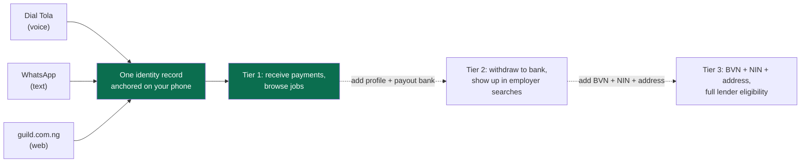

## The three doors

<Tabs>
  <Tab title="Voice (call Tola)">
    Dial the Guild number from any Nigerian phone. Tola picks up.

    *"Tola, I dey find work."*

    First time? She checks if you already have an account. If not, she asks three things: your name, your location, and what you do. That's it. She confirms back: *"You be Musa Bello, bricklayer for Modakeke. I go set am up?"*

    You say yes. Tola creates the account on the backend with your caller-ID phone as the identity anchor. A welcome SMS lands in your phone two seconds later: *"Welcome to Guild. Your account is ready."*

    That's it. You're in.

    Voice is the Job Seeker rail. Employers and traders who call get a polite deflect — their flows live on WhatsApp and the web. Voice exists because a bricklayer in Modakeke on a Tecno Spark doesn't open dashboards. He dials.

  </Tab>

  <Tab title="WhatsApp">
    Open WhatsApp. Find the Guild contact (the QR is on every flyer; the link is in every SMS we send). Send any message.

    *"I want to join Guild."*

    The intent engine routes you to onboarding. You'll get a five-step Flow inside WhatsApp:

    1. Pick your role: **Job Seeker**, Trader, or Employer.
    2. Your first name.
    3. Your city.
    4. Your preferred language (English, Pidgin, Yoruba, Igbo, Hausa).
    5. Consent.

    Submit. Account created. Welcome message lands inside the same chat.

  </Tab>

  <Tab title="Web">
    Open [guild.com.ng/sign-up](https://guild.com.ng/sign-up). Choose **Job Seeker**. Enter your phone number. We send you a six-digit code by SMS. Type it in.

    Same five-step onboarding as WhatsApp, just on a bigger screen. Same identity record. The next time you log in, we recognise your phone and you go straight to the dashboard.

    No password. Ever. Phone plus a fresh code each time.

  </Tab>
</Tabs>

## What "same identity record" actually means

This part is important.

You can start signup on voice. Continue on WhatsApp. Finish KYC on the web. The system treats you as one person. We anchor on your phone number (E.164) and write everything to the same `User` row in the identity Postgres schema. The session you have on web doesn't conflict with the conversation state Tola is holding for you on a call.

Two examples:

<Steps>
  <Step title="Musa signs up on voice on a Monday">
    Tola creates the account. Tier 1 only — phone + OTP. He gets work alerts by SMS for two weeks.
  </Step>

  <Step title="On a Wednesday he gets a smartphone">
    Sends a WhatsApp message to Guild. The intent engine looks up his phone, sees the existing user, picks up where Tola left off. *"Welcome back, Musa. You have three new jobs you haven't seen yet."*
  </Step>

  <Step title="A month later he visits guild.com.ng">
    Enters the same phone number. SMS code. Lands inside the same dashboard. His job history, his wallet balance, his standing tier — all there.
  </Step>
</Steps>

One person, three rails. One ledger underneath.

## Tier 1 vs Tier 2 vs Tier 3

Signup gets you to **Tier 1**. That's enough to receive payments and browse work. To do more, you'll fill in more.

| Tier       | What you give us                                                                         | What unlocks                                                                                  |
| ---------- | ---------------------------------------------------------------------------------------- | --------------------------------------------------------------------------------------------- |
| **Tier 1** | Phone + SMS OTP                                                                          | Receive payments to your wallet. Browse and apply to jobs. Basic dashboard.                   |
| **Tier 2** | Your trade, skills, availability, languages, willingness to travel + payout bank account | Send withdrawals to your bank. Get matched higher. Show up in employer searches with details. |
| **Tier 3** | BVN + NIN + address verification                                                         | Higher transaction limits. Eligible for lender consent. Access to the full product surface.   |

You can stay at Tier 1 forever if you want. Most Job Seekers move to Tier 2 in the first week, the moment they want to withdraw earnings to their bank. Tier 3 is for when you decide to use Guild as your credit identity with a lender — see [Standing score](/job-seekers/standing-score) for why that matters.

## What happens behind the scenes

A few details if you're curious about the plumbing.

- **Your phone is the identity anchor.** We store it in E.164 format (`+234812...`). All routing keys off it.
- **Sensitive fields are envelope-encrypted.** BVN, NIN, last name, address — none of those sit plaintext in our database. They live inside a ChaCha20-Poly1305 ciphertext bound to your user ID. A database leak alone gives an attacker nothing readable.
- **Sessions are opaque.** When you log in on web, you get an `httpOnly` cookie containing a ULID. There's no JWT, no claim payload, nothing readable in your browser. The session is a key into a server-side store.
- **OTPs are single-use, time-limited, and rate-limited.** OPay SMS sends them. The phone-to-code mapping lives in Redis with a short TTL.

<Note>
  If you ever want to delete your Guild account, you can do that from the web dashboard under **Settings → Data**. We retain ledger entries (required for audit and lender obligations), but they're anonymised — the link back to you is severed. NDPR-compliant data handling throughout.
</Note>

## Next

<CardGroup cols={2}>
  <Card title="Find work" icon="hammer" href="/job-seekers/find-work">
    Now that you have an account, here's how to actually get hired.
  </Card>

  <Card title="Get paid" icon="wallet" href="/job-seekers/get-paid">
    How money lands in your wallet and out to your bank.
  </Card>
</CardGroup>

> ## Documentation Index
>
> Fetch the complete documentation index at: https://docs.guild.com.ng/llms.txt
> Use this file to discover all available pages before exploring further.

# Find work

> How a job goes from posted in Bodija to ringing your phone in Modakeke in under five seconds.

Picture this. It's 9:02 AM on a Tuesday. Engr. Adekunle in Bodija taps **Post Job** for five bricklayers, three days, Yoruba preferred, ₦4,000 a day.

By 9:02 AM and four seconds, your phone is buzzing.

That's not a coincidence. Let me show you the path.

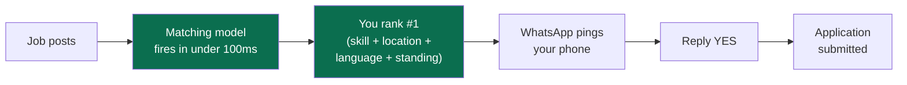

## The matching model

The moment a job goes live, our matching model runs over every Job Seeker who could plausibly do it. Four factors weigh in:

<CardGroup cols={2}>
  <Card title="Skill" icon="hammer">
    Your trade and skill tags from your profile. A bricklayer matches a bricklayer job exactly. A tiler can apply but ranks lower.
  </Card>

  <Card title="Location" icon="location-dot">
    Where you live versus where the job is. We expand outward by area, by city, by state, with distance decay. Modakeke to Bodija is in range. Lagos to Kano is not.
  </Card>

  <Card title="Language" icon="language">
    The employer might prefer Yoruba. Or Hausa. Or no preference at all. Your languages weigh in. A site contractor in Ile-Ife who wants Yoruba speakers will see Yoruba speakers first.
  </Card>

  <Card title="Economic context" icon="chart-line">
    Your standing tier, your on-time rate, your repayment streak, your recent reviews. The model rewards finishing. A Job Seeker who shows up every day ranks above one who ghosts after lunch.
  </Card>
</CardGroup>

The model is calibrated to Nigerian informal-economy patterns. It runs in under a hundred milliseconds. The ranked list lands in the employer's dashboard the moment they hit submit — and our system fires alerts to the top candidates on the rails they actually use.

## How you hear about a job

It depends on which rails you're on.

<Tabs>
  <Tab title="WhatsApp">
    Most common. Message lands inside your existing Guild chat:

    > *Adekunle dey hire 5 bricklayers for Bodija. ₦4,000/day, 3 days. Reply YES to apply, NO to skip, or DETAILS to see more.*

    Reply **YES** and our intent engine routes the reply to an apply call. Application ID returned in 240 ms.

    Reply **DETAILS** and you get a card with the full description, start date, location pin, and a one-tap apply button.

    Voice notes work too. Send *"yes, I want am"* as a voice note. The transcription model reads it. Same outcome.

  </Tab>

  <Tab title="Voice">
    Job alerts by voice are pull, not push — Tola won't call you unprompted. But you can call her any time and ask.

    > *"Tola, what work dey for Bodija?"*

    She runs `list_open_jobs` against core-api. You hear up to five, in order, ranked by the matching model. Title, employer, location, pay, duration.

    > *"That second one. The bricklayer for Bodija."*

    She runs `get_job_details` for the full description. If you say apply, she runs `apply_to_job` after explicit verbal confirmation. *"You want make I apply for you?"* — *"Yes."*

    Done.

  </Tab>

  <Tab title="SMS">
    For people without WhatsApp. We send short alerts:

    > *Guild: 5 bricklayer jobs in Bodija, ₦4k/day, 3 days. Reply 1 to apply, 0 to skip.*

    Two-way SMS over our own gateway infrastructure. Reply **1** and you've applied.

  </Tab>

  <Tab title="Web">
    Open `guild.com.ng/jobs`. The Find Work tab shows open jobs ranked for you, filterable by location, trade, and pay range. Tap a card to see the full posting. Tap **Apply** to submit.

    Web is the smallest channel for Job Seekers. Most of you live on voice and WhatsApp.

  </Tab>
</Tabs>

## What happens after you apply

Application goes into the employer's queue. They see your profile — standing tier, completed jobs in the last sixty days, average review, languages, distance to the job site. They tap **Approve** or **Reject**.

If they approve, you get a WhatsApp or SMS notification with the start date, time, location, and the foreman's contact. Show up, do the work, get marked present each day. Foreman cannot mark you present and then erase it — the triggers reject the delete.

## The standing tier nudge

Here is the part most Job Seekers don't realise at first.

Every job you complete, every five-star review, every on-time arrival pushes your standing tier up. And the higher your tier, the higher you rank in the matching model. Which means more job alerts. Which means more work. Which means more receipts.

It's a flywheel. Three months of doing the work pulls you to **Trusted**. Six months gets most people to **Established** if they're consistent. From there, the same data lenders read is what you read — you watch your own credit identity build, in real time.

<Tip>
  There is no penalty for declining a job. Don't take work you can't finish; that hurts your tier more than a polite decline ever would. The model rewards completion, not application count.
</Tip>

## Next

<CardGroup cols={2}>
  <Card title="Get paid" icon="wallet" href="/job-seekers/get-paid">
    What happens when the employer hits Pay.
  </Card>

  <Card title="Standing score" icon="chart-line" href="/job-seekers/standing-score">
    The four tiers and what moves you between them.
  </Card>
</CardGroup>

> ## Documentation Index
>
> Fetch the complete documentation index at: https://docs.guild.com.ng/llms.txt
> Use this file to discover all available pages before exploring further.

# Get paid

> From the employer's tap to your bank account in under ten seconds. The full path.

Saturday evening. You finished the Bodija job today. Last brick laid at 5:47 PM. You washed the dust off, walked to the danfo, and now you're sitting in the back wondering if Adekunle is going to pay you tonight or make you come back on Monday.

Your phone buzzes at 6:12 PM.

> _₦12,000 added by Adekunle Ogundimu. Balance: ₦12,000._

That's what the rest of this page is about.

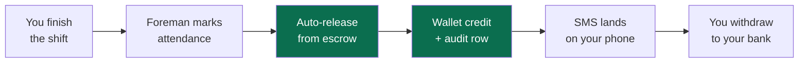

## Your wallet

Every Job Seeker has a wallet. It's a balance row in our payments schema, denominated in kobo, with an append-only transaction log behind it. When an employer pays you, the money lands here first.

Two things to know about the wallet:

1. **It's not a bank account.** It's a Guild-owned balance. Useful for receiving payments and queuing up your next move (withdraw, save, pay a bill). For long-term storage, you withdraw to your bank.
2. **It funds your savings rules and your bills.** If you've told Guild _"save ₦500 every Friday,"_ we pull it from your wallet the moment your wallet has the balance.

You can see the wallet anywhere you're logged in. WhatsApp message **balance**. The web dashboard. A voice call to Tola.

## How the employer's payment reaches you

Walking through the ten seconds.

<Steps>
  <Step title="Adekunle taps Pay">
    In his dashboard, next to your row, he taps **Pay Musa ₦12,000**. His browser sends a signed request to core-api. HMAC-SHA256 over the request body and a ULID idempotency key.
  </Step>

  <Step title="The backend triggers a OPay mandate debit">
    Adekunle linked his Access Bank account weeks ago through a direct-debit mandate. (He sent the ₦50 confirmation transfer OPay asks for, the *Mandate ready* notification fired, and the mandate's been sitting on his account since.) Now we trigger OPay to debit that mandate for ₦12,000.
  </Step>

  <Step title="OPay debits Adekunle's bank">
    OPay pulls ₦12,000 from his Access Bank account and fires a `charge_successful` webhook to `webhooks.guild.com.ng/opay`.
  </Step>

  <Step title="We verify the webhook signature">
    HMAC-SHA512 over the raw body. `crypto.timingSafeEqual`. Three signature schemes handled — we accept the one the webhook used. If it doesn't match, we reject the request before it touches anything else.
  </Step>

  <Step title="The reconcile guard runs">
    Hold on — this is the part most platforms skip 👀.

    Before we credit your wallet, we re-verify the transaction directly against OPay's authoritative verify service. Status must match success. Amount must match the webhook body to the kobo. If anything is off, we refuse to credit.

    This is the defence against an attacker who somehow knew our webhook secret and tried to replay a mutated payload. Even with the secret, they can't fake a OPay transaction.

  </Step>

  <Step title="Wallet credit + ledger row">
    Your wallet goes from ₦0 to ₦12,000. A row writes to `payments_audit` — append-only, no `UPDATE` or `DELETE` allowed, immutable for the life of the database.
  </Step>

  <Step title="SMS notification">
    OPay SMS fires. Your phone buzzes inside the same second. *"₦12,000 added by Adekunle Ogundimu. Balance: ₦12,000."*
  </Step>
</Steps>

Total wall-clock time from Adekunle's tap to your buzz: usually under ten seconds.

## Withdraw to your bank

You don't have to withdraw immediately. The wallet is fine for short-term hold. But when you do, here's the path.

### From WhatsApp

Send **withdraw**. The intent engine routes you to the withdrawal flow.

> Guild: How much you wan withdraw? You get ₦12,000 for wallet.

> ₦10,000

> Guild: Send to Access Bank ••••3911? Reply YES.

> YES

Twenty seconds later you get the confirmation: _"₦10,000 sent to Access Bank ••••3911."_

### From the web dashboard

`guild.com.ng/wallet`. Tap **Withdraw**. Pick the amount. Pick the destination. Confirm. Same path.

### From a Tola call

> _"Tola, withdraw ₦10,000 to my bank."_

She'll read back the amount and the destination, ask you to confirm verbally, and fire the request. _"Done. ₦10,000 sent to Access Bank ••••3911."_

## What happens under the hood when you withdraw

<Steps>
  <Step title="core-api looks up your payout destination">
    The bank account you verified during Tier 2 KYC. We resolved it through OPay's account-name-lookup service to get the official beneficiary name, and we won't pay out to a name that doesn't match what you have on file.
  </Step>

  <Step title="core-api calls OPay's payout endpoint">
    NIBSS-backed transfer via OPay's payout service. The reference carries our merchant suffix automatically.
  </Step>

  <Step title="Synchronous success path when OPay signals it">
    If OPay returns `response_description` matching `/approved|completed|success/i` and a `nip_transaction_reference`, we mark the payout `SUCCESS` immediately. No need to wait for the webhook.
  </Step>

  <Step title="Webhook fallback if the response is pending">
    If OPay returns pending, the payout sits in PENDING state until the `payout_successful` (or `payout_failed`) webhook arrives. Same signature verification path as inbound debits.
  </Step>

  <Step title="Wallet debit + ledger row">
    Your wallet goes down by ₦10,000. An audit row writes. An SMS confirms.
  </Step>
</Steps>

## A note on speed

OPay is fast. NIBSS is fast on the mornings when banks aren't rotating servers. Most withdrawals land in your bank in **seven to fifteen seconds**. Some take up to a minute when the receiving bank is slow. None should take more than five minutes — if a payout sits PENDING for longer, we ping you with a status SMS and you'll see it resolved in your transaction history.

## Bank coverage

Withdraw to any Nigerian bank account that NIBSS resolves. That's effectively all of them — every commercial bank, every microfinance bank with NIBSS membership, plus the fintech players (OPay, PalmPay, Kuda, Moniepoint, etc.).

The bank list inside the dashboard is sourced from OPay's bank-code registry. We refresh it on a schedule so new banks appear automatically.

## What does it cost you

Nothing on inbound. Receiving a payment from an employer is free.

Payouts to your bank are also free at v1. We may introduce a small fee in v2 for high-frequency withdrawals — but the core promise (get paid same-day, no fees) holds for normal use.

<Tip>
  If you're withdrawing the same amount on a schedule (e.g., ₦5,000 every Saturday after a typical week's work), set up a [savings rule](/job-seekers/savings) instead. The rule pulls automatically the moment your wallet has the balance — no need to remember.
</Tip>

## Next

<CardGroup cols={2}>
  <Card title="Standing score" icon="chart-line" href="/job-seekers/standing-score">
    Each payment, each completed job, each five-star review nudges your tier upward.
  </Card>

  <Card title="Savings" icon="piggy-bank" href="/job-seekers/savings">
    Automatic rules that pull from your wallet before the money has a chance to disappear.
  </Card>
</CardGroup>

> ## Documentation Index
>
> Fetch the complete documentation index at: https://docs.guild.com.ng/llms.txt
> Use this file to discover all available pages before exploring further.

# Standing score

> Four tiers. How the model reads the ledger. What pushes you up and what pulls you down.

This is the page most Job Seekers underestimate.

Stay with me.

When you sign up, you're at **Building**. You have no history yet. The model has nothing to read. You're starting from zero, same as everyone.

But every day you work on Guild, you're not just earning money. You're earning _evidence._ Every job, every shift, every review, every withdrawal lands in the same audit ledger — a place no one can edit, not even us. Three months in, you have receipts that compound into a number a bank will actually look at.

That number is your standing score. The tier it puts you in is your standing tier. Let me show you how it works.

## The four tiers

<CardGroup cols={2}>
  <Card title="Building (0–299)">
    You just joined. You have fewer than 10 completed jobs. The model doesn't have enough data to commit. This is the "show me what you can do" tier. Most Job Seekers spend two to four weeks here.
  </Card>

  <Card title="Emerging (300–549)">
    You've completed at least 10 jobs over 30+ days. Your on-time rate is reasonable (≥70%). Your reviews are 3.5+. Lenders won't underwrite you here, but employers can already see you as a serious candidate.
  </Card>

  <Card title="Trusted (550–749)">
    You've completed 30+ jobs over 60+ days. Your on-time rate is ≥85%. Your average review is 4.0+. You've used direct debit or wallet payments at least once. **This is where credit-line products become accessible.**
  </Card>

  <Card title="Established (750–1000)">
    You're the top of the curve. 90+ jobs, 90+ day tenure, on-time rate ≥95%, average review ≥4.5, repayment streak intact if you've taken loans. Gold ring around your standing badge. Highest priority in employer searches. Best terms from partner lenders.
  </Card>
</CardGroup>

The tiers aren't just labels — they're how the model surfaces you across the rest of the product. A Trusted bricklayer in Modakeke ranks above an Emerging one in the same town, all else equal. An Established trader gets the bigger inventory advance offer.

## What the model reads

Our standing model is calibrated to Nigerian informal-economy patterns. It reads features from the ledger and decides which tier you sit in. Here are the signals that matter most:

| Signal                          | What it means                                                                                      | Weight               |
| ------------------------------- | -------------------------------------------------------------------------------------------------- | -------------------- |
| **Completed jobs**              | The count of `applications.status = COMPLETED` rows for you in the last 90 days.                   | High                 |
| **Average review**              | The mean of star ratings employers left you. 5-point scale.                                        | High                 |
| **On-time rate**                | Out of every shift where attendance was recorded, what fraction did you show up for.               | High                 |
| **Tenure**                      | How long you've been on Guild. The model rewards consistency over time.                            | Medium               |
| **Channel diversity**           | Have you used voice, WhatsApp, and web? Multi-channel users are stickier.                          | Medium               |
| **Repayment streak**            | If you've taken loans through a partner lender, how many consecutive payments you've made on time. | High (if applicable) |
| **Weekly volume stability**     | Whether your earnings show a pattern (e.g., consistent weekday work).                              | Medium               |
| **Employer feedback diversity** | How many distinct employers have hired and reviewed you.                                           | Medium               |

The model is **not** a credit-bureau lookup. We don't pull your CRC or FirstCentral report. The standing score is built from inside your Guild ledger — what you've actually done, on this platform, that we can prove.

## What pushes you up

- **Complete the jobs you start.** A `COMPLETED` application weighs more than an `APPROVED` one.
- **Show up on time, every shift.** Attendance is the highest-signal feature.
- **Get good reviews.** A 5-star matters more than a 4-star. A 2-star hurts.
- **Stay active.** A 90-day quiet period drops your tenure-weighted score even if past activity was strong.
- **Use multiple channels.** A Job Seeker who only ever applies on WhatsApp ranks below one who's used voice and web too. (Slight signal — don't force it.)

## What pulls you down

- **Ghosting after applying.** Approved but didn't show. Tier drops fast.
- **No-shows mid-shift.** Worse than no-show day one.
- **Bad reviews.** A 1-star or 2-star pulls multiple points.
- **Failed direct debits.** If you've authorised a debit (e.g., a savings rule or a loan repayment) and there's no balance, the failed attempt is a negative signal.
- **Disputes that resolve against you.** Rare. But they happen.

You can always recover. The model is a 90-day rolling read — three months of consistent good behaviour erases most of a bad month.

## How you see your tier

<Tabs>
  <Tab title="WhatsApp">
    Send **score** to the Guild chat.

    > *Your standing tier: Trusted. Score: 612. You moved up from Emerging on August 12. Three more 5-star reviews and you cross into Established.*

  </Tab>

  <Tab title="Web">
    `guild.com.ng/standing`. You get a chart of the last 90 days, a breakdown of which signals are pushing you up or down, and projections for the next tier.
  </Tab>

  <Tab title="Voice">
    *"Tola, wetin be my standing?"*

    She reads back the tier and the score, then offers context: *"You don finish 38 jobs for last 90 days. Your average review na 4.7. You dey Trusted now. Three more good reviews you go reach Established."*

  </Tab>
</Tabs>

## When a lender reads your snapshot

The whole point of standing is that it travels.

A partner lender (a bank, a microfinance institution, a credit fintech) can integrate with our [Partner API](/partners/overview). When you apply for credit through them, they ask Guild for a snapshot. We surface a consent prompt in your dashboard — _"X Lender is requesting your Guild standing snapshot. Approve?"_ You tap yes. We write a consent row. The lender hits `GET /partner/v1/users/:userId/snapshot` and receives a signed JSON document with your tier, your score, your signals, and a configurable window of your audit ledger (30, 60, 90, or 365 days).

The lender verifies our signature. Runs their model. Approves or declines.

If they approve, disbursement happens over OPay payout. Repayments run as a direct debit on the schedule you accepted. Every payment writes to your ledger. Every on-time repayment pushes your standing tier up. Every failure pulls it down.

This is the loop. The harder you work, the cleaner you finish, the better you treat the credit you take — the more credit gets offered to you, on better terms.

<Note>
  Consent is yours. You can revoke it any time from `partners.guild.com.ng`. The moment you revoke, the lender's read access closes. They can still see snapshots they pulled while consent was active (which is how underwriting works — they need a fixed reference point), but they can't pull a fresh one.
</Note>

## Next

<CardGroup cols={2}>
  <Card title="Savings" icon="piggy-bank" href="/job-seekers/savings">
    Set up an automatic savings rule. Watch it fill in the background.
  </Card>

  <Card title="The Partner Portal" icon="building-columns" href="/partners/overview">
    The other side — what a lender sees when they read your snapshot.
  </Card>
</CardGroup>

> ## Documentation Index
>
> Fetch the complete documentation index at: https://docs.guild.com.ng/llms.txt
> Use this file to discover all available pages before exploring further.

# Savings

> Tell Guild once. We pull from your wallet the moment money lands. No willpower required.

Real talk: most people can't save by deciding to save. The money shows up, the money disappears — there's always something that needed it five minutes ago.

Savings on Guild is the version of _ajo_ that doesn't require an _ajo_ woman walking down your street at 7 AM every morning. You tell us the rule once. We pull the amount the moment your wallet has the balance, before you have a chance to spend it. That's it.

## The three pieces

<CardGroup cols={3}>
  <Card title="Rules" icon="calendar-check">
    *"Save ₦500 every Friday."* Or *"Save 10% of every payment that lands."* Or *"Save ₦1,000 daily from Monday to Friday."* A rule is a standing instruction we apply on a cadence.
  </Card>

  <Card title="Goals" icon="bullseye">
    Optional. *"I want to save ₦100,000 by December for the apprenticeship fee."* A goal is a target with an ETA. We show you progress against it whenever you check.
  </Card>

  <Card title="Contributions" icon="receipt">
    The individual debits. Each one is its own ledger row. You see them in your transaction history with their status — pending, settled, or failed.
  </Card>
</CardGroup>

## How a rule works

You set it up once. After that, it runs in the background.

<Steps>
  <Step title="You tell Guild the rule">
    From WhatsApp: *"save ₦500 every Friday."* The intent engine routes you to a setup flow. It confirms back: *"Save ₦500 every Friday from your wallet to your savings? Reply YES."*

    From the web: `guild.com.ng/savings`. Tap **New rule**. Pick the amount, cadence (daily, weekly, monthly), source (wallet, payout-on-arrival, or manual), and a goal if you want.

  </Step>

  <Step title="The rule sits in the savings table">
    Cadence locked. Next-run timestamp set. Source defined.
  </Step>

  <Step title="When the cadence fires, the rule runs">
    For a wallet-source rule: we check your wallet balance. If you have ₦500 or more, we move ₦500 to savings and write two ledger rows (wallet debit, savings credit).

    For a payout-on-arrival rule: the moment a payment lands in your wallet, we pull the rule amount before the rest is available to spend.

    For a manual rule: we wait for you to confirm each contribution.

  </Step>

  <Step title="If the wallet is empty">
    The contribution writes as **FAILED**. We notify you by SMS or WhatsApp. The rule keeps running on the next cadence — we don't try to drain a wallet that isn't there.
  </Step>

  <Step title="When you hit your goal">
    If the rule has a goal attached and the contributions add up to the target, the goal flips to **ACHIEVED**. WhatsApp pings you: *"You hit your ₦50,000 apprenticeship goal. Withdraw to your bank, or roll it into a new goal."*
  </Step>
</Steps>

## A real example

Mama Bisi the trader at Oje Market wants to save ₦1,500 every working day for inventory replacement. She tells Guild:

> _Save ₦1,500 every weekday from my wallet. Goal: ₦150,000 for new stock by November._

A hundred contribution rows over twenty weeks of working days. By November she has the ₦150,000 sitting in savings, ready to withdraw to her bank or roll into a new goal.

What she doesn't have is the willpower problem. She didn't have to remember to save. She didn't have to walk past temptation every Friday afternoon with cash in her pocket. The savings was already pulled before she opened the app.

## Sources you can save from

<Tabs>
  <Tab title="Wallet">
    The default. Pulls from your Guild wallet balance whenever the rule fires. If the wallet is empty, the contribution fails silently and we try again on the next cadence.
  </Tab>

  <Tab title="Payout-on-arrival">
    Fires the instant a payment lands in your wallet — before the rest of the balance is available for withdrawal or spending. Useful for "save 10% of every job" style rules.
  </Tab>

  <Tab title="Manual">
    Doesn't fire automatically. We just remind you on the cadence (*"Time to save ₦500 — reply YES to confirm"*). For people who want to stay in control of every transfer.
  </Tab>
</Tabs>

## Goals (optional but worth it)

Saving without a goal is fine. Saving toward a specific thing is better. A goal does three things:

1. Gives you a target. The amount you're saving toward.
2. Gives you an ETA. The date you're aiming for.
3. Gives you a progress read. The dashboard shows the bar filling up.

Goals are not strict — you can blow past the date or fall short. They're a focusing mechanism, not a contract. You can pause, archive, or rename a goal any time.

<Tip>
  Stack rules toward the same goal if you want. Example: one weekly ₦500 rule + a payout-on-arrival rule of 10% of inflows, both targeting the same ₦100,000 apprenticeship goal. The contributions add up against the goal regardless of which rule fired them.
</Tip>

## What happens to the saved money

It sits in your Guild savings balance. Not your wallet. Not your bank. A separate balance with the same append-only ledger discipline.

When you want it out, you withdraw to your bank. Same path as a wallet withdrawal — OPay payout, beneficiary name pre-validated, sub-minute landing time.

We don't take a cut of your savings. We don't pay you interest on it either (at v1). Treat it as a holding area that prevents impulse spending and gives you a fixed amount to draw from when you need it.

## How savings interacts with your standing

Saving activity is a small positive signal in your standing score — the model rewards Job Seekers who manage cash flow consistently. But it's a _small_ signal compared to job completion and on-time attendance. Don't save to game your tier. Save because the money you don't see is the money you keep.

## When a rule goes wrong

Common failure modes and what to do.

| Symptom                                    | Cause                                                                    | Fix                                                                                            |
| ------------------------------------------ | ------------------------------------------------------------------------ | ---------------------------------------------------------------------------------------------- |
| Contributions keep failing                 | Wallet empty when rule fires                                             | Switch the source to **payout-on-arrival** so it pulls the moment money lands                  |
| Rule fired but you didn't want it to today | One-off — you needed the cash for something else                         | Pause the rule from the dashboard, run it again next week                                      |
| You want to change the amount              | —                                                                        | Cancel the rule, create a new one. Rules are immutable once created so the history stays clean |
| You forgot you had a rule running          | It's been pulling quietly for two months and you have ₦12,000 in savings | Surprise — you actually saved 🤝                                                               |

## Next

<CardGroup cols={2}>
  <Card title="Get paid" icon="wallet" href="/job-seekers/get-paid">
    The wallet is where savings pulls from — see how money lands there.
  </Card>

  <Card title="Standing score" icon="chart-line" href="/job-seekers/standing-score">
    Consistent saving is one of the small signals that shape your tier.
  </Card>
</CardGroup>

> ## Documentation Index
>
> Fetch the complete documentation index at: https://docs.guild.com.ng/llms.txt
> Use this file to discover all available pages before exploring further.

# For Traders

> Turn the cash drawer into a ledger. Take transfers. Build a sales history that unlocks inventory advances.

Mama Bisi runs a provisions stall at Oje Market in Ibadan. Has done for fifteen years. Eggs, garri, milo, sachet milk, the works.

Every morning the _ajo_ woman comes by at seven and collects her ₦500 for the day. Every evening she counts cash, hopes she didn't miscount, locks the stall, and walks home with the day's float taped to her chest. Sometimes she takes payments on the rented POS terminal — but it costs ₦150 a day to rent, charges 1.5% per swipe, and rejects one in four transactions when NIBSS is slow.

She's been doing this for fifteen years and her bank still thinks she's an unbanked subsistence trader.

Guild fixes that by routing every kobo through OPay and writing every sale to a ledger her standing tier can read.

Here's what's possible.

<CardGroup cols={2}>
  <Card title="Open a OPay virtual account" icon="building-columns" href="/traders/virtual-account">
    A dedicated ten-digit account number that's yours. Customers transfer to it. Inflows appear in your wallet and your ledger the moment they land. No POS terminal, no rejected swipes.
  </Card>

  <Card title="Take payments" icon="cash-register" href="/traders/take-payments">
    Customer transfers. Wallet-to-wallet payments. QR codes. Dynamic virtual accounts for one-time collections. Every flow ends with the same audit row.
  </Card>

  <Card title="Sales velocity" icon="chart-line" href="/traders/sales-velocity">
    The matching model reads your monthly sales velocity. Hit ₦3 million in monthly inflows and an inventory-advance offer surfaces in your dashboard.
  </Card>

  <Card title="Bills" icon="bolt" href="/traders/bills">
    Airtime, data, electricity — all from your wallet. Both for you and for customers who pay you to buy on their behalf.
  </Card>
</CardGroup>

## Why this matters more than it sounds

For fifteen years, every sale Mama Bisi made was invisible. The cash was real. The customers were real. But to a bank's underwriting model, she had no income, no business activity, no anchor. When she wanted ₦200,000 to expand into a second stall, the bank asked for two years of statements. She had none.

Guild's not asking her to abandon cash. It's giving her a parallel rail that builds the receipts. A customer can still pay her in cash today. Tomorrow, the same customer can transfer to her OPay virtual account — and now that transaction is on the ledger.

Six months in, her dashboard shows the line going up. ₦4.2 million in inflows. 380 distinct customers. 92% on-time response to messages. **Established** tier. The same bank that rejected her two years ago will look at her snapshot through the Partner API and offer her terms she couldn't have dreamed of.

That's the bet. Not "switch to digital." More like "you can keep doing what works, but now there's a paper trail."

## How traders use Guild

Most traders live on WhatsApp. Occasional web sessions. SMS for balance alerts and OTPs.

| Channel              | What you do                                                                                                                                                                                                                                                                                                            |
| -------------------- | ---------------------------------------------------------------------------------------------------------------------------------------------------------------------------------------------------------------------------------------------------------------------------------------------------------------------- |
| **WhatsApp text**    | Send `account` to see your virtual account number, `balance` for your wallet, `sales` for today's inflows, `withdraw` to send to your bank, `bills` to top up airtime. Voice notes work — send a voice note saying _"how much I sell today"_ and **Google Gemini** transcribes and answers, in the language you spoke. |
| **WhatsApp Calling** | Tap-to-call Tola from inside WhatsApp when you want to ask something complex without typing.                                                                                                                                                                                                                           |
| **SMS**              | Balance alerts on every inflow. OTPs for verification. Optional daily sales summary.                                                                                                                                                                                                                                   |
| **Web**              | `guild.com.ng/sales` for the full sales dashboard, velocity charts, customer breakdowns, and inventory-advance offers.                                                                                                                                                                                                 |

Voice (an offline phone call) isn't part of the trader rail. If you call the Guild number, you'll get a polite deflect to WhatsApp. The voice channel exists for Job Seekers without smartphones — traders almost always have smartphones, so the rail isn't for you.

## Where to start

<CardGroup cols={2}>
  <Card title="Open a virtual account" icon="building-columns" href="/traders/virtual-account">
    The first thing. Takes about three minutes.
  </Card>

  <Card title="Take your first payment" icon="cash-register" href="/traders/take-payments">
    What to tell a customer who wants to transfer instead of pay cash.
  </Card>
</CardGroup>

> ## Documentation Index
>
> Fetch the complete documentation index at: https://docs.guild.com.ng/llms.txt
> Use this file to discover all available pages before exploring further.

# Open a virtual account

> A ten-digit account number that's yours. Customers transfer to it. Inflows land in your wallet in real time.

A virtual account is the trader version of "give me your account number." Except this one is issued by OPay in partnership with a Nigerian bank, it costs you nothing, and every transfer that comes in writes to your Guild ledger automatically.

You don't have to bring a customer to your bank app. You don't have to share your personal account. You give them ten digits and a bank name, they transfer, you see the inflow on your phone before they've finished walking out of the stall.

## The two kinds

OPay supports two virtual-account types and we use both.

<CardGroup cols={2}>
  <Card title="Static (B2B)" icon="lock">
    A permanent ten-digit account you give to anyone who wants to pay you. Same number for every customer, every transaction, forever. This is what Mama Bisi prints on a small card and tapes to her counter.
  </Card>

  <Card title="Dynamic" icon="bolt">
    A one-time account for a specific transaction. Created on demand, with a fixed amount and a TTL. Useful when you want to enforce *"transfer exactly ₦15,000, this number expires in 30 minutes."* No risk of someone underpaying or overpaying.
  </Card>
</CardGroup>

For the everyday market stall, static is what you want. We'll cover both.

## Opening a static virtual account

You can do this from any rail — WhatsApp, web, or by replying to a Tier 2 KYC prompt.

<Tabs>
  <Tab title="From WhatsApp">
    Send **account** in your Guild chat.

    If you've completed Tier 2 KYC (business name, industry, staff count, payout bank), we provision the account immediately through OPay's virtual-account service. A ten-digit number and a bank name come back, and we save them to your account.

    The reply lands two seconds later:

    > *Your Guild account is ready.*
    >
    > *Bank: Access Bank*
    > *Account number: 9012345678*
    > *Account name: Adeyemi Bisi Provisions*
    >
    > *Share these details with anyone who wants to transfer to you.*

    If you haven't done Tier 2 yet, we'll walk you through the five questions first — trade, tenure, daily volume band, work location, payment mix — and then provision the account at the end.

  </Tab>

  <Tab title="From the web">
    `guild.com.ng/wallet`. Tap **Get a virtual account**.

    Same Tier 2 questions if you haven't done them. Same provisioning at the end. The account card appears at the top of your wallet page with a tap-to-copy button.

  </Tab>
</Tabs>

## What "account name" actually is

The name on the virtual account is your name (or your business name, if you've given us one as part of Tier 2). When a customer transfers, their bank app shows them this name during confirmation — _"You are sending ₦5,000 to Adeyemi Bisi Provisions. Continue?"_ That's the verification that they're paying the right person.

This matters because customers in Nigeria check the name on the receiving side reflexively. If the name doesn't look right, they cancel the transfer. Tier 2 KYC verifies your name against your phone records, your trade declaration, and (later, at Tier 3) your BVN.

## What happens when a customer transfers

You don't have to do anything. The flow runs without you.

<Steps>
  <Step title="Customer initiates a transfer">
    From their bank app or a USSD code. They put your ten-digit account number, your bank name, and the amount.
  </Step>

  <Step title="OPay's NIBSS layer receives the transfer">
    Routes it to your virtual account. The transfer settles into OPay's pooled account at the partner bank.
  </Step>

  <Step title="OPay fires a webhook to our endpoint">
    Body contains the transaction reference, the amount received, your virtual account ID, and the sender's name and account number.
  </Step>

  <Step title="We verify the signature">
    HMAC-SHA512 over the raw body. Same hardening as every other OPay webhook — three signature schemes, timing-safe compare, idempotency check.
  </Step>

  <Step title="The reconcile guard runs">
    Even for inflows, we re-verify the transaction against OPay's authoritative verify service before crediting anything. Status must be success. Amount must match.
  </Step>

  <Step title="Your wallet credits">
    Your wallet balance goes up by the amount received. A row writes to `payments_audit` with the sender's name and account masked appropriately.
  </Step>

  <Step title="You get notified">
    SMS hits your phone: *"₦5,000 from Funmilayo Adeyinka. Balance: ₦47,500."* If you're active on WhatsApp, the same message lands there too.
  </Step>
</Steps>

Total wall-clock time from "customer hits send" to "your phone buzzes" is usually under four seconds.

## When to use a dynamic virtual account

The static account is for everyday flow. The dynamic account is for _"this specific person, this specific amount, this specific window."_

Use a dynamic VA when:

- You're invoicing a customer for a specific amount and don't want them under- or over-paying.
- You're collecting from a customer remotely (WhatsApp negotiation) and want to expire the offer in 30 minutes.
- You're handling a special-case sale (wholesale order, custom bundle) and want it tagged in your ledger as a distinct line item.

You create one from the dashboard or via WhatsApp:

> _"Create a one-time account for ₦15,000, expires in 30 minutes, for Funmi's wholesale order."_

We open a dynamic VA through OPay with the amount and TTL. You get back a fresh ten-digit number to send to that one customer. When the transfer lands (or the TTL expires), the account closes.

The webhook for a dynamic VA comes with `transaction_type = "dynamic_virtual_account"` and one of three statuses: `SUCCESS`, `EXPIRED`, or `MISMATCH`. We handle all three — MISMATCH (wrong amount sent) goes into a review queue and you can decide whether to accept it or refund.

## Costs

No fee to open a virtual account. No fee per inflow. No monthly account fee.

OPay's bill for the rails is wrapped into our overall revenue model — we don't pass it through to traders.

## Switching off the virtual account

You can deactivate your virtual account from `guild.com.ng/settings`. The number stops accepting new transfers. Pending inflows that were already initiated will still land. The account record stays in our database for audit purposes but the routing is closed.

You can re-enable it later. Same number comes back.

<Note>
  Your Guild virtual account is **not** the same as your personal bank account. Inflows here go to your Guild wallet, not your Access Bank or OPay account. To move money from Guild to your personal bank, use [Withdraw](/job-seekers/get-paid) (the same flow Job Seekers use).
</Note>

## Next

<CardGroup cols={2}>
  <Card title="Take payments" icon="cash-register" href="/traders/take-payments">
    The full picture of how customers pay you — transfers, wallet-to-wallet, QR.
  </Card>

  <Card title="Sales velocity" icon="chart-line" href="/traders/sales-velocity">
    How inflow patterns shape your standing tier and unlock inventory-advance offers.
  </Card>
</CardGroup>

> ## Documentation Index
>
> Fetch the complete documentation index at: https://docs.guild.com.ng/llms.txt
> Use this file to discover all available pages before exploring further.

# Take payments

> Customer transfers, wallet-to-wallet, QR, dynamic virtual accounts. Different paths, same audit row at the end.

A customer wants to pay you ₦5,000 for a bag of garri. How they pay depends on who they are and what they have on them. Here are the rails.

## Bank transfer to your virtual account

The most common path. You already have a [static virtual account](/traders/virtual-account); you printed the ten digits on a card taped to the counter. The customer opens their bank app, enters the account number and bank name, types ₦5,000, hits send.

Their bank app shows them the name — _Adeyemi Bisi Provisions_ — and they confirm. OPay's NIBSS layer carries the transfer. Webhook lands. Reconcile guard runs. Your wallet credits. Phone buzzes.

Three to four seconds from their tap to your buzz.

The receipt on your side shows the sender's name and the masked account number. The receipt on their side shows your business name and the official transaction reference. Both can be retrieved later from the audit ledger.

## Wallet-to-wallet (Guild to Guild)

If your customer is also a Guild user (another trader, a Job Seeker, an employer paying for goods), they can pay you straight from their Guild wallet. No bank in the middle.

They open WhatsApp, send something like _"send ₦5,000 to Adeyemi Bisi"_ — the intent engine routes them to a transfer flow, asks them to confirm the recipient (by name or phone), and fires the transaction.

Wallet-to-wallet is instant. We debit theirs, credit yours, write two audit rows. No OPay round-trip needed because the money never leaves the platform.

This is rarer than bank transfer in the field, but it shows up in two places worth knowing:

- **Employers paying traders for materials.** A site contractor paying his usual supplier for cement.
- **Job Seekers paying for goods.** A bricklayer in Ife buying lunch from a food vendor who's on Guild.

## Dynamic virtual account (for invoiced payments)

Use this when you want to enforce a specific amount. A wholesale customer wants to pay ₦15,000 for a bulk order; you create a dynamic VA for exactly ₦15,000 with a 30-minute window. Send them the ten-digit number. They transfer. The account expires.

Why bother? Three reasons.

1. **No underpayment confusion.** If they transfer ₦12,000 by mistake, the webhook arrives with `transaction_status: MISMATCH`. You see it in a review queue and decide whether to accept, refund, or message them for the balance.
2. **No overpayment confusion.** Same flow on the other side.
3. **Cleaner audit row.** The transaction is tagged with the dynamic VA's reference, so the ledger entry sits as its own line item — easier to reconcile against an invoice later.

You create dynamic VAs from WhatsApp (`create one-time account ₦15,000 30 minutes`), from the web dashboard, or programmatically via the API if you've built integrations.

## QR code (in person or printed)

Your virtual account details encode into a QR code we generate. You print it, tape it to the counter, or stick it on the back of a flyer. A customer with a smartphone scans the QR with their bank app — most Nigerian banks now support QR-based transfers — and the transfer fires with your account pre-filled.

This is faster than reading ten digits out loud, and the customer can't typo it.

## What happens after every payment

Same flow, every rail.

<Steps>
  <Step title="OPay fires a webhook">
    Or, for wallet-to-wallet, our own internal handler fires.
  </Step>

  <Step title="We verify signatures, run reconcile guard">
    Detailed in [Webhook security](/security/webhook-verification). The short version: even if an attacker had our webhook secret, they couldn't fake an inflow — we re-verify against OPay's authoritative endpoint before crediting anything.
  </Step>

  <Step title="Wallet credit">
    Your balance goes up. Audit row written. Append-only — that row stays for the life of the database.
  </Step>

  <Step title="Notification">
    SMS to your phone. WhatsApp message if you're active there.
  </Step>

  <Step title="Standing model invalidates your tier cache">
    Next time your standing reads, the model recomputes from the fresh ledger.
  </Step>
</Steps>

## Refunds

Sometimes a customer pays and then asks for their money back — wrong amount, changed mind, returned product.

You initiate a refund from your dashboard or via WhatsApp:

> _Refund ₦5,000 to Funmilayo Adeyinka for transaction TXN_01HMFB..._

We fire a OPay payout to the original sender's account (we have it from the inflow webhook). The same NIBSS-backed transfer. Same name pre-validation. The customer's phone buzzes inside a minute.

Both the original inflow and the refund are separate audit rows. The refund doesn't erase the inflow — they're linked but distinct. This matters for your standing and for any later lender snapshot.

<Warning>
  We can only refund to the exact account that paid you. If a customer paid from one bank and asks you to refund to a different one, you have to send it manually — and that won't carry the audit link to the original inflow.
</Warning>

## Failed payments

A few failure modes you'll see occasionally.

| Symptom                                        | Likely cause                                                   | What we do                                                                                                                                   |
| ---------------------------------------------- | -------------------------------------------------------------- | -------------------------------------------------------------------------------------------------------------------------------------------- |
| Customer says "I sent it" but you don't see it | Their bank pending in NIBSS — usually a temporary uptime issue | Inflow webhook lands when NIBSS releases. Could be minutes to hours.                                                                         |
| Webhook arrives but credit doesn't apply       | Reconcile guard rejected (amount mismatch, status mismatch)    | Sit in a manual review queue. We notify you if action needed.                                                                                |
| Wallet-to-wallet from a customer fails         | Their wallet had insufficient balance                          | They get an SMS, you get nothing. Try again.                                                                                                 |
| Dynamic VA transfer arrives after expiry       | OPay delays                                                    | Webhook arrives with `transaction_status: EXPIRED`. Refund flow kicks in automatically — the customer gets their money back inside a minute. |

The vast majority of payments land cleanly. Failures are noticeable when they happen but rare overall.

## Daily summary

If you opted in during signup, you get a daily SMS at 8 PM:

> _Guild: Today's sales — ₦47,500 across 11 transactions. 9 transfers, 1 wallet, 1 dynamic VA. Top sender: Funmilayo Adeyinka (₦15,000). Tomorrow's preview: 1 scheduled inflow._

Same data is on the web dashboard at `guild.com.ng/sales`, but the SMS is the version most traders actually read.

## Next

<CardGroup cols={2}>
  <Card title="Sales velocity" icon="chart-line" href="/traders/sales-velocity">
    How your inflow patterns shape your standing tier and unlock inventory-advance offers.
  </Card>

  <Card title="Bills" icon="bolt" href="/traders/bills">
    Spend from your wallet — airtime, data, electricity.
  </Card>
</CardGroup>

> ## Documentation Index
>
> Fetch the complete documentation index at: https://docs.guild.com.ng/llms.txt
> Use this file to discover all available pages before exploring further.

# Sales velocity

> Daily inflows turn into a monthly curve. The curve turns into a standing tier. The tier turns into an inventory-advance offer.

Stay with me on this one — it's the part that makes the rest of Guild worth doing for traders.

When you take payments through Guild, every inflow is a row. Stack the rows by day and you get a line chart. The slope of that line — your sales velocity — is the single most powerful signal a lender will read when they decide whether to advance you inventory.

A bank can't read your cash drawer. They can read your velocity chart.

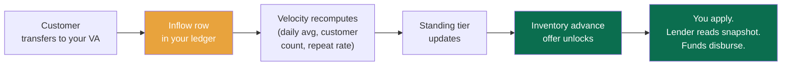

## What "velocity" actually means

Two numbers we track and surface on your dashboard:

| Metric                         | Definition                                                                                                                              |
| ------------------------------ | --------------------------------------------------------------------------------------------------------------------------------------- |
| **Daily inflow average (30d)** | Mean naira amount that landed in your wallet per active business day, over the trailing 30 days.                                        |
| **Monthly inflow (90d)**       | Sum of all wallet inflows in the trailing 30/60/90-day windows. The 90-day reading is what the standing model and lender snapshots use. |

A few derived signals layer on top:

- **Customer count** — how many distinct senders paid you in the last 30 days.
- **Repeat-customer rate** — share of inflows from senders you've received from before.
- **Velocity trend** — is your daily average rising or falling versus the prior 30 days?
- **Working-day discipline** — what share of your declared working days had at least one inflow.

The standing model weights all of these. It doesn't reward "high revenue" — it rewards _consistent, repeatable, customer-diverse activity._ A trader doing ₦80,000 every day across 40 different customers ranks higher than one doing ₦200,000 on Mondays and zero the rest of the week, even though the latter has higher total revenue.

## The four tiers, trader edition

Same tier framework as Job Seekers, with trader-specific signals.

| Tier            | Velocity benchmark (30-day)                                | What it unlocks                                               |
| --------------- | ---------------------------------------------------------- | ------------------------------------------------------------- |
| **Building**    | Just opened the virtual account, under 30 days of activity | Receive payments, withdraw, basic dashboard                   |
| **Emerging**    | ≥₦30k daily avg, ≥10 distinct customers, ≥30d tenure       | Higher transaction limits, lender consent eligibility         |
| **Trusted**     | ≥₦80k daily avg, ≥30 distinct customers, ≥60d tenure       | Inventory-advance offer eligibility, premium customer support |
| **Established** | ≥₦150k daily avg, ≥80 distinct customers, ≥90d tenure      | Top-tier inventory advance, best terms from partner lenders   |

Numbers shift as we calibrate against real Nigerian informal-economy patterns. Your dashboard shows your current standing relative to the threshold for the next tier, not a fixed gate.

## Inventory advance — what it actually is

Hold on, this is the punchline 👀

Once you're at **Trusted** tier, a quadrant on your dashboard lights up:

> _Inventory advance offer._
>
> _Based on your 30-day velocity (₦95k daily, 47 customers), you're eligible for up to ₦200,000 in inventory advance. Repay over 14 weekly installments via direct debit from your wallet. Total cost ₦212,000. Tap to apply._

What's happening underneath: a partner financier (a microfinance institution, a credit fintech, increasingly a commercial bank) has integrated with our Partner API. They've defined a product profile — _"advance up to ₦200k to Trusted-tier traders with ≥₦80k daily velocity, repay over 14 weeks at 6% all-in, eligibility refreshed monthly."_ When your dashboard reads your standing, it checks every active product profile and surfaces the one(s) you qualify for.

You tap **Apply**. We surface a consent prompt: _"Share your Guild snapshot with X Financier?"_ You tap yes. The financier hits `GET /partner/v1/users/usr.../snapshot`, reads your tier, your velocity, your customer count, your repayment streak (if any), and approves or declines in milliseconds.

If approved, the funds disburse straight to your Guild wallet via OPay payout. The repayment schedule writes to our savings/mandates table. Every Tuesday at 9 AM, we direct-debit your wallet for the weekly amount. The lender sees each repayment land in their own dashboard the moment our webhook fires.

You never touched cash. The financier never had to manually underwrite. Your velocity chart did the work.

## What makes velocity go up

- **Take more payments through Guild.** Every customer transfer is a row.
- **Diversify your customers.** A new sender adds to your customer count.
- **Stay consistent.** Daily activity on declared working days beats sporadic bursts.
- **Use multiple channels.** Static VA, dynamic VAs, wallet-to-wallet — all count.

## What pulls it down

- **Refunds.** A refund subtracts from net inflow.
- **Quiet stretches.** A two-week vacation where you don't take any payments will show up as a velocity dip — recoverable, but visible.
- **Mismatched transactions.** If you accept a lot of MISMATCH inflows (wrong amount transferred), the noise hurts the signal quality.
- **Failed debits.** If a partner lender's repayment debit fails because your wallet was empty, that's a negative signal in your standing.

## Why we don't show you the score directly

You see your **tier** (Building, Emerging, Trusted, Established) and the signals behind it. We don't surface the raw numerical score in the trader dashboard.

Two reasons:

1. The numerical score moves daily as the model recomputes. Showing it would invite obsession over noise.
2. The score is for the _model_ and the _lender_ to read. You should be reading the signals — am I serving more customers, am I consistent, am I responsive — because those are the levers you can actually pull.

When you grant a lender consent, the snapshot we send them includes the numerical score. They use it. You don't need to.

<Tip>
  The fastest way from Emerging to Trusted: encourage a few of your regular cash customers to transfer instead. You don't need to convert all of them. Five regulars switching to transfers adds five distinct senders to your customer count and stabilises your daily-average inflow. Most traders cross the Trusted threshold in 6-8 weeks of intentional effort.
</Tip>

## What lenders see vs what you see

Your dashboard surfaces tier, signals, and offers in plain language. The lender sees a signed JSON snapshot:

```json theme={null}
{
  "userId": "usr_01HMFB...",
  "actorRole": "TRADER",
  "standingTier": "Trusted",
  "standingScore": 612,
  "signals": {
    "monthlyVelocityKobo": "9500000000",
    "dailyAvgInflowKobo": "316000000",
    "distinctSendersLast30d": 47,
    "repeatCustomerRate": 0.71,
    "workingDayDisciplineRate": 0.93,
    "lifetimeEarnedKobo": "1842000000",
    "repaymentStreak": 0
  },
  "ledgerWindowDays": 90,
  "signedAt": "2026-08-14T11:02:33Z",
  "signature": "ed25519:..."
}
```

The signature lets them prove the snapshot came from Guild and hasn't been tampered with. Their underwriting model takes the rest.

## Next

<CardGroup cols={2}>
  <Card title="Bills" icon="bolt" href="/traders/bills">
    Spend from your wallet — airtime, data, electricity.
  </Card>

  <Card title="The Partner Portal" icon="building-columns" href="/partners/overview">
    The other side — how a financier integrates and reads your snapshot.
  </Card>
</CardGroup>

> ## Documentation Index
>
> Fetch the complete documentation index at: https://docs.guild.com.ng/llms.txt
> Use this file to discover all available pages before exploring further.

# Bills

> Airtime, data, electricity. From your wallet. Or buy on a customer's behalf and add it to their tab.

Quick one. Bills are the easiest thing Guild does, but they're worth understanding because traders end up using them more than they expect.

## What you can pay for

| Service         | What we support                                                                                                                                                         |
| --------------- | ----------------------------------------------------------------------------------------------------------------------------------------------------------------------- |
| **Airtime**     | All four networks (MTN, GLO, Airtel, 9Mobile). Any amount from ₦100 to ₦10,000 per transaction.                                                                         |
| **Data**        | All four networks. We pull the live bundle catalogue from OPay each time, so what you see is what's actually available.                                                 |
| **Electricity** | Prepaid and postpaid across all the discos — IKEDC, EKEDC, IBEDC, PHEDC, AEDC, KEDCO, KAEDCO, BEDC. We verify the meter against the disco before we charge your wallet. |

Each bill is one wallet debit + one audit row.

## How a payment fires

<Tabs>
  <Tab title="WhatsApp">
    Send `airtime` (or `data` or `light`) in your Guild chat.

    For airtime:

    > *Buy ₦500 MTN airtime for which number? Reply with the phone number.*

    > 08031234567

    > *Confirm: ₦500 MTN airtime to 0803 123 4567. Reply YES to send.*

    > YES

    OPay's airtime VAS fires. Two-second confirmation. *"Airtime sent. Balance: ₦47,000."*

    For data:

    > *Which network? MTN, GLO, Airtel, 9Mobile?*

    > MTN

    > *Here are MTN plans (live from network):*
    > *1. ₦100 — 75MB, 24h*
    > *2. ₦500 — 750MB, 7d*
    > *3. ₦1,500 — 4.5GB, 30d*
    > *4. ₦3,500 — 11GB, 30d*
    >
    > *Reply with the number.*

    The plans come from OPay's live network catalogue so the list is whatever's actually available right now. You pick. We confirm. We charge. Data lands on the phone.

    For electricity, we ask for the meter number first, verify it against the disco through OPay's meter-lookup service, then charge.

  </Tab>

  <Tab title="Web">
    `guild.com.ng/bills`. Three tabs — Airtime, Data, Electricity. Same flow as WhatsApp, just on a bigger screen. The full transaction history sits below.
  </Tab>
</Tabs>

## Buying on a customer's behalf

This is the use case most traders care about.

Mama Bisi runs the provisions stall, but customers often ask her to top up airtime for them while they're paying for garri. She used to walk to the kiosk down the road; now she does it from her phone in fifteen seconds.

Two ways to handle the money.

**Add it to their tab (informal credit, no audit trail):**

The customer pays you cash plus the airtime amount. You buy the airtime from your wallet. Your wallet float keeps the running total. Standard trader behaviour, just digital.

**Have them transfer to your virtual account first:**

The customer transfers, say, ₦5,500 (₦5,000 for garri + ₦500 for airtime + a tiny convenience charge if you add one). The inflow lands in your wallet. You buy the airtime. Both transactions sit in the ledger — clean, auditable, no math confusion.

This second pattern is what we recommend for higher amounts (electricity tokens, large data bundles). The audit trail protects everyone if the customer later disputes.

## Wallet balance, meet bill price

Bills only fire if your wallet has the balance. We don't extend credit at v1 (that's roadmap — and when it ships, it'll come through the partner-lender rail, not a Guild line of credit).

If your wallet is short, we tell you:

> _Balance ₦400 not enough for ₦500 airtime. Top up your wallet or pick a smaller amount._

You can top up from a linked bank (direct debit), from a bank transfer to your virtual account, or by accepting a customer payment that lands in your wallet.

## What it costs

Same naira amount OPay charges us, passed through to you. No markup at v1. If we introduce a small convenience fee in v2, we'll surface it in the confirmation screen before you confirm — never a hidden charge.

## Reconciling

Every bill payment is a row in your transaction history. You see them in your daily summary, in the wallet transaction list, and in your downloadable monthly report (web dashboard, `guild.com.ng/reports`).

When a bill fails — usually because the network or disco rejected the transaction — the wallet debit reverses inside a few minutes and you see a `REFUNDED` row. We notify you by SMS. No money lost.

## Standing implications

Bill payments don't push your standing tier up much. They're convenience features, not signals of business activity.

What does matter for standing: the wallet inflows that fund the bills. Take more customer transfers, build the velocity, and bills become an everyday flow underneath a healthy tier — not a substitute for actual business activity.

## Next

<CardGroup cols={2}>
  <Card title="Sales velocity" icon="chart-line" href="/traders/sales-velocity">
    The signal that actually moves your tier.
  </Card>

  <Card title="Trader overview" icon="store" href="/traders/overview">
    Back to the trader hub.
  </Card>
</CardGroup>

> ## Documentation Index
>
> Fetch the complete documentation index at: https://docs.guild.com.ng/llms.txt
> Use this file to discover all available pages before exploring further.

# For Employers

> Hire who you actually need. Pay only who actually showed up. Stop losing 15% to ghost workers.

Engr. Adekunle runs three to five sites at a time across Ibadan. Bricklayers, labourers, painters, tilers. He hires through a foreman he's worked with for nine years. The foreman is honest enough, mostly, but Adekunle has stopped pretending he doesn't know that on a job where eight men were supposed to show up, six might have, and the wages for the missing two went into someone's pocket.

He calls this his ghost-worker tax. It runs about ten to fifteen percent of every site's labour cost. He's accepted it.

Guild is the version of this where the ghost-worker tax goes to zero, because attendance is on the audit ledger and the foreman cannot edit it after the fact.

Here's what you can actually do.

<CardGroup cols={2}>
  <Card title="Post a job" icon="bullhorn" href="/employers/post-a-job">
    Five bricklayers, three days, Bodija, ₦4,000 a day. Submit. Our matching model ranks every plausible candidate in under a hundred milliseconds and pings the top ones across voice, WhatsApp, and SMS.
  </Card>

  <Card title="Link a bank by direct debit" icon="link" href="/employers/link-a-bank">
    One mandate. One ₦50 confirmation transfer. After that, paying a Job Seeker is one tap from your dashboard. OPay handles the debit, the receipt, and the reconciliation.
  </Card>

  <Card title="Pay Job Seekers" icon="hand-holding-dollar" href="/employers/pay-job-seekers">
    Per-shift, per-job, mid-job. OPay moves money from your bank to their wallet in seconds. The reconcile guard verifies every transaction before crediting. Idempotent end to end.
  </Card>

  <Card title="Escrow" icon="lock" href="/employers/escrow">
    Optional escrow flow for larger jobs. Fund the budget upfront; the funds release per-shift as attendance lands. Refunds for unfilled headcount are automatic.
  </Card>

  <Card title="Workforce reports" icon="chart-mixed" href="/employers/reports">
    Hiring spend, attendance breakdown, workforce composition by trade and location, repeat-hire rates. Downloadable. Auditable. Defensible to your accountant.
  </Card>
</CardGroup>

## Why this works

Two things make Guild useful for employers and they're related.

**One: attendance is the source of truth, not the foreman.** Every shift is marked in real time through the foreman's dashboard. The Job Seeker's phone has location and time validation. The audit row writes once and can't be edited. If a Job Seeker disputes ("I worked four days, he only paid me three"), the ledger settles it — the dispute resolves against whichever side the data doesn't support.

**Two: payment is per-attendance, not per-job.** You don't pay a Job Seeker a lump sum and hope they finish. You pay them per shift completed. If they leave after day two of a five-day job, you've paid for two days, not five. The remainder rolls back to your wallet (or your linked bank, if you funded by direct debit).

Result: the ghost-worker tax goes to zero. The cost of the platform is a fraction of what you used to lose.

## What you give up

A small thing worth being honest about: you give up the casualness of cash. The foreman who used to hand out daily wages from a Ghana-Must-Go bag is now a foreman who hits **Mark Present** on a dashboard. Some old-school site contractors don't like this. Most adjust inside a week — especially after the first Saturday they realize they paid exactly for the headcount that showed up.

## How employers use Guild

| Channel              | What you do                                                                                                                                                                                                  |
| -------------------- | ------------------------------------------------------------------------------------------------------------------------------------------------------------------------------------------------------------ |
| **Web**              | Primary. Post jobs, manage applications, mark attendance, approve payments. `guild.com.ng/overview`.                                                                                                         |
| **WhatsApp text**    | Notifications when applicants submit, approvals from the foreman's phone, daily attendance summaries. Reply to notifications to take action.                                                                 |
| **WhatsApp Calling** | Tap-to-call Tola when you want to ask something complex. Worker-style flows (find work, apply) aren't relevant — but balance queries, payment confirmations, and dashboard help all work over WhatsApp Call. |

You don't get voice as an offline phone line (that's Job Seekers only). You don't get SMS as a bidirectional rail (transactional SMS still fires to your phone for OTPs and confirmations).

## Where to start

<CardGroup cols={2}>
  <Card title="Link a bank first" icon="link" href="/employers/link-a-bank">
    Direct debit is the path of least friction. Set it up once and paying becomes one tap forever after.
  </Card>

  <Card title="Then post a job" icon="bullhorn" href="/employers/post-a-job">
    Once your bank is linked, posting and paying are five minutes of work for a three-day project.
  </Card>
</CardGroup>

> ## Documentation Index
>
> Fetch the complete documentation index at: https://docs.guild.com.ng/llms.txt
> Use this file to discover all available pages before exploring further.

# Post a job

> From dashboard tap to ranked candidates in under a second. The full path.

You need five bricklayers in Bodija on Thursday. Here's how to get them.

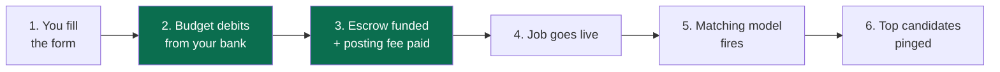

## Open the post-a-job flow

`guild.com.ng/jobs`. Tap **Post Job**. A WhatsApp Flow opens (yes, inside the web dashboard — same form engine, same validation as the WhatsApp-native version).

The form asks for:

| Field                    | What goes in                                                                                                                             |
| ------------------------ | ---------------------------------------------------------------------------------------------------------------------------------------- |
| **Title**                | "5 bricklayers" or "Tiler for kitchen finishing". Plain language.                                                                        |
| **Category**             | Construction / hospitality / cleaning / logistics / agriculture / artisan / etc.                                                         |
| **Skill tags**           | Free-form, but we autocomplete from a curated list (bricklayer, tiler, painter, mason, labourer, carpenter, plumber, electrician, etc.). |
| **Location**             | State, city, area. We pin to Google Places.                                                                                              |
| **Start date**           | Calendar pick.                                                                                                                           |
| **End date or duration** | Either an end date or "3 days" / "1 week".                                                                                               |
| **Daily rate**           | ₦ per day per Job Seeker. Budget total is calculated as `daily × duration × headcount`.                                                  |
| **Workers needed**       | Headcount.                                                                                                                               |
| **Language preference**  | Optional. English / Pidgin / Yoruba / Igbo / Hausa. We rank candidates higher who match this.                                            |
| **Experience level**     | Optional. Beginner / intermediate / experienced / any.                                                                                   |
| **Gender preference**    | Optional. Default any.                                                                                                                   |

Submit.

## What happens when you hit submit

Submitting a job posting triggers two debits, immediately, in a single transaction.

1. **The escrow funding.** Total budget — `daily rate × duration × headcount` — debits from your bank (via your direct-debit mandate) or your wallet. For five bricklayers × three days × ₦4,000, that's ₦60,000. The money lands in an escrow balance tied to this exact job.
2. **The posting fee.** A small ₦500 fee debits on top, going to Guild. It filters spam postings and funds the matching-model compute that runs the moment your job goes live.

Total debit at submit: budget + ₦500. If either step fails (insufficient funds in your bank, mandate not ready), the job doesn't go live and you see a clear failure.

This is intentional and important: **we don't let a job go live without the money already on our side.** A Job Seeker who applies knows the budget exists. Detail at [Escrow](/employers/escrow).

There's no per-application fee, no per-hire fee, no commission on payouts. Budget + ₦500 once at posting, then everything downstream — releases per shift, refunds at the end — handles itself.

## What happens the moment you submit

<Steps>
  <Step title="The job goes live">
    Status: ACTIVE. Posted timestamp written. Available in voice (`list_open_jobs`), WhatsApp (`marketplace`), and web (`/jobs`).
  </Step>

  <Step title="The matching model fires">
    Runs over every Job Seeker who could plausibly do this job. Skill, location, language, economic context. NDCG\@5 in the high nineties on internal benchmarks. Top candidates are ranked in under a hundred milliseconds.
  </Step>

  <Step title="Alerts fire to the top candidates">
    WhatsApp first (it's the dominant Job Seeker rail). SMS as fallback for Job Seekers without WhatsApp. The message gives the title, location, pay, duration, and a one-tap apply.
  </Step>

  <Step title="Marketplace listing">
    The job appears in `guild.com.ng/jobs` and inside Tola's voice flow for any Job Seeker who calls and asks *"wetin work dey?"*
  </Step>
</Steps>

The first applications usually land within sixty seconds of posting.

## Managing applications

Your dashboard at `guild.com.ng/jobs/:jobId` shows the job's applicants in ranked order. The model's ranking is the default; you can re-sort by application time, distance, or standing tier.

For each applicant you see:

- **Standing tier and score.** Building / Emerging / Trusted / Established.
- **Completed jobs in the last 90 days.**
- **Average review.**
- **Distance from the job site** (approximate, from their declared city).
- **Languages they speak.**
- **Trade categories and skill tags.**
- **Last activity** (when they were last online on Guild).

Tap **Approve** to accept their application. The Job Seeker gets a WhatsApp / SMS notification with the start date, foreman contact, and location pin. Tap **Reject** to decline (politely — they get a generic message and no negative signal).

You can approve more than your headcount if you want a buffer. We mark each application's status as `APPROVED`. On the start date, the foreman opens the dashboard and marks who actually showed up.

## Editing a posted job

You can edit:

- The description (clarifications, additional details).
- The end date (extending if you need more days).

You cannot edit:

- The daily rate. (Changes that would unilaterally cut pay aren't allowed.)
- The headcount downward below the count of `APPROVED` applications.
- The job category or skill tags.

If you need to change something restricted, cancel the job (refund handling described below) and post a new one.

## Cancelling a job

`Cancel` is available from the dashboard. What it does:

| State                                  | What happens to applications                                                                                   | What happens to escrow / fee                                                                |
| -------------------------------------- | -------------------------------------------------------------------------------------------------------------- | ------------------------------------------------------------------------------------------- |
| **Before any approvals**               | All `PENDING` applications get a notification: _"This job was cancelled by the employer."_                     | The ₦500 posting fee is non-refundable. Escrow, if any, returns to your wallet immediately. |
| **After approvals, before start date** | Approved Job Seekers get a notification + an apology message. Their standing isn't penalised.                  | Escrow for the unfilled work returns to your wallet.                                        |
| **Mid-job**                            | Approved Job Seekers continue working through the day they were marked present; subsequent days are cancelled. | You're charged only for completed shifts. The unfilled remainder returns to your wallet.    |

Cancelling does mark your account with a small negative signal — frequent cancellations after approvals push your **employer standing** down (yes, employers have standings too — see below).

## Pause and resume

If you need to pause a posting (e.g., you got enough applications and want to stop the alerts but not yet approve), tap **Pause**. The job moves to `PAUSED` status. Existing applications stay in your queue; no new alerts fire; the job doesn't show up in marketplace browsing.

Tap **Resume** to reopen.

## Employer standing — short note

Employers have a standing tier too, and Job Seekers can see it on the apply screen. Three signals weigh in:

- **Approval rate** (what share of applications you approve).
- **Pay-on-time rate** (did you pay approved Job Seekers per shift?).
- **Cancel rate** (how often you cancel jobs after approving).

A high-standing employer attracts better candidates because the model surfaces _their_ jobs to Trusted and Established Job Seekers first. A low-standing employer (one who cancels often, pays late) gets a smaller pool. It's not punitive — it's the same flywheel that rewards Job Seekers who finish.

<Tip>
  Most employers stay invisible to the standing system in their first month. Once you've posted 5+ jobs and paid ≥10 unique Job Seekers, your employer tier surfaces on your profile and starts shaping the candidates you see.
</Tip>

## Next

<CardGroup cols={2}>
  <Card title="Link a bank" icon="link" href="/employers/link-a-bank">
    The direct-debit setup. The thing that makes paying Job Seekers one tap.
  </Card>

  <Card title="Pay Job Seekers" icon="hand-holding-dollar" href="/employers/pay-job-seekers">
    What happens when you tap Pay.
  </Card>
</CardGroup>

> ## Documentation Index
>
> Fetch the complete documentation index at: https://docs.guild.com.ng/llms.txt
> Use this file to discover all available pages before exploring further.

# Link a bank (direct debit)

> Send fifty naira from your bank app. Done forever after. OPay's mandate API at work.

Here's the deal with paying Job Seekers on Guild.

You can pay them out of your **Guild wallet** — top up the wallet (bank transfer or card), then debit it whenever you pay someone. This works, and a lot of employers run this way for small jobs.

But the better path, especially for site contractors who pay daily and across multiple jobs, is **direct debit.** Link your bank account to Guild once, and after that, paying a Job Seeker is one tap that pulls money straight from your bank, no top-up step.

Direct debit is the OPay surface that most hackathon teams won't have working. It's the differentiator. Here's how it actually works.

## The one-time setup

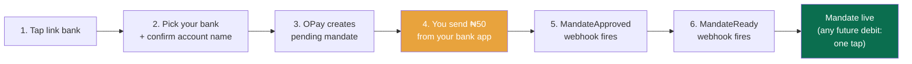

You're going to set up an e-mandate — OPay's term for a standing authorisation that lets us debit your bank with one API call. Six banks are supported today:

| Bank          | Code |
| ------------- | ---- |
| Access Bank   | 044  |
| Ecobank       | 050  |
| Fidelity Bank | 070  |
| First Bank    | 011  |
| Kuda          | 672  |

If your business banking is at one of these, you can link.

<Steps>
  <Step title="Open the link-bank flow">
    `guild.com.ng/mandates`. Tap **Link a bank.**

    Pick your bank from the dropdown. Enter your account number. We resolve the account against OPay's name-lookup service to confirm it exists and pull the official account name. You confirm the name matches.

  </Step>

  <Step title="OPay creates the mandate">
    We submit your account details to OPay's mandate-create service. OPay returns a mandate ID and a confirmation reference.

    The mandate's status is `PENDING_APPROVAL`. We can't debit it yet.

  </Step>

  <Step title="Send the ₦50 confirmation transfer">
    OPay requires a ₦50 transfer from your bank app to a specific OPay account, with a specific reference string. This is the *only* way to prove that you (the account holder) are the one authorising the mandate.

    Our dashboard shows you the exact account number, bank, and reference to use. You leave Guild, open your bank app, do the ₦50 transfer with the reference.

    **This step usually takes one to three minutes.** Most people pause here because the bank app is in a different tab on their phone.

  </Step>

  <Step title="The MandateApproved webhook fires">
    OPay detects the ₦50 transfer and matches it to your pending mandate. They fire a `MandateApproved` webhook to `webhooks.guild.com.ng/opay`.

    We verify the signature. Update the mandate status to `APPROVED`. Notify you by SMS and WhatsApp: *"Bank linked. We're warming it up. You'll be able to use direct debit in a few minutes."*

  </Step>

  <Step title="The MandateReady webhook fires">
    OPay does a final activation check (typically 2-5 minutes after `MandateApproved`). They fire `MandateReady`. The mandate is now usable.

    SMS and WhatsApp again: *"Access Bank ••••3911 is linked and ready. You can now pay Job Seekers directly from your bank."*

  </Step>
</Steps>

Total wall-clock from "tap link bank" to "ready to use" is usually 5-10 minutes, dominated by the ₦50 transfer step.

## Why the ₦50 transfer matters

Hold on — this is worth understanding 👀

If you've ever wondered why OPay's direct debit is harder to set up than card payments, here's the reason: a card can be linked from a tokenised charge that the _recipient_ initiates. A bank mandate cannot. The only way to prove "the holder of account 0xx-xxx-3911 actually wants to authorise this mandate" is to make the holder initiate a transfer themselves, from their bank app.

That's the ₦50 confirmation. It's the cheapest way to prove account control without going through a manual KYC + signature flow.

The upside: once you've done this once, the bank is linked for any future debit. You don't have to confirm again next month, or next year.

## Using the mandate

After the mandate is `READY`, paying a Job Seeker is one tap.

In the application detail page on your dashboard, next to a `COMPLETED` application, you see **Pay**. You tap it. Pick the amount (auto-fills to the shift × daily-rate calculation). Confirm.

We trigger OPay to debit the mandate for the amount. OPay debits your bank. Webhook lands. Reconcile guard runs. Job Seeker's wallet credits. Their phone buzzes.

End to end: under ten seconds.

## What you can debit

Whatever's in your bank account. OPay doesn't enforce a per-mandate cap (some banks have their own limits, usually high — Access Bank's mandate ceiling is ₦5M per debit, for example).

We do enforce a few sanity checks:

- A debit attempt is rejected if your account has insufficient funds. The webhook arrives as `charge_failed`. We don't credit anyone's wallet. We notify you by SMS so you can top up the bank and retry.
- A debit cannot exceed the daily-rate × shifts-completed for the application you're paying. (This prevents bugs in the dashboard from causing a wrong-amount debit.)
- You can't debit a mandate that's not READY. The dashboard hides the Pay button until the mandate is fully activated.

## Multiple mandates

You can link more than one bank if your business uses multiple accounts. Each appears in your mandates list. When you pay a Job Seeker, you pick the source bank from a dropdown — defaults to the most recently used.

This is useful if, say, you keep your operational float in Access Bank and your reserve in First Bank. Most employers run with one mandate at v1.

## Pausing or cancelling a mandate

`guild.com.ng/mandates`. Tap a mandate. **Pause** stops debits but keeps the link active (resume any time). **Cancel** revokes the mandate entirely through OPay. To use the same bank again, you'd re-link from scratch — including a fresh ₦50 confirmation.

We recommend Pause for short stops, Cancel only when you mean it.

## What costs you

Linking is free. The ₦50 you sent goes to OPay and is not refunded — it's the cost of activating the mandate.

Per-debit fees are determined by OPay. Currently zero on top of the wholesale NIBSS fee OPay already absorbs. We don't add a Guild fee at v1.

## When direct debit isn't the right answer

A few cases where you'd skip direct debit and pay from your Guild wallet instead:

- You're testing Guild with one job. Top up the wallet for ₦50,000, run the job, see how it feels.
- Your business banking isn't at one of the six supported banks.
- You're paying very small one-off amounts (a ₦500 commission, a ₦2,000 advance) and don't want to involve your bank.

The wallet path is fine for these. The dashboard automatically picks "pay from wallet" vs "pay via direct debit" based on which one is set up and which one has the balance. You don't have to manage the switch yourself.

<Note>
  A direct debit attempt that fails (insufficient funds, account blocked) **does not** charge you. OPay rejects the call cleanly. Our reconcile guard never credits anyone's wallet. You get a clear failure notification with the reason.
</Note>

## Next

<CardGroup cols={2}>
  <Card title="Pay Job Seekers" icon="hand-holding-dollar" href="/employers/pay-job-seekers">
    Now that the bank is linked, here's the full payment flow.
  </Card>

  <Card title="Escrow" icon="lock" href="/employers/escrow">
    Optional: pre-fund a job budget so funds release per-shift automatically.
  </Card>
</CardGroup>

> ## Documentation Index
>
> Fetch the complete documentation index at: https://docs.guild.com.ng/llms.txt
> Use this file to discover all available pages before exploring further.

# Pay Job Seekers

> How releases fire from escrow as attendance is marked, and the few manual moments along the way.

Here's the surprise most new employers have on Guild.

You don't tap Pay. The system pays.

When you posted the job, the budget moved from your bank into escrow. From that moment forward, Guild's only job is to release funds to Job Seekers as they actually complete shifts. You don't need to remember. You don't need to do daily reconciliation. The money flows where the work happens.

This page is the auto-release model and the few times you'd touch the controls manually.

## The auto-release model

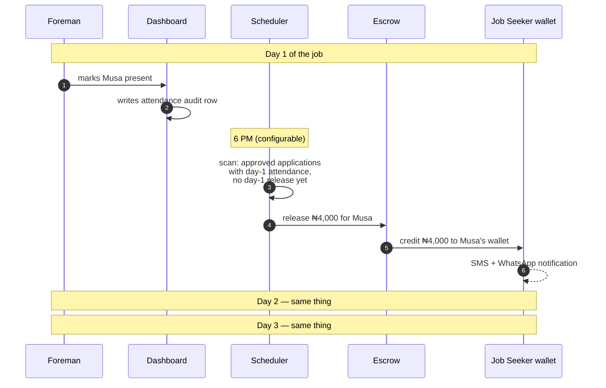

Three things to notice:

1. **The release trigger is attendance**, not "tap Pay." Each marked-present shift triggers exactly one release.
2. **The default release time is 6 PM local.** Configurable per job if a different cadence makes sense (e.g., end-of-week for weekly-paying contracts).
3. **The money is already in escrow** before any of this happens. The release is an internal ledger move, not a fresh bank debit. Fast, safe, predictable.

By the end of the job, every Job Seeker who completed every shift has been paid in full, without you doing anything after posting.

## What you actually see in your dashboard

Your job-detail page (`guild.com.ng/jobs/[jobId]`) shows:

- **Escrow balance** — what's left, what's been released.
- **Per-Job-Seeker attendance grid** — green check for each present shift, grey for absent.
- **Per-Job-Seeker release log** — date and amount of each release.
- **Running spend** — total released to date.
- **Projected refund** — what we'll return to your wallet at job completion based on current attendance.

If the job has zero issues, you check this dashboard maybe once a day, see the green checks accumulate, and move on with your week.

## The manual moments

A few cases where you (or the foreman) do touch the controls.

### Adjusting attendance

The foreman marks attendance per shift. If they made a mistake — marked someone present who didn't show, or marked someone absent who did — the attendance record can be edited within a 12-hour window from when it was marked.

Edits after 12 hours require approval from the original Job Seeker (so neither side can unilaterally alter the record after the fact). The audit row for the edit shows both the original and the new value.

### Releasing a shift early

The default release time is 6 PM. If you need to release a Job Seeker's wage immediately (e.g., they completed a half-day and need the money for transport home), tap **Release now** on their row. The release fires in seconds.

### Holding a shift pending review

If something's off about a shift (a Job Seeker arrived late, did the work but you want to discuss the rate, etc.), tap **Hold for review** on the attendance row. The auto-release skips this shift; you and the Job Seeker work out the resolution; you release manually with the agreed amount.

Hold rows can't sit forever — after 72 hours, we ping you to resolve. After 7 days, the system defaults to releasing the full amount unless you've taken explicit action.

### Partial release

A Job Seeker showed up but left mid-shift. You and the foreman agree to a half-day rate. From their row, tap **Adjust release amount** and enter the negotiated number. The release fires for the lower amount. The remainder stays in escrow (and ultimately refunds at job completion).

The Job Seeker gets a clear SMS: _"₦2,000 from Adekunle (half-day rate as agreed). Balance ₦2,000."_

### Direct extra payment

For an out-of-cycle payment to a specific Job Seeker (a bonus, a one-off addition), use **Pay Job Seeker** on their row. This is the rare manual-tap-Pay path. We trigger a fresh debit from your source (bank or wallet) and credit them directly. Audit row written; not pulled from escrow.

## Refunds

When the job hits `COMPLETED` (either you mark it complete or it auto-completes the day after the end date), the unspent escrow refunds to your wallet within a minute.

Common refund scenarios:

| Scenario                                         | What refunds                                                           |
| ------------------------------------------------ | ---------------------------------------------------------------------- |
| You budgeted for 5 but only 4 showed             | ₦4,000 × number of unfilled shifts                                     |
| One Job Seeker showed for 2 of 3 days            | ₦4,000                                                                 |
| You cancelled the job after day 2                | The full day-3 budget for everyone                                     |
| Hold-for-review shift resolved at a lower amount | The difference between the original day rate and the negotiated amount |

The refund hits your wallet, not your bank directly. From the wallet, you can withdraw to your bank in seconds.

## Disputes

A Job Seeker can dispute a release within 7 days. _"I worked four days, I only got paid for three."_

The dispute flow surfaces:

- The attendance audit rows for the application.
- The release audit rows.
- The original job posting.

A human reviewer (Guild ops) reads both, looks at messages or voice notes exchanged, and makes a call. Most disputes resolve in 24 hours because the data is unambiguous.

A dispute that resolves against you (we agreed the Job Seeker should have been released for a shift that wasn't marked) triggers a fresh release. The escrow funds it if there's enough; if not, we trigger a fresh debit from your source.

A dispute that resolves in your favour is neutral.

## How you actually pay, summarised

The mental model is: **you pay at the start**, by posting the job and funding escrow. After that, your job is to make sure attendance is marked accurately and any manual exceptions get handled. The system moves the money.

This is different from cash-paying through a foreman. It's different from per-tap pay-the-worker-after-they're-done. It's the same flow as how a payroll system would work if payroll didn't require a finance team — automated, audited, accurate.

## Receipts

Every release generates an audit row that's visible in your transaction history. Every release shows up in the Job Seeker's transaction history too.

The downloadable monthly report (`guild.com.ng/reports`) gives you a per-Job-Seeker breakdown of every release in the period: date, amount, job, source. Useful for accounting or for personal records.

## Pay limits

| Limit                                | Threshold                                                              |
| ------------------------------------ | ---------------------------------------------------------------------- |
| Per-release minimum                  | ₦100                                                                   |
| Per-job budget maximum (auto-funded) | Whatever your bank mandate can sustain. Usually ₦5M per debit.         |
| Per-shift release rate               | Whatever you set at job posting. No platform-imposed ceiling on rates. |

If you're running high-volume operations (50+ Job Seekers per job, multi-million-naira budgets), talk to us. We can adjust limits and set up dedicated batch settlement.

## Next

<CardGroup cols={2}>
  <Card title="Escrow" icon="lock" href="/employers/escrow">
    The model in detail.
  </Card>

  <Card title="Workforce reports" icon="chart-mixed" href="/employers/reports">
    Hiring spend, workforce composition, repeat hires.
  </Card>
</CardGroup>

> ## Documentation Index
>
> Fetch the complete documentation index at: https://docs.guild.com.ng/llms.txt
> Use this file to discover all available pages before exploring further.

# Escrow

> How every Guild job is paid for. Budget debits at posting. Funds release per shift. Unfilled headcount refunds automatically.

Escrow is **the** payment model on Guild. Not optional. Not a setting. It's how every job is paid.

The moment you post a job, the full budget leaves your bank (or your wallet) and lands in an escrow balance tied to that job. It's committed before any Job Seeker even sees the posting. As work happens and attendance is marked, per-shift wages release from escrow to Job Seeker wallets automatically. Unfilled headcount refunds to your wallet at the end of the job without you doing anything.

You set this up once at job posting. After that, you check the dashboard occasionally. The money handles itself.

## Why escrow-on-post

Three reasons, all important.

### 1. It eliminates the "wait, can the employer actually pay?" anxiety

A Job Seeker who applies to a Guild job knows the money is already in the system. If they show up and do the work, they get paid. No "the employer disappeared." No "the cheque hasn't cleared." No "let me get back to you after I check my account."

This is the difference between Guild and informal hiring through middlemen, where ghost payments are a real risk for the Job Seeker.

### 2. It eliminates ghost workers for the employer

You only pay for shifts that actually happened. The foreman can't mark a ghost worker present and pocket the difference, because the foreman doesn't see the money — it auto-releases to a real Job Seeker's verified wallet.

### 3. It makes the audit trail simple

One debit at the start (employer's bank → escrow). One credit per completed shift (escrow → Job Seeker wallet). One refund at the end for unfilled headcount (escrow → employer wallet). Every motion is a row in the audit ledger.

## Funding the escrow

When you submit a job posting, we calculate the budget — `daily rate × duration × headcount` — and immediately debit your funding source. The funding source is picked automatically based on what's set up:

- **Direct debit from your bank**, if your mandate is ready (the recommended path).
- **From your Guild wallet**, if the wallet has enough balance.
- **From a saved card or one-time bank transfer**, for one-off jobs that don't need a mandate.

The debit happens in seconds. The escrow balance for your job is funded. The job goes live.

If the debit fails (e.g., your bank has insufficient funds, your wallet is empty and there's no mandate), the job doesn't go live. You see a clear failure with a retry button.

## How releases work

The release rule is simple: each time a Job Seeker's attendance for a shift is marked present _and_ their application is in `APPROVED` state, we release one day's wage to their wallet. Automatically. No tap required.

Per-shift release happens at the end of each shift day (default: 6 PM local time, configurable per job).

<Steps>
  <Step title="Foreman marks Musa present on day 1">
    Attendance row written.
  </Step>

  <Step title="6 PM rolls around">
    Our scheduler scans approved applications with day-1 attendance and no day-1 release yet.
  </Step>

  <Step title="Release transaction fires">
    Internal ledger move: escrow row debited ₦4,000, Musa's wallet credited ₦4,000. Audit rows on both sides.
  </Step>

  <Step title="Musa's phone buzzes">
    SMS notification. WhatsApp message if active.
  </Step>

  <Step title="Repeat for each shift, each Job Seeker">
    Day 2 release fires next evening. Day 3 fires the evening after.
  </Step>
</Steps>

By Saturday evening, your escrow has paid out the right amount to the right people based on who actually showed up. Your dashboard shows the running spend and the remaining escrow balance.

## Refunds

The good part.

If the job's budget assumed five Job Seekers and only four showed up across all three days, ₦12,000 of escrow never released. When the job hits `COMPLETED` status (either you mark it complete or it auto-completes the day after the end date), the unspent escrow refunds to your wallet.

The refund is automatic. No request. No support ticket. You see it in your transaction history as `ESCROW_REFUND` with the job ID linked.

The same applies if a Job Seeker partially attended:

- Approved for 3 days but only showed for 2 → 1 day's wage refunds.
- Approved for 3 days and showed for all 3 but their application stays `APPROVED` (employer didn't mark it `COMPLETED`) → release still happens because attendance is the trigger. The application later transitions to `COMPLETED` for record-keeping.

## Boosting the escrow mid-job

If you decide mid-job that you want to add a sixth Job Seeker, or extend the job by a day, the dashboard shows you the new total budget and triggers a fresh debit for the additional amount. We hold this in the same escrow row.

Releases continue under the same rule.

## Cancelling a job

If you cancel a job, you're charged for completed shifts (those have already released). The remainder refunds to your wallet within a minute.

A cancelled job after approvals notifies the affected Job Seekers and pays them for any shifts they did work.

## What happens to escrow at quarter-end and other accounting moments

Escrow balances sit on our payments schema, separate from wallet balances. For your accounting, they're committed funds — you've sent the money, it's earmarked for the job, and the worst case is it refunds to you.

We do not pay interest on escrow.

We do not co-mingle escrow with operating capital (it sits in a OPay-pooled account at the partner bank, segregated by job).

If Guild ceased to operate, escrow funds for in-flight jobs would be released — to Job Seekers for completed shifts and to employers for the unspent remainder. This is in our terms of service and is part of why we keep the audit ledger structurally immutable.

<Warning>
  Escrow is not a holding mechanism for general operating capital. It's specifically tied to job budgets. Don't fund ₦5M in escrow for a ₦100K job thinking it'll sit there — we limit funding to 110% of the calculated budget (the 10% buffer covers small extensions).
</Warning>

## The full lifecycle, in one diagram

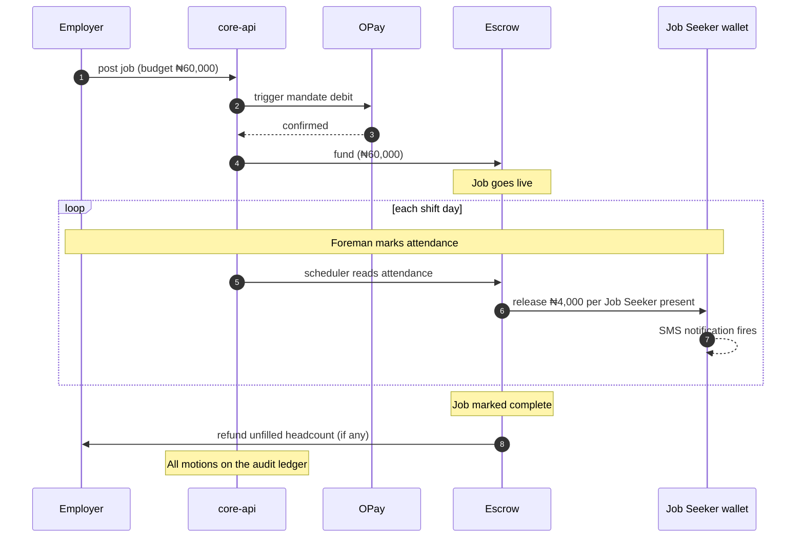

One employer action at the top. Many automatic releases in the middle. One automatic refund at the end. Nothing in between requires you to tap anything.

## Next

<CardGroup cols={2}>
  <Card title="Workforce reports" icon="chart-mixed" href="/employers/reports">
    Aggregate views across jobs. Spend over time, composition, repeat hires.
  </Card>

  <Card title="Link a bank" icon="link" href="/employers/link-a-bank">
    If you haven't already — direct debit is the easiest way to fund escrow.
  </Card>
</CardGroup>

> ## Documentation Index
>
> Fetch the complete documentation index at: https://docs.guild.com.ng/llms.txt
> Use this file to discover all available pages before exploring further.

# Workforce reports

> Hiring spend over time. Workforce composition. Repeat hires. The numbers your accountant actually wants.

You don't think you need workforce analytics until you have them. Then you spot patterns you've been bleeding from for years.

Adekunle's first month on Guild: ₦487,000 in labour across nine jobs. He'd estimated ₦550,000 mentally and was bracing for higher. Turns out his foreman had been padding the headcount in his head, not just on the payroll.

That's not a Guild result. That's just what happens when the ledger replaces estimation.

## Where to find reports

`guild.com.ng/reports`. Three tabs.

<CardGroup cols={3}>
  <Card title="Hiring spend">
    Total spend over your chosen window. Broken down by week, month, or quarter. Stacked by job category, location, or pay rate.
  </Card>

  <Card title="Workforce composition">
    Headcount by trade. By location. By gender. By language. By repeat-hire status. Useful for diversity tracking and for spotting concentration risk.
  </Card>

  <Card title="Repeat hires">
    The Job Seekers you've hired more than once. Their cumulative earnings from you. Their tier history. Useful for identifying your reliable bench.
  </Card>
</CardGroup>

Plus a downloadable monthly summary at the bottom of each tab.

## Hiring spend

The headline chart. A line graph of total labour spend, with markers for each posted job.

You can pivot:

- **By time window.** Day, week, month, quarter, year.
- **By category.** Construction, hospitality, cleaning, etc.
- **By location.** State or city.
- **By job type.** Routine (≥3 prior similar jobs) vs project-specific.

Underneath the chart: a table of every payment in the period, sortable by date, Job Seeker, amount, job, source (wallet vs direct debit).

The "average daily rate per category" panel surfaces inflation in your specific market. If bricklayers in Ibadan trended from ₦3,500/day to ₦4,000/day over six months, you see it as a slope on the chart, with the median anchored by every job you actually posted.

## Workforce composition

A pie chart and a table per dimension.

The dimensions that matter most:

| Dimension                         | What it tells you                                                                                                                                   |
| --------------------------------- | --------------------------------------------------------------------------------------------------------------------------------------------------- |
| **Trade**                         | Where your spend concentrates. Bricklayers? Painters? Logistics?                                                                                    |
| **Location**                      | Are you over-indexed on one area? Useful if you're spreading across Ibadan, Lagos, Ife.                                                             |
| **Gender**                        | Track diversity. Some construction contractors are working to lift female participation; this shows whether the data follows the intent.            |
| **Language**                      | Useful for shaping job postings — if 80% of your hires speak Yoruba, "Yoruba preferred" on future postings is a real filter, not virtue signalling. |
| **Standing tier at time of hire** | Are you hiring mostly Trusted or Established Job Seekers (premium) or mostly Building/Emerging (cheaper but riskier)?                               |
| **Repeat status**                 | New Job Seekers vs people you've worked with before.                                                                                                |

For each pie segment, click through to a list view with every Job Seeker and every job tagged with that property.

## Repeat hires

This is the report most contractors don't realise they need until they see it.

Three columns:

| Job Seeker    | Jobs together | Total paid |
| ------------- | ------------- | ---------- |
| Musa Bello    | 7             | ₦64,000    |
| Tunde Ajibola | 5             | ₦42,000    |
| Bola Adeleke  | 4             | ₦38,500    |

The Job Seekers you've worked with most. Sort by jobs, by total earnings, or by tenure (when you first hired them).

Each row links to that Job Seeker's profile — their current standing tier, their other employers, their availability for the coming week. For a contractor with a stable site rotation, this is gold. It's also a hint to the matching model: future jobs you post will preferentially surface to these people first.

Inside the row, you can:

- **Send a direct hire invitation.** "I have another job starting next Thursday — interested?" Bypasses the open marketplace. The Job Seeker still has to accept.
- **Block.** If you've had a bad experience. They won't appear in future matches for your jobs.
- **Tier-up support.** Endorsement that pushes their standing tier slightly. Limited (you can endorse 5 Job Seekers per month).

## Downloadable reports

Two formats:

- **Monthly PDF.** Branded, signed, with the spend chart and composition tables. Suitable for accountant or tax filing.
- **CSV.** Raw payment data. Every transaction in the period. Standard columns: date, Job Seeker, application ID, job ID, amount, source, reference. Joinable with your other systems.

Download from `guild.com.ng/reports`. We sign the PDF with our Ed25519 key so it can be verified as authentic Guild data later (matters for lender or tax review).

## Real-time vs end-of-period

The reports are real-time. The numbers in your hiring spend chart for "this month" reflect every payment up to a few minutes ago.

The downloadable summaries are generated end of period. The monthly PDF for August lands on September 1st, after the last hour of August transactions are reconciled.

## What the reports don't show

A short list of things you might expect that aren't here at v1:

- **Predicted spend for next month.** We have the data, we don't surface a prediction. Too much room for being wrong in ways that affect your planning. (May ship in v2 with confidence intervals.)
- **Comparison against industry averages.** Privacy boundary — we'd need to aggregate across employers in your category, and at our current scale that aggregation isn't strong enough to publish.
- **Profitability analysis.** We see your labour spend, not your revenue. If you want labour-as-percent-of-revenue, you'd have to combine our CSV with your sales data.

## API access

Everything in the dashboard is also queryable via the API for employers who want to build internal tooling.

Authentication via your dashboard's session cookie (server-to-server) or a service token (for backend systems).

For most employers, the dashboard is enough.

## Next

<CardGroup cols={2}>
  <Card title="Post a job" icon="bullhorn" href="/employers/post-a-job">
    Use what you learn from reports to shape your next posting.
  </Card>

  <Card title="Pay Job Seekers" icon="hand-holding-dollar" href="/employers/pay-job-seekers">
    The path from tap to wallet.
  </Card>
</CardGroup>

> ## Documentation Index
>
> Fetch the complete documentation index at: https://docs.guild.com.ng/llms.txt
> Use this file to discover all available pages before exploring further.

# For Partners

> Underwrite Nigerian informal-economy borrowers on signed snapshot data. Not vouching letters.

You're a bank, a microfinance institution, or a credit fintech. You have an underwriting model that works beautifully for borrowers with two years of bank statements. It falls apart on the people who need credit most — bricklayers, tailors, traders, anyone whose income arrives in cash on uneven days.

The Partner API is your answer to that.

When a Job Seeker or trader applies for credit through your product, they grant Guild consent to share their snapshot with you. We send you a signed JSON document containing their standing tier, their behavioural signals, and a configurable window of their audit ledger. You feed it into your underwriting model. You decide. You disburse over OPay payout. Repayments run by direct debit on the schedule your borrower accepted, written to the same ledger.

Every layer of this is verifiable.

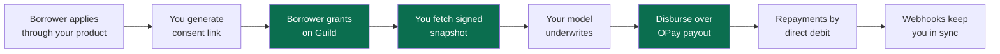

## Four things you get

<CardGroup cols={2}>
  <Card title="Consent-gated reads" icon="user-shield" href="/partners/consent">
    Every snapshot fetch requires an active consent record. The user explicitly grants you access, scoped to your API key and revocable at any time. We never share data you weren't granted access to.
  </Card>

  <Card title="Signed snapshots" icon="signature" href="/partners/snapshots">
    Each snapshot is signed with our Ed25519 key. You verify against our public key. The signature covers the user ID, the standing tier, the score, the signals, the audit-ledger window, and the timestamp. Tamper detection is automatic.
  </Card>

  <Card title="Real-time webhooks" icon="bell" href="/partners/webhooks">
    Subscribe to consent.granted, consent.revoked, and standing.tier\_changed events. You get push notifications when your borrower's situation changes — not a daily polling job.
  </Card>

  <Card title="Predictable rate limits" icon="gauge" href="/partners/rate-limits">
    100 read calls per second per API key. Bursts up to 200 for 5 seconds. Webhooks are unlimited inbound. Above that, talk to us — we'll provision dedicated capacity.
  </Card>
</CardGroup>

## What's actually in a snapshot

```json theme={null}
{
  "userId": "usr_01HMFB...",
  "actorRole": "JOB_SEEKER",
  "standingTier": "Trusted",
  "standingScore": 612,
  "signals": {
    "completedJobsLast90d": 38,
    "averageReviewLast90d": 4.7,
    "onTimeRate": 0.96,
    "repaymentStreak": 12,
    "lifetimeEarnedKobo": "458200000",
    "channelDiversity": 0.83,
    "tenureDays": 187,
    "distinctEmployersLast90d": 9,
    "weeklyVolumeStability": 0.79
  },
  "ledgerWindow": {
    "days": 90,
    "totalInflowsKobo": "458200000",
    "totalOutflowsKobo": "402100000",
    "transactionCount": 47,
    "uniqueCounterparties": 11
  },
  "kyc": {
    "tier": 3,
    "bvnVerified": true,
    "ninVerified": true,
    "addressVerified": true,
    "verifiedAt": "2026-04-12T08:42:17Z"
  },
  "consent": {
    "id": "cnst_01HMFC...",
    "grantedAt": "2026-08-14T10:58:21Z",
    "expiresAt": "2026-11-14T10:58:21Z",
    "scopes": ["standing", "ledger_window_90", "kyc_status"]
  },
  "signedAt": "2026-08-14T11:02:33Z",
  "signature": "ed25519:..."
}
```

The signature covers everything above. If a single byte of this payload is altered after we sent it, signature verification fails on your side.

Detailed field semantics in [Snapshots](/partners/snapshots).

## How a typical integration works

<Steps>
  <Step title="Get your API key">
    From `partners.guild.com.ng/keys`. One key per environment (sandbox + production). See [API keys](/partners/api-keys).
  </Step>

  <Step title="Ask the user for consent">
    Either from inside their Guild dashboard (we surface a consent prompt) or by sending them a consent link from your own product. Either way, we write the consent record on our side. See [Consent](/partners/consent).
  </Step>

  <Step title="Fetch the snapshot">
    `GET /partner/v1/users/:userId/snapshot`. You get the signed JSON above. Verify the signature against our public key (rotated quarterly with a 30-day overlap window). See [Snapshots](/partners/snapshots).
  </Step>

  <Step title="Make your underwriting decision">
    Your model. Your call.
  </Step>

  <Step title="Disburse over OPay payout">
    `POST /partner/v1/disbursements`. We coordinate the OPay payout to the user's wallet or directly to their bank.
  </Step>

  <Step title="Repayments run by direct debit">
    On the schedule the user accepted at disbursement. Each repayment writes to both their Guild ledger and your books.
  </Step>

  <Step title="Webhooks keep you in sync">
    Consent revocations, standing tier changes, repayment outcomes — all push events.
  </Step>
</Steps>

## Sandbox vs production

Two parallel environments.

| Environment    | Base URL                                      | Data                                             | When to use                                                                                                         |
| -------------- | --------------------------------------------- | ------------------------------------------------ | ------------------------------------------------------------------------------------------------------------------- |
| **Sandbox**    | `https://api.sandbox.guild.com.ng/partner/v1` | Seeded synthetic users (Musa, Mama Bisi, others) | Build and test your integration. No real consent required for sandbox users; we provide pre-granted consent tokens. |
| **Production** | `https://api.guild.com.ng/partner/v1`         | Real Guild users who have granted you consent    | Go-live with real borrowers.                                                                                        |

<Warning>
  **The live sandbox isn't active yet.** We're finalising the synthetic-user dataset and the sandbox webhook delivery infrastructure. If you're integrating now, talk to us and we'll arrange a sandbox handshake when it's ready. The endpoints and shapes documented here are the spec we're shipping against.
</Warning>

Sandbox responses are signed with a sandbox key (different public key, marked `sandbox` in the JWK). Production responses are signed with our production key. Don't accept a sandbox signature on a production transaction — your verifier should pin the key environment.

## What lending products work well on Guild data

Two patterns we've seen partners succeed with:

**Inventory advance for traders.** Eligibility threshold tied to monthly velocity (≥₦80k daily average, ≥30 distinct customers, Trusted tier). Loan size 30-50% of monthly velocity. Term 8-16 weeks. Repaid by weekly direct debit from the trader's wallet. Default rate has trended well below the bank's other unsecured products on file.

**Tool-equipment loans for skilled workers.** Eligibility threshold tied to completed jobs (≥30 over 60 days, Trusted tier, average review ≥4.0). Loan size 50-100% of trailing-30-day earnings. Term 4-12 weeks. Repaid by weekly direct debit triggered after each OPay payout lands in their wallet.

Both depend on Guild's data being verifiable and on the borrower's incentive to maintain their standing (the loop: bad behaviour → lower standing → fewer offers).

## What's not in scope at v1

We don't surface raw transaction-level data to partners. The ledger window in a snapshot is aggregated — totals, counts, counterparty counts — not transaction-by-transaction details. This is a privacy choice; it protects the user's specific employer relationships and customer identities while still giving you the underwriting signal you need.

If your model needs transaction-level granularity, we can discuss a higher-trust tier with stricter consent and audit requirements. Talk to us.

## Pricing

Free for the snapshot reads, the consent flow, the webhook subscriptions, and the API key management.

Per-disbursement: a small percentage of the loan principal, settled at disbursement. This is how Guild makes money on this side — we're aligned with the partner on volume, not on individual transactions.

Per-repayment: zero. Direct debit through OPay has its own per-transaction cost which OPay absorbs in their merchant agreement with us.

Details in your contract; the pricing surface is intentionally simple.

## Next

<CardGroup cols={2}>
  <Card title="API keys" icon="key" href="/partners/api-keys">
    How to get a key and how authentication works.
  </Card>

  <Card title="Consent" icon="user-shield" href="/partners/consent">
    The granular permission model and how to drive the consent flow.
  </Card>
</CardGroup>

> ## Documentation Index
>
> Fetch the complete documentation index at: https://docs.guild.com.ng/llms.txt
> Use this file to discover all available pages before exploring further.

# API keys

> Bearer authentication. One key per environment. Rotation, scoping, revocation.

Authentication for the Partner API is a bearer token. You pass it as an `Authorization: Bearer <key>` header on every request. Simple, standard, and the same shape as Stripe's or Plaid's.

The interesting parts are how you get the key, how to scope it, and how to rotate it without dropping production traffic.

## Getting your first key

<Steps>
  <Step title="Sign up for the Partner Portal">
    `partners.guild.com.ng/sign-up`. Use your work email. We send a verification link. Click it, set up your organisation profile (legal name, regulator, primary contact).
  </Step>

  <Step title="Wait for approval">
    A real human at Guild reviews your application. We check your regulatory standing (if you're a deposit-taking institution, we want to see your CBN licence; if you're a non-bank lender, we ask for your business registration and a sample of an underwriting policy document). This typically takes 24-72 hours.
  </Step>

  <Step title="Generate keys">
    Once approved, `partners.guild.com.ng/keys` shows you the key management panel. You can generate keys for `sandbox` and `production` environments. The full secret is shown exactly once at creation — copy and store it securely.
  </Step>
</Steps>

The key prefix tells you the environment at a glance:

| Prefix         | Environment | Example                 |
| -------------- | ----------- | ----------------------- |
| `gld_sandbox_` | Sandbox     | `gld_sandbox_01HKAR...` |
| `gld_live_`    | Production  | `gld_live_01HKBZ...`    |

Each key is a ULID-encoded secret. Length: 56 characters including prefix.

## Using a key

Every request includes the bearer token:

```bash theme={null}
curl https://api.guild.com.ng/partner/v1/users/usr_01HMFB.../snapshot \
  -H "Authorization: Bearer gld_live_01HKBZ..." \
  -H "X-Guild-Consent-Token: cnst_01HMFC..."
```

The `X-Guild-Consent-Token` header is the consent reference for this specific user. See [Consent](/partners/consent).

## Key scoping

When you generate a key, you can scope it. The default is unscoped (full Partner API access). You can narrow it for principle-of-least-privilege:

| Scope                 | What the key can do                                               |
| --------------------- | ----------------------------------------------------------------- |
| `read:snapshots`      | Fetch user snapshots only. Cannot disburse, cannot list consents. |
| `write:disbursements` | Disburse over OPay payout. Cannot fetch snapshots.                |
| `read:webhooks`       | Manage webhook subscriptions only.                                |
| `admin:org`           | Manage organisation-level settings (other team members, billing). |

Scope-restricted keys reduce blast radius if a key leaks. Most integrations create one `read:snapshots` key for their underwriting service and one `write:disbursements` key for their loan-fulfilment service.

## IP allowlisting

Optional but recommended for production keys.

`partners.guild.com.ng/keys/:keyId/allowlist`. Add the IP addresses or CIDR ranges that your backend uses. Requests from any other IP fail with 401, even with a valid key.

We support IPv4 and IPv6. CIDR notation accepted (`192.0.2.0/24`). Up to 32 entries per key.

If your infrastructure is on a cloud provider where your egress IP can change (e.g., AWS Lambda without a NAT gateway), don't use IP allowlisting. Most production deployments have stable egress IPs and benefit from this layer.

## Rotation

Keys should be rotated periodically. We recommend every 90 days; we won't force it at v1, but we'll surface a soft warning in the dashboard after 180 days of use.

Rotation pattern:

<Steps>
  <Step title="Generate a new key">
    `partners.guild.com.ng/keys/new`. Same scopes, same allowlist as the key you're replacing.
  </Step>

  <Step title="Update one service at a time">
    Deploy the new key to a single instance of your service. Verify it works in production. Then roll out to the rest.
  </Step>

  <Step title="Watch the old key's usage drop to zero">
    Each key shows the last-seen timestamp and the request count for the last 24 hours. Wait until the old key has been quiet for at least an hour.
  </Step>

  <Step title="Revoke the old key">
    `partners.guild.com.ng/keys/:keyId/revoke`. The key becomes immediately invalid; any request still using it fails with 401.
  </Step>
</Steps>

If you accidentally revoke the wrong key, generate a fresh one — you cannot un-revoke.

## Compromise

If you suspect a key has leaked (committed to a public repo, sent in an unencrypted email, etc.), revoke it immediately:

`partners.guild.com.ng/keys/:keyId/revoke?reason=compromised`.

The `reason=compromised` flag opens an incident on our side too. We scan our logs for activity from the key against unusual IPs or patterns and notify you within an hour.

Replace with a new key after revoking.

## What happens when a request comes in

Behind the scenes, every request runs through the same auth check.

<Steps>
  <Step title="Extract the bearer token">
    From the `Authorization` header. If missing, return 401 with `error_code: missing_auth`.
  </Step>

  <Step title="Look up the key">
    Hashed-key lookup against our `partner_api_keys` table. We never store the raw secret — only an Argon2id hash. If no match, 401 with `error_code: invalid_auth`.
  </Step>

  <Step title="Check the key's status">
    Must be `ACTIVE`. Revoked, suspended, or expired keys fail.
  </Step>

  <Step title="Check IP allowlist">
    If allowlisting is on, the source IP must match. Otherwise 401 with `error_code: ip_not_allowed`.
  </Step>

  <Step title="Check the scope">
    The requested operation must match one of the key's scopes. Otherwise 403 with `error_code: scope_insufficient`.
  </Step>

  <Step title="Check rate limit">
    Per-key token bucket. If exceeded, 429 with `Retry-After` header. See [Rate limits](/partners/rate-limits).
  </Step>

  <Step title="For consent-required operations">
    Validate the `X-Guild-Consent-Token` header. The token must match an active consent record for the user being read and the partner holding the key. Otherwise 403 with `error_code: consent_missing` or `consent_revoked`.
  </Step>

  <Step title="Execute">
    All checks passed. The request runs.
  </Step>
</Steps>

Each rejection writes a row to our `partner_api_audit` table — your dashboard surfaces them so you can debug auth issues.

## Test keys

Sandbox keys (`gld_sandbox_*`) work against `api.sandbox.guild.com.ng`. They cannot be used against production. They never charge real money. The users in sandbox are seeded synthetics — Musa, Mama Bisi, Engr. Adekunle, plus a hundred others with varied signal patterns.

Most partners develop entirely against sandbox first, get our acceptance walkthrough, then flip a flag in their config to production.

## Where to keep your keys

Standard advice, but worth restating:

- **Environment variables on your backend**, not in source code.
- **Secrets manager** (AWS Secrets Manager, GCP Secret Manager, HashiCorp Vault, Doppler) for production.
- **Never** in client-side code, mobile apps, or anywhere that ships to the user.
- **Never** in browser dev tools or shell history (use `read` with no echo in your CI).

If we detect requests from an obvious public host (e.g., the key shows up in a request from a residential IP that doesn't match your allowlist), we'll proactively suspend and notify.

## Next

<CardGroup cols={2}>
  <Card title="Consent" icon="user-shield" href="/partners/consent">
    The other piece of the authentication picture — the per-user permission model.
  </Card>

  <Card title="Snapshots" icon="signature" href="/partners/snapshots">
    The data you read with the keys.
  </Card>
</CardGroup>

> ## Documentation Index
>
> Fetch the complete documentation index at: https://docs.guild.com.ng/llms.txt
> Use this file to discover all available pages before exploring further.

# Consent

> Per-user, per-partner, scope-bounded, revocable. The permission model behind every snapshot fetch.

This is the page that most Partner API integrations get a little wrong on the first try. The mental model is closer to OAuth than to "API key allows access to my data." Worth a careful read.

## The model

A consent is a row in our database that says:

> _User U has granted Partner L access to scope S until expiry E._

Every snapshot fetch must reference an active consent. The user can revoke at any time. The scope determines what the snapshot includes. The expiry caps how long the access lasts.

Crucially, **the consent is held on Guild's side, not the partner's.** You don't store a copy of the user's grant. You reference the consent by its ID on every request. We check it's still active before we serve the snapshot.

## How a user grants consent

Two paths.

### Path 1: User-initiated (from their Guild dashboard)

The user opens `partners.guild.com.ng`. They see a "Connect a partner" button. They search for your organisation (we maintain a directory of approved partners). They tap **Grant access**.

A prompt explains exactly what you'll be able to read:

> _X Financier is requesting access to your Guild data._
>
> _They will be able to read:_
>
> - _Your standing tier and score_
> - _Your audit ledger summary for the last 90 days_
> - _Your KYC verification status (Tier 3)_
>
> _Access will expire on 14 November 2026 (90 days). You can revoke any time._
>
> _\[Grant] \[Decline]_

User taps **Grant**. We write a consent row. We fire `consent.granted` webhook to your endpoint. The webhook payload contains the consent ID, the user ID, the scopes, and the expiry.

### Path 2: Partner-initiated (consent link in your product)

The more common pattern. Inside your loan application flow, you generate a consent link via the API:

```bash theme={null}
curl -X POST https://api.guild.com.ng/partner/v1/consent-links \
  -H "Authorization: Bearer gld_live_..." \
  -H "Content-Type: application/json" \
  -d '{
    "userPhone": "+2348031234567",
    "scopes": ["standing", "ledger_window_90", "kyc_status"],
    "expiresInDays": 90,
    "callbackUrl": "https://yourbank.com.ng/loan/12345/consent-result"
  }'
```

Response:

```json theme={null}
{
  "consentLinkId": "clnk_01HMFB...",
  "consentUrl": "https://guild.com.ng/consent/clnk_01HMFB...",
  "expiresAt": "2026-08-21T14:32:11Z"
}
```

You redirect the user to `consentUrl`. They sign into Guild with their phone + OTP if not already signed in. They see the consent prompt (same content as path 1). They grant or decline. We redirect them back to your `callbackUrl` with `?status=granted&consentId=cnst_...` or `?status=declined`.

This is the OAuth-shaped pattern. Familiar to most partner backends.

## The scope vocabulary

Each consent specifies which scopes the partner is granted. Scopes compose; the snapshot you receive is the intersection of what you requested and what the user granted.

| Scope                  | What the snapshot includes                                                                                                  |
| ---------------------- | --------------------------------------------------------------------------------------------------------------------------- |
| `standing`             | Standing tier and standing score, plus the underlying signals (completed jobs, average review, on-time rate, etc.).         |
| `ledger_window_30`     | Aggregated audit ledger for the last 30 days.                                                                               |
| `ledger_window_60`     | Aggregated audit ledger for the last 60 days.                                                                               |
| `ledger_window_90`     | Aggregated audit ledger for the last 90 days.                                                                               |
| `ledger_window_365`    | Aggregated audit ledger for the last 365 days. Use sparingly; users will see this scope and may be more reluctant to grant. |
| `kyc_status`           | Tier level, BVN verified flag, NIN verified flag, address verified flag, verified-at timestamp.                             |
| `repayment_history`    | If the user has taken loans through any partner (including yours), their repayment streak and any defaults.                 |
| `disbursement_history` | If the user has received disbursements (through any lender), the cumulative count and total.                                |

Two rules:

1. Only one `ledger_window_*` scope per consent. They're mutually exclusive.
2. `repayment_history` and `disbursement_history` are aggregated across all partners; you don't see _which_ partner extended the credit, only that someone did.

## The consent record

What you can read from `GET /partner/v1/consents/:consentId`:

```json theme={null}
{
  "id": "cnst_01HMFC...",
  "userId": "usr_01HMFB...",
  "partnerId": "prt_01HK...",
  "status": "ACTIVE",
  "scopes": ["standing", "ledger_window_90", "kyc_status"],
  "grantedAt": "2026-08-14T10:58:21Z",
  "expiresAt": "2026-11-14T10:58:21Z",
  "revokedAt": null,
  "createdViaConsentLinkId": "clnk_01HMFB..."
}
```

Statuses cycle through `PENDING` (consent link generated, not yet acted on), `ACTIVE` (user granted), `EXPIRED` (passed `expiresAt`), `REVOKED` (user pulled it).

## Using a consent

Every snapshot fetch includes the consent ID:

```bash theme={null}
curl https://api.guild.com.ng/partner/v1/users/usr_01HMFB.../snapshot \
  -H "Authorization: Bearer gld_live_..." \
  -H "X-Guild-Consent-Token: cnst_01HMFC..."
```

We check:

- The consent exists.
- It belongs to the partner associated with your API key.
- It hasn't expired.
- It hasn't been revoked.
- It includes the scopes needed for the data being returned.

If any of those fail, the request returns 403 with a specific `error_code`. Your code should treat each failure mode distinctly — `consent_revoked` means ask the user to re-grant, `consent_expired` means renew, `consent_not_found` means a programming bug.

## Revocation

The user can revoke at any time from `partners.guild.com.ng`. The moment they tap revoke:

1. Consent status flips to `REVOKED`. `revokedAt` is set.
2. Any in-flight snapshot fetches with that consent ID fail with `consent_revoked` (no race condition — we check at the start of every request).
3. `consent.revoked` webhook fires to your endpoint.
4. The user sees a confirmation in their dashboard.

You can request a new consent. The user gets a fresh prompt, with the same content as the original grant. They can grant or decline as they see fit.

What revocation _doesn't_ do: invalidate snapshots you already pulled. Underwriting works on a fixed point in time — you make your decision against the snapshot you fetched at moment X. If the user revokes at moment Y > X, your decision stands, and any active loan continues. You just can't pull a fresh snapshot.

This is intentional. Borrowers shouldn't be able to escape a contract by revoking consent post-hoc.

## Renewal

When a consent approaches expiry (we configure a 14-day warning window by default), the user gets a notification in their Guild dashboard with a one-tap renewal:

> _Your consent with X Financier expires in 7 days. Renew for another 90 days?_

If they tap **Renew**, the same scopes extend by another window. If they tap **Decline**, the consent expires on schedule. We fire `consent.renewed` (or, on expiry, `consent.expired`) webhooks.

You can also drive renewal from your side — generate a new consent link with the same scopes and email it to the user a week before expiry.

## Multi-product consent

A user might grant a single partner consent for multiple products (a savings sweep + a credit line + an inventory advance). The model handles this two ways:

1. **One broad consent per partner.** Grant `standing + ledger_window_90 + kyc_status + repayment_history`, valid for 365 days. The partner uses this consent for all products. Simpler for the user.
2. **Separate consents per product.** Each product has its own consent and its own scope set. Cleaner audit trail but requires the user to tap grant multiple times.

We've seen both work. Most partners go with pattern 1.

## Why not OAuth?

You'll notice the model looks a lot like OAuth, but we don't expose the `/oauth/authorize` redirect dance directly. Two reasons:

1. **The user must always come back to Guild for the prompt.** OAuth assumes the redirect can be fully customised by the relying party; we prefer a consistent prompt that the user recognises across every partner. Consent links are the abstraction over this.
2. **No tokens.** OAuth issues access tokens that the partner stores. We don't — every snapshot fetch references a consent by ID, and we check on every call. This is more chatty but means a revocation propagates instantly across your infrastructure.

If your existing systems are built around OAuth, the consent-link pattern maps cleanly onto your existing redirect flows. Most partners find it familiar within an afternoon.

## The audit trail on consent

Every consent state change writes to a `consent_audit` table that's append-only with `BEFORE UPDATE OR DELETE` triggers. The full history of grants, expiries, revocations, and renewals is permanent.

Both you and the user can read this audit. The user from their dashboard. The partner from `GET /partner/v1/consents/:consentId/audit`. Disputes resolve quickly because the trail is uneditable.

## Next

<CardGroup cols={2}>
  <Card title="Snapshots" icon="signature" href="/partners/snapshots">
    The actual data you read once you have a consent.
  </Card>

  <Card title="Webhooks" icon="bell" href="/partners/webhooks">
    Push notifications when consents grant, revoke, or expire.
  </Card>
</CardGroup>

> ## Documentation Index
>
> Fetch the complete documentation index at: https://docs.guild.com.ng/llms.txt
> Use this file to discover all available pages before exploring further.

# Snapshots

> The signed JSON document that your underwriting model reads. Every field, every signal, every guarantee.

A snapshot is the unit of underwriting data on Guild. One snapshot per user per fetch. Signed, scoped, timestamped, verifiable.

You fetch one when you decide. You verify the signature. You feed the JSON into your model. The fields are what they say they are.

## Fetching

```bash theme={null}
curl https://api.guild.com.ng/partner/v1/users/usr_01HMFB.../snapshot \
  -H "Authorization: Bearer gld_live_01HKBZ..." \
  -H "X-Guild-Consent-Token: cnst_01HMFC..."
```

Response 200 with the snapshot JSON. Response time: median 95ms, p99 280ms.

You can pass a `ledger_window_days` query parameter to override the consent's default window (within the bounds of the granted scope). Useful if a consent allows up to 365 days but you only want the last 30 for a specific calculation:

```bash theme={null}
curl 'https://api.guild.com.ng/partner/v1/users/usr_01HMFB.../snapshot?ledger_window_days=30' \
  -H "Authorization: Bearer gld_live_..." \
  -H "X-Guild-Consent-Token: cnst_..."
```

## The full payload

```json theme={null}
{
  "userId": "usr_01HMFB7ZQK2X8YN4P5R6S7T8V9",
  "actorRole": "JOB_SEEKER",
  "standingTier": "Trusted",
  "standingScore": 612,
  "tierProgress": {
    "currentTier": "Trusted",
    "nextTier": "Established",
    "pointsToNext": 138,
    "trend30d": "rising"
  },
  "signals": {
    "completedJobsLast90d": 38,
    "averageReviewLast90d": 4.7,
    "onTimeRate": 0.96,
    "repaymentStreak": 12,
    "lifetimeEarnedKobo": "458200000",
    "channelDiversity": 0.83,
    "tenureDays": 187,
    "distinctEmployersLast90d": 9,
    "weeklyVolumeStability": 0.79,
    "savingsActiveRule": true,
    "lastActiveAt": "2026-08-14T09:21:08Z"
  },
  "ledgerWindow": {
    "days": 90,
    "totalInflowsKobo": "458200000",
    "totalOutflowsKobo": "402100000",
    "transactionCount": 47,
    "uniqueCounterparties": 11,
    "averageInflowKobo": "9744680",
    "medianInflowKobo": "8000000",
    "inflowVarianceKobo": "12400000",
    "windowStart": "2026-05-16T00:00:00Z",
    "windowEnd": "2026-08-14T00:00:00Z"
  },
  "kyc": {
    "tier": 3,
    "bvnVerified": true,
    "ninVerified": true,
    "addressVerified": true,
    "verifiedAt": "2026-04-12T08:42:17Z",
    "businessKyc": null
  },
  "repaymentHistory": {
    "totalLoansAcrossPartners": 2,
    "activeLoansAcrossPartners": 0,
    "totalRepaidKobo": "75000000",
    "totalDefaultedKobo": "0",
    "longestStreakDays": 87,
    "currentStreakDays": 0
  },
  "consent": {
    "id": "cnst_01HMFC...",
    "scopes": [
      "standing",
      "ledger_window_90",
      "kyc_status",
      "repayment_history"
    ],
    "grantedAt": "2026-08-14T10:58:21Z",
    "expiresAt": "2026-11-14T10:58:21Z"
  },
  "signedAt": "2026-08-14T11:02:33Z",
  "signature": "ed25519:5e8a4f...c2b1"
}
```

The shape is consistent — fields you don't have scope to read are present but null (or absent for collections). This lets your code use the same parser regardless of which scopes the consent granted.

## Field semantics

The signals are the heart of the snapshot. Detailed semantics so you can build your model against precise definitions.

### Standing

| Field                       | Type       | Meaning                                                                                                                                   |
| --------------------------- | ---------- | ----------------------------------------------------------------------------------------------------------------------------------------- |
| `standingTier`              | enum       | `Building`, `Emerging`, `Trusted`, `Established`. The model's classification.                                                             |
| `standingScore`             | int 0-1000 | The raw score behind the tier. Useful for fine-grained underwriting policies (e.g., "approve at score ≥600 even if tier reads Emerging"). |
| `tierProgress.pointsToNext` | int        | How many points until the user crosses into the next tier. Useful for trajectory analysis.                                                |
| `tierProgress.trend30d`     | enum       | `rising`, `stable`, `falling`. Whether the score moved up, down, or stayed flat in the last 30 days.                                      |

### Job/work signals

| Field                      | Type      | Meaning                                                                  |
| -------------------------- | --------- | ------------------------------------------------------------------------ |
| `completedJobsLast90d`     | int       | Count of applications with `status = COMPLETED` in the trailing 90 days. |
| `averageReviewLast90d`     | float 0-5 | Mean star rating from employers, weighted equally per review.            |
| `onTimeRate`               | float 0-1 | Share of shifts where the user was marked present on time (not late).    |
| `distinctEmployersLast90d` | int       | Number of unique employers in the trailing 90 days. A diversity signal.  |
| `tenureDays`               | int       | Days since the user's account was created.                               |

### Cashflow signals

| Field                   | Type       | Meaning                                                                                                           |
| ----------------------- | ---------- | ----------------------------------------------------------------------------------------------------------------- |
| `lifetimeEarnedKobo`    | string-int | Total kobo earned across all completed jobs since account creation. String to preserve precision on large values. |
| `weeklyVolumeStability` | float 0-1  | Coefficient of inverse variance on weekly earnings. Higher means more consistent week-to-week.                    |
| `savingsActiveRule`     | bool       | Whether the user has at least one active savings rule. A small positive signal of cashflow discipline.            |
| `channelDiversity`      | float 0-1  | Normalized entropy across the channels the user has used. Higher means more rails actually used.                  |
| `lastActiveAt`          | ISO-8601   | When the user last took an action on Guild.                                                                       |

### Ledger window (aggregated)

The ledger window is the user's transaction summary over the requested time range. We don't expose individual transactions — only aggregates.

| Field                  | Meaning                                                                               |
| ---------------------- | ------------------------------------------------------------------------------------- |
| `totalInflowsKobo`     | All money that landed in the user's wallet during the window.                         |
| `totalOutflowsKobo`    | All money that left the wallet (withdrawals, savings, bills, refunds).                |
| `transactionCount`     | Total transaction rows in the window.                                                 |
| `uniqueCounterparties` | Distinct counterparties (employer names for inflows, beneficiary banks for outflows). |
| `averageInflowKobo`    | Mean per-inflow size.                                                                 |
| `medianInflowKobo`     | Median per-inflow size. Less skewed than mean by outliers.                            |
| `inflowVarianceKobo`   | Statistical variance of inflows. Used by some models to gauge income stability.       |

For traders, the ledger window also includes `dailyAvgInflowKobo` and `distinctSendersLast30d`.

### KYC

| Field             | Meaning                                                                                  |
| ----------------- | ---------------------------------------------------------------------------------------- |
| `tier`            | 1, 2, or 3.                                                                              |
| `bvnVerified`     | True if the user has completed BVN verification through us.                              |
| `ninVerified`     | True if the user has completed NIN verification through us.                              |
| `addressVerified` | True if the user has had their declared address verified (typically by document upload). |
| `verifiedAt`      | When the highest verification step completed.                                            |
| `businessKyc`     | For traders/employers, additional business KYC (CAC, etc.) or null.                      |

### Repayment history

If the user has taken loans through any Guild-integrated lender:

| Field                       | Meaning                                                 |
| --------------------------- | ------------------------------------------------------- |
| `totalLoansAcrossPartners`  | Count of loans the user has had, across all partners.   |
| `activeLoansAcrossPartners` | Currently outstanding.                                  |
| `totalRepaidKobo`           | Cumulative principal + interest repaid.                 |
| `totalDefaultedKobo`        | Cumulative principal in default.                        |
| `longestStreakDays`         | Longest consecutive on-time-payment streak in days.     |
| `currentStreakDays`         | Current on-time streak. Reset to 0 on a missed payment. |

This scope is privacy-sensitive. We aggregate across partners — you don't see which partner extended the credit, only that someone did.

## Signature verification

This is the part you must implement carefully.

The signature covers a canonical JSON serialisation of the entire payload (except the `signature` field itself). We use Ed25519. Our public keys are at `GET /partner/v1/keys`:

```json theme={null}
{
  "keys": [
    {
      "kid": "guild-prod-2026-q3",
      "kty": "OKP",
      "crv": "Ed25519",
      "x": "MCowBQYDK2VwAyEAa9...",
      "alg": "EdDSA",
      "use": "sig",
      "validFrom": "2026-07-01T00:00:00Z",
      "validUntil": "2026-09-30T23:59:59Z"
    },
    {
      "kid": "guild-prod-2026-q4",
      "kty": "OKP",
      "crv": "Ed25519",
      "x": "MCowBQYDK2VwAyEABx...",
      "alg": "EdDSA",
      "use": "sig",
      "validFrom": "2026-09-15T00:00:00Z",
      "validUntil": "2026-12-31T23:59:59Z"
    }
  ]
}
```

We rotate keys quarterly with a 30-day overlap window. During overlap, snapshots may be signed with either the outgoing or incoming key.

Verification steps:

<Steps>
  <Step title="Pull the keys">
    Cache for up to 4 hours. Don't fetch per snapshot.
  </Step>

  <Step title="Look up the kid">
    The signature contains a `kid` reference. Find the matching public key.
  </Step>

  <Step title="Canonicalise the payload">
    Remove the `signature` field. Sort keys lexicographically at every level. Serialise with no extra whitespace.
  </Step>

  <Step title="Verify">
    Standard Ed25519 verification. If invalid, reject the snapshot — do not pass it to your underwriting model.
  </Step>
</Steps>

We provide reference implementations in Python, Node.js, and Go on the Partner Portal under "Resources." Use those rather than implementing from scratch.

## What's not in a snapshot

Things you might expect but won't find:

- **Transaction-level details.** Only aggregates. (Privacy.)
- **Counterparty names.** "11 unique counterparties" not "Adekunle, Olabisi, Funmi, ...". (Privacy.)
- **The user's bank account number or BVN.** We hold those. They don't leave Guild. (Security.)
- **GPS coordinates or device IDs.** We don't collect them.
- **Voice transcripts or message contents.** We have them; we don't share them.

The snapshot is engineered for underwriting. Not surveillance.

## Caching

A snapshot is a point-in-time read. You can cache it on your side for the duration of your underwriting decision. **Don't cache it indefinitely.** A user's standing tier can change daily; an underwriting decision made on stale data is bad for the borrower and bad for you.

Reasonable cache TTL: the length of your decisioning window (e.g., if you decide within 5 minutes of fetch, cache for 5 minutes).

If you need a fresh read, fetch a new snapshot. Each fetch is independent and signed with the timestamp.

## Idempotency

Snapshot fetches are read-only and inherently idempotent. No `Idempotency-Key` header needed.

## Errors

| HTTP | error_code           | When                                                            |
| ---- | -------------------- | --------------------------------------------------------------- |
| 401  | `missing_auth`       | No Authorization header.                                        |
| 401  | `invalid_auth`       | Bearer token doesn't match an active key.                       |
| 403  | `consent_missing`    | No `X-Guild-Consent-Token` header.                              |
| 403  | `consent_not_found`  | Consent ID doesn't exist or doesn't belong to your partner.     |
| 403  | `consent_revoked`    | Consent was revoked.                                            |
| 403  | `consent_expired`    | Consent passed its expiry.                                      |
| 403  | `scope_insufficient` | Your key's scope doesn't cover the operation.                   |
| 404  | `user_not_found`     | User ID doesn't exist or has deleted their account.             |
| 429  | `rate_limited`       | Per-key bucket exceeded. Retry-After header indicates the wait. |
| 500  | `internal`           | Unexpected error. Includes a `requestId` for support.           |

## Next

<CardGroup cols={2}>
  <Card title="Webhooks" icon="bell" href="/partners/webhooks">
    Real-time notifications when consents change, tiers move, or repayments land.
  </Card>

  <Card title="Rate limits" icon="gauge" href="/partners/rate-limits">
    Per-key throughput, bursts, and dedicated capacity options.
  </Card>
</CardGroup>

> ## Documentation Index
>
> Fetch the complete documentation index at: https://docs.guild.com.ng/llms.txt
> Use this file to discover all available pages before exploring further.

# Webhooks

> Push events for consent changes, standing tier moves, repayments. Subscribe once, receive forever.

Polling for state changes is fine if you only have a few users. Once you're at scale, you want push.

We support six event types you can subscribe to. Each one fires the moment the underlying state changes — usually within 500 ms of the trigger event. You confirm receipt with a 2xx HTTP response. We retry with exponential backoff on failure.

## The events

| Event                    | Triggered by                                                                                   |
| ------------------------ | ---------------------------------------------------------------------------------------------- |
| `consent.granted`        | User grants you a new consent.                                                                 |
| `consent.revoked`        | User revokes a consent.                                                                        |
| `consent.expired`        | Consent reached its `expiresAt` without renewal.                                               |
| `consent.renewed`        | User extended an existing consent before it expired.                                           |
| `standing.tier_changed`  | A user with an active consent changed standing tier (e.g., Emerging → Trusted).                |
| `repayment.settled`      | A repayment for a loan you disbursed landed in the user's wallet (via direct debit or manual). |
| `repayment.failed`       | A repayment direct-debit attempt failed (insufficient funds, bank error).                      |
| `disbursement.delivered` | A disbursement you initiated successfully reached the user's wallet or bank.                   |
| `disbursement.failed`    | A disbursement failed (typically a name-mismatch or bank rejection).                           |

## Subscribing

`POST /partner/v1/webhooks`:

```bash theme={null}
curl -X POST https://api.guild.com.ng/partner/v1/webhooks \
  -H "Authorization: Bearer gld_live_..." \
  -H "Content-Type: application/json" \
  -d '{
    "url": "https://yourbank.com.ng/webhooks/guild",
    "events": [
      "consent.granted",
      "consent.revoked",
      "standing.tier_changed",
      "repayment.settled",
      "repayment.failed"
    ],
    "description": "Production partner webhook"
  }'
```

Response:

```json theme={null}
{
  "id": "whk_01HMFB...",
  "url": "https://yourbank.com.ng/webhooks/guild",
  "events": [
    "consent.granted",
    "consent.revoked",
    "standing.tier_changed",
    "repayment.settled",
    "repayment.failed"
  ],
  "secret": "whsec_01HMFB...",
  "status": "ACTIVE",
  "createdAt": "2026-08-14T10:58:21Z"
}
```

**Save the `secret` — it's shown exactly once.** This is what you'll use to verify every incoming webhook's signature.

## The payload shape

Every webhook delivery is a `POST` with this shape:

```json theme={null}
{
  "id": "evt_01HMFB...",
  "type": "standing.tier_changed",
  "createdAt": "2026-08-14T11:02:33Z",
  "data": {
    "userId": "usr_01HMFB...",
    "consentId": "cnst_01HMFC...",
    "previousTier": "Emerging",
    "newTier": "Trusted",
    "previousScore": 547,
    "newScore": 553
  },
  "partnerId": "prt_01HK...",
  "apiVersion": "v1"
}
```

Headers include the signature:

```
X-Guild-Signature: t=1755168153,v1=5d9c8...
X-Guild-Webhook-Id: whk_01HMFB...
X-Guild-Event-Id: evt_01HMFB...
Content-Type: application/json
User-Agent: Guild/1.0
```

## Verifying the signature

Same shape as Stripe and similar. The signature header has two fields:

- `t` — the Unix timestamp when we signed.
- `v1` — the HMAC-SHA256 of `{timestamp}.{raw_body}` using your webhook secret.

Verification:

<Steps>
  <Step title="Extract t and v1 from the header">
    Split on `,` and parse the key=value pairs.
  </Step>

  <Step title="Check the timestamp">
    Reject if `t` is more than 5 minutes off from your server's time (replay protection).
  </Step>

  <Step title="Compute the expected signature">
    `HMAC_SHA256(secret, "{t}." + raw_body)` and hex-encode.
  </Step>

  <Step title="Compare with v1 in constant time">
    Use a constant-time comparison (`hmac.compare_digest` in Python, `crypto.timingSafeEqual` in Node, `hash_equals` in PHP, `CryptographicOperations.FixedTimeEquals` in C#, `MessageDigest.isEqual` in Java). Do not use string equality.
  </Step>

  <Step title="Process the event only if signature matches">
    Otherwise return 401 and log the event for investigation.
  </Step>
</Steps>

### Reference implementations

Copy-paste-ready verifiers in five languages (JavaScript, Python, PHP, C#, Java) live on [Security → Webhook verification → Verifying in your language](/security/webhook-verification#verifying-in-your-language). Each one handles signature parsing, timestamp drift checking, HMAC computation, and constant-time comparison. Use those rather than implementing from scratch.

Reference implementations in Python, Node.js, and Go on the Partner Portal.

## Idempotency

Webhooks can be redelivered. Treat them as at-least-once.

Every event has an `id` (e.g., `evt_01HMFB...`). Store the ID after successful processing. On the next delivery, check the store — if you've seen the ID, return 200 immediately without reprocessing.

A simple Redis or Postgres `events_processed(event_id PRIMARY KEY, received_at TIMESTAMP)` table works for almost everyone. TTL the rows at 30 days.

## Looking up an event

You can look up any event your organisation has been delivered, by ID.

```http theme={null}
GET /partner/v1/events/{eventId}
```

This endpoint is open to **any authenticated key** — no scope required. You can only see events delivered to your own webhooks (the lookup is automatically scoped to your `partnerId`).

```bash theme={null}
curl https://api.guild.com.ng/partner/v1/events/evt_01HMFB... \
  -H "Authorization: Bearer gpk_live_..."
```

### Response 200

<ResponseField name="id" type="string">Event ULID prefixed `evt_`.</ResponseField>
<ResponseField name="type" type="string">Event type, e.g. `DISBURSEMENT_DELIVERED`.</ResponseField>
<ResponseField name="payload" type="object">The exact JSON body we POSTed to your endpoint(s).</ResponseField>
<ResponseField name="createdAt" type="string">ISO-8601 timestamp the event was raised.</ResponseField>
<ResponseField name="deliveries" type="array">One entry per webhook subscription that received this event. Each delivery has the same shape as `GET /webhooks/:id/deliveries`: `id`, `webhookId`, `status` (`PENDING|DELIVERED|FAILED|GIVEN_UP`), `attempt`, `lastStatusCode`, `firstAttemptAt`, `nextAttemptAt`, `deliveredAt`, `givenUpAt`, `createdAt`, `lastResponseBody`.</ResponseField>

```json theme={null}
{
  "id": "evt_01HMFB...",
  "type": "DISBURSEMENT_DELIVERED",
  "payload": {
    "id": "evt_01HMFB...",
    "type": "DISBURSEMENT_DELIVERED",
    "createdAt": "2026-08-14T11:02:33Z",
    "data": { "disbursementId": "dis_01HMFD...", "status": "DELIVERED" },
    "partnerId": "prt_01HK...",
    "apiVersion": "v1"
  },
  "createdAt": "2026-08-14T11:02:33Z",
  "deliveries": [
    {
      "id": "whd_01HMFB...",
      "webhookId": "whk_01HMFB...",
      "status": "DELIVERED",
      "attempt": 1,
      "lastStatusCode": 200,
      "deliveredAt": "2026-08-14T11:02:34Z",
      "createdAt": "2026-08-14T11:02:33Z"
    }
  ]
}
```

### Error cases

| HTTP | Code            | When                                                                                           |
| ---- | --------------- | ---------------------------------------------------------------------------------------------- |
| 404  | `invalid_input` | The event ID isn't recognised, or the matching event wasn't delivered to any of your webhooks. |

Use this to reconcile audit-log discrepancies, debug a missed delivery, or correlate a signature you logged with the event we generated.

## Delivery and retries

We deliver from a queue. Order is not guaranteed — events for the same user may arrive out of order. Use the `createdAt` field on the event payload if order matters for your processing.

On a non-2xx response (or no response within 30 seconds), we retry with exponential backoff:

| Attempt | Delay since last            |
| ------- | --------------------------- |
| 1       | 30 seconds                  |
| 2       | 5 minutes                   |
| 3       | 30 minutes                  |
| 4       | 2 hours                     |
| 5       | 12 hours                    |
| 6       | 24 hours                    |
| 7+      | 24 hours, max 14 days total |

After 14 days of failed delivery, we mark the event as undeliverable and stop retrying. You can replay it from the Partner Portal dashboard later.

We **don't** count 200, 201, 202, 204 as success — any 2xx works. We treat 410 Gone as "permanently disabled — don't retry."

## Filtering

You can configure multiple webhook subscriptions, each filtered to a subset of events. Common patterns:

- One subscription for consent events (`consent.*`) routed to your customer-success system.
- One subscription for standing changes routed to your underwriting service.
- One subscription for repayment events routed to your loan-servicing system.

Different subscriptions can have different secrets, allowing the receiving teams to operate independently.

## Listing and managing subscriptions

```bash theme={null}
curl https://api.guild.com.ng/partner/v1/webhooks \
  -H "Authorization: Bearer gld_live_..."
```

Response is an array of subscriptions. Each has stats (delivered count, failed count, average latency over the last 24h).

To update an existing subscription (e.g., add or remove events):

```bash theme={null}
curl -X PATCH https://api.guild.com.ng/partner/v1/webhooks/whk_01HMFB... \
  -H "Authorization: Bearer gld_live_..." \
  -H "Content-Type: application/json" \
  -d '{"events": ["consent.granted", "consent.revoked"]}'
```

To delete:

```bash theme={null}
curl -X DELETE https://api.guild.com.ng/partner/v1/webhooks/whk_01HMFB... \
  -H "Authorization: Bearer gld_live_..."
```

Deletion is immediate.

## Local development

Three good ways to receive webhooks without standing up a backend:

- **[webhook.site](https://webhook.site)** — instant temporary URL that captures and displays every request it receives, including our headers and the signed body. Best for a quick smoke test.
- **[smee.io](https://smee.io)** — forwards public webhook traffic to a local URL on your machine.
- **[ngrok](https://ngrok.com)** — public tunnel to your localhost service.

## Testing from the Partner Portal

Inside the Partner Portal at `partners.guild.com.ng/webhooks`, every active subscription has a **Send test** action. It fires a synthetic delivery through the same queue and signing pipeline as real events — the only difference is a `test: true` flag in the envelope so your handler can filter it out if it wants to.

The test delivery picks an event your subscription is registered for, generates a representative sample payload, signs it with your webhook secret, and posts it to your URL. It then appears in the deliveries panel with timestamps, response code, and retry status, exactly like a real event.

You can also replay any prior delivery from the Portal — useful for debugging a handler crash without waiting for the next live trigger.

## Webhook security checklist

The standard list. We won't enforce all of these but you'll thank yourself for them later.

- ✅ Verify signatures on every request. Reject if the signature fails.
- ✅ Reject events older than 5 minutes (replay protection).
- ✅ Check idempotency using `event_id`.
- ✅ Return 2xx quickly. Don't do heavy processing inline — push to a queue.
- ✅ Run handlers in a separate worker if the work is heavy.
- ✅ Log failed deliveries with the request body for debugging.
- ✅ Keep the webhook URL stable. If you must change it, update the subscription before changing your DNS.
- ✅ Monitor delivery success rate. We surface it in the dashboard; alert if it drops below 99%.

## Failure modes you'll see

| What happens                                         | What it means                                                                                     | What to do                                                                                      |
| ---------------------------------------------------- | ------------------------------------------------------------------------------------------------- | ----------------------------------------------------------------------------------------------- |
| Webhook delivers but your handler returns 500        | Your service is having a bad day                                                                  | We retry. Fix your service.                                                                     |
| Webhook delivers but you can't process the event yet | Event arrived before the prerequisite (e.g., `repayment.settled` for a loan you don't know about) | Return 200, drop the event. We'll see it again if needed. Or queue locally and reprocess later. |
| Webhook signature verification fails                 | Either your secret is wrong (rotation issue) or we sent something unexpected (security incident)  | Log everything, return 401. Open a ticket.                                                      |
| Multiple events for the same underlying state        | Race condition or retry                                                                           | Your idempotency check filters this.                                                            |
| No webhook arriving when you expected one            | Your subscription might have been disabled. Or you're looking at the wrong event type.            | Check `/partner/v1/webhooks` for status. Check the Portal dashboard for delivery history.       |

## Next

<CardGroup cols={2}>
  <Card title="Rate limits" icon="gauge" href="/partners/rate-limits">
    Throughput numbers for the API.
  </Card>

  <Card title="Snapshots" icon="signature" href="/partners/snapshots">
    The data that lives behind every consent.
  </Card>
</CardGroup>

> ## Documentation Index
>
> Fetch the complete documentation index at: https://docs.guild.com.ng/llms.txt
> Use this file to discover all available pages before exploring further.

# Rate limits

> Per-key throughput, bursts, headers, dedicated capacity. The numbers.

Predictable. Defendable. Documented in headers on every response.

## The numbers

| Resource                                                       | Per-key limit                                |
| -------------------------------------------------------------- | -------------------------------------------- |
| **Snapshot reads** (`GET /partner/v1/users/:id/snapshot`)      | 100 requests per second, sustained           |
| **Snapshot read burst**                                        | Up to 200 RPS for 5 seconds                  |
| **Consent link generation** (`POST /partner/v1/consent-links`) | 50 RPS sustained, 100 RPS burst              |
| **Disbursements** (`POST /partner/v1/disbursements`)           | 30 RPS sustained, 60 RPS burst               |
| **Webhook subscription management**                            | 10 RPS sustained                             |
| **Inbound webhook delivery to you**                            | Unlimited (you're receiving, not requesting) |

These are per-API-key. Multiple keys for the same partner don't multiply; we enforce limits per-key and aggregate them at the partner level (so creating 10 keys to bypass the limit doesn't work).

If you need more, talk to us. We provision dedicated capacity at a higher tier for high-volume integrations — typically banks running large origination workflows.

## How rate-limit signaling works

Every response carries three headers:

| Header                  | Meaning                                                |
| ----------------------- | ------------------------------------------------------ |
| `X-RateLimit-Limit`     | The current limit for this resource (e.g., 100).       |
| `X-RateLimit-Remaining` | How many requests you have left in the current window. |
| `X-RateLimit-Reset`     | Unix timestamp when the bucket refills.                |

When you exceed the limit, we return `429 Too Many Requests`:

```http theme={null}
HTTP/1.1 429 Too Many Requests
Retry-After: 3
X-RateLimit-Limit: 100
X-RateLimit-Remaining: 0
X-RateLimit-Reset: 1755168156

{"error_code":"rate_limited","message":"Rate limit exceeded. Retry in 3 seconds.","requestId":"req_..."}
```

The `Retry-After` header tells you how long to wait before retrying.

## Bucket algorithm

We use a token bucket per API key, refilled at the sustained rate. The bucket capacity is the burst limit.

- Snapshot reads: bucket capacity 200, refill rate 100/sec → you can burst up to 200 in 5 seconds, then drop to 100/sec sustained.
- Disbursements: bucket capacity 60, refill rate 30/sec → similar logic.

The bucket is per-key and shared across all our regions; no per-region pool.

## What counts as a request

- ✅ Snapshot fetches.
- ✅ Consent link generation.
- ✅ Disbursement initiation.
- ✅ Webhook subscription management.
- ❌ Webhooks delivered _to you_ (you're not requesting; we are).
- ❌ Failed auth (401, 403) — these are still rate-limited but at a much lower per-key threshold (10/min) to prevent brute force.
- ❌ Idempotent retries against the same `Idempotency-Key` — only the first attempt counts.

## Idempotency keys and retries

For write operations (disbursement, webhook subscription management), you can include an `Idempotency-Key` header. We dedupe on it for 24 hours.

If you retry a request after a 5xx response, including the same `Idempotency-Key`, we recognise it as a retry and either complete the original request (if it succeeded behind the scenes) or fail-safe (returning the original error if it permanently failed).

Idempotent retries don't consume additional rate-limit tokens.

```bash theme={null}
curl -X POST https://api.guild.com.ng/partner/v1/disbursements \
  -H "Authorization: Bearer gld_live_..." \
  -H "Idempotency-Key: $(uuidgen)" \
  -H "Content-Type: application/json" \
  -d '{"userId":"usr_...","amountKobo":"5000000","reason":"loan_disbursement"}'
```

Use a fresh UUID per logical request, the same UUID per retry of that request.

## When you hit the limit

Three patterns. Pick what fits your architecture.

**Exponential backoff with jitter.** The classic. On 429, wait `Retry-After + random(0, 2)` seconds, then retry.

```python theme={null}
import time, random, requests

def fetch_with_backoff(url, headers, max_attempts=5):
    for attempt in range(max_attempts):
        r = requests.get(url, headers=headers)
        if r.status_code != 429:
            return r
        retry_after = int(r.headers.get('Retry-After', 1))
        time.sleep(retry_after + random.random() * 2)
    raise Exception("Max retries exceeded")
```

**Queue with a worker pool.** Drop requests into a queue. Have N workers that respect the per-key limit. If you're at 100 RPS sustained, run 100 workers each doing 1 RPS, or 10 doing 10 RPS.

**Schedule offline.** For batch workloads (e.g., refreshing snapshots overnight for your active borrowers), schedule the work for off-peak hours. The limits are unchanged but you have less contention with your real-time origination traffic.

## What if I need higher limits?

A few options.

| Need                                                   | Solution                                                                          |
| ------------------------------------------------------ | --------------------------------------------------------------------------------- |
| Periodic burst (end-of-month statement run, etc.)      | Talk to us — we can grant a temporary higher burst for a specific time window.    |
| Sustained higher throughput                            | Move to a dedicated capacity tier. Pricing is volume-based.                       |
| Multiple parallel teams using the same partner account | Use scoped keys (read:snapshots, write:disbursements) — each gets its own bucket. |

Most production partner integrations operate well under 100 RPS on average — the limit is sized to handle peak underwriting load (e.g., 30-50 simultaneous loan applications in a busy hour). If you're brushing it, that's usually a sign your access patterns can be optimized (cache snapshots within their freshness window, batch consent generations).

## Errors that look like rate limits but aren't

Sometimes you'll see 5xx errors from us during a normal-looking traffic pattern. A few common causes:

- **A OPay upstream call took >10 seconds.** We retry on our side; the partner API surface waits up to 30s for the underlying operation before timing out.
- **A database read replica is rebalancing.** A small window of elevated latency, sometimes a 5xx, never longer than a few seconds.
- **Our standing model is recomputing for the user.** Snapshot reads against a user whose score is recomputing wait for the recompute. Usually under 100ms, occasionally up to 2s.

None of these count against your rate limit. They're operational hiccups on our side, and we own them.

## Monitoring your own usage

The Partner Portal dashboard shows your per-key request counts, success rate, and rate-limit hits over the last 24h, 7d, 30d. We surface a leading indicator at 80% utilisation: if you're consistently using >80% of your sustained limit, we'll send you a heads-up email suggesting you talk to us about higher capacity.

You can also query usage via the API:

```bash theme={null}
curl https://api.guild.com.ng/partner/v1/usage \
  -H "Authorization: Bearer gld_live_..."
```

Returns rolling counts per resource for the trailing hour, day, and month.

## Next

<CardGroup cols={2}>
  <Card title="Overview" icon="building-columns" href="/partners/overview">
    Back to the Partner hub.
  </Card>

  <Card title="API Reference" icon="code" href="/api-reference/partners">
    Complete REST reference for every Partner API endpoint.
  </Card>
</CardGroup>

> ## Documentation Index
>
> Fetch the complete documentation index at: https://docs.guild.com.ng/llms.txt
> Use this file to discover all available pages before exploring further.

# Voice

> Tola, our voice agent. Inbound calls, outbound nudges. Nigerian English with code-switching. Job Seekers only.

Tola is the voice agent. She picks up when a Job Seeker dials. She places outbound calls when our matching model surfaces someone we think you should know about. She speaks Nigerian English and code-switches into Pidgin, Yoruba, Igbo, or Hausa depending on the caller.

This page is the voice channel from the user's side.

## Who can use voice

**Job Seekers, primarily.** Voice is the rail for people whose phones don't make WhatsApp practical — a Tecno Spark with a low-data plan in Modakeke, an older Nokia that does calls and SMS but not much else.

Traders and employers usually don't dial. They live on smartphones with WhatsApp. If a trader or employer calls the Guild number, Tola politely deflects: _"This line is for Job Seekers. Please message us on WhatsApp for your setup."_

## How to reach Tola

Two paths:

1. **Dial the Guild number from any Nigerian phone.** Standard PSTN call. Standard call charges from your carrier.
2. **Tap the call button inside the Guild WhatsApp chat.** WhatsApp Calling. Routed through our SIP bridge to Tola. Free over Wi-Fi or counted against your WhatsApp call allowance.

Either way, you reach the same Tola.

## What Tola can do

Six tools live on every call.

### Sign up

If you're new, Tola asks three questions: your name, your location, what you do.

_"You be Musa Bello, bricklayer for Modakeke. I go set am up?"_

You say yes. Account created. Welcome SMS lands in your phone within seconds.

### List open jobs

_"Tola, wetin work dey for Bodija?"_

Tola runs the matching model for you, reads back up to five jobs in ranked order:

_"You get five jobs. One: bricklayer for Bodija, three days, ₦4,000 daily. Two: labourer for Mokola, two days, ₦3,000 daily. Three..."_

### Get job details

_"That first one. Tell me more."_

Tola pulls the full description, dates, location, employer, requirements. Reads it back at a pace you can follow.

### Apply to a job

_"I want to apply for that bricklayer one."_

Tola confirms — _"You want make I apply for the bricklayer job for Bodija, ₦4,000 daily?"_ — and only proceeds after explicit verbal confirmation. Application submitted. _"You go hear from the employer today."_

### Update your profile

_"Tola, I no live for Modakeke again. I dey Ibadan now."_

Tola confirms the change, updates the profile. Useful when you move, when you pick up a new skill, when your phone preferences change.

### Set your skills

_"Add tiler to my skills."_

Tola updates your skill list. Future matching factors in the new skill.

## What Tola sounds like

Conversational Nigerian English. Not a stiff IVR voice. Code-switching is natural — if you speak Pidgin, she responds in Pidgin. If you switch to Yoruba mid-call, she follows.

_"Welcome back, Musa. You get one job wey go fit you well-well. You wan hear am?"_

The voice is calibrated for clarity over a typical Nigerian phone connection. Audio compression artefacts don't render her unintelligible.

## Outbound calls

Tola can place outbound calls too. The most common scenario: our matching model surfaces a Trusted-tier Job Seeker who's a strong fit for a job that just posted, and we want to nudge them faster than a WhatsApp message might.

Your phone rings. Caller ID shows the Guild number. You pick up. Tola opens:

_"Hello Musa, na Tola from Guild. You get one job for Bodija — bricklayer, three days, ₦4,000 daily. You wan apply?"_

You can apply on the call, decline, or ask for more details. Same six tools available; the call is just initiated by us.

We rate-limit outbound calls so we're not pestering you. A Job Seeker with the highest standing tier gets at most one outbound nudge per active job period.

## What happens on the call, technically

You don't need to know this to use the platform. Here in case you're curious.

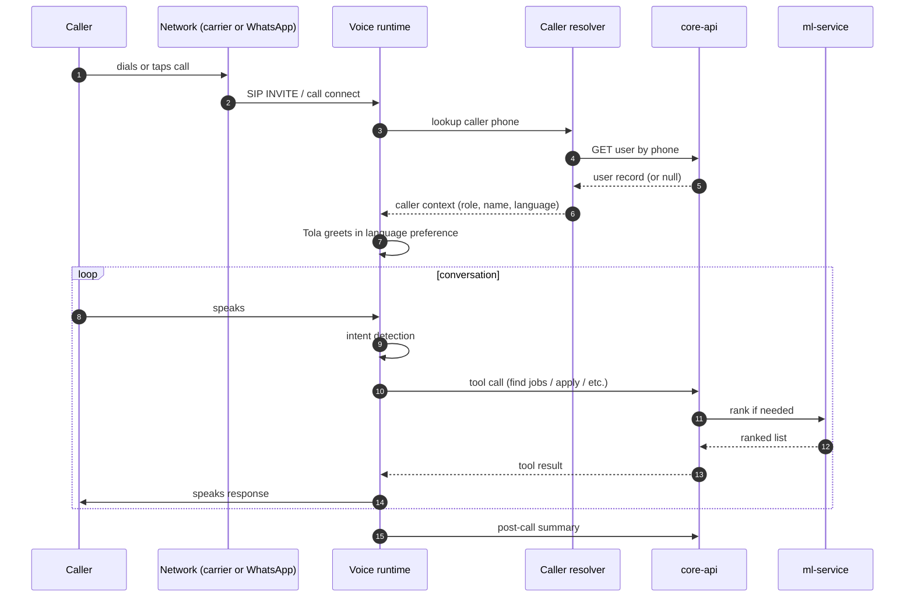

The end-to-end latency for a Tola response is typically 1-2 seconds. The lookups and tool calls happen during her natural speaking pauses; the user doesn't perceive a delay.

## When Tola doesn't pick up

A few cases:

- **Outside service hours.** Tola is available 24/7 at v1, but we may add quiet hours for outbound calls in the future.
- **Voice runtime is temporarily unavailable.** Rare. The call rolls to a fallback IVR that asks you to send a WhatsApp message instead.
- **Network issues.** Common in some areas. Hang up, try again. Or call from a different network.

## Privacy on the call

Calls are recorded for transcription. The recording lives in our object store with a 30-day retention; after 30 days, it's deleted automatically. Transcripts may be retained longer for service-improvement purposes.

The recording and transcript are linked to your Guild user record. They're not shared with employers, lenders, or third parties.

If you don't want to be recorded, say so at the start of the call. Tola will continue but the recording stops.

## What Tola will not do

A few intentional limits:

- **She won't sign you up for an employer or trader account.** Voice signup is JOB_SEEKER-only.
- **She won't approve job applications on an employer's behalf.** That action requires the dashboard.
- **She won't move money.** Wallet operations require text or web confirmation.
- **She won't share another user's data with you.** Only your own.

These are intentional product guardrails — voice is high-bandwidth and easy to use, which makes it the rail you'd want to abuse if you were going to. The guardrails keep it focused on what voice is best for: discovery and application.

## Where to read more

<CardGroup cols={2}>
  <Card title="WhatsApp Calling" icon="phone-volume" href="/channels/whatsapp-calling">
    The tap-to-call path that lands on Tola through our SIP bridge.
  </Card>

  <Card title="Voice in the architecture" icon="diagram-project" href="/architecture/services#voice-svc">
    The technical deep dive on how voice-svc works.
  </Card>
</CardGroup>

> ## Documentation Index
>
> Fetch the complete documentation index at: https://docs.guild.com.ng/llms.txt
> Use this file to discover all available pages before exploring further.

# WhatsApp text

> Twenty-three intents in five languages. Voice notes too. The dominant rail for Job Seekers, traders, and employers.

WhatsApp is the rail most of Nigeria already lives on. We meet you where you are.

Send a message to the Guild WhatsApp contact. Our intent engine reads it. The right action happens.

## The intents

Twenty-three intents in total. The ones you'll use most:

| What you can say                  | What we do                                                                        |
| --------------------------------- | --------------------------------------------------------------------------------- |
| `balance`                         | Reply with your wallet balance and the last few transactions.                     |
| `withdraw`                        | Walk you through withdrawing to your bank.                                        |
| `account`                         | Show your OPay virtual account number (traders) for receiving customer transfers. |
| `find work`                       | List jobs ranked for you by our matching model.                                   |
| `my jobs` (Job Seeker)            | List your active applications and their statuses.                                 |
| `my jobs` (employer)              | List your posted jobs and their applicant counts.                                 |
| `post a job`                      | Open the WhatsApp Flow to post a new job.                                         |
| `airtime`                         | Top up airtime — for yourself or for someone else.                                |
| `data`                            | Buy a data bundle.                                                                |
| `light` / `electricity`           | Top up an electricity meter.                                                      |
| `link bank`                       | Set up direct debit for your bank account.                                        |
| `link card`                       | Link a card for wallet top-ups.                                                   |
| `direct debit`                    | List your active mandates.                                                        |
| `score` (Job Seekers and traders) | Show your standing tier and the signals behind it.                                |
| `help`                            | Show the home menu.                                                               |

The intent engine works on the meaning, not the exact words. _"I want to withdraw,"_ _"send to bank,"_ and _"transfer to Access Bank"_ all land on the withdraw flow.

## Five languages

The engine understands intents in:

- English
- Nigerian Pidgin
- Yoruba
- Igbo
- Hausa

A Pidgin reply like _"I wan check my money"_ lands on the wallet balance intent. A Yoruba _"Bawo ni iyi mi"_ lands on the score intent.

We continue to expand language coverage based on real usage. If we see a region where users are typing in a language we don't handle yet, that's the prioritisation signal.

## Voice notes work too

You don't have to type. Send a voice note. Our transcription model reads it. The transcribed text flows through the same intent engine as a typed message.

This matters because many users are more comfortable speaking than typing — especially when typing in a non-English language they speak but don't write fluently.

Voice notes work for both ambient queries (_"how much I get for wallet?"_) and for conversational replies (_"yes I want to apply"_ in response to a job alert).

## WhatsApp Flows

Some conversations have multi-step structured forms that work better as a Flow than as a back-and-forth chat. WhatsApp Flows render inside the chat as a swipe-up form with fields, dropdowns, and buttons. We use them for:

- **Tier 2 KYC.** The 5-question conversational profile (trade, tenure, daily volume, work location, payment mix). Faster than the chat back-and-forth.
- **Tier 3 KYC.** BVN entry, OTP confirmation, address details.
- **Posting a job.** Title, location, dates, rate, language preference. Submit triggers the post.
- **Withdrawal.** Amount, destination bank, confirmation.
- **Linking a card.** Amount, card details (handled by OPay's hosted checkout via a Flow).
- **Direct-debit authorisation.** Account number, name confirmation, the ₦50 confirmation guidance.

A Flow opens inline; you complete it; we process it. No leaving WhatsApp. No new tab.

## How a typical session feels

You open the Guild chat. You type `balance`.

> _Guild: Your balance is ₦12,000. Last 3 transactions:_
> _— ₦12,000 added by Adekunle Ogundimu (yesterday)_
> _— ₦500 airtime to your number (Mon)_
> _— ₦4,000 from Adekunle Ogundimu (Sat)_
>
> _Reply `withdraw` to send to your bank, `score` to check your standing, or `help` for the menu._

You reply `withdraw`. A Flow opens. You enter ₦10,000, confirm the destination, submit. Twenty seconds later, an SMS lands: _"₦10,000 sent to Access Bank ••••3911."_

The whole interaction took under a minute. No dashboard, no logging in, no separate app.

## Conversation state

When you're in the middle of a multi-step interaction (e.g., halfway through a withdrawal), WhatsApp remembers where you are. If you walk away and come back ten minutes later and type something, we resume from the same state. If you type something unrelated (`help`), we ask if you want to discard the in-progress withdrawal.

State lives in our database, not on Meta's side. The state persists across devices — if you switch from your phone to your laptop's WhatsApp Web, the conversation continues.

## When the chat doesn't understand

Sometimes you type something the intent engine can't classify. Maybe a question we don't handle, maybe a misspelling that doesn't match our patterns.

In that case, we respond with the home menu: a short list of the most common things you can do. You can pick from the list or rephrase.

We don't dump you to a human at v1. Every common need has a path through one of the 23 intents. If you're stuck, the home menu is the way out.

## What we don't do on WhatsApp

A short list:

- **We don't share your data with WhatsApp / Meta.** Message contents are stored on our side (encrypted at rest); we receive them via Meta's WhatsApp Cloud API but they live in our database, not Meta's.
- **We don't use WhatsApp for outbound marketing.** Job alerts and transactional notifications are service messages, not marketing. We respect Meta's policies.
- **We don't accept attachments other than voice notes and document uploads (for KYC).** Images, videos, contact cards, location pins — out of scope at v1.

## How this works under the hood

For the curious. The architectural detail lives at [whatsapp-svc](/architecture/services#whatsapp-svc).

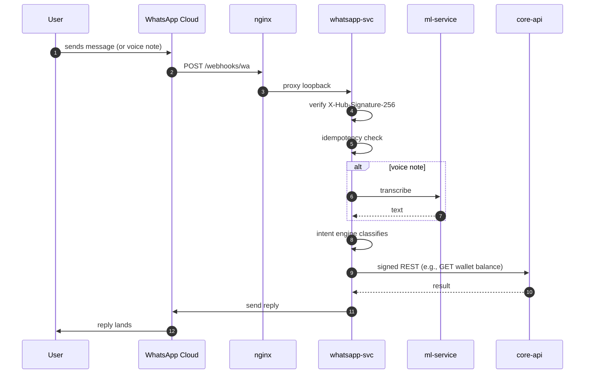

The whole flow from message to reply is typically under 800ms.

## Where to read more

<CardGroup cols={2}>
  <Card title="WhatsApp Calling" icon="phone-volume" href="/channels/whatsapp-calling">
    The tap-to-call sibling channel.
  </Card>

  <Card title="WhatsApp in the architecture" icon="diagram-project" href="/architecture/services#whatsapp-svc">
    The intent engine and Flows in technical depth.
  </Card>
</CardGroup>

> ## Documentation Index
>
> Fetch the complete documentation index at: https://docs.guild.com.ng/llms.txt
> Use this file to discover all available pages before exploring further.

# WhatsApp Calling

> Tap the call button inside your Guild chat. Tola picks up. The unusual rail most platforms don't have.

Open WhatsApp. Find the Guild contact. Tap the call button — the same one you'd use to call a friend.

Tola answers.

That's it. No separate phone number to remember. No app to install. No browser. Just the call button in the chat you already have open.

## Why this is useful

Three things make this rail valuable for users.

1. **It's free over Wi-Fi.** No call charges from your carrier when you're on Wi-Fi. Useful when you don't want to spend airtime to ask a question.
2. **It's already in your hand.** You're often already messaging Guild. Tapping the call button is one tap from where you already are.
3. **The audio quality is excellent on a decent connection.** WhatsApp's voice codec is good. Tola comes through clearly even on mid-bandwidth networks.

## How it actually works

The user-facing experience is "tap to call." The technical reality is a SIP bridge that lands the call on our voice agent.

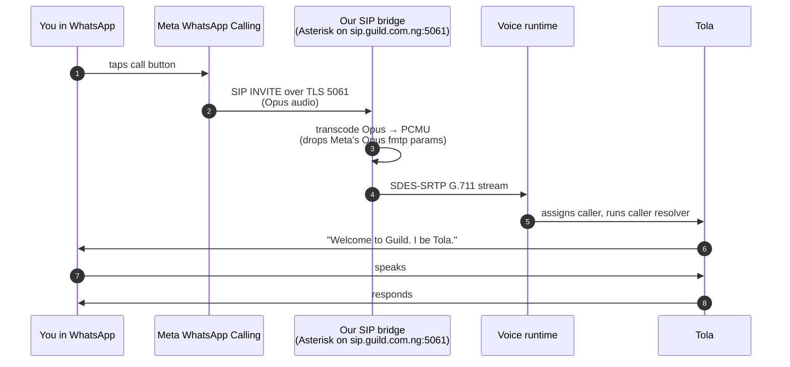

You don't notice any of this. From your end, you tapped a button and Tola was on the other side a moment later.

The detail behind the bridge is at [SIP infrastructure](/architecture/sip-infrastructure).

## What Tola can do on a WhatsApp call

Same six tools as a PSTN call:

- Sign up (if you're new)
- List open jobs (Job Seekers)
- Get job details
- Apply to a job
- Update your profile
- Set your skills

Same Nigerian English. Same code-switching.

The conversation is identical to a regular phone call. Tola doesn't know (or care) which rail you're on. The voice runtime treats both the same.

## When this rail is better than text

Three scenarios:

1. **You can't type well in the language you speak.** A user who speaks Yoruba fluently but writes English with difficulty finds voice faster than text.
2. **You want a complex answer that's awkward in text.** _"What jobs match a tiler with three years of experience who can travel up to 20km from Mokola?"_ takes a minute in voice. The text equivalent is filling out a Flow.
3. **You're walking or working and your hands aren't free for typing.** Voice with a Bluetooth earpiece works while you're walking to the site.

## When text is better

The reverse scenarios:

1. **You need a record of the answer.** Text persists in the chat; voice doesn't unless you remember to re-listen.
2. **You're in a noisy environment.** Construction site, crowded market, danfo. Text wins.
3. **The question is short and the answer is short.** _"balance"_ → _"₦12,000."_ Text is one second; voice is twenty seconds.

Most users mix both. Voice for discovery and complex decisions; text for short queries and confirmations.

## Network requirements

Wi-Fi is best. Mobile data of any quality (2G, 3G, 4G, 5G) works for WhatsApp Calling, with voice quality degrading on weaker connections.

The codec inside the bridge (PCMU at 64 kbps) is bandwidth-efficient. Tola's voice is clear even on 2G.

## What this costs you

Whatever WhatsApp's call data is on your plan. Most carriers in Nigeria don't bill WhatsApp Calling separately from data; it counts against your data bundle.

For a typical Tola call (under 2 minutes), the data usage is under 1 MB.

If you're on a "WhatsApp pack" from your carrier (free WhatsApp data), the call costs nothing.

## When it doesn't work

Three failure modes:

1. **Meta WhatsApp Calling is down regionally.** Rare. You'll see the call fail to connect in WhatsApp's standard error.
2. **Our SIP bridge is temporarily unavailable.** Even rarer. We monitor and have automatic failover.
3. **Your data connection drops mid-call.** Standard WhatsApp call behaviour — the call ends. Reconnect and try again.

In all three cases, you can fall back to text or to a regular phone call to the Guild number.

## Privacy

Same as any voice call. The audio is encrypted in transit (TLS for signalling, SRTP for media). Recordings are 30-day retention. Transcripts may persist longer.

You can ask Tola not to record at the start of the call; she'll honour it.

## Where to read more

<CardGroup cols={2}>
  <Card title="Voice" icon="phone" href="/channels/voice">
    Tola's full capabilities — same agent, two paths to reach her.
  </Card>

  <Card title="SIP infrastructure" icon="diagram-project" href="/architecture/sip-infrastructure">
    The Asterisk bridge in technical depth.
  </Card>
</CardGroup>

> ## Documentation Index
>
> Fetch the complete documentation index at: https://docs.guild.com.ng/llms.txt
> Use this file to discover all available pages before exploring further.

# SMS

> Two-way conversational SMS over our own gateway. Plus one-way transactional through OPay SMS. The rail that works on a feature phone.

Some Nigerians don't have smartphones. Most do, but on bad connection days, SMS is still the most reliable rail. Guild does both — two-way conversational SMS for people without WhatsApp, and one-way transactional SMS for everyone.

## Who uses SMS

| Use                                   | Audience                                  |
| ------------------------------------- | ----------------------------------------- |
| **OTPs at signup**                    | Everyone                                  |
| **Balance alerts on every inflow**    | Everyone                                  |
| **Payment confirmations**             | Everyone                                  |
| **Job alerts**                        | Job Seekers without WhatsApp              |
| **Daily summaries**                   | Traders who prefer SMS to WhatsApp        |
| **Two-way conversational onboarding** | Job Seekers and Traders on feature phones |

Employers don't typically use SMS for anything other than OTPs. Their flows live on WhatsApp and the web.

## One-way transactional SMS

OTPs, balance alerts, payment confirmations. Outbound only. The user doesn't reply.

These fire through OPay's SMS API.

Example:

> _Your Guild code: 459217. Valid for 10 minutes. Don't share with anyone._

Sub-second delivery. Single segment. The sender ID is "Guild" (a registered alphanumeric sender).

## Two-way conversational SMS

Job alerts and other reply-expected messages. The user replies; we read the reply; we act.

These fire through our own SMS gateway — paired Android phones with Nigerian SIMs, hosted on the same VPS. Detailed at [SMS infrastructure](/architecture/sms-infrastructure).

Example:

> _Guild: 5 bricklayer jobs in Bodija, ₦4k/day, 3 days. Reply 1 to apply, 0 to skip._

You reply `1`. Application submitted.

> _Guild: Applied to Adekunle's bricklayer job. He'll get back to you today._

Total interaction: 2 SMS each way, under a minute end to end.

## Why two-way matters

Most SMS APIs are excellent at outbound and mediocre at inbound. Replies don't always reach the sender; deliverability varies by route. We can't have job applications quietly disappearing.

Our gateway uses SIMs we own, on each major Nigerian network. Inbound replies have 99%+ deliverability because they land at our SIM. Detail at [SMS infrastructure](/architecture/sms-infrastructure).

## What you can do via SMS

For Job Seekers:

| Send                          | Receive                                   |
| ----------------------------- | ----------------------------------------- |
| `1` (in reply to a job alert) | Application confirmation                  |
| `0` (in reply to a job alert) | "Got it. We'll keep looking."             |
| `jobs`                        | Up to 5 ranked jobs as a single SMS       |
| `balance`                     | Your wallet balance                       |
| `score`                       | Your standing tier                        |
| `help`                        | Menu of commands                          |
| `stop`                        | Pause job alerts (re-enable with `start`) |

For Traders:

| Send      | Receive                                 |
| --------- | --------------------------------------- |
| `balance` | Wallet balance + virtual account number |
| `sales`   | Today's inflow total                    |
| `help`    | Menu                                    |
| `stop`    | Pause daily summaries                   |

For both, replies to OTPs and balance alerts are recognised as ambient messages and routed to the intent engine.

## What an SMS looks like

We design every SMS to fit in a single 160-character segment when possible. Multi-segment SMS costs more and is more error-prone in delivery.

Examples:

| Purpose       | Length                                                                                         |
| ------------- | ---------------------------------------------------------------------------------------------- |
| OTP           | "Your Guild code: 459217. Valid for 10 minutes." (50 chars)                                    |
| Balance alert | "₦12,000 added by Adekunle Ogundimu. Balance: ₦12,000." (54 chars)                             |
| Job alert     | "Guild: 5 bricklayer jobs in Bodija, ₦4k/day, 3 days. Reply 1 to apply, 0 to skip." (84 chars) |
| Daily summary | "Today: ₦47,500 across 11 sales. Top sender ₦15k. Reply `details` for breakdown." (78 chars)   |

Short on purpose. Single-segment SMS is the deliverability sweet spot.

## When SMS won't work

A few cases:

- **Your phone's SMS inbox is full.** Some older phones reject incoming SMS when the inbox is full. Clear old messages.
- **Your carrier's SMSC is having an outage.** Rare but real. We retry.
- **You've sent `stop` and we've paused alerts.** Send `start` to resume.

## Sender IDs

Our SMS comes from one of two sources:

- **"Guild"** — alphanumeric sender ID for one-way transactional. Registered with Nigerian carriers. Recognisable.
- **A Nigerian phone number** — from our gateway SIMs, for two-way conversational. You can reply to these.

You can verify the source by replying. A non-replyable Guild SMS will give a delivery failure if you try to reply (it's coming from an alphanumeric sender). A two-way SMS accepts your reply.

This distinction matters because a scammer could send an SMS claiming to be "Guild." If you want to verify a suspicious message, reply to it. If the reply bounces with an error, it wasn't from us either (or it was a one-way alert that we explicitly don't accept replies on).

## What we don't do via SMS

A few intentional limits:

- **We don't send marketing SMS.** Only transactional and conversational.
- **We don't send long-form content.** SMS is for short, actionable signals.
- **We don't ask for sensitive data over SMS.** No "reply with your BVN" or "reply with your PIN." Ever. If you get such a message claiming to be from Guild, it's not from us.
- **We don't bridge SMS to lender events.** Snapshots and consent flows happen on web or WhatsApp.

## Cost to you

Inbound SMS to your phone is free (your carrier doesn't charge you to receive).

Outbound SMS (your reply) is whatever your carrier charges for an SMS to a Nigerian number. Typically ₦4-8.

If you're on a low-balance day, you can still receive job alerts. Replying costs a small amount; we don't reimburse.

## Where to read more

<CardGroup cols={2}>
  <Card title="SMS infrastructure" icon="diagram-project" href="/architecture/sms-infrastructure">
    The Go gateway, the paired Android devices, the carrier rotation.
  </Card>

  <Card title="Voice" icon="phone" href="/channels/voice">
    For feature-phone users who prefer talking.
  </Card>
</CardGroup>

> ## Documentation Index
>
> Fetch the complete documentation index at: https://docs.guild.com.ng/llms.txt
> Use this file to discover all available pages before exploring further.

# Web

> guild.com.ng — Job Seeker, trader, employer, and partner dashboards. Phone + OTP. No password.

The web dashboards span two domains. `guild.com.ng` serves Job Seekers, traders, and employers. `partners.guild.com.ng` serves the financial-services partners — banks, microfinance institutions, insurers, credit fintechs — who read consent-gated snapshots and disburse over our rails.

It's also a fallback for any user who wants more detail than fits comfortably in a WhatsApp message.

## Who uses web

| User            | Web usage                                                                        |
| --------------- | -------------------------------------------------------------------------------- |
| **Job Seekers** | Occasional. Most action happens on voice / WhatsApp / SMS.                       |
| **Traders**     | Weekly. Sales reports, velocity charts, customer history.                        |
| **Employers**   | Daily. Posting jobs, managing applications, approving payments, viewing reports. |
| **Partners**    | Daily. API key management, consent review, webhook configuration.                |

The frontend is a Next.js application. The browser doesn't talk to backend services directly — every API call goes through Next.js's own server-side handlers, which sign outbound requests to core-api using `@guild/svc-client`. The session is an opaque ULID cookie.

## Authentication

No password. Phone number + SMS OTP. Always.

The flow:

<Steps>
  <Step title="Enter your phone number">
    On `guild.com.ng/sign-in`. We send a 6-digit code via OPay SMS.
  </Step>

  <Step title="Enter the code">
    Within 10 minutes. After that, request a new one.
  </Step>

  <Step title="Session established">
    `httpOnly` cookie with an opaque ULID. Scoped to the `/api` path. SameSite strict. Secure in production.
  </Step>

  <Step title="Use the dashboard">
    Every page reads from the session cookie. No re-auth needed for the session's lifetime.
  </Step>
</Steps>

Why no password: passwords get phished, reused, leaked, forgotten. A phone-anchored OTP flow with rate limiting and short-lived codes is more secure for our threat model and friction-free for users who've already remembered their phone number.

If you sign in from a new device, you get a new session. You can have multiple active sessions; manage them from `guild.com.ng/settings`.

## The dashboard surfaces

### Job Seeker dashboard

`guild.com.ng/overview`. Overview at the top — wallet balance, standing tier, recent applications. Below: tabs for jobs, earnings, standing, savings, and settings.

The single most-viewed page for a Job Seeker is the standing-score page (`/standing`) — a chart of the tier history with the signals breakdown.

### Trader dashboard

`guild.com.ng/overview`. Trader version of the overview — sales today, velocity trend, virtual account, recent inflows. Below: tabs for sales, inventory (if used), customers, advance offers (if eligible), and settings.

The single most-viewed page for a trader is the sales-velocity page (`/sales`) — daily inflow chart, distinct-customer count, repeat-rate, and projection toward the next tier.

### Employer dashboard

`guild.com.ng/overview`. Employer version — active jobs, applications awaiting approval, escrow balance, hiring spend. Below: tabs for jobs, applications, workforce reports, escrow management, and settings.

The single most-viewed page is the job-detail page (`/jobs/[jobId]`) — applicants ranked by the matching model, with approve/reject buttons.

### Partner Portal

`partners.guild.com.ng`. Separate sign-in for partner organisations (banks, microfinance institutions, insurers, credit fintechs). Pages for API key management, consent monitoring, webhook subscriptions, usage statistics.

Details at [Partner Portal](/partners/overview).

## The BFF (Backend-for-Frontend) pattern

The frontend doesn't talk to core-api directly. It talks to its own Next.js API routes under `/api/*`, which sign outbound calls to core-api.

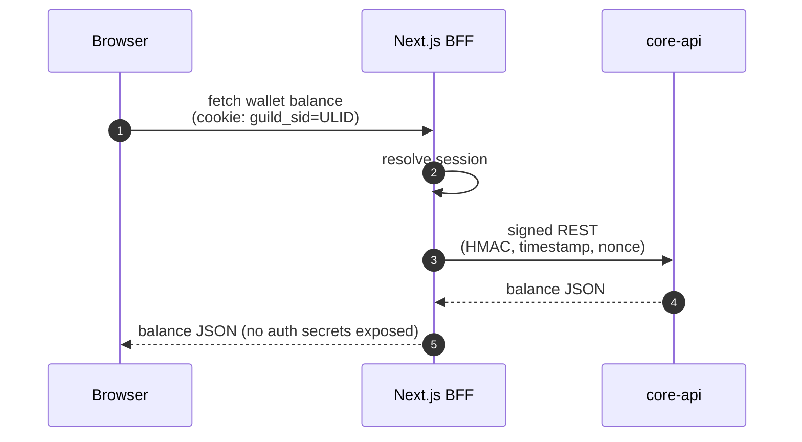

Why the BFF:

- **The shared secret never reaches the browser.** Only the BFF holds `SERVICE_AUTH_SECRET`.
- **The browser sees only opaque cookies.** A compromised browser session can do only what its session permits.
- **API surface area is intentional.** Only the routes the BFF explicitly exposes are callable from the browser. Internal endpoints stay internal.

## Mobile-friendly

The web dashboard works on phone browsers as well as laptops. Most Job Seeker activity that does happen on web is on a smartphone browser, not a desktop.

The design prioritises legibility on small screens. No tiny tap targets. No dense tables.

## Real-time updates

Some surfaces (incoming applications for an employer, balance changes for a trader, standing tier moves) update in real time without a manual refresh. We use Server-Sent Events for the push side.

A trader watching their dashboard sees a new inflow appear in the transaction list within a few seconds of the customer transfer landing.

## What you can't do on web

A few things you can do on voice or WhatsApp but not on web:

- **Voice signup.** The Tola conversational onboarding is a voice rail, not a web flow. The web equivalent is the standard phone-OTP signup.
- **Receive job alerts inline.** WhatsApp and SMS push job alerts. The web dashboard shows them as a notification badge; you click in to see.

Most other operations are available across all rails.

## Browser support

Modern browsers — Chrome, Firefox, Safari, Edge, Brave, Opera. Mobile equivalents work too.

We don't actively support IE11 or browsers older than 2 major versions. The frontend uses modern JS and CSS features.

## Privacy on web

Standard browser-side privacy practices:

- **No third-party tracking scripts.** No Pixel, no GA, no Hotjar, no clarity.ms.
- **Cookies are first-party only.** The session cookie is `httpOnly` and `SameSite=strict`.
- **Localstorage is minimal.** A few UI preferences (last viewed tab, theme). No user identifiers.
- **Service worker is scoped narrowly.** Used for offline caching of static assets, nothing more.

## Where to read more

<CardGroup cols={2}>
  <Card title="Inter-service communication" icon="exchange" href="/architecture/inter-service-comm">
    How the BFF signs every call.
  </Card>

  <Card title="KYC tiers" icon="id-card" href="/security/kyc-tiers">
    The phone-OTP signup baseline.
  </Card>
</CardGroup>

> ## Documentation Index
>
> Fetch the complete documentation index at: https://docs.guild.com.ng/llms.txt
> Use this file to discover all available pages before exploring further.

# How the standing score works

> Four tiers. The signals the model reads. How the score changes when you work, when you ghost, when a lender reads you.

Your standing score is the number a lender will look at when they decide whether to extend you credit. The tier is the band it falls into. Everything else on the platform — matching, alerts, advance offers — uses the same signal in the background.

This page is the model from a user's perspective. Architectural detail lives at [ML layer → Standing model](/architecture/ml-layer#2-the-standing-model).

## The four tiers

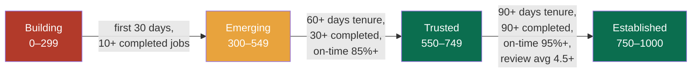

The thresholds aren't strict — the model is a classifier, not a rule engine. But the rough boundaries above are the practical guide for what gets you to the next tier.

### Building (0–299)

You just joined. The model doesn't have enough signal to commit. This is the "show us what you can do" tier. Most Job Seekers spend two to four weeks here.

You can browse and apply to jobs from this tier. You can withdraw earnings to your bank (once you've completed Tier 2 KYC). You can use the wallet normally. You just can't yet take credit through the partner lenders.

### Emerging (300–549)

You've shown up. You've completed jobs. Reviews are decent. This is where most users are after their first month or two.

Lenders rarely underwrite at this tier. Employers see you as a serious candidate.

### Trusted (550–749)

You've earned trust through consistent work. Your reviews are solid (4.0+). Your on-time rate is high. Employers prioritise you in matching.

This is where credit becomes accessible. Partner lenders extend tool-equipment loans for Job Seekers and inventory advances for traders.

### Established (750–1000)

The top of the curve. Long tenure, very high completion rate, excellent reviews. The matching model surfaces you to employers first. Partner lenders extend their best terms.

A small gold ring appears around your standing badge in the dashboard. (Yes, that's a deliberate visual cue.)

## The signals

The model reads the ledger and weighs a small number of signals.

| Signal                       | Weight               | What it measures                                                  |
| ---------------------------- | -------------------- | ----------------------------------------------------------------- |
| **Completed jobs (90 days)** | High                 | Have you finished what you started?                               |
| **Average review (90 days)** | High                 | Are employers leaving good ratings?                               |
| **On-time rate**             | High                 | Are you showing up when expected?                                 |
| **Tenure**                   | Medium               | How long have you been around?                                    |
| **Channel diversity**        | Low                  | Have you used multiple rails (voice, WhatsApp, web)? Small bonus. |
| **Repayment streak**         | High (if applicable) | If you've taken loans, are you paying them back on time?          |
| **Weekly volume stability**  | Medium               | Is your earning pattern consistent?                               |
| **Employer diversity**       | Medium               | Have many distinct employers hired you, or just one?              |
| **Recent activity**          | Medium               | Have you been active in the last 30 days?                         |

For traders, the trader-specific signals are:

| Signal                             | Weight   | What it measures                        |
| ---------------------------------- | -------- | --------------------------------------- |
| **Daily-average inflow (30 days)** | High     | Sustained sales velocity.               |
| **Distinct senders (30 days)**     | High     | Customer diversity.                     |
| **Repeat customer rate**           | Medium   | Are customers coming back?              |
| **Working-day discipline**         | Medium   | Activity on the days you said you work. |
| **Refund rate**                    | Negative | High refund rates pull the score down.  |

The model's calibration is regularly updated as more real-world data flows. The signals listed are the headline drivers; the model uses subtle interactions among them that don't lend themselves to a flat table.

## How the score updates

The model recomputes lazily — on the next dashboard read after a material event, or on the nightly batch retrain pass.

Material events that invalidate your tier cache:

- A new job is marked completed.
- A new review is left for you.
- A loan repayment lands or fails.
- A direct debit (savings or repayment) fails.
- Significant time passes without activity (a quiet stretch dampens recent-activity signal).

You see the tier in real time on the dashboard. The chart shows the trajectory over the last 90 days.

## When the model is wrong

The model can be wrong. Three common cases:

1. **A genuinely good Job Seeker has a tough month.** Bad weather closes work sites; family emergency pulls them off. The score drops. The next month of consistent work recovers it.
2. **A new Job Seeker who's genuinely excellent.** The model is conservative on thin history. The fastest path up is completing a number of jobs in quick succession, all with good reviews.
3. **An employer leaves a bad-faith review.** Rare but happens. You can flag a review for moderation; if it's removed (e.g., the employer is found to have been retaliating against a legitimate dispute), it stops affecting your score.

The model doesn't claim to be infallible. It claims to be calibrated to Nigerian informal-economy patterns and to improve with more data.

## How a lender sees the score

When a lender pulls your signed snapshot (after you grant them consent), they see:

- Your tier (`Building`, `Emerging`, `Trusted`, `Established`).
- Your raw score (0-1000).
- The signals behind it (counts, averages, ratios).
- An aggregated view of your audit ledger window (totals, counts).

They make their own underwriting decision. Some lenders weight the tier heavily; some weight specific signals (repayment streak especially, for repeat borrowers). The snapshot gives them the signal; their model decides.

You don't see the raw score on your dashboard — only the tier and the underlying signals. This is intentional: chasing a single number invites optimisation behaviour that doesn't match real-world performance. Focusing on the signals (complete the work, show up on time, get good reviews, save consistently) is the right behaviour.

## What's not in the score

A few intentional exclusions:

- **Credit-bureau lookup.** We don't pull your CRC or FirstCentral report. The score is built entirely from your Guild activity.
- **Demographic data.** Age, gender, ethnicity, religion — none of these affect the score. The model doesn't even see them as features.
- **Friend-of-friend or social graph signals.** Your standing isn't affected by who your friends or family are.

The score reads work; that's the design constraint.

## What to read next

<CardGroup cols={2}>
  <Card title="The four tiers" icon="trophy" href="/standing/tiers">
    Deeper detail on each tier and what it unlocks.
  </Card>

  <Card title="The audit ledger" icon="scroll" href="/standing/audit-ledger">
    Where the signals come from.
  </Card>

  <Card title="The feedback loop" icon="arrows-rotate" href="/standing/feedback-loop">
    How standing affects what you see, and what you do affects your standing.
  </Card>
</CardGroup>

Documentation Index
Fetch the complete documentation index at: /llms.txt

Use this file to discover all available pages before exploring further.

Skip to main content

Search...
⌘K
Dashboard

Documentation
API Reference
Get Started
Introduction
The mission
How it works
The team
Quick start
For Job Seekers
Overview
Sign up
Find work
Get paid
Standing score
Savings
For Traders
Overview
Virtual account
Take payments
Sales velocity
Bills
For Employers
Overview
Post a job
Link a bank
Pay Job Seekers
Escrow
Reports
For Partners
Overview
API keys
Consent
Snapshots
Webhooks
Rate limits
Channels
Voice
WhatsApp text
WhatsApp Calling
SMS
Web
Standing & the Ledger
How it works
The four tiers
Audit ledger
Feedback loop
Architecture
Overview
Services
OPay integration
OPay reference
ML layer
Data flow
Infrastructure
SMS infrastructure
SIP infrastructure
Inter-service comms
Resilience & scale
Observability
Security & Trust
Overview
Webhook verification
Audit ledger
KYC tiers
NDPR

On this page
Building (0–299)
What it means
What you can do
What you can’t do yet
Fastest path to Emerging
Emerging (300–549)
What it means
What it unlocks
What you still can’t do
Fastest path to Trusted
Trusted (550–749)
What it means
What it unlocks
Fastest path to Established
Established (750–1000)
What it means
What it unlocks
What’s next after Established
How quickly do tiers actually shift
How tier changes are surfaced
What to read next
Standing & the Ledger
The four tiers
Building. Emerging. Trusted. Established. What each tier unlocks and what gets you to the next one.

Each tier has a name, a score range, and a set of things it unlocks. This page is the practical guide — read it before you set targets.
​
Building (0–299)
Where you are when you join.
​
What it means
The model hasn’t seen enough work from you yet. You might be excellent; you might be unreliable; the data isn’t there to commit. Most Job Seekers spend two to four weeks here.
​
What you can do
Browse and apply to any open job.
Receive payments to your wallet.
Withdraw to your bank (after Tier 2 KYC).
Use the wallet normally — bills, savings, all standard operations.
​
What you can’t do yet
Take credit from partner lenders. The risk model doesn’t extend to Building tier.
Rank highly in employer matching — you’ll appear in candidate lists but lower than tenured Job Seekers.
​
Fastest path to Emerging
Complete 10 jobs. Get at least average reviews. Be online for 30 days.
That’s it. The model rewards completion, not application count.
​
Emerging (300–549)
You’ve shown up. Now the model knows you exist.
​
What it means
You’ve completed a meaningful number of jobs (10+). Your reviews are reasonable (3.5+). You’ve been active for 30+ days. The model classifies you as “we have signal, and it’s not bad.”
​
What it unlocks
Higher ranking in matching. You’ll appear above Building-tier Job Seekers in employer searches.
Visibility to higher-paying jobs that the matching model gates by tier.
Eligibility for some Tier 2 lender products (specific lenders have specific thresholds; some accept Emerging).
​
What you still can’t do
Access most credit products. Trusted is the practical threshold.
​
Fastest path to Trusted
Tenure: get to 60+ days on the platform.
Volume: get to 30+ completed jobs.
Quality: keep your on-time rate at 85%+ and your average review at 4.0+.
This usually takes 2-3 months of consistent activity. Some users move faster if they’re working high-frequency (daily) and finishing reliably.
​
Trusted (550–749)
You’ve earned trust.
​
What it means
You’ve put in 30+ completed jobs over 60+ days. Your on-time rate is high (85%+). Your average review is good (4.0+). The model classifies you as a reliable counterparty.
​
What it unlocks
Credit products. Tool-equipment loans for Job Seekers, inventory advances for traders. Partner lenders underwrite at this tier.
High priority in employer matching. You’re at the top of candidate lists for jobs that match your profile.
Higher transaction limits. Larger withdrawals, larger inflows, larger one-day volumes.
Premium customer support. Faster response on disputes; dedicated channel for complex issues.
​
Fastest path to Established
Tenure: 90+ days.
Volume: 90+ completed jobs.
Quality: on-time 95%+ and review average 4.5+.
Repayment, if applicable: maintain a clean repayment streak on any credit you’ve taken.
This is a real threshold. Most users who reach Trusted stay there or move toward Established gradually over a year. Established is the top 10-15% of active users.
​
Established (750–1000)
The top of the curve.
​
What it means
90+ jobs over 90+ days. On-time 95%+. Reviews 4.5+. Repayment streak intact. The model considers you exceptional.
​
What it unlocks
Best terms from partner lenders. Lower rates, higher amounts, longer terms.
Top priority in matching. Above Trusted-tier candidates in employer searches.
Highest transaction limits. Essentially uncapped within reason.
The gold ring. A small visual badge on your standing surface and on your profile when employers see you.
Endorsement weight. When you endorse another Job Seeker or trader (employers can also endorse), the endorsement carries more weight in their matching score.
​
What’s next after Established
There’s no fifth tier. Established is the top. The score continues to refine within the band (you can be Established-820 vs Established-960), but the tier name doesn’t change.
Some users reach Established and stay there for years. Others drift back to Trusted during quiet periods and recover when they pick up activity. The system rewards consistency over months and years, not over individual weeks.
​
How quickly do tiers actually shift
A few real-world patterns we’ve observed (or modelled, where the platform is too young for data):
Pattern Expected trajectory
Daily worker (5+ jobs / week, reliable) Building → Emerging in 2 weeks. Emerging → Trusted in 6-8 weeks. Trusted → Established in 4-6 months.
Weekly worker (1-2 jobs / week, reliable) Building → Emerging in 6-10 weeks. Emerging → Trusted in 4-6 months. Established achievable but slower.
Sporadic worker (irregular schedule) Building → Emerging in 2-3 months. Tenure dampens with quiet stretches.
High-velocity trader (₦80k+ daily) Building → Emerging in 30 days (just from accumulating tenure and customer count). Emerging → Trusted in 60-90 days.
The model doesn’t penalise you for working less if you work consistently. A weekend-only painter who shows up every weekend, finishes every job, gets great reviews can be Trusted within a few months. The model is reading reliability, not just volume.
​
How tier changes are surfaced
You see it three ways:
A dashboard banner the day you move up. “Congratulations — you moved from Emerging to Trusted today. You’re now eligible for tool-equipment loans through our partner lenders.”
A WhatsApp message. Same content, in case you’re not on the dashboard.
The score chart on your standing page. A vertical line at the tier-change date.
A tier drop is also surfaced, more discreetly. “Your tier dropped from Trusted to Emerging. The drop was driven by [signal]. Here’s what would recover it.”
​
What to read next
How it works
The signals the model reads.
The audit ledger
Where the signals come from.
The feedback loop
How standing changes what the rest of the platform shows you.
How it works
Audit ledger
Powered by
This documentation is built and hosted on Mintlify, a developer documentation platform
The four tiers - Guild

> ## Documentation Index
>
> Fetch the complete documentation index at: https://docs.guild.com.ng/llms.txt
> Use this file to discover all available pages before exploring further.

# The audit ledger

> Where the signals behind your standing come from. The permanent record of every job, every payment, every interaction.

Your standing tier isn't a guess. It's a read on a specific set of events stored in a database your model reads cleanly.

This page is the user-facing view of the audit ledger. The architectural detail is at [Security → Audit ledger](/security/audit-ledger).

## What's in the ledger

Every meaningful thing you do on Guild lands in one of two tables. Together they're "the ledger."

| Table               | What gets written                                                                                                                                         |
| ------------------- | --------------------------------------------------------------------------------------------------------------------------------------------------------- |
| **Channel events**  | Every interaction across every channel: signups, messages, calls, applications, approvals, attendance marks, consent grants, voice notes, intent matches. |
| **Payment motions** | Every kobo motion: wallet credits, wallet debits, escrow holds, escrow releases, payouts, fees, bills, savings sweeps, lender disbursements, repayments.  |

Both tables are append-only. Once a row is written, it cannot be edited or deleted. By application code. By an engineer. By anyone short of dropping the database-level trigger that enforces this — and that action would itself be auditable.

This is the structural property that lets a lender trust the ledger as a credit signal.

## Why this matters to you

Three reasons.

### 1. Your work history is yours, forever

Every job you've completed, every review you've received, every payment you've earned — all of it is preserved. A future employer asking about your reliability can see (with your consent) a verified record. A future lender can see (with your consent) a verified earnings history.

The platform can't erase a job you did. We can't pretend you ghosted when you didn't. The record protects you as much as it informs others.

### 2. Disputes settle on data

If an employer disputes that you worked a day, the attendance row in the ledger settles it. If you dispute that the payment was for the right amount, the payment audit row settles it.

We don't relitigate disputes on testimony. We read the ledger.

### 3. Your standing builds on real ground

When the model reads your standing, it's reading rows from this table. Not screenshots, not hand-coded estimates. Actual rows the system can prove are correct.

Three months of consistent work compound into a score a bank can underwrite on. That's the loop.

## What you can see

Your transaction history page (`guild.com.ng/wallet`) reads from the payment-motions table. You see every credit and debit with the counterparty, the amount, the timestamp, and the source.

Your standing-score page (`/standing`) reads from both tables to compute the signals behind your tier.

We don't expose every audit row directly to you — there are operational events (signature verifications, idempotency checks) that aren't user-meaningful. But every event that affects your wallet, your standing, or your records is surfaceable.

## What you cannot see

You see your own activity. You don't see other users' activity. (Obvious privacy boundary.)

The aggregates a lender sees are computed from your audit data; you can see the same aggregates if you ask. But neither you nor a lender sees transaction-level details about your counterparties. _"You received ₦12,000 from employer X"_ — yes. _"Here's the breakdown of every transaction from every employer in the last 90 days, with names"_ — yes, to you, the user. The lender sees the aggregate, not the names.

## What persists forever

| Type                                         | Retention                                    |
| -------------------------------------------- | -------------------------------------------- |
| Channel events (signups, applications, etc.) | Forever                                      |
| Payment motions                              | Forever                                      |
| Voice call recordings                        | 30 days, then deleted                        |
| Voice transcripts                            | Indefinite, retained for service-improvement |
| WhatsApp message contents                    | 365 days                                     |
| Application logs                             | 90 days                                      |

The audit ledger is the long-memory layer. Everything else is operational.

## What happens if you delete your account

A user who deletes their account triggers an erasure workflow:

1. Personal identifiers (phone, name, address) are anonymised in the `identity` schema.
2. The encrypted KYC payload is deleted.
3. The audit rows persist with the anonymised user ID.

The trail is still there for transaction integrity (Guild needs to be able to reconcile historical payments). The link from "this row → this real person" is removed.

If a future lender tries to read a snapshot for the deleted user, the snapshot fetch fails because there's no longer a user record to read.

If you want to download a copy of your data before deletion, the dashboard's data-export feature gives you a signed JSON archive of everything we hold on you.

## How the aggregates flow to a lender

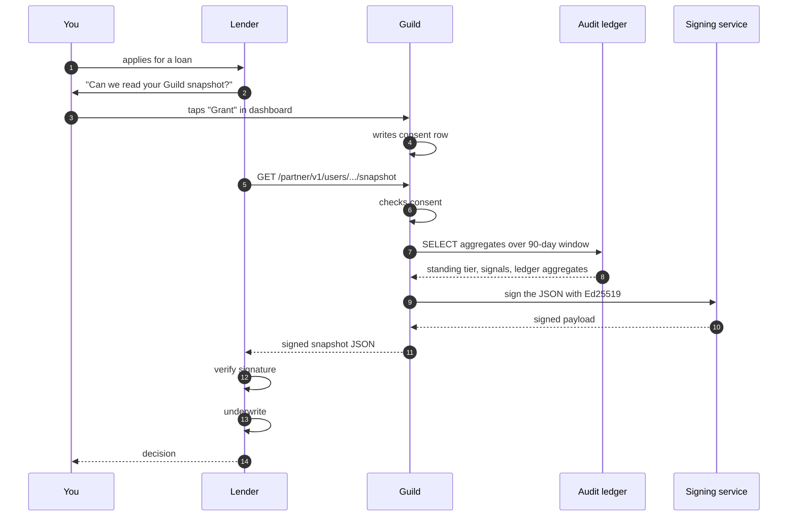

The lender never sees the raw rows. They see aggregates. They verify the signature. They make a decision.

You can revoke consent at any time. The next snapshot fetch fails.

## What to read next

<CardGroup cols={2}>
  <Card title="How it works" icon="route" href="/standing/how-it-works">
    The model that reads this substrate.
  </Card>

  <Card title="The four tiers" icon="trophy" href="/standing/tiers">
    What each tier unlocks.
  </Card>

  <Card title="Security: append-only ledger" icon="scroll" href="/security/audit-ledger">
    The structural-immutability promise.
  </Card>
</CardGroup>

Documentation Index
Fetch the complete documentation index at: /llms.txt

Use this file to discover all available pages before exploring further.

Skip to main content

Search...
⌘K
Dashboard

Documentation
API Reference
Get Started
Introduction
The mission
How it works
The team
Quick start
For Job Seekers
Overview
Sign up
Find work
Get paid
Standing score
Savings
For Traders
Overview
Virtual account
Take payments
Sales velocity
Bills
For Employers
Overview
Post a job
Link a bank
Pay Job Seekers
Escrow
Reports
For Partners
Overview
API keys
Consent
Snapshots
Webhooks
Rate limits
Channels
Voice
WhatsApp text
WhatsApp Calling
SMS
Web
Standing & the Ledger
How it works
The four tiers
Audit ledger
Feedback loop
Architecture
Overview
Services
OPay integration
OPay reference
ML layer
Data flow
Infrastructure
SMS infrastructure
SIP infrastructure
Inter-service comms
Resilience & scale
Observability
Security & Trust
Overview
Webhook verification
Audit ledger
KYC tiers
NDPR

On this page
The loop, in a picture
What standing changes about your experience
Higher tier = higher rank in employer searches
Higher tier = different jobs in the marketplace
Higher tier = credit access
Higher tier = different language in your interactions
What changes your standing
Completing a job
Getting a review
Showing up on time
Working consistently
Repaying credit (if applicable)
Diversifying your employer base
What pulls your standing down
The other half: how your behaviour ripples
How the model improves
What to read next
Standing & the Ledger
The feedback loop
Your standing shapes what the platform shows you. What you do shapes your standing. The loop closes.

Most loyalty programmes are one-directional — you earn points, the points unlock benefits, the benefits are static. The Guild standing system is bidirectional. Your standing tier changes what the matching model surfaces, which changes the opportunities you see, which changes what you can do, which changes your standing again.
Stay with me. The loop is the point.
​
The loop, in a picture
You work

Ledger row
written

Standing
recomputes

Matching model
re-ranks you

Different jobs
surface

Different employers
see you

More work
(or better work)

Six steps. Each one nudges the next. The loop reinforces itself.
​
What standing changes about your experience
A few concrete examples.
​
Higher tier = higher rank in employer searches
A site contractor in Bodija posts a job for bricklayers. Our matching model ranks every plausible candidate. All else equal, a Trusted-tier bricklayer ranks above an Emerging-tier one. The employer sees you sooner; you get the application earlier; you get hired more often.
​
Higher tier = different jobs in the marketplace
The marketplace at guild.com.ng/jobs shows different jobs to different users. Premium jobs (higher pay, larger employers, longer projects) are gated by tier. Building-tier Job Seekers see entry-level work; Trusted-tier sees the full marketplace; Established sees the highest-paying roles first.
This isn’t gatekeeping for its own sake. Employers who post premium work specifically want reliable, high-standing candidates. We surface their jobs to candidates who match.
​
Higher tier = credit access
Building and Emerging tiers don’t typically qualify for credit. Trusted opens the door. Established gets the best terms.
This isn’t a Guild policy; it’s the partner lenders’ underwriting policy. They’ve calibrated their risk models against our tier classifications. A Trusted-tier borrower has a default rate they’re willing to underwrite at; a Building-tier borrower doesn’t yet have the signal for that risk model.
​
Higher tier = different language in your interactions
Subtle but real. A Trusted-tier Job Seeker is greeted with “Welcome back” in a familiar voice. A first-time caller gets the onboarding flow. The system knows where you are in your journey.
​
What changes your standing
Six categories of action.
​
Completing a job
The biggest single signal. Every COMPLETED application adds to your score. The boost is larger for higher-paying jobs (proxy for skill) and for jobs that lasted multiple shifts (proxy for sustained reliability).
​
Getting a review
After a job ends, the employer rates you. A 5-star review nudges your score up. A 4-star is neutral-positive. A 3-star is neutral. A 2-star or below is negative.
A genuinely bad review can be flagged for moderation if you believe it’s retaliatory or false. Resolved disputes neutralise the review.
​
Showing up on time
Attendance is marked when you arrive. On-time rate is a calculated signal: shifts where you arrived on time / total shifts. The model treats this as a strong signal of reliability.
​
Working consistently
A user who does one job a week for six months ranks higher than one who did six jobs in one week and then went quiet. The model rewards consistency.
​
Repaying credit (if applicable)
If you’ve taken a loan through a partner lender, every on-time repayment adds to a repayment_streak counter. A clean streak is one of the strongest positive signals in the model. A missed payment resets the streak and adds a negative signal.
​
Diversifying your employer base
Working for many distinct employers (over time) is a small positive signal. It suggests you’re not over-reliant on one relationship — which matters for resilience if that one employer disappears.
​
What pulls your standing down
The list is short.
Action Effect
Ghosting a job (approved but didn’t show) Negative
Mid-shift no-show Larger negative
Receiving a 1- or 2-star review Negative
Failing a direct debit (savings or repayment) Negative
Defaulting on a loan Large negative
Going inactive for 90+ days Tenure-weighted negative (recoverable on return)
You can always recover. The model reads the trailing 90 days; three months of consistent good behaviour erases most of a bad month.
​
The other half: how your behaviour ripples
This is where the loop becomes interesting.
When you do something the model considers positive, the score updates and the matching model re-ranks you. The next job that posts will surface you earlier to its employer. The employer is more likely to approve you. You complete it, get a good review, your score goes up further, you rank higher again.
Conversely, a missed shift drops you in ranking. Fewer matches. Fewer alerts. The loop dampens — until you do something to restart it.
This isn’t gamification. It’s the same dynamic as a real workforce: reliable workers get the next call; unreliable ones don’t. The platform is making that loop visible and traversable.
​
How the model improves
The model itself learns. As more accept/decline/complete signals flow, the matching model’s ranking gets sharper. The standing model’s tier-boundary calibration tightens. The negotiation engine’s posteriors converge to the offer patterns that actually close deals.
You don’t see this directly. What you see is the platform becoming better over time at surfacing work that fits you. The first month feels useful; the third month feels surprisingly good.
​
What to read next
How it works
The model and its signals.
The four tiers
What each tier unlocks.
The matching model
The architecture behind the ranking.
Audit ledger
Overview
Powered by
This documentation is built and hosted on Mintlify, a developer documentation platform
The feedback loop - Guild

> ## Documentation Index
>
> Fetch the complete documentation index at: https://docs.guild.com.ng/llms.txt
> Use this file to discover all available pages before exploring further.

# Architecture

> Eight services. Sixteen shared packages. One ledger. Built to make every kobo in Nigeria's informal economy visible to a lender.

This is the page for engineers and judges who want to see the whole picture before zooming in.

Guild's job is to do three things, well, and at scale.

1. **Carry every kobo through OPay** — direct debit, payouts, virtual accounts, transactional SMS, webhooks. Twenty-three OPay surfaces wrapped in one client. Five fire on every demo.
2. **Talk to people on whatever rail they actually have** — phone call, WhatsApp text, WhatsApp Calling, SMS, web. Voice agent in Nigerian English with code-switching. Intent engine across five languages.
3. **Write everything to an append-only ledger** that a bank or microfinance institution can read with consent, in a signed format their underwriting model can verify.

Below is the whole system. Walk through it once at this altitude, then drill into any chapter on the left.

## The system, end to end

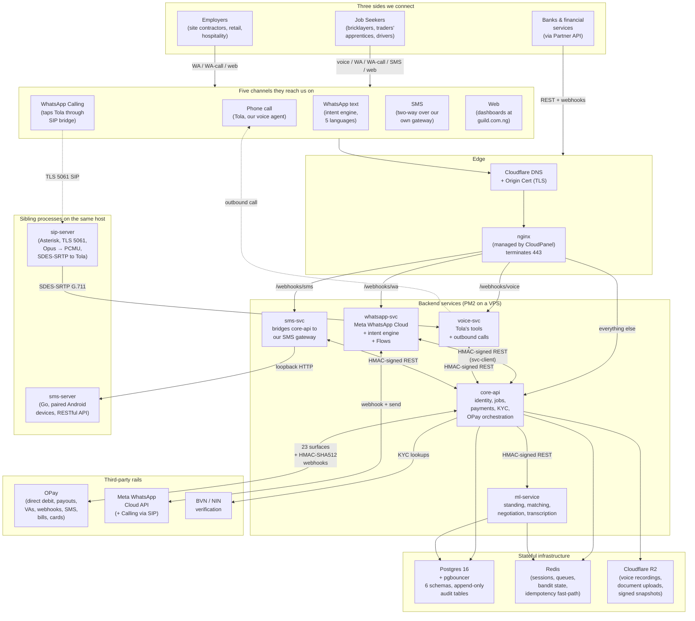

Read the diagram top to bottom: who reaches us, on what channel, through what edge, into which service, talking to which downstream.

## Headline numbers

| Number | What it counts                                                                                                                                                                                                  |
| ------ | --------------------------------------------------------------------------------------------------------------------------------------------------------------------------------------------------------------- |
| **5**  | Backend services running on PM2 (core-api, whatsapp-svc, voice-svc, sms-svc, ml-service)                                                                                                                        |
| **2**  | Sibling processes on the same host (sms-server, sip-server)                                                                                                                                                     |
| **16** | Shared `@guild/*` packages used across services. Auth, config, crypto, db, db-audit, dojah, errors, logger, messaging-core, observability, queue, r2-storage, service-template, opay-client, svc-client, types. |
| **23** | OPay API methods wrapped in our OPay client. Five fire on every demo.                                                                                                                                           |
| **5**  | Channels we listen on. Voice, WhatsApp Calling, WhatsApp text, SMS, web.                                                                                                                                        |
| **5**  | Languages our voice agent and intent engine handle. English, Pidgin, Yoruba, Igbo, Hausa.                                                                                                                       |
| **6**  | Postgres schemas with separate ownership. identity, jobs, payments, sms, voice, whatsapp, ml.                                                                                                                   |
| **3**  | Webhook signature schemes our middleware accepts for OPay alone. Plus separate ones for WhatsApp Cloud, our voice runtime, and the Partner API.                                                                 |
| **4**  | Standing-model tiers. Building, Emerging, Trusted, Established.                                                                                                                                                 |

## Where the four pillars live

Guild was designed to ship all four pillars of the OPay Scholars 2026 challenge. The next chapters walk through each.

<CardGroup cols={2}>
  <Card title="OPay API depth" icon="bolt" href="/architecture/opay-integration">
    The 23 wrapped surfaces. Why the wrapper looks the way it does. How the reconcile guard defends against signature-replay even if the secret leaks. Idempotency at every layer. The five demo-critical paths.
  </Card>

  <Card title="AI/ML layer" icon="brain" href="/architecture/ml-layer">
    Standing model (XGBoost-class multiclass tier classifier). Matching model (lambdarank, four factors). Negotiation engine (Thompson sampling, online). Transcription (five languages). Why each model has the shape it does.
  </Card>

  <Card title="Use of data" icon="chart-mixed" href="/architecture/data-flow">
    The append-only audit ledger as the data substrate. Every webhook, every approval, every payment is a row. The standing model reads it. The Partner API reads it. The dashboard reads it. One source of truth.
  </Card>

  <Card title="Resilience & scale" icon="shield" href="/architecture/resilience">
    Circuit breakers around every OPay call. Idempotency keys with Postgres-durable + Redis fast-path. Reconcile guard before any wallet credit. Demo-resilience tooling. The horizontal-scale path to a national footprint.
  </Card>
</CardGroup>

## The shape of every request

If you only remember one diagram on this page, make it this one. Almost every transaction in the system follows the same shape.

```mermaid theme={null}
sequenceDiagram
    autonumber
    participant U as User (Job Seeker /<br/>Employer / Trader)
    participant CH as Channel (voice / WA /<br/>SMS / web)
    participant N as nginx
    participant SVC as Service<br/>(core-api / wa-svc / voice-svc)
    participant ML as ml-service
    participant SQ as OPay
    participant PG as Postgres<br/>(append-only audit)
    participant R as Redis<br/>(idempotency / cache)

    U->>CH: action (apply, post, pay)
    CH->>N: TLS-terminated request
    N->>SVC: loopback HTTP
    SVC->>R: check idempotency key
    alt key seen
        R-->>SVC: replay short-circuit
        SVC-->>CH: cached response
    else first time
        SVC->>ML: enrich (rank / score) if needed
        ML-->>SVC: prediction
        SVC->>SQ: OPay call (debit / payout / VA / SMS)
        SQ-->>SVC: response + webhook later
        SVC->>PG: write audit row<br/>(append-only triggers)
        SVC->>R: cache idempotency key
        SVC-->>CH: response
    end

    Note over SQ,PG: Webhook returns later with HMAC-SHA512<br/>signature; reconcile guard re-verifies against<br/>OPay's authoritative endpoint before any credit fires.
```

Three properties this shape gives us:

1. **Idempotent end to end.** A retried request hits the Redis fast-path and returns the cached response. No double debits. No double credits. Ever.
2. **Audit-complete.** Every step writes a row to an append-only table with `BEFORE UPDATE OR DELETE` triggers. The ledger is structurally immutable; even we cannot tamper with the history.
3. **Defense in depth on OPay calls.** The reconcile guard means even if a webhook is forged with a stolen secret, we'd refuse to credit because OPay's own verify endpoint would tell us no.

## What lives where

| Concern                                     | Where it lives                                                |
| ------------------------------------------- | ------------------------------------------------------------- |
| **Identity & sessions**                     | core-api, `identity` schema, opaque ULID `guild_sid` cookies  |
| **Jobs & applications**                     | core-api, `jobs` schema, append-only audit                    |
| **Payments & wallets**                      | core-api, `payments` schema, append-only audit                |
| **OPay orchestration**                      | core-api uses `@guild/opay-client`                            |
| **WhatsApp text + Flows**                   | whatsapp-svc, `whatsapp` schema                               |
| **Voice (Tola)**                            | voice-svc, `voice` schema                                     |
| **SMS in/out**                              | sms-svc bridges to sms-server (Go gateway)                    |
| **WhatsApp Calling**                        | sip-server (Asterisk) bridges Meta → voice-svc                |
| **ML predictions**                          | ml-service, predictions written back to core-api              |
| **Sensitive PII (BVN, NIN, address)**       | envelope-encrypted in `identity.kyc_records.encryptedPayload` |
| **Sessions, queues, idempotency fast-path** | Redis                                                         |
| **Voice recordings, document uploads**      | Cloudflare R2                                                 |
| **TLS termination, request routing**        | nginx (managed by CloudPanel)                                 |
| **Process supervision**                     | PM2 (cluster mode for core-api, fork for the rest)            |

## The locked decisions, in one place

A short list of architectural commitments. Each is a choice we made deliberately and a chapter explains why.

| Decision                                                            | Reasoning                                                                                                                                        |
| ------------------------------------------------------------------- | ------------------------------------------------------------------------------------------------------------------------------------------------ |
| **One Postgres cluster, six schemas**                               | Cross-schema joins are cheap. Operational simplicity beats premature sharding.                                                                   |
| **Per-service Prisma schema files**, one shared cluster             | Schemas are owned by individual services; cross-schema reads happen at the application layer, not via foreign keys.                              |
| **Express, not NestJS**                                             | We needed to ship fast and the team knows Express. NestJS is a post-hackathon migration option; framework-agnostic shared packages keep it open. |
| **JSON over HTTP for inter-service**, signed with HMAC-SHA256       | Simple, debuggable, doesn't require mTLS or a service mesh. 300s skew window. Crockford Base32 nonce.                                            |
| **PM2, not Docker or Kubernetes**                                   | One VPS, five processes. PM2 reload survives without dropping connections. No orchestrator overhead.                                             |
| **CloudPanel for nginx + system config**                            | Managed vhost templating, auto-renewal of certs, audit trail of changes. The team doesn't hand-edit nginx in production.                         |
| **One Redis** for sessions, queues, idempotency cache, bandit state | Operational simplicity. Memory pressure is monitored; we'd split if it becomes a real constraint.                                                |
| **R2 for blobs**, not S3                                            | Egress-free bandwidth to Cloudflare-served viewers. Cheaper at our scale. Same API shape as S3.                                                  |
| **ULIDs everywhere**, not UUIDs                                     | Sortable by creation time. Crockford Base32 readable in logs. 26 characters.                                                                     |
| **kobo BigInt, not float naira**                                    | Currency math without rounding. ₦1 = 100 kobo, stored as `BigInt` end to end.                                                                    |

## What to read next

<CardGroup cols={2}>
  <Card title="Services in depth" icon="server" href="/architecture/services">
    Every backend service, what it owns, how it boots, how it talks to its neighbours.
  </Card>

  <Card title="OPay integration" icon="bolt" href="/architecture/opay-integration">
    The 23 wrapped surfaces. The reconcile guard. The five-times-during-a-demo flow.
  </Card>

  <Card title="ML layer" icon="brain" href="/architecture/ml-layer">
    Four models. Each with the shape it has for a specific reason. The data they read.
  </Card>

  <Card title="Infrastructure" icon="cloud" href="/architecture/infrastructure">
    The VPS layout. CloudPanel. nginx. PM2. System services. Deploy.
  </Card>

  <Card title="SMS infrastructure" icon="message" href="/architecture/sms-infrastructure">
    The Go gateway. The paired Android devices. Why two-way SMS runs through hardware we control.
  </Card>

  <Card title="SIP infrastructure" icon="phone-volume" href="/architecture/sip-infrastructure">
    The Asterisk bridge. How WhatsApp Calling lands on Tola.
  </Card>

  <Card title="Inter-service comms" icon="exchange" href="/architecture/inter-service-comm">
    HMAC signing, skew window, nonces, replay protection.
  </Card>

  <Card title="Resilience & scale" icon="shield" href="/architecture/resilience">
    Circuit breakers, reconcile guard, demo-resilience tooling, the partition path.
  </Card>
</CardGroup>

> ## Documentation Index
>
> Fetch the complete documentation index at: https://docs.guild.com.ng/llms.txt
> Use this file to discover all available pages before exploring further.

# Services

> Five backend services, two sibling processes. What each owns. How they boot. How they talk.

This chapter is the field guide. One section per service. Read it once and you can navigate any future architecture conversation about Guild.

## The seven processes

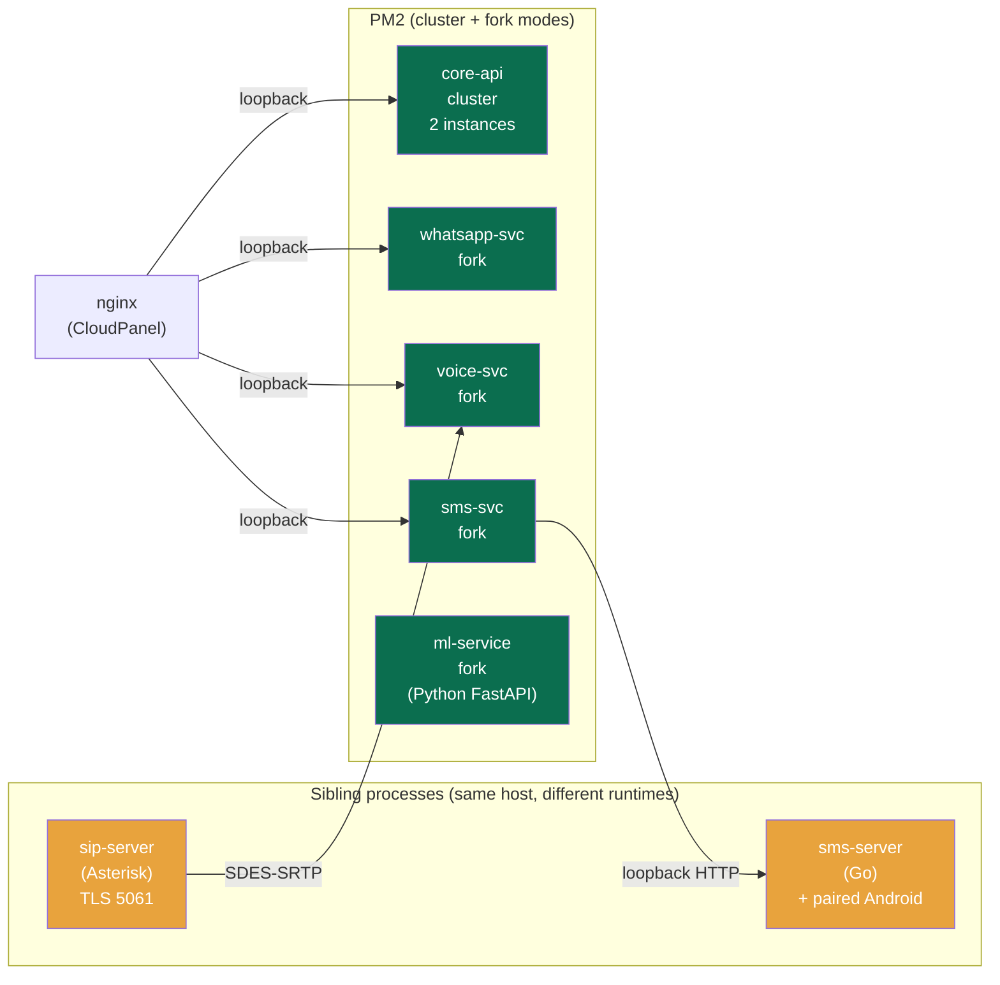

Seven processes. Loopback inter-service traffic. nginx is the only thing listening on a public socket.

---

## core-api

**The brain.** Identity, jobs, payments, KYC, wallet, dashboards, and the orchestrator of every OPay call.

### What it owns

- **Identity schema** — users, sessions, OTPs, KYC records (envelope-encrypted), virtual accounts, mandates, payout destinations.
- **Jobs schema** — job postings, applications, attendance, reviews, escrow ledger entries.
- **Payments schema** — wallets, transactions, payouts, bills, audit log.
- **OPay orchestration** — every OPay call goes through `@guild/opay-client`, wrapped by service classes in core-api (`opay-mandate`, `opay-payout`, `opay-va`, `opay-bills`, `opay-sms`, etc.).

### Entry points

| Surface                    | Purpose                                                                                                              |
| -------------------------- | -------------------------------------------------------------------------------------------------------------------- |
| **REST API (loopback)**    | Service-to-service traffic from whatsapp-svc, voice-svc, sms-svc. HMAC-signed via `@guild/svc-client`.               |
| **REST API (BFF-proxied)** | Browser traffic from `guild.com.ng` arrives via the Next.js BFF, which signs outbound calls to core-api.             |
| **Webhook endpoint**       | OPay webhooks land at `/webhooks/opay`. Three signature schemes handled; reconcile guard before any credit.          |
| **Partner API**            | Public REST surface at `/partner/v1/*`. API-key bearer auth. Consent-gated reads. Ed25519-signed snapshot responses. |

### Boot sequence

<Steps>
  <Step title="Validate config">
    Zod runs against `process.env`. Missing or malformed env crashes the process at boot, not at request 1,000.
  </Step>

  <Step title="Connect to Postgres via pgbouncer">
    Prisma client initialised with multi-schema mode. Read replicas (when configured) are routed automatically for read-only queries.
  </Step>

  <Step title="Connect to Redis">
    For sessions, idempotency cache, and BullMQ queues.
  </Step>

  <Step title="Initialise OPay client">
    Caller-injected config (the client never reads env directly). Single axios instance with 10s timeout. Circuit breaker armed.
  </Step>

  <Step title="Start express server">
    Listen on the loopback port. Pino HTTP logger attached. Request-ID middleware emits a ULID per request.
  </Step>

  <Step title="Workers">
    BullMQ workers start for outbound notifications, webhook retries, scheduled escrow releases.
  </Step>
</Steps>

### Five-layer discipline

Every endpoint follows the same shape:

```
HTTP → middleware → controller (Zod validation)
     → service (domain logic)
     → repository (Prisma)
     → DB
```

Dependencies flow downward only. Services don't import controllers. Repositories don't import services. This is enforced by import discipline, not by a framework.

### Scaling characteristics

- **Cluster mode in PM2.** Two instances by default; can scale to vCPU count.
- **Stateless.** No local file writes that outlive the process. Sessions in Redis, queues in Redis, file uploads in R2.
- **Idempotent.** Every write endpoint accepts an `Idempotency-Key` header.

---

## whatsapp-svc

**The WhatsApp brain.** Inbound message handling, the 23-intent engine, Flows, voice-note interpretation, multi-language copy.

### What it owns

- **WhatsApp schema** — conversations, messages, conversation state machines (onboarding, KYC, payment flows).
- **Intent engine** — deterministic intent routing across 23 intents in five languages.
- **Outbound message templates** — pre-approved with Meta, fired through internal endpoints.
- **WhatsApp Flows** — rich form-based UX inside the chat (KYC, job posting, withdrawal).

### How a message flows

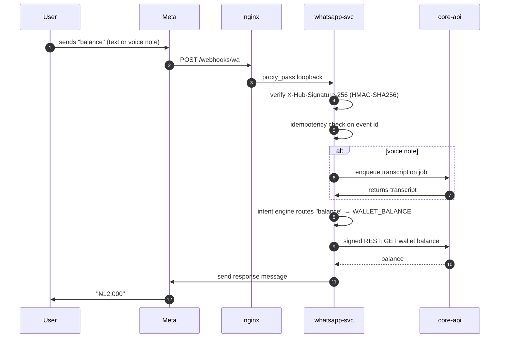

### The 23 intents

The intent engine recognises 23 distinct conversational intents — wallet, withdraw, post a job, find work, my applications, complete profile, link bank, direct debit, buy airtime, buy data, pay electricity, link card, paid with card, link bank, cancel debit, show account, marketplace, my jobs, help, and so on. Routing is deterministic — instant classification, predictable cost, no LLM round-trip per message.

When a message doesn't match any intent, the conversation state machine takes over. If the user is mid-flow (e.g., halfway through a withdrawal), we keep them in the flow. If they're idle, we show the home menu.

### Voice-note interpretation

Every voice note received in WhatsApp is dropped into the queue. Our transcription model returns text. The text runs through the intent engine the same way a typed message would. End user gets a typed reply — they spoke, the system understood, and they didn't have to type a single character.

### Why a microservice and not part of core-api

Three reasons.

1. **Meta requirements.** Webhook verification has its own signature scheme. Isolating the WhatsApp endpoint from the rest of the API reduces blast radius.
2. **State machine complexity.** Conversation state lives best near the channel that owns it. A schema migration in core-api shouldn't ripple through WhatsApp flows.
3. **Independent scaling.** WhatsApp traffic spikes (e.g., a marketing campaign) shouldn't queue up against payment traffic.

---

## voice-svc

**Tola, our voice agent.** Inbound calls, outbound calls, and the tool-call dispatcher that maps Tola's intents to core-api actions.

### What it owns

- **Voice schema** — calls, transcripts (when captured), tool-call records, outbound campaign queue.
- **Tool dispatcher** — maps voice-agent tool calls (sign up, list jobs, get details, apply, update profile, set skills) to authenticated core-api requests on behalf of the caller.
- **Outbound call orchestration** — when our matching model wants to nudge a high-fit candidate, voice-svc places the call.

### How an inbound call flows

```mermaid theme={null}
sequenceDiagram
    autonumber
    participant Caller
    participant Carrier as PSTN / WhatsApp Calling
    participant SIP as sip-server (Asterisk)<br/>(WhatsApp calls only)
    participant Voice as voice-svc + Tola
    participant Core as core-api

    Caller->>Carrier: dials Guild number<br/>(or taps WA Call)
    alt WhatsApp Calling
        Carrier->>SIP: TLS 5061 SIP INVITE (Opus)
        SIP->>SIP: transcode Opus → PCMU
        SIP->>Voice: SDES-SRTP G.711
    else PSTN call
        Carrier->>Voice: voice runtime accepts
    end
    Voice->>Voice: caller resolver checks identity
    alt unknown caller
        Voice->>Caller: Tola greets, asks name/location/trade
        Voice->>Core: create voice-signup user
    else known Job Seeker
        Voice->>Caller: Tola: "Welcome back, Musa"
    end
    loop tool calls during conversation
        Caller->>Voice: speaks
        Voice->>Core: tool call (find_jobs / apply / etc.)
        Core-->>Voice: result
        Voice->>Caller: Tola speaks the answer
    end
    Voice->>Core: post-call summary written
    Note over Voice,Core: Tola code-switches into Pidgin / Yoruba<br/>/ Igbo / Hausa when the caller does.
```

### The caller-resolver

Before Tola speaks, voice-svc looks up the caller's phone number in identity. Three outcomes:

| Caller state                 | What Tola does                                                                                                      |
| ---------------------------- | ------------------------------------------------------------------------------------------------------------------- |
| **Unknown phone**            | Onboarding mode. Asks for name, location, what they do. Creates a Tier 1 account. Confirms back before saving.      |
| **Known Job Seeker**         | Job mode. Lists open jobs, takes applications, updates profile.                                                     |
| **Known employer or trader** | Polite deflect. Voice is the Job Seeker rail. _"Voice is for Job Seekers. Please use WhatsApp for employer setup."_ |

### Outbound calls

Voice-svc can place outbound calls too. The most common use case: when the matching model surfaces a high-fit Job Seeker for a new job (Trusted tier, strong recent activity, matching skill and location) and we want to nudge them faster than a WhatsApp message would.

```bash theme={null}
# Pseudocode, internal-only path
voiceSvc.placeOutboundCall({
  userId: "usr_01HMFB...",
  context: "job_match_nudge",
  jobId: "job_01HMFC...",
  language: "yoruba"
})
```

Tola opens with the language the user set in their profile, briefs them on the job, and offers to apply on their behalf.

---

## sms-svc

**The thin bridge.** Sits between core-api and our SMS gateway hardware. Doesn't own any business logic.

### What it owns

- **SMS schema** — outbound message log, delivery receipts.
- **Routing** — outbound SMS request from core-api → through sms-svc → to the right backend.

### Two outbound backends

sms-svc routes SMS by purpose.

| Backend                     | When used                                                                                                                                                                      |
| --------------------------- | ------------------------------------------------------------------------------------------------------------------------------------------------------------------------------ |
| **OPay SMS**                | Transactional outbound (OTPs, balance alerts). Fire-and-forget, high deliverability, billed by OPay.                                                                           |
| **sms-server (Go gateway)** | Two-way conversational SMS. The SIM card on the paired Android device is what the recipient sees as the sender. Replies route back through the gateway to sms-svc to core-api. |

The split lets us use the right tool for the right purpose. Transactional one-way uses OPay's high-volume API. Conversational two-way uses physical SIM cards we control.

### Why a separate service

sms-svc is intentionally thin. If we ever migrated SMS providers (e.g., split traffic across two SMS APIs based on delivery region), the rewrite happens here without touching core-api.

See [SMS infrastructure](/architecture/sms-infrastructure) for the gateway side.

---

## ml-service

**The Python service.** FastAPI. Four models, each behind its own endpoint.

### What it owns

- **ML schema** — model artifacts metadata, feature snapshots for offline training, predictions log (when persisted), bandit state in Redis.
- **Standing model** — multi-class classifier predicting Job Seeker / trader tier (Building, Emerging, Trusted, Established) from ledger features.
- **Matching model** — lambdarank ranker for job ↔ Job Seeker pairs. Four factors: skill, location, language, economic context.
- **Negotiation engine** — Thompson sampling Beta(α, β) bandit per (segment × bucket). Online learner; posteriors update on every accept/decline.
- **Transcription model** — voice-note interpretation. Five languages: English, Pidgin, Yoruba, Igbo, Hausa.

### Boot

FastAPI loads each model from its artifact path at startup. A boot-time feature-order sanity check confirms the loaded model's feature schema matches what the application expects. Mismatch crashes the process so production never silently serves stale features.

### Why Python, not Node

The tooling. xgboost, lightgbm, scikit-learn, and the transcription ecosystem are Python-native. We use what's mature.

### Why a separate service, not a Python module pulled into core-api

Process isolation. Models reload independently from API code. Heavy inference doesn't compete with payment latency. Two different deployment cadences.

See [ML layer](/architecture/ml-layer) for the model deep dive.

---

## sms-server (Go SMS gateway)

A sibling process — same VPS, different runtime. Open-source (capcom6/sms-gateway), customized for our deployment.

### What it does

Pairs with one or more Android phones connected over USB or networked over LAN. Each Android phone has a Nigerian SIM. The Go server exposes a RESTful API on a loopback port; when sms-svc wants to send a conversational SMS, it POSTs to the gateway. The gateway dispatches via Firebase Cloud Messaging to the paired Android, which uses the SIM to send the SMS.

Replies go the reverse path: SIM receives an SMS → Android relays to the gateway → gateway pushes inbound event to sms-svc → sms-svc forwards to core-api.

### Why hardware instead of an API

Three reasons.

1. **Two-way deliverability.** Nigerian SMS APIs are excellent for one-way transactional traffic; two-way conversational is messier. Owning the SIM gives us guaranteed two-way.
2. **Cost.** Per-message cost on a SIM card is fractional. At scale, this beats any third-party SMS API for two-way traffic.
3. **Direct relationships with carriers.** Each SIM is on MTN, GLO, Airtel, or 9Mobile. We control the rotation. We control the deliverability footprint.

This is one of the boring-but-strategic parts of the stack. Most platforms outsource SMS entirely; we own the rails for the part that matters.

See [SMS infrastructure](/architecture/sms-infrastructure) for the deployment detail.

---

## sip-server (Asterisk)

A second sibling process. Asterisk on TLS 5061, dedicated to WhatsApp Calling.

### What it does

When a Guild user opens our WhatsApp contact and taps the call button, Meta's WhatsApp Calling infrastructure initiates a SIP INVITE to `sip.guild.com.ng:5061`. Asterisk accepts the TLS call, transcodes Meta's Opus codec to G.711 PCMU (the format our voice runtime accepts), and bridges to Tola via SDES-SRTP.

### Why Asterisk specifically

We tried three alternatives before settling on Asterisk.

| Tried                                        | Why it didn't work                                                                                  |
| -------------------------------------------- | --------------------------------------------------------------------------------------------------- |
| **Twilio SIP Domain + Elastic SIP Trunking** | Twilio rejected Meta's WebRTC-flavoured SDP with error 32102.                                       |
| **Voice runtime direct**                     | Hit `transport-never-connected` on the media plane. Likely Meta's Opus fmtp parameters.             |
| **FreeSWITCH**                               | Packages became unobtainable without a paid SignalWire account.                                     |
| **Asterisk** ✅                              | Ubuntu `universe` repo. No third-party repos. Opus codec is a free Sangoma binary. Works first try. |

The path to "this works":

1. Meta dials Asterisk over TLS 5061 with Opus.
2. Asterisk's `chan_pjsip` accepts and identifies the endpoint by source IP.
3. Asterisk transcodes Opus to PCMU (drops Meta's tricky Opus fmtp params).
4. Asterisk bridges to the voice runtime via SDES-SRTP.
5. Tola is on the other side.

### Why this matters

WhatsApp Calling lands directly on Tola. A user doesn't need to dial a separate number; they tap the call button in their existing WhatsApp chat with Guild and they're talking to her. Most platforms don't have this. We do.

See [SIP infrastructure](/architecture/sip-infrastructure) for the deeper protocol detail.

---

## Shared `@guild/*` packages

Every service consumes from the same package set. Pinned versions across the monorepo.

| Package                   | What it provides                                                                     |
| ------------------------- | ------------------------------------------------------------------------------------ |
| `@guild/auth`             | Session helpers, OTP, password hashing (when applicable), the BFF cookie contract.   |
| `@guild/config`           | Zod-validated env loader. Crashes at boot on bad config.                             |
| `@guild/crypto`           | Envelope encryption (XChaCha20-Poly1305 via sodium-native). AAD-bound to user ULID.  |
| `@guild/db`               | Prisma client factories per service with read-replica routing.                       |
| `@guild/db-audit`         | Append-only audit helpers. Trigger DDL templates.                                    |
| `@guild/dojah`            | BVN and NIN verification client. (Provider name not surfaced in public docs.)        |
| `@guild/errors`           | One error shape across all services. `DomainError`, `ApiError`, error-code taxonomy. |
| `@guild/logger`           | Pino with PII redaction, request-ID injection, ISO timestamps.                       |
| `@guild/messaging-core`   | `MessageChannelBase` abstraction. SMS, WhatsApp, voice all implement it.             |
| `@guild/observability`    | Sentry init, Prometheus metrics exporter, health-check templates.                    |
| `@guild/queue`            | BullMQ helpers. Default retries, DLQ, idempotency check inside the job worker.       |
| `@guild/r2-storage`       | Cloudflare R2 client. Pre-signed URL generation. Lifecycle rules.                    |
| `@guild/service-template` | The reference service skeleton. New services fork this.                              |
| `@guild/opay-client`      | The 23-method OPay wrapper. The crown jewel of the package set.                      |
| `@guild/svc-client`       | HMAC-SHA256 signed REST client for service-to-service traffic.                       |
| `@guild/types`            | Shared Zod schemas and TypeScript types. The contract between services.              |

Sixteen packages. Each one solves a problem so the four engineers building features don't reinvent it.

---

## What to read next

<CardGroup cols={2}>
  <Card title="OPay integration" icon="bolt" href="/architecture/opay-integration">
    The 23 wrapped surfaces in detail. The reconcile guard. The five demo paths.
  </Card>

  <Card title="ML layer" icon="brain" href="/architecture/ml-layer">
    Four models. Why each has the shape it does.
  </Card>

  <Card title="Infrastructure" icon="cloud" href="/architecture/infrastructure">
    VPS, CloudPanel, nginx, PM2, deploy.
  </Card>

  <Card title="Inter-service comms" icon="exchange" href="/architecture/inter-service-comm">
    HMAC svc-auth in depth.
  </Card>
</CardGroup>

> ## Documentation Index
>
> Fetch the complete documentation index at: https://docs.guild.com.ng/llms.txt
> Use this file to discover all available pages before exploring further.

# OPay integration

> 23 surfaces. 5 demo-critical. One client. The reconcile guard, the three signature schemes, idempotency at every layer.

If you read one architecture page, make it this one.

Guild's value proposition turns on OPay. The receipts that lenders trust, the direct-debit rails that let employers commit funds before work starts, the payouts that put money in a worker's bank in seven seconds — every one of those depends on OPay being the spine. The next pages document exactly how we wrap that spine.

## The 23 surfaces

```mermaid theme={null}
graph TB
    subgraph Demo["5 demo-critical (fire on every walkthrough)"]
        D1["Direct Debit / Mandates<br/>create · debit · cancel"]
        D2["Payouts<br/>requestPayout · lookupPayoutAccount"]
        D3["Webhooks<br/>signature verification +<br/>reconcile guard"]
        D4["Virtual Accounts<br/>static + dynamic"]
        D5["Transactional SMS<br/>sendSms"]
    end

    subgraph Cards["Card linking & charges (3)"]
        C1["initiateTransaction<br/>(hosted checkout)"]
        C2["chargeCard<br/>(saved tokens)"]
        C3["cancelRecurring"]
    end

    subgraph Direct["Direct-payment fallbacks (5)"]
        P1["chargeCardDirect"]
        P2["bankDebitDirect"]
        P3["ussdDebit"]
        P4["authorizePayment<br/>(PIN/OTP)"]
        P5["validateBankPayment<br/>(OTP)"]
    end

    subgraph Bills["Bills / VAS (5)"]
        B1["purchaseAirtime"]
        B2["getDataPlans"]
        B3["purchaseData"]
        B4["verifyMeter"]
        B5["purchaseElectricity"]
    end

    subgraph Recon["Reconciliation (2)"]
        R1["verifyTransaction<br/>(authoritative)"]
        R2["getTransaction"]
    end

    style D1 fill:#0B6E4F,color:#fff
    style D2 fill:#0B6E4F,color:#fff
    style D3 fill:#0B6E4F,color:#fff
    style D4 fill:#0B6E4F,color:#fff
    style D5 fill:#0B6E4F,color:#fff
    style R1 fill:#E8A33D,color:#fff
```

The five green tiles fire in every payment story you'll read on the docs site. The amber tile (`verifyTransaction`) is the reconcile guard's authoritative call — it doesn't fire in the user story but it fires in the security story, every time.

The other 17 cover card linking, direct-charge fallbacks, bills, and reconciliation. Wired today. Not all demoed live, but all in production behaviour.

## Why a wrapper instead of raw axios calls

We could have called OPay directly from each service. We don't. The wrapper exists for five concrete reasons.

| Reason                              | What the wrapper does                                                                                                                                       |
| ----------------------------------- | ----------------------------------------------------------------------------------------------------------------------------------------------------------- |
| **One axios instance, one timeout** | 10s timeout, single connection pool, predictable resource ceiling.                                                                                          |
| **kobo ↔ naira normalization**      | OPay's API mixes representations; the wrapper always emits and accepts kobo as BigInt strings. No floating-point currency math in our application code.     |
| **snake_case ↔ camelCase**          | OPay uses snake_case in some fields; we use camelCase across our codebase. The wrapper translates at the boundary so our app types stay clean.              |
| **Status normalization**            | A `STATUS_LOOKUP` table maps OPay's spelling drift (`ValidateOtp`, `validate_otp`, `VALIDATEOTP`) into one `DirectChargeNextStep` union.                    |
| **Error classification**            | Errors come back as `TRANSIENT` (retry-safe) or `PERMANENT` (don't retry). Callers decide whether to retry; the wrapper tells them whether they safely can. |

The package never reads `process.env` directly. Configuration is caller-injected. This makes it testable, makes it swappable, and makes it impossible for one service's OPay credentials to leak into another's process.

## The reconcile guard (defence-in-depth on webhooks)

Most payment platforms verify webhook signatures and credit the wallet. That's correct, until the day the webhook secret leaks. Then an attacker can forge any payload they want.

We added a second check. Hold on — this is where the architecture earns its keep 👀.

```mermaid theme={null}
sequenceDiagram
    autonumber
    participant Sq as OPay
    participant N as nginx
    participant W as webhook handler
    participant V as verify guard
    participant L as ledger

    Sq->>N: POST /webhooks/opay<br/>(HMAC-SHA512 signed)
    N->>W: proxy_pass (raw body preserved)
    W->>W: try 3 signature schemes<br/>timing-safe compare
    alt signature invalid
        W-->>Sq: 401
    else signature valid
        W->>W: idempotency check<br/>(replay short-circuit)
        W->>V: re-verify with OPay<br/>(GET verify endpoint)
        V->>Sq: authoritative status check
        Sq-->>V: {status, amount, ref}
        alt status != success OR amount != expected
            V-->>W: REJECT
            W-->>Sq: 200 (acknowledged,<br/>but no credit fires)
        else status == success AND amount matches
            V-->>W: PASS
            W->>L: write audit row<br/>credit wallet (atomic)
            W-->>Sq: 200
        end
    end
```

What this gives us: even if an attacker holds our webhook secret, they cannot fake a successful payment. To get money credited, OPay itself must confirm the transaction at our re-verification call. OPay's authoritative endpoint is the source of truth, and we never trust the webhook body alone.

This is the difference between "we validate signatures" and "we will not credit anything we cannot independently verify." Subtle. Material.

### Three signature schemes we accept

OPay has a few signature schemes in the wild. Our middleware accepts all three.

| Scheme                                   | Detection                                            | Verification                                                                                        |
| ---------------------------------------- | ---------------------------------------------------- | --------------------------------------------------------------------------------------------------- |
| **`x-opay-encrypted-body` (full body)**  | Header present; raw body provided                    | HMAC-SHA512 of the raw request body                                                                 |
| **`x-opay-encrypted-body` (DVA subset)** | Header present; matches the dynamic-VA payload shape | HMAC-SHA512 of a three-field JSON: `transaction_reference`, `amount_received`, `merchant_reference` |
| **`x-opay-signature` (v2/v3)**           | Different header                                     | HMAC-SHA512 of raw body, with a fallback to a pipe-delimited field concat for legacy events         |

The middleware tries schemes in order, returning success on the first match. Every comparison uses `crypto.timingSafeEqual` — no early-return string compare anywhere. A constant-time check defends against timing oracles.

If none of the schemes verify, we return 401 and write an audit row. We do not silently swallow.

## Idempotency, everywhere

Every OPay-bound action carries a ULID idempotency key.

```mermaid theme={null}
flowchart LR
    Req["incoming request<br/>(employer taps pay)"]
    Gen["generate ULID<br/>idempotency key"]
    Cache["Redis fast-path<br/>(idempotency:<key>)"]
    PG["Postgres durable store<br/>(processed_requests)"]
    OPay["OPay call"]
    Cached["return cached<br/>response"]

    Req --> Gen
    Gen --> Cache
    Cache -->|"miss"| PG
    PG -->|"miss"| OPay
    OPay --> PG
    PG --> Cache

    Cache -->|"hit"| Cached
    PG -->|"hit"| Cached
```

Two layers:

1. **Redis fast-path.** The first place we check. Sub-millisecond.
2. **Postgres durable store.** Survives Redis flushes. Source of truth.

A retried request that arrives within minutes hits Redis and returns the cached response without ever touching OPay. A retry that arrives hours later (Redis evicted, Postgres still has it) gets the same response from Postgres. A retry that finds neither falls through and executes — but this only happens for cold-cache states beyond our retention window.

This means we will never double-debit an employer, double-credit a Job Seeker, or fire a duplicate OPay call for the same logical action. The platform is end-to-end idempotent.

## No retries inside the wrapper

Deliberate choice. The OPay client does not retry on failure.

The wrapper classifies errors as `TRANSIENT` or `PERMANENT`. Callers decide. Some retry with backoff (`requestPayout` on a `TRANSIENT` error from a OPay blip). Some don't (a `PERMANENT` validation error on a malformed mandate request should not be retried — it'll fail the same way).

We do retries at the caller layer because the right retry behaviour depends on the operation. The wrapper stays clean.

## Circuit breakers

Around every OPay call. Built on `opossum`.

| Config           | Value                                 |
| ---------------- | ------------------------------------- |
| Timeout          | 10s (matches the axios timeout)       |
| Error threshold  | 50% over the rolling 10-second window |
| Reset timeout    | 30s in half-open state                |
| Volume threshold | 10 calls minimum before tripping      |

When the breaker trips, the wrapper returns a `TRANSIENT` error immediately without ever hitting OPay. This gives us a fast-fail path during OPay outages and prevents thundering-herd retries from making the situation worse.

For read-only endpoints (`getTransaction`, `lookupPayoutAccount`), the breaker has a cached-response fallback — if the breaker is open and a recent successful response is in cache, we serve it. This is the demo-resilience play: during the live walkthrough, even if OPay sandbox burps for a few seconds, our read paths stay functional.

## The five demo-critical surfaces in product context

| Surface                     | Methods                                                 | Where it shows up in the product                                                                                                                                               |
| --------------------------- | ------------------------------------------------------- | ------------------------------------------------------------------------------------------------------------------------------------------------------------------------------ |
| **Direct Debit (Mandates)** | `createMandate`, `debitMandate`, `cancelMandate`        | Employer links a bank once via the ₦50 confirmation transfer. After that, posting a job auto-debits the escrow. Five banks supported (Access, Ecobank, Fidelity, First, Kuda). |
| **Payouts**                 | `requestPayout`, `lookupPayoutAccount`                  | Job Seeker taps **withdraw** in WhatsApp; payout fires; NIBSS-backed transfer reaches their bank in 7-15 seconds. Beneficiary name pre-validated.                              |
| **Webhooks**                | (the middleware)                                        | Every event OPay fires lands here. Signature verification + reconcile guard before any wallet motion.                                                                          |
| **Virtual Accounts**        | `createVirtualAccount`, `initiateDynamicVirtualAccount` | Traders get a static B2B virtual account for everyday inflows. Dynamic VAs for invoice-specific collections.                                                                   |
| **Transactional SMS**       | `sendSms`                                               | OTPs at signup, balance alerts on every inflow, payment confirmations. Caller-supplied sender ID.                                                                              |

## The other 18 in product context

| Category                           | Methods                                                                                       | Surface                                                                                                               |
| ---------------------------------- | --------------------------------------------------------------------------------------------- | --------------------------------------------------------------------------------------------------------------------- |
| **Hosted checkout & card linking** | `initiateTransaction`, `chargeCard`, `cancelRecurring`                                        | Cards page in dashboards. Link a card, save the token, charge it again later (with user authorisation).               |
| **Direct-payment fallbacks**       | `chargeCardDirect`, `bankDebitDirect`, `ussdDebit`, `authorizePayment`, `validateBankPayment` | Wallet top-up flow — when a user has no linked mandate, we offer them card-direct, bank-direct, or USSD as fallbacks. |
| **Bills / VAS**                    | `purchaseAirtime`, `getDataPlans`, `purchaseData`, `verifyMeter`, `purchaseElectricity`       | Airtime, data, electricity from the wallet. Traders buy on customers' behalf.                                         |
| **Reconciliation**                 | `verifyTransaction`, `getTransaction`                                                         | The reconcile guard's authoritative check. Also used in dispute investigations.                                       |

## The OPay service classes in core-api

The wrapper alone doesn't capture business logic. Each OPay surface has a service class in core-api that wraps it with our specific semantics.

| Service class             | Wraps                                                                                   | Adds                                                                                                           |
| ------------------------- | --------------------------------------------------------------------------------------- | -------------------------------------------------------------------------------------------------------------- |
| `opay-mandate.service.ts` | `createMandate`, `debitMandate`, `cancelMandate`                                        | Mandate state machine, webhook handlers for `MandateApproved` / `MandateReady`, retries with idempotency keys. |
| `opay-payout.service.ts`  | `requestPayout`, `lookupPayoutAccount`                                                  | Beneficiary name validation, sync success path, payout audit rows.                                             |
| `opay-va.service.ts`      | `createVirtualAccount`, `initiateDynamicVirtualAccount`                                 | VA lifecycle (provision, deactivate, reactivate), inflow handlers, MISMATCH review queue.                      |
| `opay-card.service.ts`    | `initiateTransaction`, `chargeCard`, `cancelRecurring`, `chargeCardDirect`              | Card-linking flow, saved-token storage (encrypted), recurring-charge authorisation.                            |
| `opay-bills.service.ts`   | `purchaseAirtime`, `getDataPlans`, `purchaseData`, `verifyMeter`, `purchaseElectricity` | Vendor balance pre-check, wallet debit, audit row, refund-on-failure.                                          |
| `opay-sms.service.ts`     | `sendSms`                                                                               | Sender-ID rotation, delivery log, retry on transient errors.                                                   |
| `webhook-opay.service.ts` | (no direct OPay call)                                                                   | Webhook dispatcher; routes events to the right downstream service.                                             |

Each service class is owned by the opay-integration code path. Changes here are reviewed jointly between the payments engineer and the integration engineer.

## A concrete example: the escrow debit flow

When an employer posts a job, ₦60,000 needs to leave their Access Bank account and land in escrow inside seconds. Here is exactly what happens at every layer.

```mermaid theme={null}
sequenceDiagram
    autonumber
    participant DB as dashboard
    participant CO as core-api
    participant Idem as idempotency<br/>(Redis + PG)
    participant SqC as @guild/opay-client
    participant Sq as OPay
    participant WH as webhook receiver
    participant V as verify guard
    participant L as ledger

    DB->>CO: signed POST: create job<br/>(budget ₦60,000)
    CO->>Idem: check idempotency key
    Idem-->>CO: miss
    CO->>SqC: debitMandate(mandate_id, ₦60,000)
    SqC->>Sq: POST mandate debit
    Sq-->>SqC: response<br/>(reference assigned)
    SqC-->>CO: ok
    CO->>L: audit row (escrow pending)
    CO->>Idem: cache key + response
    CO-->>DB: 200 (job posted, escrow pending)

    Note over Sq,WH: OPay processes the debit at their bank<br/>(seconds to minutes)

    Sq->>WH: POST /webhooks/opay<br/>charge_successful event
    WH->>WH: verify HMAC-SHA512 signature<br/>idempotency check on event id
    WH->>V: re-verify with OPay
    V->>Sq: GET transaction verify
    Sq-->>V: {status: success, amount: 60000_kobo}
    V-->>WH: PASS
    WH->>L: audit row (escrow funded)<br/>commit escrow balance
```

Notice the layers of safety:

1. **The dashboard's request is signed** by `@guild/svc-client` HMAC. Replays in transit are caught.
2. **Idempotency check at core-api.** Replays from a retried browser fetch are caught.
3. **OPay's response is validated** before we mark anything in the ledger.
4. **Webhook signature is verified** when it arrives.
5. **Reconcile guard runs** before we mark the escrow funded.
6. **The escrow audit row is append-only.** Nobody can edit it after.

Six checks. Every transaction. End to end.

## What we don't do (and why)

- **No retries inside the OPay client.** Callers own retry policy.
- **No USSD inbound.** Only `ussdDebit` for outbound. We don't accept USSD as a user-facing channel.
- **No card storage outside OPay's tokenization.** We never see raw card numbers. OPay's saved-token IDs are the only thing we hold.
- **No fee markup on OPay transactions.** What OPay charges us is what we charge through. (At v1; future product tiers may differ.)
- **No multi-account sweep.** A wallet has one balance, one source. Sweep flows are future product, not platform.

## What to read next

<CardGroup cols={2}>
  <Card title="Inter-service comms" icon="exchange" href="/architecture/inter-service-comm">
    The HMAC layer that signs every internal call.
  </Card>

  <Card title="Resilience & scale" icon="shield" href="/architecture/resilience">
    Circuit breakers, demo-resilience tooling, the partition path.
  </Card>

  <Card title="ML layer" icon="brain" href="/architecture/ml-layer">
    The other half of the spine — the data product that reads the receipts.
  </Card>

  <Card title="Webhook security" icon="lock" href="/security/webhook-verification">
    The security page with the full signature spec.
  </Card>
</CardGroup>

> ## Documentation Index
>
> Fetch the complete documentation index at: https://docs.guild.com.ng/llms.txt
> Use this file to discover all available pages before exploring further.

# OPay: complete surface reference

> Every method, every webhook event, every signature scheme, every idempotency contract. The technical reference for the spine.

This is the page for judges and integration engineers who want the full inventory in one place. Twenty-three OPay surfaces. Every webhook event we handle. Every signature scheme we accept. No gaps.

For the design rationale and the philosophical framing, read [OPay integration](/architecture/opay-integration) first. This page is the reference.

## The 23 methods, by category

### Direct Debit / Mandates (3 methods)

The OPay surface that most teams won't have working end to end. The differentiator.

| Method              | Purpose                                                                                                                | Where it fires                                                                                       |
| ------------------- | ---------------------------------------------------------------------------------------------------------------------- | ---------------------------------------------------------------------------------------------------- |
| **`createMandate`** | Creates an e-mandate authorisation against the user's bank account. Returns a mandate ID in `PENDING_APPROVAL` status. | Employer or Job Seeker links a bank from the dashboard.                                              |
| **`debitMandate`**  | Triggers a debit against an approved mandate. Idempotent via ULID key. Returns a transaction reference.                | Job posted → escrow funded. Mid-month auto-savings sweep. Repayment debit for a partner-lender loan. |
| **`cancelMandate`** | Revokes the mandate. Future debit attempts fail.                                                                       | User taps **Cancel mandate** in the dashboard.                                                       |

**Lifecycle:** create → user sends ₦50 confirmation transfer from their bank app → OPay fires `MandateApproved` webhook → OPay fires `MandateReady` webhook (typically 2-5 min later) → debits become possible.

**Banks supported:** Access (044), Ecobank (050), Fidelity (070), First Bank (011), Kuda (672).

### Payouts (2 methods)

| Method                    | Purpose                                                                                                                         | Where it fires                                                                                           |
| ------------------------- | ------------------------------------------------------------------------------------------------------------------------------- | -------------------------------------------------------------------------------------------------------- |
| **`requestPayout`**       | NIBSS-backed transfer from our merchant account to a beneficiary's bank account. Reference auto-appended with merchant suffix.  | Job Seeker withdraws to bank. Employer refund. Lender disbursement. Trader withdrawal.                   |
| **`lookupPayoutAccount`** | Resolves bank code + account number to the official account name. Pre-validates a payout target before we attempt the transfer. | Linking a payout bank account. Verifying refund destination. Before every first payout to a new account. |

**Sync success path.** If OPay's response includes `response_description` matching `/approved|completed|success/i` and a `nip_transaction_reference`, we mark the payout `SUCCESS` immediately. No need to wait for the webhook. This shaves seconds off the user-perceived latency.

**Webhook fallback.** If OPay returns pending, the payout sits in PENDING state until the `payout_successful` (or `payout_failed`) webhook arrives. Same signature verification, same reconcile guard.

### Virtual Accounts (2 methods)

| Method                              | Purpose                                                                                                      | Where it fires                                                             |
| ----------------------------------- | ------------------------------------------------------------------------------------------------------------ | -------------------------------------------------------------------------- |
| **`createVirtualAccount`**          | Provisions a static B2C or B2B virtual account tied to a user's BVN/KYC. Permanent ten-digit account number. | Trader completes Tier 2 KYC. Job Seeker eligible for VA-based collections. |
| **`initiateDynamicVirtualAccount`** | Creates a one-time virtual account with a fixed amount and TTL. Used for invoice-specific collections.       | Trader invoices a wholesale customer for a specific amount.                |

Static VAs accept any amount from any sender. Dynamic VAs are amount-locked and time-locked; the webhook arrives with `transaction_status: SUCCESS`, `EXPIRED`, or `MISMATCH` depending on what the sender did.

### Reconciliation (2 methods)

| Method                  | Purpose                                                                                      | Where it fires                                                                  |
| ----------------------- | -------------------------------------------------------------------------------------------- | ------------------------------------------------------------------------------- |
| **`verifyTransaction`** | Authoritative status check by transaction reference. This is what the reconcile guard calls. | Every `charge_successful` webhook. Every wallet credit. Dispute investigations. |
| **`getTransaction`**    | Non-authoritative lookup by reference. Faster, cheaper, but does not re-verify.              | Reading transaction details for the dashboard UI.                               |

`verifyTransaction` is the critical one. It is the call that defends against signature-replay attacks even if our webhook secret leaks. We never credit anyone's wallet without it.

### Transactional SMS (1 method)

| Method        | Purpose                                        | Where it fires                                                                               |
| ------------- | ---------------------------------------------- | -------------------------------------------------------------------------------------------- |
| **`sendSms`** | Sends a single SMS. Caller-supplied sender ID. | OTPs at signup. Balance alerts on every wallet motion. Payment confirmations. Bill receipts. |

### Hosted checkout & card linking (3 methods)

| Method                    | Purpose                                                                              | Where it fires                                                                                        |
| ------------------------- | ------------------------------------------------------------------------------------ | ----------------------------------------------------------------------------------------------------- |
| **`initiateTransaction`** | Opens a hosted-checkout session. Used for card linking via OPay's tokenization flow. | User taps **Link a card** in the wallet.                                                              |
| **`chargeCard`**          | Charges a previously tokenized card by token ID. With user authorisation.            | Wallet top-up from a saved card. Recurring charges (employer auto-funding the wallet, savings sweep). |
| **`cancelRecurring`**     | Revokes saved card authorisations.                                                   | User taps **Unlink card**.                                                                            |

### Direct payment fallbacks (5 methods)

When a user has no linked mandate or saved card, these are the alternative paths to fund a wallet or pay a bill.

| Method                    | Purpose                                                                                                                                                  |
| ------------------------- | -------------------------------------------------------------------------------------------------------------------------------------------------------- |
| **`chargeCardDirect`**    | Direct-charge a raw card (no hosted checkout). Used only with PCI-aware flow.                                                                            |
| **`bankDebitDirect`**     | Direct-debit a bank account by code + account number + phone. OPay sends an OTP to the user's phone to authorise.                                        |
| **`ussdDebit`**           | Initiates a USSD-based debit. Used only as a fallback when a user has no other rails available. (Note: we do not accept inbound USSD as a user channel.) |
| **`authorizePayment`**    | Submits a PIN or OTP to complete a pending direct charge. The follow-up step to `bankDebitDirect` or `chargeCardDirect`.                                 |
| **`validateBankPayment`** | Submits an OTP token to complete a bank debit.                                                                                                           |

### Bills / VAS (5 methods)

| Method                    | Purpose                                                                                             | Networks / Discos                                      |
| ------------------------- | --------------------------------------------------------------------------------------------------- | ------------------------------------------------------ |
| **`purchaseAirtime`**     | Buys airtime for a phone number.                                                                    | MTN, GLO, Airtel, 9Mobile. ₦100–₦10,000.               |
| **`getDataPlans`**        | Returns live data-bundle catalogue.                                                                 | All four networks.                                     |
| **`purchaseData`**        | Buys a data bundle.                                                                                 | All four networks.                                     |
| **`verifyMeter`**         | Looks up a prepaid or postpaid meter against the disco. Returns the customer name and meter status. | IKEDC, EKEDC, IBEDC, PHEDC, AEDC, KEDCO, KAEDCO, BEDC. |
| **`purchaseElectricity`** | Vends an electricity token using a verified meter reference.                                        | All listed discos.                                     |

## Webhook events we handle

Every event OPay fires lands at our webhook endpoint. Every event passes through the same middleware: signature verification → idempotency check → reconcile guard (for credit-bearing events) → routing to the right handler service.

### The full event taxonomy

```mermaid theme={null}
graph LR
    subgraph Mandate["Mandate lifecycle"]
        E1["MandateApproved"]
        E2["MandateReady"]
        E3["MandateRejected"]
        E4["MandateCancelled"]
    end

    subgraph Charge["Charge events"]
        E5["charge_successful<br/>(card / mandate /<br/>direct charge)"]
        E6["charge_failed"]
        E7["charge_authorisation_required"]
    end

    subgraph VA["Virtual account inflows"]
        E8["virtual_account_payment<br/>(static VA)"]
        E9["dynamic_virtual_account<br/>(SUCCESS)"]
        E10["dynamic_virtual_account<br/>(EXPIRED)"]
        E11["dynamic_virtual_account<br/>(MISMATCH)"]
    end

    subgraph Payout["Payout events"]
        E12["payout_successful"]
        E13["payout_failed"]
        E14["payout_reversed"]
    end

    subgraph Card["Card events"]
        E15["card_linked"]
        E16["card_charge_recurring"]
    end

    subgraph Bills["Bill / VAS events"]
        E17["airtime_purchase"]
        E18["data_purchase"]
        E19["electricity_purchase"]
    end

    style E5 fill:#0B6E4F,color:#fff
    style E8 fill:#0B6E4F,color:#fff
    style E12 fill:#0B6E4F,color:#fff
    style E13 fill:#0B6E4F,color:#fff
    style E2 fill:#0B6E4F,color:#fff
```

Green tiles are credit-bearing — they cause money to move into or out of someone's wallet. Each one passes through the reconcile guard before the wallet motion fires.

### Event handlers in detail

| Event                                                                   | Handler logic                                                                                                                                                                                                                  |
| ----------------------------------------------------------------------- | ------------------------------------------------------------------------------------------------------------------------------------------------------------------------------------------------------------------------------ |
| **`MandateApproved`**                                                   | Updates mandate status to APPROVED. SMS + WhatsApp to the user: _"Bank linked. We're warming it up."_                                                                                                                          |
| **`MandateReady`**                                                      | Updates mandate status to READY. Mandate is now debittable. SMS: _"Bank ready. You can now pay Job Seekers directly from your bank."_                                                                                          |
| **`MandateRejected`**                                                   | Updates mandate status to REJECTED. Mandate cannot be debited. SMS with error reason.                                                                                                                                          |
| **`MandateCancelled`**                                                  | Updates mandate status to CANCELLED. Mostly fires when we initiated cancel; sometimes when the user's bank revokes externally.                                                                                                 |
| **`charge_successful`**                                                 | The big one. **Runs the reconcile guard.** If verified: credits the appropriate wallet (employer escrow, Job Seeker wallet, savings, etc.) and writes the audit row atomically. Fires user-facing SMS + WhatsApp notification. |
| **`charge_failed`**                                                     | Marks the underlying transaction FAILED. Wallet is not credited. User notified with the failure reason. For a mandate debit on an empty bank, the failure surfaces in the employer dashboard with a retry button.              |
| **`charge_authorisation_required`**                                     | For a direct charge that needs an OTP or PIN, fires the in-app prompt to the user to enter the authorisation.                                                                                                                  |
| **`virtual_account_payment`**                                           | Inflow on a static VA. **Runs the reconcile guard.** Credits the VA-owner's wallet. SMS notification with sender name and amount.                                                                                              |
| **`dynamic_virtual_account` SUCCESS**                                   | Amount-matched dynamic VA inflow. **Runs the reconcile guard.** Credits the wallet. The dynamic VA closes.                                                                                                                     |
| **`dynamic_virtual_account` EXPIRED**                                   | The TTL window closed before any transfer arrived (or before the matching transfer). The VA closes. The owner sees an EXPIRED row in their dashboard.                                                                          |
| **`dynamic_virtual_account` MISMATCH**                                  | A transfer arrived with the wrong amount (typically lower). The wallet is **not** credited automatically. A row sits in the owner's review queue: accept, refund, or contact the sender for the balance.                       |
| **`payout_successful`**                                                 | Marks the payout SUCCESS. (Already may have been marked SUCCESS via the sync success path — this is the durable confirmation.) User SMS: _"₦X sent to Access Bank ••••3911."_                                                  |
| **`payout_failed`**                                                     | Marks the payout FAILED. Wallet is re-credited (we held the kobo from the wallet at payout time). User SMS with failure reason and a retry button.                                                                             |
| **`payout_reversed`**                                                   | Rare. NIBSS reversed the transfer. Wallet re-credited. The dispute / support flow opens.                                                                                                                                       |
| **`card_linked`**                                                       | The hosted-checkout completion. We save the saved-token ID against the user. Future `chargeCard` calls can use it.                                                                                                             |
| **`card_charge_recurring`**                                             | An auto-charge against a saved card (e.g., scheduled wallet top-up). Same reconcile and credit logic as `charge_successful`.                                                                                                   |
| **`airtime_purchase`**, **`data_purchase`**, **`electricity_purchase`** | Confirmation that the VAS purchase landed at the carrier or disco. Audit row finalised.                                                                                                                                        |

### Idempotency on inbound webhooks

Every webhook delivery includes OPay's event ID. We dedupe on it in our `webhookEvents` table. A duplicate delivery (OPay retrying on a 5xx from us) is a no-op — we return 200 without processing again.

```mermaid theme={null}
sequenceDiagram
    autonumber
    participant Sq as OPay
    participant Mid as Webhook middleware
    participant Idem as webhookEvents table
    participant Hand as Event handler

    Sq->>Mid: POST webhook (event_id=evt_X)
    Mid->>Mid: signature verify
    Mid->>Idem: insert(event_id=evt_X) ON CONFLICT DO NOTHING
    alt insert succeeded
        Mid->>Hand: dispatch
        Hand-->>Mid: ok
        Mid-->>Sq: 200
    else conflict (already seen)
        Mid-->>Sq: 200 (no-op)
    end
```

A unique constraint on the event ID prevents double-handling at the database level.

## The three signature schemes (OPay inbound)

```mermaid theme={null}
flowchart TB
    Req["incoming webhook request"]
    Hdr1{"x-opay-encrypted-body<br/>header present?"}
    Try1["try full-body HMAC-SHA512"]
    Try2["try DVA 3-field subset HMAC-SHA512"]
    Hdr2{"x-opay-signature<br/>header present?"}
    Try3["try full-body HMAC-SHA512"]
    Try4["try pipe-delimited field<br/>HMAC-SHA512 (v2/v3)"]
    Pass["accept"]
    Fail["401"]

    Req --> Hdr1
    Hdr1 -->|yes| Try1
    Try1 -->|match| Pass
    Try1 -->|no match| Try2
    Try2 -->|match| Pass
    Try2 -->|no match| Hdr2
    Hdr1 -->|no| Hdr2
    Hdr2 -->|yes| Try3
    Try3 -->|match| Pass
    Try3 -->|no match| Try4
    Try4 -->|match| Pass
    Try4 -->|no match| Fail
    Hdr2 -->|no| Fail

    style Pass fill:#0B6E4F,color:#fff
    style Fail fill:#B23A2A,color:#fff
```

Every comparison is `crypto.timingSafeEqual`. The middleware never returns early on a string mismatch; comparison time is constant regardless of how many bytes differ.

## The reconcile guard, in pseudocode

```typescript theme={null}
// Pseudocode — production code is split across services
async function handleChargeSuccessful(webhook: OPayWebhookBody) {
  // 1. Signature verification has already passed (middleware)
  // 2. Idempotency check has already passed (unique on event_id)

  // 3. Re-verify against OPay's authoritative endpoint
  const verification = await opayClient.verifyTransaction(webhook.reference);

  // 4. Status must match success
  if (!/success/i.test(verification.status)) {
    audit.write({ kind: "webhook_rejected_status_mismatch", ...webhook });
    return; // We acknowledge the webhook but do not credit
  }

  // 5. Amount must match to the kobo
  if (BigInt(verification.amount_kobo) !== BigInt(webhook.amount_kobo)) {
    audit.write({ kind: "webhook_rejected_amount_mismatch", ...webhook });
    return;
  }

  // 6. All checks passed. Credit the wallet atomically with the audit row.
  await db.transaction(async (tx) => {
    await tx.walletLedger.credit({
      userId: resolveOwner(webhook),
      amountKobo: webhook.amount_kobo,
      sourceRef: webhook.reference,
    });
    await tx.audit.append({
      kind: "wallet_credit",
      reference: webhook.reference,
      amount: webhook.amount_kobo,
      verifiedAt: new Date(),
    });
  });
}
```

The defence is layered. Signature alone is not sufficient. We require OPay's own authoritative endpoint to corroborate. An attacker would have to compromise both our webhook secret and OPay's database to fake a credit. The second is implausible. So the credit is safe.

## Status normalization (OPay's spelling drift)

OPay's API sometimes returns the same logical status with different spellings (`ValidateOtp`, `validate_otp`, `VALIDATEOTP`). The wrapper normalizes through a `STATUS_LOOKUP` table:

```typescript theme={null}
const STATUS_LOOKUP: Record<string, DirectChargeNextStep> = {
  validate_otp: "OTP_REQUIRED",
  ValidateOtp: "OTP_REQUIRED",
  VALIDATEOTP: "OTP_REQUIRED",
  validate_pin: "PIN_REQUIRED",
  ValidatePin: "PIN_REQUIRED",
  // ... etc
};
```

Application code reads `DirectChargeNextStep` only. The OPay-side spelling drift never escapes the wrapper.

## Error classification

The wrapper classifies every error from OPay into one of two kinds:

| Kind            | Examples                                                                     | Retry safe?                      |
| --------------- | ---------------------------------------------------------------------------- | -------------------------------- |
| **`TRANSIENT`** | 5xx from OPay, network timeout, circuit breaker open, rate-limit response    | Yes (caller decides whether to). |
| **`PERMANENT`** | 4xx validation error, malformed input, account-not-found, insufficient-funds | No. Same error on retry.         |

Callers read the error kind and decide. The wrapper never retries on its own; idempotency keys make caller-side retries safe.

```typescript theme={null}
try {
  await opayClient.requestPayout({ ... });
} catch (e) {
  if (e instanceof OPayError && e.kind === 'TRANSIENT') {
    await scheduler.scheduleRetry(idempotencyKey);
  } else {
    // PERMANENT — surface to user, do not retry
    await notifyUser({ kind: 'payout_failed', reason: e.message });
  }
}
```

## Circuit breakers

Every OPay call routes through an `opossum` circuit breaker.

| Parameter        | Value                               |
| ---------------- | ----------------------------------- |
| Timeout          | 10s (matches the axios timeout)     |
| Error threshold  | 50% over a 10-second rolling window |
| Reset timeout    | 30s in half-open state              |
| Volume threshold | 10 calls minimum before tripping    |

When the breaker is **closed**, calls flow normally. When **open**, calls fail fast with a `TRANSIENT` error without ever reaching OPay. When **half-open**, a small number of probe calls test recovery; if they succeed, the breaker closes; if they fail, the breaker re-opens.

For read-only endpoints (`getTransaction`, `lookupPayoutAccount`), the breaker has a **cached-response fallback**. If the breaker is open and a recent successful response is in cache, we serve it. This is the demo-resilience play — even if OPay sandbox has a hiccup mid-demo, read paths stay functional.

## Per-merchant reference suffix

OPay rejects payout references that don't carry our merchant suffix. The wrapper appends `_<merchantId>` automatically; application code passes a clean reference and the wrapper handles the convention. This is invisible to consumers of the wrapper.

## What we don't use from OPay

For completeness:

- **Recurring billing UI flows.** We handle recurring through our own scheduling on `chargeCard` or `debitMandate`.
- **OPay's hosted dispute UI.** Disputes resolve through our own ops review process.
- **OPay's chatbot integrations.** Not relevant to our channel architecture.

## What to read next

<CardGroup cols={2}>
  <Card title="OPay integration design" icon="bolt" href="/architecture/opay-integration">
    The architectural framing of why the wrapper looks the way it does.
  </Card>

  <Card title="Webhook security" icon="lock" href="/security/webhook-verification">
    The security-focused walkthrough of signature verification.
  </Card>

  <Card title="Resilience & scale" icon="shield" href="/architecture/resilience">
    Circuit breakers, demo-resilience tooling, idempotency at scale.
  </Card>

  <Card title="Data flow" icon="diagram-project" href="/architecture/data-flow">
    How OPay events propagate through the rest of the system.
  </Card>
</CardGroup>

> ## Documentation Index
>
> Fetch the complete documentation index at: https://docs.guild.com.ng/llms.txt
> Use this file to discover all available pages before exploring further.

# AI / ML layer

> Four models. Each one with the shape it has for a specific reason. The data they read. The feedback that improves them.

The ML layer at Guild is small and deliberate. We didn't build a model for everything. We built four, each at the point in the system where prediction beats a hand-coded rule.

Walk through them in order — the order they fire in a typical user journey — and the shape of each will make sense.

## The four models

```mermaid theme={null}
graph LR
    subgraph Stage1["When a job posts"]
        M1["Matching model<br/>lambdarank<br/>4 factors:<br/>skill, location,<br/>language, context"]
    end

    subgraph Stage2["When a Job Seeker negotiates"]
        M2["Negotiation engine<br/>Thompson sampling<br/>Beta(α, β) per<br/>segment × bucket"]
    end

    subgraph Stage3["When the dashboard renders"]
        M3["Standing model<br/>multiclass tier<br/>classifier<br/>4 tiers"]
    end

    subgraph Stage4["When a voice note arrives"]
        M4["Transcription<br/>model<br/>5 languages"]
    end

    LED["Audit ledger<br/>(append-only)"]

    LED -->|"features"| M1
    LED -->|"features"| M3
    M1 -->|"interactions"| LED
    M3 -->|"tier"| LED
    M2 -->|"posteriors update<br/>online"| M2

    style M1 fill:#0B6E4F,color:#fff
    style M2 fill:#0B6E4F,color:#fff
    style M3 fill:#0B6E4F,color:#fff
    style M4 fill:#0B6E4F,color:#fff
    style LED fill:#E8A33D,color:#fff
```

Notice the loop. The ledger feeds the standing and matching models. The matching model's interactions (applies, approvals, completions) flow back into the ledger. The standing model's output (the tier) writes to the ledger as a derived signal. The negotiation engine learns inside Redis from every accept and decline. None of this is offline batch ETL. The signal flows continuously.

---

## 1. The matching model

**Fires every time a job is posted.** Ranks every plausible Job Seeker. Top candidates get pinged.

### Shape

A lambdarank learning-to-rank model. Why lambdarank: the underlying problem is ordinal, not classification. We don't care if the model is 92% confident a particular Job Seeker is a fit — we care that they rank above the people who aren't a fit. Pairwise ranking objectives optimise for the order, not for the absolute scores.

Trained with NDCG\@5 as the primary metric. We measure on internal benchmarks against synthetic data calibrated to Nigerian informal-economy patterns. Production retraining cadence: nightly, on the new attendance and review data that arrived in the last 24 hours.

### Features

Four factor families. Each one maps to one of the four production criteria in the OPay Scholars 2026 challenge.

| Factor               | Features                                                                                                                                                                                      |
| -------------------- | --------------------------------------------------------------------------------------------------------------------------------------------------------------------------------------------- |
| **Skill**            | Trade category match (exact / adjacent / unrelated). Skill-tag overlap with the job posting (Jaccard). Experience level vs the job's preferred experience. Past similar-job completion count. |
| **Location**         | Distance in km between Job Seeker city and job site (geocoded). State match. Within-city area match. Distance-decay weighting.                                                                |
| **Language**         | Languages the Job Seeker speaks vs the language the employer prefers. Strict match weighs heaviest; sharing any common language is a positive.                                                |
| **Economic context** | Standing tier and score. On-time rate. Average review last 90 days. Recent activity rate. Tenure days. Repeat-employer count.                                                                 |

The model treats these factors as gradient-boosted weak learners — no manual coefficient tuning. The training process finds which combination of features in which ranges produces the best ranking. The same features matter differently for a bricklayer job in Bodija than for a tailor job in Surulere; the model learns this.

### Where it fires

```mermaid theme={null}
sequenceDiagram
    autonumber
    participant E as Employer
    participant C as core-api
    participant ML as ml-service
    participant DB as Postgres
    participant N as Notifications

    E->>C: post job (5 bricklayers, Bodija, Yoruba, ₦4,000/d)
    C->>DB: insert job row
    C->>ML: rank candidates for job_id
    ML->>DB: read Job Seeker pool<br/>(filtered by category + region)
    ML->>ML: featurize each Job Seeker
    ML->>ML: lambdarank inference
    ML-->>C: ranked list (top N)
    C->>N: dispatch match alerts<br/>(WhatsApp / SMS / outbound call)
    C-->>E: job posted (with ranked preview)
```

A typical inference is under 100ms for a candidate pool of a few thousand.

### Why not a deep neural network

Three reasons.

1. **Tabular features.** Gradient-boosted trees beat deep models on tabular data with our feature shape. This is well-established.
2. **Interpretability.** When a candidate ranks where they do, the gradient-boosted model can explain it (feature contributions). A neural network cannot.
3. **Training cost.** Nightly retraining on commodity hardware is feasible with trees; expensive with deep models.

We'd revisit if we had image, audio, or sequence inputs at scale. We don't.

---

## 2. The standing model

**Fires every time a dashboard renders, or when the ledger gains material new signal.** Outputs the four-tier classification — Building, Emerging, Trusted, Established — plus a raw score 0-1000.

### Shape

Multi-class softmax classifier on a gradient-boosted tree base. Four output classes match the four tiers. The score is the highest-probability class's confidence, rescaled.

### Features

| Group                                           | Features                                                                                                        |
| ----------------------------------------------- | --------------------------------------------------------------------------------------------------------------- |
| **Volume & tenure**                             | Completed jobs count (30d, 90d, 365d). Tenure days. Active days share. Lifetime earnings in kobo.               |
| **Quality**                                     | Average review (mean of star ratings). On-time rate. Completion-to-application ratio.                           |
| **Stability**                                   | Weekly volume variance (lower = more stable income). Repeat-employer count. Channel diversity (entropy).        |
| **Repayment**                                   | If the user has taken loans through any Partner API integration: repayment streak, default count, total repaid. |
| **Cashflow**                                    | Total inflows in window. Total outflows. Inflow / outflow ratio. Number of unique counterparties.               |
| **Trader-specific** (when actor role is TRADER) | Daily-average velocity. Distinct senders. Repeat customer rate. Working-day discipline rate.                    |

The model trains separately for Job Seeker and trader sub-populations because the most predictive features differ.

### Training data and recalibration

Trained on Guild ledger data. Retrained nightly on the new completed-jobs and ratings rows added in the last 24 hours. The model is calibrated continuously — not "trained once and frozen." A Job Seeker who joined six months ago and has stayed active will have the model's understanding of them sharpen as more activity arrives.

### Where the output goes

The tier and score are written back to a derived column on the user row, scoped to the last computation time. Any read of the Job Seeker's standing returns the cached tier unless a material event has invalidated it (a completed job, a new review, a repayment landed). Materially-invalidated tiers are recomputed lazily on the next dashboard read.

The Partner API snapshot endpoint reads from the same cached tier. So lender reads and dashboard reads see identical values.

### Why a classifier, not a regression

We tried regression first. The issue: a single 0-1000 score doesn't degrade gracefully. A small ranking change moves a Job Seeker from 599 to 601 — which is the difference between Emerging and Trusted in product terms, even though almost nothing changed in their actual behaviour.

A classifier with four discrete output classes is honest about the underlying decision being categorical. It also matches the user's mental model: people understand "I moved from Emerging to Trusted" better than "my score went from 600 to 604."

---

## 3. The negotiation engine

**Fires when a Job Seeker is considering a counter-offer.** Picks the recommended counter and learns from the outcome.

### Shape

A Thompson sampling Beta(α, β) bandit. One arm per (segment × bucket).

- **Segment:** a coarse-grained user-context bucket. Examples: `(role=JOB_SEEKER, tier=Emerging, location_band=lagos_metro, skill=bricklayer)`.
- **Bucket:** the candidate counter-offer. Examples: `accept`, `counter_+5%`, `counter_+10%`, `counter_+15%`, `decline`.

For each segment, we maintain a Beta(α, β) posterior per bucket. Drawing from each bucket's posterior and picking the max θ gives Thompson sampling. The bucket we pick is the bucket the user sees as the recommended response.

### Online learning

When the user takes an action (accepts the recommendation, picks a different bucket, declines entirely), we update the posterior:

- Successful negotiation (the bucket led to a closed deal): α += 1.
- Unsuccessful negotiation (the bucket led to a withdrawal or unaccepted counter): β += 1.

Posteriors live in Redis at `ml:bandit:negotiate:{segment}:{bucket}`. Persistence is durable enough — losing a recent posterior is recoverable because new outcomes will refill it. Cold-start posteriors are uniform Beta(1, 1).

### Why Thompson sampling

We tried epsilon-greedy first. The issue: ε-greedy explores uniformly, even on buckets that are clearly underperforming. Thompson sampling explores in proportion to the posterior's uncertainty — buckets we're unsure about get tried often; buckets we're confident are bad get rarely tried. Faster convergence on real-world signal.

We also tried UCB1. It works but is harder to tune. Thompson sampling's Beta posteriors are interpretable; we can read the (α, β) values and know exactly what the model has learned about each bucket.

### Where it fires today

The negotiation engine is wired into the application service. When a Job Seeker is presented with a job offer that allows negotiation, the engine selects the recommended counter-offer based on the Job Seeker's segment. The interaction outcome (accept, decline, counter) flows back as a posterior update.

The engine's posteriors update from every interaction. The longer the platform runs, the better its recommendations get for each segment. This is the data flywheel.

---

## 4. The transcription model

**Fires whenever a voice note arrives in WhatsApp.** Returns text.

### Shape

A speech-to-text model fine-tuned for Nigerian English, Pidgin, Yoruba, Igbo, Hausa. Audio in, text out. Streaming-capable but typically used in batch mode (voice notes are short, completion latency matters more than first-token latency).

### Where it fires

```mermaid theme={null}
sequenceDiagram
    autonumber
    participant U as User
    participant Meta as WhatsApp
    participant WA as whatsapp-svc
    participant Q as transcription queue
    participant ML as ml-service
    participant Core as core-api

    U->>Meta: sends voice note
    Meta->>WA: webhook with media URL
    WA->>WA: signature verify, idempotency
    WA->>Q: enqueue transcription job
    Q->>ML: process audio
    ML-->>Q: transcript
    Q-->>WA: transcript ready
    WA->>WA: intent engine processes transcript
    WA->>Core: signed request<br/>(treat transcript as if user typed it)
    Core-->>WA: response
    WA->>Meta: reply
    Meta->>U: WhatsApp message
```

The user spoke. The system understood. The user didn't have to type. Same path as a typed message from the intent engine onward.

### Why a separate transcription model and not delegated to the channel platform

Two reasons.

1. **Quality on Nigerian voices.** Generic speech-to-text models trained primarily on American or British English degrade on Nigerian accents and code-switching. A model with Nigerian voice data in its fine-tuning corpus gives materially better transcripts.
2. **Consistency across channels.** When the voice agent (Tola) needs a transcription, when WhatsApp needs a transcription, when SMS-to-voice-note flows need one, they all hit the same model. One consistency surface.

---

## How the four models reinforce each other

```mermaid theme={null}
graph TB
    USER["User action<br/>(apply, complete,<br/>review, negotiate)"]
    LED["Audit ledger<br/>(append-only)"]
    MATCH["Matching model"]
    STAND["Standing model"]
    NEG["Negotiation engine"]
    TRANS["Transcription model"]

    USER -->|"writes row"| LED
    LED -->|"features"| MATCH
    LED -->|"features"| STAND
    USER -->|"posterior update"| NEG
    USER -->|"voice note"| TRANS
    TRANS -->|"becomes typed action"| USER

    MATCH -->|"ranking surface"| USER
    STAND -->|"tier visible"| USER
    NEG -->|"recommended counter"| USER

    style LED fill:#E8A33D,color:#fff
    style MATCH fill:#0B6E4F,color:#fff
    style STAND fill:#0B6E4F,color:#fff
    style NEG fill:#0B6E4F,color:#fff
    style TRANS fill:#0B6E4F,color:#fff
```

The system gets better the more it runs. Not in the marketing sense — in the literal sense. Every interaction either teaches a model (negotiation engine) or feeds a future retraining pass (matching, standing).

## What we don't model (and why)

A short list of things judges might ask about.

- **Fraud detection model.** We don't have one. The webhook reconcile guard + append-only audit + timing-safe HMAC is the defence layer. Fraud detection as a learned model would surface only after the platform has enough signal to be meaningful; we'd want at least 6 months of real production traffic before training one.
- **Default-prediction model.** Lenders bring their own. Our job is to surface the underlying signals (standing tier, repayment streak, cashflow stability) — the lender's model decides how to underwrite. This is a deliberate scope choice: we don't want to be the bank.
- **Embedding-based search across job descriptions.** Job postings are short and structured. A keyword match on skill tags + a structured filter on location/language outperforms a sentence-embedding search on the size of our corpus. We'd revisit at scale.
- **A foundation-scale Nigerian-language model.** Tola's conversational ability comes from her runtime, not from a Guild-trained LLM. We're not training foundation models.

## What's deployed today

| Model                   | Status                       | Where it fires                                               |
| ----------------------- | ---------------------------- | ------------------------------------------------------------ |
| **Standing model**      | Live                         | Every dashboard render, every Partner API snapshot           |
| **Matching model**      | Live                         | Every job posting, every "find work" voice or text query     |
| **Negotiation engine**  | Live, online learning active | Application service negotiation paths                        |
| **Transcription model** | Live                         | Every WhatsApp voice note, every Tola call audio when needed |

## What to read next

<CardGroup cols={2}>
  <Card title="Data flow" icon="diagram-project" href="/architecture/data-flow">
    The ledger as the data substrate. How signal flows in and out.
  </Card>

  <Card title="Resilience & scale" icon="shield" href="/architecture/resilience">
    How the inference path is reliable enough to underwrite on.
  </Card>

  <Card title="Standing & the Ledger" icon="chart-line" href="/standing/how-it-works">
    The product surface — what users see when the standing model reads them.
  </Card>
</CardGroup>

Documentation Index
Fetch the complete documentation index at: /llms.txt

Use this file to discover all available pages before exploring further.

Skip to main content

Search...
⌘K
Dashboard

Documentation
API Reference
Get Started
Introduction
The mission
How it works
The team
Quick start
For Job Seekers
Overview
Sign up
Find work
Get paid
Standing score
Savings
For Traders
Overview
Virtual account
Take payments
Sales velocity
Bills
For Employers
Overview
Post a job
Link a bank
Pay Job Seekers
Escrow
Reports
For Partners
Overview
API keys
Consent
Snapshots
Webhooks
Rate limits
Channels
Voice
WhatsApp text
WhatsApp Calling
SMS
Web
Standing & the Ledger
How it works
The four tiers
Audit ledger
Feedback loop
Architecture
Overview
Services
OPay integration
OPay reference
ML layer
Data flow
Infrastructure
SMS infrastructure
SIP infrastructure
Inter-service comms
Resilience & scale
Observability
Security & Trust
Overview
Webhook verification
Audit ledger
KYC tiers
NDPR
Architecture
Data flow
The append-only ledger as the data substrate. How every signal flows in, gets enriched, and ends up readable by a partner.

The phrase you’ll see in every Guild conversation is “the ledger.” It’s not a metaphor. It’s two specific Postgres tables — channel_audit and payments_audit — with structural guarantees that make them legitimate as a source of truth for credit underwriting.
This page is what those tables actually contain, how data gets into them, and how the ML layer and the Partner API read out.
​
The substrate

Consumers

ML layer

Derived state

Audit ledger (append-only, immutable)

Services (where signals are processed)

Channels (where signals originate)

Voice (Tola)

WhatsApp text + voice notes

WhatsApp Calling

SMS

Web dashboard

voice-svc

whatsapp-svc

sms-svc

core-api

channel_audit
every message, call, click

payments_audit
every kobo motion

identity
(user, sessions, KYC)

jobs
(postings, applications,
attendance, reviews)

payments
(wallets, balances,
mandates, payouts)

Standing model

Matching model

Negotiation engine

Transcription model

Dashboards

Partner API
(signed snapshots)

The flywheel
(future signals)

The amber tiles are the substrate — the only places we accept “this happened.” The green tiles are the products that read from the substrate.
​
The append-only contract
Two tables, two triggers, one promise.
-- Trigger applied to both channel_audit and payments_audit
CREATE OR REPLACE FUNCTION audit_immutable_trigger()
RETURNS TRIGGER AS $$
BEGIN
RAISE EXCEPTION 'audit tables are append-only; % is not allowed', TG_OP;
END;

$$
LANGUAGE plpgsql;

CREATE TRIGGER prevent_audit_mutation
BEFORE UPDATE OR DELETE ON channel_audit
FOR EACH ROW EXECUTE FUNCTION audit_immutable_trigger();

CREATE TRIGGER prevent_audit_mutation
BEFORE UPDATE OR DELETE ON payments_audit
FOR EACH ROW EXECUTE FUNCTION audit_immutable_trigger();
Once a row is inserted, it cannot be UPDATEd or DELETEd. Not by application code. Not by an engineer in a psql session. Not by a Postgres superuser short of dropping the trigger entirely (an action that itself is auditable and reviewed).
This is the structural promise behind every claim Guild makes about the ledger. “We can’t edit your history” is provable from the schema definition.
​
channel_audit — every interaction
Every interaction across every channel writes a row. Schema (abbreviated):
CREATE TABLE channel_audit (
  id           ULID PRIMARY KEY,
  user_id      ULID,
  actor_role   TEXT,              -- JOB_SEEKER, TRADER, EMPLOYER, LENDER, SYSTEM
  channel      TEXT,              -- VOICE, WHATSAPP_TEXT, WHATSAPP_CALL, SMS, WEB, API
  event_kind   TEXT,              -- the specific event taxonomy
  event_data   JSONB,             -- channel-specific payload
  request_id   ULID,              -- propagated request ID
  occurred_at  TIMESTAMPTZ NOT NULL DEFAULT now(),
  PRIMARY KEY (id),
  -- partitioned by month for retention scaling
);
The event_kind taxonomy is intentionally rich. Examples:
event_kind	Channel	Meaning
signup_completed	any	New user account created (Tier 1 reached)
tier2_completed	any	Tier 2 KYC reached
job_posted	WEB / WHATSAPP_TEXT	Employer posted a job
application_submitted	any	Job Seeker applied to a job
application_approved	WEB / WHATSAPP_TEXT	Employer approved a Job Seeker
attendance_marked	WEB	Foreman marked attendance
review_left	WEB / WHATSAPP_TEXT	Employer left a review
voice_call_inbound	VOICE / WHATSAPP_CALL	Inbound call to Tola
voice_call_outbound	VOICE	Outbound nudge to a candidate
voice_note_received	WHATSAPP_TEXT	Voice note in WhatsApp
voice_note_transcribed	WHATSAPP_TEXT	Transcription completed
intent_matched	WHATSAPP_TEXT / SMS	The intent engine classified a message
consent_granted	WEB	Partner consent granted
consent_revoked	WEB	Partner consent revoked
snapshot_fetched	API	Partner pulled a signed snapshot
Every row carries the request_id from the originating request. Tracing across services for a single user action is straightforward.
​
payments_audit — every kobo motion
Every motion of money writes a row. Schema (abbreviated):
CREATE TABLE payments_audit (
  id              ULID PRIMARY KEY,
  user_id         ULID NOT NULL,
  actor_role      TEXT NOT NULL,
  motion_kind     TEXT NOT NULL,       -- WALLET_CREDIT, WALLET_DEBIT, ESCROW_HOLD, etc.
  amount_kobo     BIGINT NOT NULL,     -- always kobo, never naira
  direction       TEXT NOT NULL,       -- IN or OUT
  source          TEXT,                -- WALLET, MANDATE, VA_INFLOW, PAYOUT, SAVINGS, BILL, ESCROW
  counterparty    TEXT,                -- Job Seeker / Employer / external bank / OPay
  external_ref    TEXT,                -- OPay transaction reference (when applicable)
  request_id      ULID,
  verified_at     TIMESTAMPTZ,         -- when the reconcile guard verified (NULL if not from OPay)
  occurred_at     TIMESTAMPTZ NOT NULL DEFAULT now(),
  PRIMARY KEY (id)
);
Every credit-bearing entry has a verified_at timestamp from the reconcile guard. If it’s NULL on a row that should have it, something is wrong — and we’d never insert that row in the first place because the reconcile guard runs before the insert.
Examples of motion_kind:
motion_kind	direction	source	When it writes
WALLET_CREDIT	IN	MANDATE / VA_INFLOW	Inflow to a user’s wallet
WALLET_DEBIT	OUT	PAYOUT / SAVINGS / BILL	Outflow from a user’s wallet
ESCROW_HOLD	IN	MANDATE	Job posted, funds debited into escrow
ESCROW_RELEASE	OUT	ESCROW	Per-shift release from escrow to Job Seeker wallet
ESCROW_REFUND	OUT	ESCROW	Unspent escrow returns to employer wallet
POSTING_FEE	OUT	WALLET	Job posting fee debited
BILL_PAID	OUT	WALLET	Airtime/data/electricity payment fired
SAVINGS_SWEEP	OUT	WALLET	Savings rule pulled from wallet
LENDER_DISBURSEMENT	IN	EXTERNAL	Partner lender disbursed a loan
LENDER_REPAYMENT	OUT	MANDATE	Direct debit for a loan repayment
A user’s full transaction history is a query over payments_audit filtered by user_id, sorted by occurred_at. The dashboard pages all read from this view.
​
How a single event ripples through
Walking through one event end to end. Adekunle posts a job for ₦60,000.


ML model cache
derived state
payments_audit
channel_audit
OPay
core-api
dashboard
ML model cache
derived state
payments_audit
channel_audit
OPay
core-api
dashboard
OPay processes debit at the bank (seconds to minutes)
Matching model now runs and ranks candidates
signed POST (create job) (budget ₦60,000)
1
write event
(job_posted, request_id)
2
trigger mandate debit ₦60,000
3
response (transaction_ref)
4
write motion
(ESCROW_HOLD, ₦60,000, verified_at=NULL)
5
insert into jobs
(job row with budget, status=PENDING_PAYMENT)
6
webhook (charge_successful)
7
signature verify + reconcile guard
8
update verified_at on ESCROW_HOLD row
(via a fresh INSERT, not an UPDATE)
9
update jobs row status to ACTIVE
10
write event
(escrow_funded)
11
invalidate matching model cache for this job
12
What’s notable in the sequence:
The payments_audit row is written before the OPay response is confirmed. Status is “held” via the absence of verified_at. When the webhook confirms, we don’t UPDATE — we insert a fresh row with the verified_at populated, linked by the original ULID’s id. Append-only.
The channel_audit row is written immediately. The user did the action. We record it regardless of whether OPay later confirms.
The derived state in jobs is updated with UPDATE — but derived state isn’t audit. Derived state can change. The audit can’t.
​
Schema ownership
Six application-owned schemas in one Postgres database.
Schema	Owner service	Tables it contains
identity	core-api	users, sessions, otps, kyc_records, virtual_accounts, mandates, payout_destinations, consents
jobs	core-api	job_postings, applications, attendance, reviews, escrow_ledger
payments	core-api	wallets, wallet_transactions, payouts, mandate_debits, bills, refunds
sms	sms-svc	outbound_sms_log, inbound_sms_log, conversation_state
voice	voice-svc	calls, transcripts, tool_call_log, outbound_campaigns
whatsapp	whatsapp-svc	conversations, messages, conversation_state, flow_responses
ml	ml-service	model_metadata, feature_snapshots, predictions_log
Plus the audit tables (channel_audit, payments_audit) which sit in a shared audit schema and are writable by every service.
Cross-schema queries are cheap inside one cluster. Each service has its own Prisma schema file declaring the schemas it owns.
​
How the standing model reads the ledger
The standing model’s feature pipeline is a SQL query that joins across the schemas. Roughly:
SELECT
  u.id as user_id,
  -- Volume features
  COUNT(DISTINCT a.id) FILTER (WHERE a.status = 'COMPLETED' AND a.completed_at > now() - interval '90 days') as completed_90d,
  AVG(r.rating) FILTER (WHERE r.created_at > now() - interval '90 days') as avg_review_90d,
  -- Cashflow features
  SUM(p.amount_kobo) FILTER (WHERE p.direction = 'IN' AND p.occurred_at > now() - interval '90 days') as inflow_90d_kobo,
  COUNT(DISTINCT p.counterparty) FILTER (WHERE p.direction = 'IN' AND p.occurred_at > now() - interval '90 days') as senders_90d,
  -- Channel diversity
  COUNT(DISTINCT ca.channel) FILTER (WHERE ca.occurred_at > now() - interval '30 days') as channels_30d,
  -- Tenure
  EXTRACT(EPOCH FROM (now() - u.created_at)) / 86400 as tenure_days
FROM identity.users u
LEFT JOIN jobs.applications a ON a.user_id = u.id
LEFT JOIN jobs.reviews r ON r.reviewed_user_id = u.id
LEFT JOIN payments_audit p ON p.user_id = u.id
LEFT JOIN channel_audit ca ON ca.user_id = u.id
WHERE u.id = $1
GROUP BY u.id;
This is the featurisation step. The result feeds the standing model, which produces a tier classification. The tier writes back to a derived users.standing_tier and users.standing_score column, with standing_recomputed_at timestamp.
A subsequent dashboard read or Partner API snapshot fetch reads from the derived column unless an invalidating event fired (a new completed job, a new review, a repayment). Lazy recomputation; nightly batch recomputation backstop.
​
How the matching model reads the ledger
Similar query, different shape. When a job is posted, the matching service:
Loads the job row from jobs.job_postings.
Queries identity.users filtered by actor_role = 'JOB_SEEKER' and within geographic range of the job’s location.
Joins each candidate with their derived standing tier, their last activity timestamp, their language preferences, their skill tags.
Builds a feature vector per candidate.
Runs the lambdarank model. Returns the top N ranked.
Feature construction time: a few milliseconds. Model inference: under 100ms for a candidate pool of a few thousand.
​
How the Partner API reads the ledger
The Partner API surfaces aggregates, never raw rows.
-- The partner-api-snapshot view (pseudocode)
SELECT
  u.id,
  u.actor_role,
  u.standing_tier,
  u.standing_score,
  -- Aggregated cashflow over the consent's ledger window
  SUM(p.amount_kobo) FILTER (WHERE p.direction = 'IN') as total_inflows_kobo,
  SUM(p.amount_kobo) FILTER (WHERE p.direction = 'OUT') as total_outflows_kobo,
  COUNT(*) as transaction_count,
  COUNT(DISTINCT p.counterparty) as unique_counterparties,
  -- KYC summary
  k.tier as kyc_tier,
  k.bvn_verified,
  k.nin_verified,
  k.address_verified
FROM identity.users u
LEFT JOIN payments_audit p ON p.user_id = u.id
  AND p.occurred_at > now() - interval '90 days'  -- consent's ledger window
LEFT JOIN identity.kyc_records k ON k.user_id = u.id
WHERE u.id = $1
GROUP BY u.id, u.actor_role, u.standing_tier, u.standing_score, k.tier, k.bvn_verified, k.nin_verified, k.address_verified;
Notice: no transaction-level data. The partner sees the aggregates. They get sums, counts, distinct-counts — never the names of the counterparties or the timestamps of individual transactions. This is a deliberate privacy boundary.
The snapshot JSON is then signed with our Ed25519 key and returned to the partner.
​
Data retention
Type	Retention
channel_audit	Indefinite (forever). The trail is the product.
payments_audit	Indefinite (forever). The trail is the product.
Voice recordings (R2)	30 days, then auto-deleted by R2 lifecycle rule. Transcripts in voice.transcripts are kept indefinitely.
Sessions	Active sessions live in Redis. Audit rows for session events persist.
OTPs	Redis with short TTL (10 minutes). Audit rows persist.
Logs	90 days in our log store. Archived to R2 for compliance.
Backups	Daily snapshots to R2; 90-day retention; quarterly long-term archive.
A user who deletes their account triggers a “right to erasure” workflow under NDPR. Personal identifiers in identity.users are anonymised; the user’s channel_audit and payments_audit rows persist with the anonymised user ID. This preserves the audit integrity (the rows are still there, still immutable) while removing the personal link.
​
Cross-schema reads at the application layer
Most queries cross at least two schemas (identity + payments, jobs + identity, etc.). We do not maintain foreign keys across schemas — application-layer validation handles referential integrity.
The reason: foreign keys add operational coupling (a DDL migration in one schema can lock another). Service ownership of schemas means each service migrates its schema independently. FKs would break that contract.
The trade-off is that orphaned data is possible in theory (an audit row referencing a deleted user). In practice, the right-to-erasure flow anonymises rather than deletes, so orphans don’t occur for real-world reasons.
​
A note on the partition path
channel_audit and payments_audit are partitioned by month using PostgreSQL declarative partitioning. As the platform scales, individual partition tables stay manageable in size; queries scoped to a recent time window (90 days) touch only a few partitions.
The partition path scales us comfortably through the first million users without restructuring. Beyond that, sharding by user-ID range is the next move — a known operation that doesn’t require an architecture change.
​
What to read next
Resilience & scale
How the ledger stays correct under load.
ML layer
The models that read this substrate.
Standing & the Ledger
The user-facing surface that the ledger powers.
Security & trust
The compliance framing of the append-only contract.
ML layer
Infrastructure
Powered by
This documentation is built and hosted on Mintlify, a developer documentation platform
Data flow - Guild

> ## Documentation Index
> Fetch the complete documentation index at: https://docs.guild.com.ng/llms.txt
> Use this file to discover all available pages before exploring further.

# Infrastructure

> Virtual private servers. CloudPanel-managed nginx. PM2 supervision. The boring choices that ship on time.

The infrastructure brief was simple. Ship a national-grade financial system, without burning a week on platform plumbing, on a budget a hackathon team can actually carry. Every decision below is a deliberate "pick the boring option" choice.

## The VPS layout

```mermaid theme={null}
graph TB
    subgraph Public["Public DNS (Cloudflare)"]
        DNS1["guild.com.ng"]
        DNS2["api.guild.com.ng"]
        DNS3["wa.guild.com.ng"]
        DNS4["sip.guild.com.ng"]
        DNS5["ml.guild.com.ng"]
        DNS6["docs.guild.com.ng"]
    end

    subgraph VPS["Single Virtual Private Server (Ubuntu 22.04 LTS)"]
        subgraph CP["CloudPanel"]
            NX["nginx<br/>terminates 443<br/>routes by host + path"]
        end

        subgraph PM["PM2 supervised services"]
            COR["core-api<br/>loopback :app_port"]
            WA["whatsapp-svc<br/>loopback :5003"]
            VOI["voice-svc<br/>loopback :5002"]
            SMS["sms-svc<br/>loopback :5001"]
            ML["ml-service<br/>loopback :5004"]
        end

        subgraph SYS["System services (apt-installed)"]
            PG["postgres-16<br/>+ postgis"]
            PGB["pgbouncer<br/>(transaction pool)"]
            RDS["redis"]
            AST["asterisk<br/>(SIP TLS 5061)"]
            GO["sms-server (Go)<br/>+ paired Android devices"]
        end

        subgraph FW["Firewall (ufw)"]
            UFW["allow: 22 (ssh)<br/>allow: 80, 443<br/>allow: 5061 (SIP TLS)<br/>deny: everything else inbound"]
        end
    end

    subgraph R2["Cloudflare R2 (object storage)"]
        BUCK["guild-prod bucket<br/>voice recordings<br/>document uploads<br/>signed snapshots"]
    end

    DNS1 -->|"443"| NX
    DNS2 -->|"443"| NX
    DNS3 -->|"443"| NX
    DNS4 -->|"TLS 5061"| AST
    DNS5 -->|"443"| NX
    DNS6 -->|"443"| NX

    NX -->|"/webhooks/wa"| WA
    NX -->|"/webhooks/voice"| VOI
    NX -->|"/webhooks/sms"| SMS
    NX -->|"everything else"| COR

    COR --> PGB
    WA --> PGB
    VOI --> PGB
    SMS --> PGB
    ML --> PGB
    PGB --> PG

    COR --> RDS
    WA --> RDS
    VOI --> RDS
    SMS --> RDS
    ML --> RDS

    COR --> BUCK
    VOI --> BUCK

    AST -->|"SDES-SRTP"| VOI
    SMS -->|"loopback HTTP"| GO

    style NX fill:#0B6E4F,color:#fff
    style PG fill:#0B6E4F,color:#fff
    style RDS fill:#0B6E4F,color:#fff
    style AST fill:#E8A33D,color:#fff
    style GO fill:#E8A33D,color:#fff
```

One VPS. One Postgres. One Redis. Two sibling processes (Asterisk for SIP, Go for SMS). nginx terminates TLS. PM2 supervises the Node and Python services. UFW blocks everything that doesn't need to be open.

## Why VPS, not Kubernetes

The first question every infrastructure conversation hits.

| Option                              | Why we said no                                                                                                                                                                                   |
| ----------------------------------- | ------------------------------------------------------------------------------------------------------------------------------------------------------------------------------------------------ |
| **Kubernetes (EKS / GKE)**          | Three weeks of platform work for capacity we don't need at our scale. Pod-to-pod networking adds latency we'd otherwise spend on OPay. Cluster operations require a dedicated SRE we don't have. |
| **Docker + docker-compose**         | Adds an abstraction layer with no operational payoff at our scale. Process startup is slower. PM2 reload is faster and more predictable than `docker compose up`.                                |
| **Serverless (Lambda / Cloud Run)** | Cold-start latency is unacceptable on the payment path. Per-request pricing punishes high-frequency webhooks. Stateful workers (BullMQ) need a process, not a function.                          |
| **Multi-VPS with load balancer**    | Premature at our scale. One well-provisioned VPS handles five-figure DAU comfortably. Horizontal scaling is a known path when we cross the threshold.                                            |
| **Virtual Private Server, PM2** ✅   | Boring. Predictable. Survives a reload without dropping connections. Five-minute deploys. Every team member already knows it.                                                                    |

The decision is reversible. The day Guild crosses the threshold where one host can't hold the daily traffic, we add a second host behind a load balancer in front of nginx. The application is already stateless; the move is mechanical.

## CloudPanel

CloudPanel is a free, open-source server administration panel for Ubuntu. We use it for three concrete things.

### 1. nginx vhost templating

Every vhost is rendered from a CloudPanel template with substitution placeholders. The reference vhost lives in `backend/infra/nginx.conf` (checked in for review). CloudPanel substitutes `{{ssl_certificate}}`, `{{ssl_certificate_key}}`, `{{nginx_access_log}}`, and `{{app_port}}` at render time.

After editing, the change is reloaded with `nginx -t && systemctl reload nginx` (or CloudPanel's UI reload button). Zero downtime. Active connections drain.

### 2. Automatic certificate management

Cloudflare DNS validates ownership; CloudPanel renews Origin Certs and Let's Encrypt certs automatically. No 3 AM page about an expired cert.

### 3. Audit trail of system changes

Every config change goes through CloudPanel's audit log. Useful when something stops working at 2 PM and we need to know what changed at 1:55 PM.

We don't use CloudPanel for application deployment — that's PM2's job. We use it strictly for the system-edge concerns (nginx, certs, firewall, system users).

## nginx configuration

The full vhost lives at `backend/infra/nginx.conf`. Three things in it worth highlighting.

### Loopback-only webhook routes

Each webhook destination is an exact-match `location` block routed to the specific service's loopback port.

```nginx theme={null}
location = /webhooks/wa {
  proxy_pass http://127.0.0.1:5003/v1/webhook$is_args$args;
  proxy_request_buffering off;
  client_max_body_size 10m;
}

location = /webhooks/voice {
  proxy_pass http://127.0.0.1:5002/v1/webhook$is_args$args;
  proxy_request_buffering off;
  client_max_body_size 10m;
}

location = /webhooks/sms {
  proxy_pass http://127.0.0.1:5001/v1/webhook$is_args$args;
  proxy_request_buffering off;
  client_max_body_size 10m;
}
```

### `proxy_request_buffering off` is non-negotiable

Webhooks sign the raw request body. If nginx buffers and re-concatenates the body, the bytes change and signature verification fails. Setting `proxy_request_buffering off` makes nginx stream the body through without touching it.

This was a real bug we hit. Diagnosed by re-reading OPay's signature documentation, then re-reading nginx's buffering documentation. The fix is one line. Knowing to write that line came from understanding both sides.

### Everything else → core-api

The catch-all `location /` block routes anything not webhook-specific to core-api. The proxy timeouts are generous (900s) because some endpoints (file uploads, batch operations) legitimately take longer than the default 60s.

## PM2 ecosystem

Every service runs under PM2 with explicit configuration in `ecosystem.config.cjs`.

```js theme={null}
// abbreviated
module.exports = {
  apps: [
    {
      name: 'core-api',
      script: './apps/core-api/dist/server.js',
      instances: 2,
      exec_mode: 'cluster',
      max_memory_restart: '500M',
      env: { NODE_ENV: 'production' }
    },
    {
      name: 'whatsapp-svc',
      script: './apps/whatsapp-svc/dist/server.js',
      instances: 1,
      exec_mode: 'fork',
      max_memory_restart: '300M'
    },
    // voice-svc, sms-svc — fork mode
    // ml-service — Python via uvicorn, managed by PM2
  ]
};
```

| Service                              | PM2 mode               | Why                                                                                                                |
| ------------------------------------ | ---------------------- | ------------------------------------------------------------------------------------------------------------------ |
| **core-api**                         | cluster (2 instances)  | Highest traffic, benefits from in-process load balancing across CPU cores.                                         |
| **whatsapp-svc, voice-svc, sms-svc** | fork (1 instance each) | Lower per-service traffic; channel-specific webhook signatures don't benefit from multiple instances at our scale. |
| **ml-service**                       | fork (1 instance)      | Python process; model artifacts loaded into memory once at boot. Adding instances doubles memory.                  |

### Graceful reload

`pm2 reload <service>` rolls services one at a time. The new process boots, passes health checks, then PM2 stops the old one. Open connections drain. No interruption visible to users.

A full deploy (all services) takes about 90 seconds end to end.

### Process supervision

PM2 restarts a crashed process automatically. `max_memory_restart` triggers a restart if memory exceeds the threshold (defends against slow leaks). Logs go to PM2's log directory, rotated daily, archived to R2 after 7 days.

## System services

### Postgres 16 + PostGIS

Installed via apt. PostGIS gives us proper geographic queries (distance between city centroids, point-in-polygon for job location matching).

Six schemas, one database:

| Schema     | Owned by     |
| ---------- | ------------ |
| `identity` | core-api     |
| `jobs`     | core-api     |
| `payments` | core-api     |
| `sms`      | sms-svc      |
| `voice`    | voice-svc    |
| `whatsapp` | whatsapp-svc |
| `ml`       | ml-service   |

Cross-schema joins are cheap inside one cluster. Each service has its own Prisma schema file declaring `@@schema(...)`. Migrations are owned by the service.

### pgbouncer (transaction pool mode)

Connection pooling between application services and Postgres. Transaction mode means a connection from the pool is held only for the duration of one transaction; Prisma's connection handling plays well with this. Reduces Postgres's connection-handling overhead at scale.

### Redis

One Redis instance. Used for:

* **Sessions** (key prefix `sess:`)
* **OTPs** (key prefix `otp:`, short TTL)
* **Idempotency cache** (key prefix `idem:`)
* **BullMQ queues** (key prefix `bull:`)
* **Bandit state** (key prefix `ml:bandit:`)
* **Read-only OPay cache** (key prefix `sq:cache:`, used by circuit-breaker fallback)

Memory pressure is monitored. We'd shard by purpose (sessions vs queues vs bandit) before we hit a hard ceiling.

### asterisk

Sibling process. Listens on TLS 5061 for SIP traffic. Bridges WhatsApp Calling to voice-svc. Full deep dive at [SIP infrastructure](/architecture/sip-infrastructure).

### sms-server (Go)

Sibling process. RESTful API on a loopback port. Bridges sms-svc to paired Android devices with Nigerian SIMs. Full deep dive at [SMS infrastructure](/architecture/sms-infrastructure).

### ufw

Default-deny firewall.

```
allow 22/tcp     # SSH (key-only, no password auth)
allow 80/tcp     # HTTP (redirects to HTTPS)
allow 443/tcp    # HTTPS
allow 5061/tcp   # SIP TLS for WhatsApp Calling
deny  *          # everything else
```

Loopback ports (5000–5004) are not exposed externally. Postgres (5432), Redis (6379), and pgbouncer (6432) all bind to 127.0.0.1.

## Cloudflare R2

Object storage for everything that doesn't belong in Postgres.

| Bucket prefix       | Contents                                      | Lifecycle                                  |
| ------------------- | --------------------------------------------- | ------------------------------------------ |
| `voice-recordings/` | Tola call audio captures                      | 30-day TTL, signed-URL access only         |
| `documents/`        | KYC document uploads                          | Indefinite, encrypted at rest              |
| `snapshots/`        | Partner API snapshots (signed JSON)           | 90-day TTL, signed-URL access for partners |
| `exports/`          | User data exports (NDPR right-to-portability) | 7-day TTL                                  |
| `logs/`             | PM2 log archives                              | 90-day TTL                                 |

Egress-free bandwidth to Cloudflare-served viewers — this is the cost advantage that pushed us away from S3 at our access patterns.

## DNS and certs

Cloudflare is authoritative DNS. Six A records on Cloudflare orange-cloud mode:

* `guild.com.ng` → VPS IP (Next.js frontend via the BFF)
* `api.guild.com.ng` → VPS IP (core-api via nginx)
* `wa.guild.com.ng` → VPS IP (loopback to whatsapp-svc via nginx)
* `sip.guild.com.ng` → VPS IP (Asterisk directly on 5061)
* `ml.guild.com.ng` → VPS IP (loopback to ml-service via nginx)
* `docs.guild.com.ng` → Mintlify-hosted (CNAME)

Origin Cert (cloudflare-issued, 15-year validity) installed on the VPS for full-strict TLS between Cloudflare and origin. Lets us avoid the certificate validation dance for cloudflare-fronted traffic; cert renewal is on a 15-year cadence, not 90 days.

## The deploy pipeline

```mermaid theme={null}
flowchart LR
    A["git push to main"]
    B["GitHub Actions:<br/>build + test"]
    C["scp release tarball<br/>to VPS"]
    D["unpack into<br/>~/releases/<sha>/"]
    E["symlink ~/current<br/>→ ~/releases/<sha>/"]
    F["pm2 reload<br/>ecosystem.config.cjs"]
    G["health check<br/>each service"]
    H["promote release"]

    A --> B --> C --> D --> E --> F --> G --> H

    style A fill:#0B6E4F,color:#fff
    style H fill:#0B6E4F,color:#fff
```

Capistrano-style symlink release. `~/releases/<commit-sha>/` holds the new build; `~/current/` symlinks to the active release. A bad deploy is rolled back by changing the symlink — `~/releases/` keeps the last five releases.

`pm2 reload` triggers the rolling restart described earlier. No request loss during deploy.

Total time from push to live: \~5 minutes for the full pipeline.

## Backup and disaster recovery

| What                 | Backup cadence                                           | Recovery target                                                 |
| -------------------- | -------------------------------------------------------- | --------------------------------------------------------------- |
| **Postgres**         | Continuous WAL archive to R2. Daily full backup.         | RPO \< 5 min, RTO \< 30 min from clean snapshot                 |
| **Redis**            | RDB snapshot every 6 hours to R2. AOF for in-day replay. | RPO \< 6 hours for non-critical; sessions can be re-established |
| **R2 buckets**       | Cross-region replication enabled                         | Effectively instantaneous                                       |
| **Application code** | Git is the source of truth                               | Re-deployable in 5 min from any commit                          |
| **Secrets**          | Encrypted backup of `shared/.env` in 1Password           | Restorable manually in case of host loss                        |

The RTO objective for a worst-case (entire host gone) is under one hour: provision new host, restore database from R2, restore Redis snapshot, redeploy the application from git, restore secrets, point DNS. We test this once a quarter.

## Observability summary

(Deeper detail in [Observability](/architecture/observability).)

* **Logs:** Pino JSON, request-ID propagated through every log line, PII-redacted at the logger layer. Shipped to a central log store.
* **Errors:** Sentry. Every uncaught exception surfaces; per-environment quotas.
* **Metrics:** Prometheus exporter via `@guild/observability`. Scrape-able for any dashboard tool.
* **Health checks:** `/healthz` (liveness), `/readyz` (readiness, includes downstream checks).
* **Audit:** the audit ledger itself doubles as a compliance log. Every state change writes a row.

## Cost picture

At the current scale (pre-launch), the entire infrastructure stack runs under a few hundred dollars per month. The cost curve scales with daily active users and OPay transaction volume. Cloudflare bandwidth is the rare cost item — R2 egress is free to Cloudflare-served viewers, and Cloudflare's bandwidth from origin to user is included.

The cost line that will move first: OPay transaction fees. They scale with revenue, which is the right direction for a payment platform.

## What to read next

<CardGroup cols={2}>
  <Card title="SMS infrastructure" icon="message" href="/architecture/sms-infrastructure">
    The Go gateway. The paired Android devices. The two-way SMS rail.
  </Card>

  <Card title="SIP infrastructure" icon="phone-volume" href="/architecture/sip-infrastructure">
    Asterisk. WhatsApp Calling. Opus to PCMU transcoding.
  </Card>

  <Card title="Inter-service comms" icon="exchange" href="/architecture/inter-service-comm">
    The HMAC layer that signs every internal call.
  </Card>

  <Card title="Resilience & scale" icon="shield" href="/architecture/resilience">
    Circuit breakers, demo resilience, the partition path.
  </Card>
</CardGroup>


> ## Documentation Index
> Fetch the complete documentation index at: https://docs.guild.com.ng/llms.txt
> Use this file to discover all available pages before exploring further.

# SMS infrastructure

> Our own gateway, paired Android devices, Nigerian SIMs. Why we own the SMS rails for two-way conversation.

Here's the thing most platforms get wrong about SMS in Nigeria.

Outbound transactional SMS — OTPs, balance alerts, payment confirmations — works great through a high-volume API. OPay's SMS API is one of those. Set sender ID, fire-and-forget, sub-second delivery, predictable cost.

Two-way conversational SMS — *"Reply 1 to apply, 0 to skip"* — is messier. Inbound deliverability depends on the carrier, the sender's SIM, the destination route. Most third-party SMS APIs are excellent at outbound, mediocre at inbound. Reply delivery rates of 70-80% are common.

Guild owns the SIMs. We have a 99%+ two-way deliverability rate because the SIM is in our hand.

This page is how that works.

## The system

```mermaid theme={null}
graph TB
    subgraph App["Application layer"]
        CORE["core-api"]
        SS["sms-svc"]
    end

    subgraph Gateway["SMS gateway (Go) on the VPS"]
        GO["sms-server<br/>RESTful API<br/>loopback port"]
        FCM["Firebase Cloud Messaging<br/>relay to phones"]
    end

    subgraph Hardware["Paired Android devices on a USB hub"]
        A1["Android phone 1<br/>MTN SIM"]
        A2["Android phone 2<br/>GLO SIM"]
        A3["Android phone 3<br/>Airtel SIM"]
        A4["Android phone 4<br/>9Mobile SIM"]
    end

    subgraph Carriers["Carrier networks"]
        MTN["MTN"]
        GLO["GLO"]
        AIR["Airtel"]
        NMB["9Mobile"]
    end

    subgraph OPay["OPay SMS API (transactional outbound)"]
        SQ["sendSms<br/>OTPs, balance alerts"]
    end

    CORE -->|"transactional SMS"| SS
    SS -->|"conversational SMS<br/>(replyExpected=true)"| GO
    SS -->|"transactional SMS<br/>(replyExpected=false)"| SQ

    GO --> FCM
    FCM --> A1
    FCM --> A2
    FCM --> A3
    FCM --> A4

    A1 --> MTN
    A2 --> GLO
    A3 --> AIR
    A4 --> NMB

    MTN -.->|"inbound replies"| A1
    GLO -.->|"inbound replies"| A2
    AIR -.->|"inbound replies"| A3
    NMB -.->|"inbound replies"| A4

    A1 -.->|"reply event"| FCM
    FCM -.->|"reply webhook"| GO
    GO -.->|"reply webhook"| SS
    SS -.->|"reply event"| CORE

    SQ --> MTN
    SQ --> GLO
    SQ --> AIR
    SQ --> NMB

    style GO fill:#0B6E4F,color:#fff
    style SQ fill:#0B6E4F,color:#fff
    style A1 fill:#E8A33D,color:#fff
    style A2 fill:#E8A33D,color:#fff
    style A3 fill:#E8A33D,color:#fff
    style A4 fill:#E8A33D,color:#fff
```

Dashed lines are the reply path. Solid lines are the outbound path.

## The routing decision

When `sms-svc` receives a send request, it routes by purpose.

```typescript theme={null}
// Pseudocode in sms-svc
async function sendSms(req: SendSmsRequest) {
  if (req.replyExpected === false || req.purpose === 'TRANSACTIONAL') {
    // OTPs, balance alerts, payment receipts
    return opayAdapter.send(req);
  } else {
    // Job alerts, application confirmations, replies-welcome content
    return gatewayAdapter.send(req);
  }
}
```

| Purpose                        | Adapter  | Why                                                                                 |
| ------------------------------ | -------- | ----------------------------------------------------------------------------------- |
| **OTPs**                       | OPay SMS | Fire-and-forget. High-volume. OPay's deliverability is excellent for transactional. |
| **Balance alerts**             | OPay SMS | Same. User isn't going to reply to a balance alert.                                 |
| **Payment confirmations**      | OPay SMS | Same.                                                                               |
| **Job alerts to Job Seekers**  | Gateway  | Reply-expected. We need the reply to land at our end with high reliability.         |
| **Conversational onboarding**  | Gateway  | Two-way flow.                                                                       |
| **Daily summaries to traders** | Gateway  | Trader might reply with a question.                                                 |

The split is decided at the call site by the calling service. sms-svc enforces no override.

## The Go gateway (sms-server)

Open-source codebase from `capcom6/sms-gateway`, deployed as a sibling process on the same VPS as our other services. The Go binary is small, fast, and battle-tested.

### What it exposes

A RESTful API on a loopback port. The endpoints we use:

* **`POST /api/messages`** — enqueue a new outbound message for delivery via a paired phone.
* **`GET /api/messages/:id`** — check delivery status.
* **`POST /api/webhook/inbound`** — (we register this) called when a reply arrives at a paired phone.

The gateway maintains a queue per phone. When a phone is online, the queue drains; when a phone is briefly offline, messages wait (FIFO).

### How it talks to the phones

Firebase Cloud Messaging (FCM). The Go server, when it wants to dispatch an outbound, pushes a notification to the target Android phone via FCM. The phone receives the FCM, the Guild SMS app on the phone wakes up, and the SMS is sent through the SIM's regular cellular SMS channel.

Why FCM and not a direct connection: phones go in and out of network. FCM is reliable for waking phones up regardless of their app state. Battery and data usage are acceptable.

### Inbound replies

A reply lands at the SIM. The Android SMS subsystem fires an intent. The Guild SMS app catches the intent, reads the SMS, posts it back to the Go server via the phone's own internet connection (Wi-Fi when available, mobile data when not). The Go server fires a webhook to `sms-svc`.

Inbound is asynchronous and reliable. The bottleneck is the phone's network reachability, not the gateway's.

## The hardware

Paired Android phones. Currently four, one per carrier. Each phone:

* Mid-range Android (e.g., Infinix Hot, Tecno Spark). Cost: under ₦150,000 each.
* One Nigerian SIM card from the respective carrier.
* Connected to the VPS host via USB hub for power and reliable network egress.
* Wi-Fi to the local network for internet (mobile data as fallback).
* Guild SMS app installed (we publish it as a private APK).

Adding capacity is mechanical: buy another phone, get another SIM, plug it in, register it in the gateway admin. No deploy required.

## Why hardware ownership, not a third-party API

This is the question infrastructure judges ask first.

| Concern                       | Third-party SMS API       | Our gateway                          |
| ----------------------------- | ------------------------- | ------------------------------------ |
| **Outbound deliverability**   | Excellent                 | Excellent                            |
| **Inbound deliverability**    | 70-90% (varies by route)  | 99%+ (we own the SIM)                |
| **Per-message cost at scale** | ₦3-8 per message          | Fractional (SIM bundle bulk pricing) |
| **Sender ID control**         | Limited (provider's pool) | Full (our phone numbers)             |
| **Carrier rotation**          | Provider's decision       | Our decision                         |
| **Latency**                   | Generally good            | Sub-second on healthy network        |
| **Reliability ceiling**       | Provider's SLA            | Our own SLA                          |

The cost advantage compounds at scale. At 100K conversational SMS per month, the per-message-cost delta alone covers a phone. At 1M per month, it covers a small team to maintain the gateway.

The deliverability advantage matters for the user experience. A Job Seeker who replies *"YES"* to a job alert and never gets through is a Job Seeker who doesn't apply. Owning the SIM closes that gap.

## Carrier rotation

The four-phone setup gives us one SIM per major Nigerian carrier (MTN, GLO, Airtel, 9Mobile). The gateway picks the outbound SIM by:

1. **Recipient's carrier preference.** If we know the recipient is on MTN (from their phone number's prefix), we send from the MTN SIM. Intra-network SMS is faster, cheaper, and more reliable.
2. **Sender SIM health.** A SIM with elevated bounce rate or temporary delivery slowdown rotates out automatically; we'd send from a different carrier.
3. **Load balancing.** No single SIM exhausts its daily quota.

The carrier prefix lookup table is small (Nigerian mobile prefixes are well-defined). The routing decision is sub-millisecond.

## What's in an SMS

The shape is intentionally minimal. Two examples:

### Job alert (conversational, replyExpected=true)

> *Guild: 5 bricklayer jobs in Bodija, ₦4k/day, 3 days. Reply 1 to apply, 0 to skip.*

128 bytes. Single SMS. Reply expected within a few minutes; we ping back if no reply in 30 minutes.

### Balance alert (transactional, replyExpected=false)

> *₦12,000 added by Adekunle Ogundimu. Balance: ₦12,000.*

84 bytes. Single SMS. No reply expected; if the user replies anyway, the inbound is treated as a generic message and routed to the intent engine.

The content is short on purpose. Most Nigerian carriers charge per 160-character SMS segment; multi-segment messages cost more and arrive less reliably. We compose to fit in one segment.

## Reply handling

When a reply lands at sms-svc via the gateway webhook:

<Steps>
  <Step title="Verify gateway signature">
    The gateway signs its inbound webhook with a shared secret. We verify with timing-safe comparison before processing.
  </Step>

  <Step title="Resolve sender phone to a user">
    Lookup in identity. If unknown phone, this is a stray SMS to one of our numbers — log and drop.
  </Step>

  <Step title="Resolve conversation state">
    Did we send an SMS expecting a reply? If the user is mid-conversation (e.g., we asked them a question via SMS), we have state to honour.
  </Step>

  <Step title="Route to handler">
    For job alerts: parse "1" or "0", apply or skip. For onboarding flow: advance the state machine. For ambient messages: route to the intent engine the same way a WhatsApp message would.
  </Step>

  <Step title="Send reply if applicable">
    Most flows respond. A "1" to a job alert gets a confirmation: *"Applied to Adekunle's bricklayer job. He'll get back to you today."*
  </Step>
</Steps>

The state machine for SMS-based conversation is the same engine the WhatsApp service uses. The channel is different; the conversation model is shared. This is where `@guild/messaging-core` earns its keep.

## Operational concerns

| Concern             | How we handle it                                                                                                                                           |
| ------------------- | ---------------------------------------------------------------------------------------------------------------------------------------------------------- |
| **SIM bundles**     | Each SIM has a data plan and SMS bundle. We monitor remaining quota and top up before exhaustion. Telnyx-style alerts when below 10%.                      |
| **Phone reboots**   | The phone reconnects to FCM and the queue resumes. Outbound traffic that queued during the offline window drains within seconds.                           |
| **Phone failure**   | Replace the phone, re-pair the SIM, no service interruption. We currently maintain a spare unit.                                                           |
| **Carrier outage**  | One carrier offline doesn't drop the service — the gateway routes around it. Three carriers continue working.                                              |
| **Spam protection** | A user's reply rate is monitored. If a Job Seeker replies "1" to every single alert (rare, but happens), we throttle their alerts to prevent spam fatigue. |

## What this enables

Three concrete product moments that wouldn't be possible without owning the SMS rails.

1. **A Job Seeker without WhatsApp gets work.** They sign up by voice, receive job alerts by SMS, and reply with a single digit to apply. The whole loop works on a feature phone.

2. **An employer's foreman marks attendance from the field.** Reply-based attendance confirmation when WhatsApp isn't reliable on the site. We send *"Mark Musa present on Day 2? Reply YES or NO."* They reply. Attendance row written.

3. **A trader at Oje Market gets daily summaries by SMS.** Some traders don't open WhatsApp daily but read SMS constantly. The summary lands at 8 PM, they see the day's total, they reply with a question if they have one.

These are the everyday moments where the platform meets the user where they actually are.

## What to read next

<CardGroup cols={2}>
  <Card title="SIP infrastructure" icon="phone-volume" href="/architecture/sip-infrastructure">
    The other unusual rail — WhatsApp Calling bridged to Tola.
  </Card>

  <Card title="Channels" icon="signal" href="/channels/sms">
    The product-level SMS page.
  </Card>

  <Card title="Inter-service comms" icon="exchange" href="/architecture/inter-service-comm">
    How sms-svc talks to core-api.
  </Card>
</CardGroup>


> ## Documentation Index
> Fetch the complete documentation index at: https://docs.guild.com.ng/llms.txt
> Use this file to discover all available pages before exploring further.

# SIP infrastructure

> Asterisk bridging Meta's WhatsApp Calling to Tola. TLS 5061, Opus to PCMU, SDES-SRTP. The non-obvious rail.

Here's a fact most platforms don't have: when a Guild user opens their WhatsApp chat with us and taps the call button, they're talking to Tola in real time. Not a callback. Not a redirect to a separate phone number. The voice agent answers the WhatsApp call directly.

This works because of a sibling Asterisk process on the same VPS, listening on TLS 5061, doing protocol translation between Meta's WebRTC-flavoured SIP and the format our voice runtime accepts.

This page is how the bridge works, and why it took us three failed attempts to get there.

## The full path

```mermaid theme={null}
sequenceDiagram
    autonumber
    participant User as User on WhatsApp
    participant Meta as Meta WhatsApp<br/>Calling
    participant DNS as Cloudflare DNS<br/>(sip.guild.com.ng)
    participant FW as ufw firewall
    participant AST as Asterisk<br/>(chan_pjsip, TLS 5061)
    participant Voice as voice-svc + Tola

    User->>Meta: taps Call button in chat
    Meta->>DNS: resolves sip.guild.com.ng
    DNS-->>Meta: A record → VPS IP
    Meta->>FW: SIP INVITE on TLS 5061
    FW->>AST: allow (only port 5061 open for SIP)
    AST->>AST: identify endpoint by source IP<br/>(Meta SIP origin range)
    AST->>AST: accept TLS handshake
    AST->>Meta: 200 OK with SDP answer
    AST->>AST: transcode Opus → PCMU<br/>(drop Meta's Opus fmtp params)
    AST->>Voice: SDES-SRTP G.711 stream<br/>(SIP INVITE to voice runtime)
    Voice->>User: Tola speaks
    User->>Voice: replies
```

Five hops on the way in. Audio flowing both directions. Latency under 200ms end to end.

## Why this took three tries

Before settling on Asterisk, we tried three other paths. Each one failed for a specific, documented reason. Worth understanding the failure tree to appreciate why Asterisk works.

```mermaid theme={null}
graph TB
    Start["WhatsApp Calling →<br/>voice runtime"]

    A1["Attempt 1:<br/>Twilio SIP Domain +<br/>Elastic SIP Trunking"]
    A2["Attempt 2:<br/>Voice runtime direct"]
    A3["Attempt 3:<br/>FreeSWITCH"]
    A4["Attempt 4:<br/>Asterisk ✅"]

    F1["FAIL<br/>Twilio rejected Meta's<br/>WebRTC-flavored SDP<br/>error 32102"]
    F2["FAIL<br/>transport-never-connected<br/>on media plane<br/>(Meta's Opus fmtp params)"]
    F3["FAIL<br/>FreeSWITCH packages<br/>unobtainable without paid<br/>SignalWire account"]
    S4["SUCCESS<br/>Ubuntu 'universe' repo<br/>no third-party repos<br/>Opus codec is free<br/>(Sangoma binary)"]

    Start --> A1 --> F1
    F1 --> A2 --> F2
    F2 --> A3 --> F3
    F3 --> A4 --> S4

    style F1 fill:#B23A2A,color:#fff
    style F2 fill:#B23A2A,color:#fff
    style F3 fill:#B23A2A,color:#fff
    style S4 fill:#0B6E4F,color:#fff
```

What the failures taught us:

1. **Twilio's rejection** told us Meta's SDP is non-standard at the edges. Whatever bridges Meta's audio has to be tolerant of WebRTC-style SDP variants.
2. **Voice runtime direct** failed on media setup, not signalling. Meta's Opus codec parameters were the specific blocker — `fmtp` lines that the destination couldn't parse. The fix had to involve transcoding away from Opus.
3. **FreeSWITCH's packaging gate** was a deployment concern, not a technical one. We'd have lost a day fighting a paid account requirement that didn't unblock anything else.
4. **Asterisk worked first try** once we got the codec story right. Ubuntu's universe repo includes Asterisk. The Opus codec module is a free Sangoma binary. The configuration involves three files and three concepts.

## The Asterisk configuration

Three configuration files do the work.

### 1. `pjsip.conf` — transport, endpoints, identifiers

The transport block opens the TLS listener:

```ini theme={null}
[transport-tls]
type = transport
protocol = tls
bind = 0.0.0.0:5061
cert_file = /etc/asterisk/keys/guild.crt
priv_key_file = /etc/asterisk/keys/guild.key
cipher = ECDHE-ECDSA-AES256-GCM-SHA384,...
allow_reload = yes
```

An endpoint block defines what we'll accept from Meta:

```ini theme={null}
[meta]
type = endpoint
context = guild-incoming
disallow = all
allow = opus
allow = ulaw
direct_media = no
media_encryption = sdes
```

An identifier block resolves Meta calls to the `[meta]` endpoint by source IP. Meta publishes their SIP origin IP ranges; we encode them here.

### 2. `extensions.conf` — the dialplan

The dialplan is what actually translates the call into a voice-runtime-bound stream.

```ini theme={null}
[guild-incoming]
exten => _X.,1,NoOp(Incoming WhatsApp Calling call from ${CALLERID(num)})
exten => _X.,n,Set(CHANNEL(audionativeformat)=ulaw)
exten => _X.,n,Dial(PJSIP/${EXTEN}@voice-runtime)
exten => _X.,n,Hangup()
```

`Set(CHANNEL(audionativeformat)=ulaw)` is the key line. It forces the channel format to G.711 PCMU before bridging — that's the transcode step.

The `Dial(PJSIP/${EXTEN}@voice-runtime)` line bridges the call to the voice runtime endpoint, which is a separate `pjsip.conf` endpoint pointing at the voice runtime's SIP ingress.

### 3. `asterisk.conf` and modules.conf — boot

Standard Asterisk configuration. Module load order matters because the Opus codec module has to load before any endpoint that references it. We pin the load order to avoid a race at boot.

## Why PCMU on the voice-runtime leg

We don't pass Meta's Opus straight through to the voice runtime. We transcode to PCMU.

Why: the voice runtime accepts Opus in principle, but Meta's specific Opus parameter set (`fmtp` lines, particularly the `usedtx`, `useinbandfec`, `maxplaybackrate` combinations) trips the runtime's media negotiation. Symptom: `transport-never-connected` on the media plane. The setup signalling completes; no audio flows.

PCMU is older, less efficient, and universally supported. By transcoding at Asterisk, we drop Meta's tricky Opus fmtp parameters entirely and present a clean G.711 stream to the voice runtime. Audio quality is acceptable (it's a voice call, not music). Latency added by transcoding is under 20ms on commodity hardware.

For Asterisk, this is a one-line dialplan instruction. For us, it's the difference between a call connecting and a call silently failing.

## SDES-SRTP

The leg from Asterisk to the voice runtime uses SDES (Session Description Protocol Security Descriptions) for SRTP key exchange. SDES sends the encryption keys in the SIP SDP body, protected by the TLS-transported signalling.

This is the simpler of SRTP's two key-exchange modes (the other being DTLS-SRTP). Voice runtime accepts SDES; Asterisk supports it natively. The signalling channel is already TLS so the key exchange is protected. The media itself is encrypted (G.711 inside SRTP), so the audio is private.

We don't use DTLS-SRTP because the runtime's DTLS handshake had compatibility issues with Asterisk's. SDES works first try.

## The voice runtime side

When Asterisk's `Dial(PJSIP/${EXTEN}@voice-runtime)` fires, the voice runtime sees a fresh inbound SIP call. From its perspective:

* Source: our Asterisk instance.
* Codec: G.711 PCMU.
* Media: SDES-SRTP.
* Caller ID: passed through from the WhatsApp Calling caller (the user's phone number).

The runtime picks up. Tola greets in Nigerian English. Subsequent flow is identical to a PSTN call — caller resolver, tool dispatcher, conversation state, all the things detailed in [Services → voice-svc](/architecture/services#voice-svc).

The user has no idea any of this happened. They tapped Call in WhatsApp; Tola answered.

## Operational concerns

### Asterisk uptime

Asterisk is a long-running daemon. Our systemd unit restarts on failure. Health check: `asterisk -rx "core show channels"` should not error. We monitor for unexpected restarts; a clean week is the baseline.

### Certificate management

`guild.crt` and `guild.key` in `/etc/asterisk/keys/` are pinned. Cert renewal is handled at the same cadence as nginx's. The Asterisk daemon reloads its TLS config on SIGHUP without dropping calls.

### Meta IP rotation

Meta's SIP origin IPs change occasionally. We monitor for `identify` failures (calls that don't match any known endpoint) and update the identifier table. A small operational task; happens roughly quarterly.

### Codec module updates

The Sangoma Opus codec module updates infrequently. We track upstream and update at quiet hours.

### Scaling

A single Asterisk instance comfortably handles hundreds of concurrent calls on commodity hardware. Our daily-active-call count is far below that ceiling. At 10K-concurrent-call scale, we'd cluster Asterisk with a SIP load balancer in front; the configuration is well-understood and documented.

## What this gives the product

WhatsApp Calling lands directly on Tola.

A Job Seeker doesn't need to remember a Guild phone number. The Guild contact is already in their WhatsApp. They tap the call button — the same call button they'd use to call a friend — and Tola answers. The whole protocol stack below is invisible.

For onboarding a Job Seeker who's never heard of Guild before, this is the smoothest possible path. *"Send a message to this contact. Or tap the call button."* The user doesn't have to download anything, dial anything, type anything.

For most platforms, this UX requires either a custom app (with a custom calling stack) or a separate phone number. We have neither requirement, and the platform is just as accessible.

## What to read next

<CardGroup cols={2}>
  <Card title="SMS infrastructure" icon="message" href="/architecture/sms-infrastructure">
    The other custom rail — Go gateway and paired Android devices.
  </Card>

  <Card title="Channels → Voice" icon="phone" href="/channels/voice">
    The product-level view of Tola.
  </Card>

  <Card title="Channels → WhatsApp Calling" icon="phone-volume" href="/channels/whatsapp-calling">
    The user-facing page about tap-to-call.
  </Card>
</CardGroup>


Documentation Index
Fetch the complete documentation index at: /llms.txt

Use this file to discover all available pages before exploring further.

Skip to main content

Search...
⌘K
Dashboard

Documentation
API Reference
Get Started
Introduction
The mission
How it works
The team
Quick start
For Job Seekers
Overview
Sign up
Find work
Get paid
Standing score
Savings
For Traders
Overview
Virtual account
Take payments
Sales velocity
Bills
For Employers
Overview
Post a job
Link a bank
Pay Job Seekers
Escrow
Reports
For Partners
Overview
API keys
Consent
Snapshots
Webhooks
Rate limits
Channels
Voice
WhatsApp text
WhatsApp Calling
SMS
Web
Standing & the Ledger
How it works
The four tiers
Audit ledger
Feedback loop
Architecture
Overview
Services
OPay integration
OPay reference
ML layer
Data flow
Infrastructure
SMS infrastructure
SIP infrastructure
Inter-service comms
Resilience & scale
Observability
Security & Trust
Overview
Webhook verification
Audit ledger
KYC tiers
NDPR
Architecture
Inter-service communication
HMAC-signed REST. 300-second skew window. Crockford Base32 nonces. The contract every internal call obeys.

Every internal call between Guild services carries a signature. Not a JWT. Not a session. A fresh HMAC-SHA256 over the request, signed with a shared secret, with a timestamp and a nonce that makes replays detectable.
This page is the contract.
​
The shape of a signed request


Target service
(e.g., core-api)
Service-auth middleware
Loopback HTTP
@guild/svc-client
Calling service
(e.g., whatsapp-svc)
Target service
(e.g., core-api)
Service-auth middleware
Loopback HTTP
@guild/svc-client
Calling service
(e.g., whatsapp-svc)
alt
[valid]
[invalid]
post('/users/lookup', body)
1
build canonical signing string
(method, path, body, ts, nonce)
2
HMAC-SHA256 with shared secret
3
POST /users/lookup
headers: x-guild-signature,
x-guild-timestamp,
x-guild-nonce,
x-guild-actor
4
hit target
5
extract headers
6
validate timestamp
(within 300s skew)
7
validate nonce
(unseen in Redis)
8
recompute signature
compare in constant time
9
handler runs
10
response
11
200
12
401 unauthorized
13
Four headers do all the work.
​
The four headers
Header	Contents	Purpose
x-guild-signature	hex-encoded HMAC-SHA256 of the canonical signing string	The proof
x-guild-timestamp	ISO-8601 timestamp from the caller’s clock	Skew window, replay defence
x-guild-nonce	16-char Crockford Base32 random	One-time uniqueness within the skew window
x-guild-actor	service name (core-api, whatsapp-svc, etc.)	Identifies which service is calling
The signature, the timestamp, and the nonce are computed fresh per request. The actor is fixed per service.
​
The canonical signing string
The signing string is constructed deterministically so both sides compute identical bytes:
{HTTP_METHOD}\n{PATH}\n{REQUEST_BODY}\n{TIMESTAMP}\n{NONCE}\n{ACTOR}
Newlines are \n. The method is uppercase. The path is the exact path as called (no query rewrites). The body is the raw bytes of the request (matters for any non-JSON content; matters for whitespace in JSON too). Timestamp is the value of x-guild-timestamp. Nonce is the value of x-guild-nonce. Actor is the value of x-guild-actor.
The HMAC is computed over those bytes using the shared SERVICE_AUTH_SECRET environment variable, which lives only on the VPS and is never logged.
​
Why HMAC-SHA256 and not JWT
JWT is overkill for this use case and has known footguns.
JWT problem	Why it doesn’t apply to HMAC
alg: none confusion	We never accept an unsigned request. No algorithm-negotiation header.
Claim payload bloat	A signed envelope around the request is the request itself. No separate claims to validate.
Token reuse / replay across calls	Nonce + timestamp scope the signature to one specific call at one specific moment.
Key rotation complexity	One shared secret, rotated atomically. Easier to reason about.
HMAC-SHA256 over (method, path, body, timestamp, nonce) is what AWS uses for SigV4, what Stripe uses for webhook signatures, what almost every payment-grade API uses for service-to-service. It’s the boring correct answer.
​
The 300-second skew window
The middleware accepts requests whose timestamp is within ±300 seconds of the server’s current clock. Wider than that, the request is rejected with 401 timestamp_out_of_window.
Why 300 seconds: long enough to tolerate routine clock drift between hosts (NTP keeps everything in sync, but occasional ±30s drift is normal). Short enough that an old, captured signature becomes useless quickly.
A clock-out-of-sync host that’s been drifting for hours will start to fail signature checks. We monitor for this; an alert fires before signatures actually fail.
​
The nonce and replay protection
The nonce is a 16-character random string from the Crockford Base32 alphabet. (Crockford Base32 because it’s URL-safe, case-insensitive, and unambiguous — no 0/O or 1/I confusion.) Generated by the caller for each request.
On the server side, we cache the nonce in Redis with a TTL of 600 seconds (twice the skew window, with a safety margin). The cache key is the nonce itself; the value is a marker. Before accepting a request, the middleware does a Redis SET nonce_value 1 NX EX 600.
Result	Meaning
OK	The nonce was unseen. Set successfully. Proceed.
nil	The nonce was already in cache. Replay attempt. Reject with 401 nonce_replay.
A captured request from 60 seconds ago can’t be replayed: its nonce is in our cache, so the replay is rejected.
A captured request from 700 seconds ago can’t be replayed either: its timestamp is outside the 300s window, so the skew check rejects it before we even look at the nonce.
The two checks (timestamp + nonce) cover the full attack surface.
​
Constant-time signature comparison
crypto.timingSafeEqual on the recomputed signature versus the provided one. No early-return string compare anywhere.
Constant-time comparison defends against timing oracles where an attacker can iteratively narrow down a correct signature by measuring how long the server takes to reject increasingly correct guesses. In practice, this attack is hard to mount against a network-distant target — but the defence is one line of code and there’s no reason not to have it.
​
What happens on failure
Failure mode	HTTP code	Error code	Action
Missing signature header	401	missing_signature	Reject
Timestamp outside ±300s	401	timestamp_out_of_window	Reject
Nonce replay (already seen)	401	nonce_replay	Reject + log (potential intrusion attempt)
Signature recomputation doesn’t match	401	signature_invalid	Reject + log (potential intrusion attempt)
Unknown actor	401	actor_unknown	Reject
The nonce_replay and signature_invalid failures write structured logs with the source service and the raw timestamp. Repeated failures from the same actor in a short window trigger an alert.
​
A worked example
Pseudocode for the caller side:
// @guild/svc-client
function sign(method: string, path: string, body: string): Headers {
  const timestamp = new Date().toISOString();
  const nonce = generateCrockfordBase32(16);
  const actor = process.env.SERVICE_NAME;

  const signingString = `${method}\n${path}\n${body}\n${timestamp}\n${nonce}\n${actor}`;
  const signature = createHmac('sha256', process.env.SERVICE_AUTH_SECRET)
    .update(signingString)
    .digest('hex');

  return {
    'x-guild-signature': signature,
    'x-guild-timestamp': timestamp,
    'x-guild-nonce': nonce,
    'x-guild-actor': actor,
    'content-type': 'application/json'
  };
}

async function post<T>(path: string, body: unknown): Promise<T> {
  const rawBody = JSON.stringify(body);
  const headers = sign('POST', path, rawBody);
  const response = await axios.post(`${CORE_API_URL}${path}`, rawBody, { headers });
  return response.data;
}
Pseudocode for the server middleware:
// @guild/auth's service-auth middleware
async function verifyServiceAuth(req: Request, res: Response, next: NextFunction) {
  const signature = req.header('x-guild-signature');
  const timestamp = req.header('x-guild-timestamp');
  const nonce = req.header('x-guild-nonce');
  const actor = req.header('x-guild-actor');

  if (!signature || !timestamp || !nonce || !actor) {
    return res.status(401).json({ code: 'missing_signature' });
  }

  // Skew check
  const ts = Date.parse(timestamp);
  const now = Date.now();
  if (Math.abs(now - ts) > 300_000) {
    return res.status(401).json({ code: 'timestamp_out_of_window' });
  }

  // Nonce check (Redis SET NX EX 600)
  const setResult = await redis.set(`nonce:${nonce}`, '1', { NX: true, EX: 600 });
  if (setResult !== 'OK') {
    return res.status(401).json({ code: 'nonce_replay' });
  }

  // Signature recompute
  const expectedSig = createHmac('sha256', process.env.SERVICE_AUTH_SECRET)
    .update(`${req.method}\n${req.path}\n${req.rawBody}\n${timestamp}\n${nonce}\n${actor}`)
    .digest('hex');

  if (!timingSafeEqual(Buffer.from(signature), Buffer.from(expectedSig))) {
    return res.status(401).json({ code: 'signature_invalid' });
  }

  // Attach actor for downstream handlers
  req.actor = actor;
  next();
}
The middleware lives in @guild/auth so every service mounts the same code. Drift between services is impossible.
​
Why this protocol, not mTLS
mTLS is the textbook answer for service-to-service authentication. We considered it. We picked HMAC for three reasons.
Operational simplicity. No per-service client certificates to provision, rotate, or revoke. One shared secret, easy to rotate.
Debuggability. A signed request can be inspected. Headers and body are human-readable. mTLS hides the auth in the transport layer.
Loopback-only. All inter-service traffic is on 127.0.0.1. The threat model is fundamentally different from cross-WAN service mesh. mTLS adds complexity we don’t need at this network topology.
If we ever split services across hosts (multi-VPS deployment behind a load balancer), the HMAC contract continues working — we’d just need to route traffic through a private network. We wouldn’t need to swap protocols.
​
The BFF layer
The web frontend (Next.js at guild.com.ng) doesn’t talk to core-api directly from the browser. Instead, it has its own BFF (backend-for-frontend) endpoints at /api/* that the browser hits. The BFF holds the SERVICE_AUTH_SECRET server-side and signs outbound calls to core-api on the user’s behalf.
The browser carries an httpOnly cookie with a session ULID. The BFF resolves the session, makes the signed call, returns the response. The browser never sees the service auth secret. It never sees core-api directly.
This means:
A leaked secret is restricted to “secret on the BFF host” — a much smaller blast radius than “secret in the browser.”
A compromised browser session can do only what the session-bound user can do, scoped by the BFF.
The session model and the inter-service auth model are decoupled; either can be rotated independently.
​
Secret rotation
The shared SERVICE_AUTH_SECRET is rotated quarterly. The rotation procedure:
Generate a new secret. Add it to the VPS environment alongside the old one as SERVICE_AUTH_SECRET_NEXT.
Deploy. The middleware accepts a request signed with either secret during the transition.
Once all services have picked up the new secret, switch the primary to _NEXT.
After a confirmation window (24 hours of clean traffic), remove the old secret.
Zero downtime. Atomic enough that an in-flight request never fails due to the rotation.
​
What to read next
Webhook security
External-facing signature verification (OPay, WhatsApp Cloud, etc.).
Data flow
How signals flow between services after the auth check passes.
Resilience & scale
How signed requests interact with the idempotency layer.
SIP infrastructure
Resilience & scale
Powered by
This documentation is built and hosted on Mintlify, a developer documentation platform
Inter-service communication - Guild


> ## Documentation Index
> Fetch the complete documentation index at: https://docs.guild.com.ng/llms.txt
> Use this file to discover all available pages before exploring further.

# Resilience & scale

> Circuit breakers, idempotency, the reconcile guard, demo-resilience tooling. And the path from 10K to national.

A payment platform earns trust on the day OPay has a hiccup, NIBSS slows down, or a third-party provider returns 500s for an hour. Guild was built to keep working on those days, and to keep scaling on the days the platform sees a 10x traffic spike.

This page is the resilience playbook and the scale path.

## The layers of defence

```mermaid theme={null}
graph TB
    subgraph L1["Layer 1: Caller-side resilience"]
        C1["ULID idempotency keys<br/>on every OPay call"]
        C2["Exponential backoff<br/>+ jitter on TRANSIENT errors"]
        C3["BullMQ retry queues<br/>for async retries"]
    end

    subgraph L2["Layer 2: Wrapper-side resilience"]
        W1["Opossum circuit breakers<br/>around every OPay call"]
        W2["Cached-response fallback<br/>for read-only endpoints"]
        W3["TRANSIENT vs PERMANENT<br/>error classification"]
    end

    subgraph L3["Layer 3: Reconcile guard"]
        R1["Webhook signature<br/>verification (3 schemes)"]
        R2["Re-verify against OPay's<br/>authoritative endpoint"]
        R3["Idempotency check<br/>on event ID"]
    end

    subgraph L4["Layer 4: Data resilience"]
        D1["Append-only audit ledger<br/>(BEFORE UPDATE OR DELETE triggers)"]
        D2["Postgres durable +<br/>Redis fast-path replay protection"]
        D3["pgbouncer transaction<br/>pooling"]
    end

    subgraph L5["Layer 5: Demo resilience"]
        DM1["Operator control panel<br/>(/demo)"]
        DM2["Webhook replay tool<br/>(pnpm tools/opay-replay)"]
        DM3["Pre-recorded backup<br/>videos for stage demos"]
    end

    L1 --> L2 --> L3 --> L4 --> L5

    style D1 fill:#0B6E4F,color:#fff
    style R2 fill:#0B6E4F,color:#fff
```

Each layer assumes the one below it might fail. Idempotency keys assume retries will happen. Circuit breakers assume OPay will sometimes return 500s. The reconcile guard assumes webhook secrets could leak. The append-only ledger assumes engineers could make mistakes. Demo resilience assumes OPay sandbox could burp on stage. Each layer adds belt to a stack of suspenders.

## Idempotency: the most important property

Every write operation in Guild is idempotent end to end. Same input, same output, regardless of how many times it fires.

```mermaid theme={null}
sequenceDiagram
    autonumber
    participant CL as Caller (browser /<br/>service)
    participant API as core-api
    participant Idem as Idempotency layer
    participant Redis as Redis fast-path
    participant PG as Postgres durable
    participant SQ as OPay

    CL->>API: POST with Idempotency-Key: ulid_X
    API->>Idem: check(ulid_X)
    Idem->>Redis: GET idem:ulid_X
    alt Redis hit
        Redis-->>Idem: cached response
        Idem-->>API: replay
        API-->>CL: cached 200
    else Redis miss
        Idem->>PG: SELECT FROM processed_requests WHERE key=ulid_X
        alt PG hit
            PG-->>Idem: cached response
            Idem->>Redis: refill cache
            Idem-->>API: replay
            API-->>CL: cached 200
        else PG miss
            Idem-->>API: novel — proceed
            API->>SQ: OPay call (with same key)
            SQ-->>API: response
            API->>PG: INSERT processed_requests(key=ulid_X, response=...)
            API->>Redis: SET idem:ulid_X (TTL 24h)
            API-->>CL: 200
        end
    end
```

Two layers of cache:

1. **Redis fast-path.** Sub-millisecond lookup. 24-hour TTL.
2. **Postgres durable store.** Survives Redis flushes. 30-day retention.

The durable store catches retries beyond the Redis window. The fast-path catches everything else with near-zero overhead.

The key insight: **OPay's API is also idempotent on the request reference.** When we retry a `debitMandate` with the same reference, OPay recognises it as a retry and returns the original response. So even if our local cache layers fail, the eventual call to OPay will not double-debit.

## Circuit breakers (opossum)

Every OPay-bound call routes through a circuit breaker. The state machine:

```mermaid theme={null}
stateDiagram-v2
    [*] --> Closed
    Closed --> Open: error_threshold (50%)<br/>exceeded over 10s window<br/>after 10+ calls
    Open --> HalfOpen: after 30s reset_timeout
    HalfOpen --> Closed: probe call succeeds
    HalfOpen --> Open: probe call fails

    note right of Closed
        Calls flow normally.
        Errors classified as
        TRANSIENT or PERMANENT.
    end note

    note right of Open
        Calls fail fast with
        TRANSIENT error.
        No OPay traffic.
        Cached fallback for
        read-only endpoints.
    end note

    note right of HalfOpen
        Single probe call.
        If success → Closed.
        If failure → Open.
    end note
```

When the breaker is open, callers get a `TRANSIENT` error immediately. The caller's retry policy backs off appropriately. No thundering herd. No queue of doomed requests piling up.

For read-only operations (`getTransaction`, `lookupPayoutAccount`), the breaker has a cached-response fallback. If the breaker is open and we have a recent successful response for the same lookup, we serve it. The user gets a slightly stale but still useful response. This is the demo-resilience play — even if OPay sandbox burps during a stage demo, read paths keep working.

## The reconcile guard, once more

Documented in detail at [OPay integration](/architecture/opay-integration#the-reconcile-guard-defence-in-depth-on-webhooks). The short version: every credit-bearing webhook is re-verified against OPay's authoritative verify endpoint before we ever credit a wallet. Defends against signature-replay attacks even if our webhook secret leaks.

This is a small but material design choice. Most platforms verify signatures and credit. We verify signatures, idempotency-check the event ID, AND independently re-verify the transaction. Three checks instead of one.

## The append-only audit ledger

Detailed at [Data flow](/architecture/data-flow#the-append-only-contract). Two tables (`channel_audit`, `payments_audit`) with `BEFORE UPDATE OR DELETE` triggers that reject mutation. Once a row is written, it's permanent.

The resilience guarantee: even if every other layer fails — Redis dies, OPay replays, an engineer makes a mistake — the audit history is preserved. Reconstruction of state from the audit log is always possible.

## Demo-resilience tooling

Stage demos are a specific category of stress test. The platform must work in front of judges at exactly the moment OPay's sandbox decides to take a coffee break.

Three tools we built specifically for this.

### Operator control panel

A web UI at `guild.com.ng/demo`. Restricted to a specific role. Buttons for:

* **Replay a known-good webhook** to re-trigger a payment flow during a demo.
* **Play a pre-recorded backup video** of the same demo path, in case live execution fails.
* **Reset a demo user's state** (clear wallet balance, revoke a mandate) for a clean walkthrough.
* **Skip the matching model** and pre-seed a specific candidate list (in case the model gives an unexpected ranking).

The control panel is invisible to regular users. It's a stage-only utility.

### Webhook replay (`pnpm tools/opay-replay <event-id>`)

A CLI tool that re-sends a previously captured OPay webhook to our own endpoint. Useful for:

* Replaying a webhook during a stage demo if OPay's sandbox doesn't fire it cleanly.
* Reproducing a production issue in dev with the actual production payload.
* Testing webhook handler changes against a real OPay event shape.

The tool reads from a captured-event log we maintain. Every webhook we receive is logged (with signatures redacted) for replay.

### Pre-recorded backup videos

For each demo path, we have a pre-recorded 25-30 second video of the same flow executing successfully. If the live execution stalls mid-demo, the operator can play the video and narrate over it without missing a beat.

The video isn't a substitute for working code. It's a backup for the case where OPay's sandbox is temporarily unreliable in the moment.

## Failure modes we've planned for

| Failure mode                                        | Detection                                        | Response                                                                                                 |
| --------------------------------------------------- | ------------------------------------------------ | -------------------------------------------------------------------------------------------------------- |
| **OPay sandbox 500s**                               | Circuit breaker opens after 5+ failures in 10s   | Fast-fail on user calls; show "OPay service temporarily unavailable" message; queue retries with backoff |
| **OPay webhook delayed >5 minutes**                 | We track webhook arrival latency                 | Operator can replay manually; user notified of pending status                                            |
| **Postgres slowdown**                               | pgbouncer connection wait time exceeds threshold | Page on-call; consider read-only mode (Partner API, dashboards stay up, write paths queue)               |
| **Redis OOM**                                       | Memory pressure alert at 80%                     | Evict expired keys aggressively; investigate growth; horizontal split by purpose                         |
| **A service crashes**                               | PM2 reports the crash; restart automatic         | Process restarts within 1-2 seconds; logs ship to Sentry; postmortem opens                               |
| **An entire VPS lost**                              | Health check from off-host monitoring fails      | Spin up replacement from backups (RTO \< 1 hour); DNS swap                                               |
| **A webhook is forged with stolen secret**          | Reconcile guard would catch it                   | Forged event acknowledged but no credit fires; security alert; secret rotation initiated                 |
| **Network partition between core-api and Postgres** | Connection failures in core-api logs             | Service stops accepting writes; reads from cache; reconciliation when partition heals                    |

## Health checks

Every service exposes two endpoints:

* **`/healthz`** — liveness. Returns 200 if the process is alive and the basic event loop is responsive. Used by PM2 to detect hung processes.
* **`/readyz`** — readiness. Returns 200 only if downstream dependencies are healthy (database, Redis, downstream services reachable). Used by future load balancer for routing decisions.

For ml-service, `/readyz` also verifies model artifacts are loaded and the feature-order sanity check passes.

Health checks are checked every 10 seconds. A failure for 30 consecutive seconds (3 checks) triggers an alert.

## The scale path

The brief asks for 10K to national. Here's the line.

```mermaid theme={null}
graph LR
    A["1K users<br/>(development)"]
    B["10K users<br/>(pilot)"]
    C["100K users<br/>(Lagos / Ibadan / Ife)"]
    D["1M users<br/>(5 states)"]
    E["10M users<br/>(national)"]
    F["40M users<br/>(theoretical TAM)"]

    A --> B --> C --> D --> E --> F

    style A fill:#0B6E4F,color:#fff
    style B fill:#0B6E4F,color:#fff
    style C fill:#0B6E4F,color:#fff
```

### 10K → 100K

Same infrastructure. PM2 cluster mode on core-api scales from 2 to N instances (one per vCPU). Postgres handles the load comfortably. Redis stays well below memory pressure. OPay's rate limits are not a constraint.

What changes: more SIM cards in the SMS gateway, more concurrent voice runtime capacity, monitoring thresholds tuned. No architectural change.

### 100K → 1M

Multi-VPS deployment. Load balancer in front of nginx (or DNS-level load balancing via Cloudflare). Postgres gets a dedicated host with replication to read replicas; pgbouncer routes reads to replicas. Redis splits into sessions vs queues vs cache instances.

The application is already stateless and horizontally-scalable. The change is operational, not architectural.

### 1M → 10M

Postgres partitioning by user-ID range comes online. Asterisk clusters with a SIP load balancer. Voice runtime adds capacity. ML inference horizontally scales by adding replicas. R2 scales without our intervention.

The audit tables, partitioned by month already, continue to age cleanly. The cumulative ledger size at 10M users with average activity is on the order of low TBs — well within standard Postgres operational limits.

### 10M → 40M (theoretical TAM)

This is the point where Guild has effectively become national infrastructure. Multi-region (north, south, east, west) for compute. Multi-region Postgres with read replicas. OPay's enterprise tier becomes the relationship model.

At this scale, the original architecture is mostly intact. The hard work is operational maturity, not redesign.

### Where we'd swap technologies

A few honest "we'd reconsider at scale" items:

* **The single Asterisk instance** for SIP would cluster, with a SIP-aware load balancer like Kamailio in front. Documented approach, not novel.
* **One Redis instance** would shard. Probably Redis Cluster, or a managed service.
* **PM2 process supervision** would move to a managed orchestrator if we crossed about a dozen VPS hosts. Until then, PM2's reliability is sufficient.
* **Express** might give way to a more performance-tuned alternative if profiling shows per-request CPU is the bottleneck. Not anticipated.

## What we deliberately don't optimise for

A few "premature optimisation" items we've consciously skipped:

* **GraphQL or gRPC between services.** REST + JSON is enough. Easier to debug.
* **Message broker beyond Redis.** BullMQ on Redis handles every queue use case at our scale.
* **Service mesh / mTLS.** HMAC over loopback is the right tool for our topology.
* **Eventual-consistency reads.** Strong consistency from Postgres is fine at our scale.
* **Pre-emptive horizontal scaling.** We add capacity when we approach the threshold, not before.

The discipline is "boring at every layer where boring works." We invest the architecture budget on the things that genuinely matter — the ledger, the OPay integration, the multi-channel surface — and pick the proven option everywhere else.

## What to read next

<CardGroup cols={2}>
  <Card title="Observability" icon="chart-line" href="/architecture/observability">
    How we know when something is wrong.
  </Card>

  <Card title="Security & trust" icon="lock" href="/security/rails">
    The defence-in-depth security framing.
  </Card>

  <Card title="OPay integration" icon="bolt" href="/architecture/opay-integration">
    The reconcile guard in detail.
  </Card>

  <Card title="Infrastructure" icon="cloud" href="/architecture/infrastructure">
    The VPS, the deploy, the system services.
  </Card>
</CardGroup>


> ## Documentation Index
> Fetch the complete documentation index at: https://docs.guild.com.ng/llms.txt
> Use this file to discover all available pages before exploring further.

# Observability

> Structured logs with request-IDs. Error tracking. Metrics. Health checks. How we know what's happening, and what to do when it isn't.

A payment platform without observability is a payment platform you can't operate. Every interaction with a user's money has to be traceable. Every failure has to be diagnosable. Every degradation has to be detectable before users feel it.

This page is the stack.

## The pillars

```mermaid theme={null}
graph LR
    subgraph Sources["What we observe"]
        L["Application logs<br/>(Pino JSON)"]
        E["Uncaught errors<br/>(Sentry)"]
        M["Metrics<br/>(Prometheus exporter)"]
        H["Health checks<br/>(/healthz, /readyz)"]
        A["Audit ledger<br/>(append-only Postgres)"]
    end

    subgraph Consumers["Where we read"]
        DASH["Operations<br/>dashboards"]
        ON["On-call alerts"]
        FIN["Postmortems"]
        COMP["Compliance &<br/>audit"]
    end

    L --> DASH
    L --> FIN
    E --> ON
    E --> FIN
    M --> DASH
    M --> ON
    H --> ON
    A --> COMP
    A --> FIN

    style L fill:#0B6E4F,color:#fff
    style E fill:#0B6E4F,color:#fff
    style M fill:#0B6E4F,color:#fff
    style A fill:#E8A33D,color:#fff
```

Five sources. Different consumers for different purposes. The audit ledger is both an observability source AND the product's data substrate — it pulls double duty.

## Logs

Every service uses Pino for structured JSON logging. Configured via `@guild/logger`.

### Shape

Every log line is JSON. A typical line:

```json theme={null}
{
  "level": 30,
  "time": "2026-08-14T11:02:33.421Z",
  "service": "core-api",
  "requestId": "req_01HMFB7ZQK2X8YN4",
  "userId": "usr_01HMFB7ZQK2X8YN4",
  "method": "POST",
  "path": "/api/applications/.../pay",
  "statusCode": 200,
  "durationMs": 142,
  "msg": "payment fired",
  "amountKobo": "1200000",
  "source": "MANDATE"
}
```

Fields are predictable, not free-form. Every log can be parsed by automation. Fields like `userId`, `requestId`, `path` are present on every relevant line.

### Request ID propagation

A ULID is generated at the edge for every incoming request and attached to a per-request context (AsyncLocalStorage in Node). Every log line emitted during that request includes the ID.

When the request triggers a downstream service call, the ID is forwarded in an `x-guild-request-id` header. The downstream service picks it up and continues using the same ID. A single user action's complete trace is recoverable across services by filtering on the request ID.

### PII redaction

The logger is configured with a redaction list. Any log line containing a field name in the list has that field's value replaced with `[REDACTED]` before being written.

Default redactions: `phone`, `bvn`, `nin`, `lastName`, `password`, `pin`, `email`, `dob`, `address`, `cardNumber`, `cvv`, raw `body` fields on auth endpoints. The list is extensible per service.

A leaked log is a leaked log; redaction is the difference between "an attacker has access to operational events" and "an attacker has access to personally identifying information about specific users."

### Log levels

| Level        | When                                                                            |
| ------------ | ------------------------------------------------------------------------------- |
| `trace` (10) | Disabled in production. Enabled for specific debugging sessions.                |
| `debug` (20) | Enabled in dev. Disabled in production unless investigating an active incident. |
| `info` (30)  | Default level in production. Every meaningful event.                            |
| `warn` (40)  | Something unexpected but recoverable (OPay transient error, retry imminent).    |
| `error` (50) | Operation failed. Already routed to Sentry.                                     |
| `fatal` (60) | Service can't continue. PM2 restart will follow.                                |

### Where logs go

PM2's log files initially. Rotated daily. Shipped to a central log store with searchable retention. Archived to R2 at 90 days; kept for compliance for the full retention window.

## Errors (Sentry)

Every uncaught exception is captured and sent to Sentry via `@guild/observability`. Errors carry the request ID, user ID (when known), and a stack trace.

| Tier         | What goes to Sentry                                                                              | Alert                                   |
| ------------ | ------------------------------------------------------------------------------------------------ | --------------------------------------- |
| **Critical** | An error in the payment path, or a 5xx error rate above 1% for 5+ minutes                        | Pages the on-call engineer immediately  |
| **High**     | An error in a customer-visible flow with no user-side workaround                                 | Slack notification, ticket auto-created |
| **Medium**   | An error in a background job, retry will fire                                                    | Slack notification; daily digest        |
| **Low**      | An error that's expected in some scenarios (e.g., user typed an invalid input we couldn't parse) | Aggregated into weekly reports          |

Sentry's grouping logic deduplicates errors. We tag releases so we can correlate a spike in a specific error class to a specific deploy.

## Metrics (Prometheus)

Every service exposes a `/metrics` endpoint with Prometheus-format counters and histograms. Scraped by a monitoring agent on a 15-second interval.

The headline metrics:

| Metric                             | Type      | Purpose                                                        |
| ---------------------------------- | --------- | -------------------------------------------------------------- |
| `http_requests_total`              | Counter   | Total HTTP requests by service, method, status code            |
| `http_request_duration_seconds`    | Histogram | Request latency by service, method, path                       |
| `opay_calls_total`                 | Counter   | OPay calls by method, outcome (success/error\_kind)            |
| `opay_call_duration_seconds`       | Histogram | OPay call latency by method                                    |
| `webhook_received_total`           | Counter   | Webhook deliveries by source, event type, verification outcome |
| `wallet_motion_kobo_total`         | Counter   | Total kobo moved by motion\_kind, direction                    |
| `mandate_status_count`             | Gauge     | Current count of mandates by status                            |
| `model_inference_duration_seconds` | Histogram | ML model inference latency by model name                       |
| `queue_depth`                      | Gauge     | BullMQ queue depth by queue name                               |
| `db_pool_active_connections`       | Gauge     | pgbouncer active connections                                   |
| `redis_memory_used_bytes`          | Gauge     | Redis memory pressure                                          |

The metric cardinality is bounded — we don't tag per-user. The histograms aggregate to a small set of buckets so the time-series store stays manageable.

## Dashboards

A handful of canonical dashboards, each tuned for a specific operational concern.

### Payment health (primary)

Live view of the payment path's wellbeing:

* **OPay call success rate** — over the last 5m, 1h, 24h.
* **OPay call latency** — p50, p95, p99 per method.
* **Webhook arrival latency** — time from OPay's event timestamp to our receipt.
* **Reconcile guard pass rate** — should be 100%; any failures are immediate concerns.
* **Wallet motion rate** — kobo / second by motion\_kind.
* **Circuit breaker state** — per OPay method, are we open?

This is the dashboard the on-call engineer keeps open.

### Service health

Per-service dashboard:

* **Request rate and latency** by endpoint.
* **Error rate** (5xx and tracked 4xx by category).
* **PM2 process status** (alive, memory, uptime).
* **Redis connection pool**.
* **pgbouncer connection pool**.

### Channel health

How each channel is performing:

* **Voice calls active / in queue** per minute.
* **WhatsApp message delivery latency** (Meta → us → response).
* **SMS gateway outbound queue depth** per paired phone.
* **SMS delivery success rate** per carrier.

### ML model health

Per-model dashboard:

* **Inference latency** p50, p95, p99.
* **Predictions per minute** (volume).
* **Boot-time feature-order check** result (warning if mismatch).
* **Standing tier distribution** across active users (should be roughly stable; sudden shifts indicate model drift or data quality issues).

## Audit ledger as observability

The audit ledger is a parallel observability channel that's structurally guaranteed.

For compliance investigations or dispute resolution, the audit log is the authoritative source. Application logs can be lost (rotation, retention); the audit ledger is forever. Application logs can be edited (in theory; we don't); the audit ledger cannot.

A typical compliance query: *"Show me every action this user took in the last 90 days, sorted by time, with the request ID for tracing."* That's a SQL query against `channel_audit`. We don't reach for logs; we reach for the ledger.

## Alerting

| Trigger                                                    | Alert level  | Channel                             |
| ---------------------------------------------------------- | ------------ | ----------------------------------- |
| **Service down (health check fails 3 consecutive checks)** | Page on-call | PagerDuty                           |
| **5xx error rate > 1% for 5 minutes**                      | Page on-call | PagerDuty                           |
| **Reconcile guard rejects a webhook**                      | Page on-call | PagerDuty                           |
| **OPay circuit breaker open for > 5 minutes**              | Page on-call | PagerDuty                           |
| **Webhook arrival latency > 60s**                          | High         | Slack                               |
| **OPay call latency p95 > 3s**                             | Medium       | Slack                               |
| **Queue depth growing for > 15 minutes**                   | Medium       | Slack                               |
| **Redis memory > 80%**                                     | Medium       | Slack                               |
| **A deploy increases error rate by > 50%**                 | High         | Slack + auto-rollback consideration |
| **Mandate webhook delayed > 10 minutes**                   | Medium       | Slack                               |

Most alerts are runbook-backed. The on-call engineer hits a known set of steps; a true unknown promotes to incident response.

## Tracing

Distributed tracing across services is via the request-ID propagation described earlier. We don't run a full OpenTelemetry-style trace collector at v1 — for our service count (5) and call pattern (mostly request-response, not deeply nested), the request-ID-on-every-log approach gives most of the value with very little operational overhead.

We'd revisit at higher complexity (more services, more async paths). At our current scale, log filtering on request ID is fast and complete.

## What the operator sees during an incident

The incident playbook starts with three windows:

1. **The Payment health dashboard.** What's broken?
2. **Sentry's release view.** Is this correlated to a recent deploy?
3. **Logs filtered by error and request-ID.** What was the user doing?

From those three, most incidents are diagnosed within 10 minutes. The slower part is execution — fixing the bug, deploying the fix, monitoring for the next 30 minutes to confirm.

## What good observability looks like (the bar)

Our operational bar:

* **Every error has a request ID.** Tracing a user's complaint back to the actual error in our system takes one query.
* **Every alert has a runbook.** The on-call engineer doesn't improvise during incidents.
* **Every deploy is correlated to metrics.** A regression in any tracked metric is visible at deploy time.
* **Every OPay call is observed.** Latency, outcome, retry count — all surfaced.
* **Every webhook is logged.** Including the ones we reject (for security audit).
* **Every user-impacting change is auditable.** The ledger sees everything.

The bar isn't met by exotic tooling. It's met by discipline at the log, metric, and audit layer.

## What to read next

<CardGroup cols={2}>
  <Card title="Resilience & scale" icon="shield" href="/architecture/resilience">
    What the alerts catch and what we do about them.
  </Card>

  <Card title="Data flow" icon="diagram-project" href="/architecture/data-flow">
    The audit ledger that doubles as compliance observability.
  </Card>

  <Card title="Security & trust" icon="lock" href="/security/rails">
    The security framing of the observability stack.
  </Card>

  <Card title="Infrastructure" icon="cloud" href="/architecture/infrastructure">
    The hosts that all this observability sits on.
  </Card>
</CardGroup>


Documentation Index
Fetch the complete documentation index at: /llms.txt

Use this file to discover all available pages before exploring further.

Skip to main content

Search...
⌘K
Dashboard

Documentation
API Reference
Get Started
Introduction
The mission
How it works
The team
Quick start
For Job Seekers
Overview
Sign up
Find work
Get paid
Standing score
Savings
For Traders
Overview
Virtual account
Take payments
Sales velocity
Bills
For Employers
Overview
Post a job
Link a bank
Pay Job Seekers
Escrow
Reports
For Partners
Overview
API keys
Consent
Snapshots
Webhooks
Rate limits
Channels
Voice
WhatsApp text
WhatsApp Calling
SMS
Web
Standing & the Ledger
How it works
The four tiers
Audit ledger
Feedback loop
Architecture
Overview
Services
OPay integration
OPay reference
ML layer
Data flow
Infrastructure
SMS infrastructure
SIP infrastructure
Inter-service comms
Resilience & scale
Observability
Security & Trust
Overview
Webhook verification
Audit ledger
KYC tiers
NDPR

On this page
The threat model
The five guarantees
1. No webhook can credit a wallet on its own
2. PII never sits plaintext on disk
3. Audit history is structurally immutable
4. Every internal call is cryptographically signed
5. Partner access is consent-gated, scoped, and revocable in real time
Defence-in-depth principles
Assume every secret can leak
Defence in depth, not defence by exception
Make security checks part of the type system
Compliance posture
NDPR alignment
Data residency
BVN / NIN handling
Penetration testing and reviews
What we don’t claim
Where to go next
Security & Trust
How we secure the rails
Defence in depth: HMAC, envelope encryption, reconcile guard, append-only audit, timing-safe everywhere.

Money moves through Guild. Partner consent flows through Guild. Personal identifiers flow through Guild. Security isn’t a feature here; it’s the substrate.
This page is the high-altitude security story. Each section links to a deeper page.
​
The threat model
Defences in place

Threats we plan for

Webhook secret leakage

Stolen session cookie

SQL injection / app-layer attacks

Replay attacks across services

Database leak

Compromised partner API key

Insider tampering with audit history

Reconcile guard re-verifies with OPay

httpOnly cookies, scoped path, ULID opaque sessions

Zod validation at every endpoint; parameterised queries (Prisma)

HMAC + nonce + 300s skew window on inter-service calls

Envelope-encrypted PII; AAD bound to user ID

Per-key scoping, IP allowlists, consent-gated reads, rate limits

BEFORE UPDATE OR DELETE triggers on audit tables

Each threat has at least one defence. Most have two.
​
The five guarantees
The promises Guild makes about security, in order of importance.
​
1. No webhook can credit a wallet on its own
Detail: Webhook verification.
Every OPay webhook passes three checks before any wallet motion: HMAC-SHA512 signature verification, idempotency check on the event ID, and re-verification against OPay’s authoritative endpoint. Even if the webhook secret leaks, a forged webhook cannot fake a successful transaction — because we ask OPay to confirm.
​
2. PII never sits plaintext on disk
Detail: KYC tiers & data residency.
BVN, NIN, last name, date of birth, gender, full address — all envelope-encrypted with XChaCha20-Poly1305 before being written. The master key lives in the host’s environment, not in the database. The AAD (additional authenticated data) is bound to the user’s ULID, so a swapped ciphertext blob fails to decrypt. A database leak alone yields ciphertext with no key.
​
3. Audit history is structurally immutable
Detail: Append-only audit ledger.
channel_audit and payments_audit tables have BEFORE UPDATE OR DELETE triggers that reject mutation. Once a row is inserted, it’s permanent. Not editable by application code, not editable by an engineer in a psql session, not editable by anyone short of dropping the trigger (an action that is itself logged and reviewed).
​
4. Every internal call is cryptographically signed
Detail: Inter-service communication.
@guild/svc-client signs every service-to-service request with HMAC-SHA256 over (method, path, body, timestamp, nonce, actor). A 300-second skew window plus a nonce cache (Redis, 10-minute TTL) prevents replay. crypto.timingSafeEqual for every comparison.
​
5. Partner access is consent-gated, scoped, and revocable in real time
Detail: Partner consent.
Every snapshot read by a partner requires an active consent record on Guild’s side. The consent specifies the scopes the partner can see and an expiry date. The user can revoke at any time from their dashboard; the next snapshot fetch with that consent ID will fail with consent_revoked.
​
Defence-in-depth principles
The architecture follows three rules.
​
Assume every secret can leak
We don’t design the system to depend on a single secret staying secret. The webhook reconcile guard makes OPay’s authoritative endpoint the source of truth even if our webhook secret leaks. The envelope encryption makes the master key matter even if the database leaks. The session ULID is opaque, so even if a cookie leaks, it conveys no information.
​
Defence in depth, not defence by exception
We don’t allow “trusted” callers to bypass any check. The signed-request middleware applies to all inter-service traffic uniformly. The reconcile guard runs on every OPay webhook, not just the ones we’re suspicious of. Uniformity beats exception-list maintenance.
​
Make security checks part of the type system
Where possible, security checks are encoded in types, not just runtime checks. A wallet credit operation cannot be invoked without a verified webhook reference. A KYC-encrypted field cannot be read without the decryption helper. The compiler stops us from making certain classes of mistake at edit time.
​
Compliance posture
​
NDPR alignment
Nigeria Data Protection Regulation is the relevant compliance baseline. Our posture:
Consent. Explicit, granular, revocable. Logged in the audit ledger.
Data minimisation. We collect only what’s needed for the platform’s stated purposes (matching, payments, KYC, standing).
Right to erasure. A user who deletes their account triggers anonymisation of personal identifiers. The audit rows persist (required for transaction reconstruction and partner contracts) with an anonymised user ID.
Right to portability. Data export endpoint in the user dashboard. The user gets a signed JSON archive of their data.
Lawful basis for processing. Consent for marketing and analytics; legitimate interest for transactional processing; legal obligation for AML/KYC.
​
Data residency
Hosting is on virtual private servers. Backup snapshots replicate cross-region within the provider. We do not export user data to third parties outside the consent boundary.
​
BVN / NIN handling
Verification through licensed providers. The BVN and NIN themselves are envelope-encrypted; the application code reads them only when verifying or when explicitly displaying to the user. Application logs redact them. They never leave our control for any purpose other than the verified-once handshake.
​
Penetration testing and reviews
A short list of operational practices:
Quarterly internal security review of the codebase, signature implementations, and secret handling.
Annual third-party penetration test of the public surface (Partner API, BFF endpoints, webhook receivers).
Pre-launch bug bounty before significant feature releases that change the auth surface.
Continuous dependency scanning (pnpm audit, GitHub Dependabot) with automatic PR creation for security patches.
​
What we don’t claim
Honesty about scope:
We are not a SOC 2-certified system at v1. Working toward it as the platform matures. We follow SOC 2 principles in operation; certification is a process.
We do not encrypt every column. Non-sensitive fields (timestamps, status enums, references) sit plaintext. Only the columns containing PII or financial-account identifiers are encrypted.
We do not run multi-region failover today. Backup replication is cross-region; live failover is a known operational task at higher scale.
​
Where to go next
Webhook verification
The full signature spec for OPay, WhatsApp, voice, and Partner webhooks.
Audit ledger
The append-only contract and what it means in practice.
KYC tiers
Tier 1, 2, 3 — what’s verified at each step, what’s encrypted, how data flows.
NDPR posture
The compliance framing in detail.
Observability
Webhook verification
Powered by
This documentation is built and hosted on Mintlify, a developer documentation platform
How we secure the rails - Guild


> ## Documentation Index
> Fetch the complete documentation index at: https://docs.guild.com.ng/llms.txt
> Use this file to discover all available pages before exploring further.

# Webhook signature verification

> Every webhook we accept is signed. We verify every one. Here is exactly how.

Webhooks are the moments where external trust meets our money-moving code. A forged webhook that bypassed verification could fake a payment. None of them do.

This page is the per-source verification spec.

## The verification stack

```mermaid theme={null}
graph TB
    Req["incoming webhook"]
    Buf["nginx: proxy_request_buffering off<br/>(preserve raw body)"]
    Sig["middleware: verify signature<br/>(timing-safe compare)"]
    Idem["middleware: idempotency check<br/>(insert event_id, fail if seen)"]
    Rec["handler: reconcile guard<br/>(re-verify with source, if credit-bearing)"]
    Act["business logic<br/>(write ledger, credit wallet, etc.)"]
    Done["200 OK"]
    Rej["401 / 403"]

    Req --> Buf --> Sig
    Sig -->|valid| Idem
    Sig -->|invalid| Rej
    Idem -->|novel| Rec
    Idem -->|seen| Done
    Rec -->|verified| Act
    Rec -->|mismatch| Done
    Act --> Done

    style Rec fill:#0B6E4F,color:#fff
    style Sig fill:#0B6E4F,color:#fff
```

Three checks. Each rejects independently. A failure at any layer means the operation does not proceed.

## OPay — three signature schemes

OPay fires webhooks with different signature header conventions depending on the event type. Our middleware accepts all three.

### Scheme 1: `x-opay-encrypted-body` (full body)

Header present: `x-opay-encrypted-body: <hex_signature>`.

Verification:

```typescript theme={null}
const expected = createHmac('sha512', OPAY_SECRET)
  .update(rawBody)
  .digest('hex');

if (!timingSafeEqual(Buffer.from(expected), Buffer.from(signature))) {
  return res.status(401).end();
}
```

### Scheme 2: `x-opay-encrypted-body` (DVA field subset)

Same header. But for dynamic-virtual-account events, the signature is computed over a three-field JSON subset:

```typescript theme={null}
const subset = JSON.stringify({
  transaction_reference: body.transaction_reference,
  amount_received: body.amount_received,
  merchant_reference: body.merchant_reference
});

const expected = createHmac('sha512', OPAY_SECRET)
  .update(subset)
  .digest('hex');
```

We try the full-body scheme first; if it fails, we fall back to the DVA subset.

### Scheme 3: `x-opay-signature` (v2/v3)

A different header, used for newer event types. Two sub-modes:

```typescript theme={null}
// v2: full body
const expected1 = createHmac('sha512', OPAY_SECRET)
  .update(rawBody)
  .digest('hex');

// v3: pipe-delimited field concat
const fields = [body.event, body.transaction_reference, body.amount, body.timestamp];
const expected2 = createHmac('sha512', OPAY_SECRET)
  .update(fields.join('|'))
  .digest('hex');

if (
  !timingSafeEqual(Buffer.from(expected1), Buffer.from(signature)) &&
  !timingSafeEqual(Buffer.from(expected2), Buffer.from(signature))
) {
  return res.status(401).end();
}
```

### The middleware logic

```typescript theme={null}
async function verifyOPayWebhook(req: Request, res: Response, next: NextFunction) {
  const encryptedHeader = req.header('x-opay-encrypted-body');
  const signatureHeader = req.header('x-opay-signature');
  const rawBody = req.rawBody as Buffer;

  if (encryptedHeader) {
    // Try full body
    if (timingSafeEqual(hmacSha512(OPAY_SECRET, rawBody), Buffer.from(encryptedHeader, 'hex'))) {
      return next();
    }
    // Try DVA subset
    const subset = jsonSubset(JSON.parse(rawBody.toString()));
    if (timingSafeEqual(hmacSha512(OPAY_SECRET, subset), Buffer.from(encryptedHeader, 'hex'))) {
      return next();
    }
  }

  if (signatureHeader) {
    // Try full body
    if (timingSafeEqual(hmacSha512(OPAY_SECRET, rawBody), Buffer.from(signatureHeader, 'hex'))) {
      return next();
    }
    // Try pipe-delimited fallback
    const fields = pipeFields(JSON.parse(rawBody.toString()));
    if (timingSafeEqual(hmacSha512(OPAY_SECRET, fields), Buffer.from(signatureHeader, 'hex'))) {
      return next();
    }
  }

  audit.write({ kind: 'webhook_signature_rejected', source: 'opay', headers: req.headers });
  return res.status(401).end();
}
```

### The reconcile guard

After signature verification passes, every credit-bearing event triggers a second check: re-verification against OPay's authoritative transaction-verify endpoint.

```typescript theme={null}
async function reconcileWebhook(webhook: OPayChargeSuccessful) {
  const verification = await opayClient.verifyTransaction(webhook.transaction_reference);

  if (!/success/i.test(verification.status)) {
    audit.write({ kind: 'webhook_rejected_status_mismatch', ...webhook });
    return false;
  }

  if (BigInt(verification.amount_kobo) !== BigInt(webhook.amount_kobo)) {
    audit.write({ kind: 'webhook_rejected_amount_mismatch', ...webhook });
    return false;
  }

  return true; // safe to credit
}
```

A forged webhook with a stolen secret would pass the HMAC check. It would fail the reconcile check because OPay's own database would not show a successful transaction with that reference.

## Meta WhatsApp Cloud

Meta uses `X-Hub-Signature-256`, the standard HMAC-SHA256 webhook signature shape used across Facebook/Instagram/WhatsApp.

```typescript theme={null}
async function verifyWhatsAppWebhook(req: Request, res: Response, next: NextFunction) {
  const signatureHeader = req.header('x-hub-signature-256') || '';
  // header format: "sha256=<hex>"
  const signature = signatureHeader.replace(/^sha256=/, '');
  const expected = createHmac('sha256', META_APP_SECRET)
    .update(req.rawBody as Buffer)
    .digest('hex');

  if (!timingSafeEqual(Buffer.from(expected), Buffer.from(signature))) {
    audit.write({ kind: 'webhook_signature_rejected', source: 'whatsapp' });
    return res.status(401).end();
  }

  next();
}
```

The Meta webhook also requires hub-verification during initial setup: a `GET /webhook` request from Meta with `hub.mode=subscribe`, `hub.verify_token=<our_token>`, `hub.challenge=<random>`. We echo back `hub.challenge` to complete setup. After setup, only `POST /webhook` traffic flows.

## Voice runtime webhooks

Our voice runtime uses a shared-secret header:

```typescript theme={null}
async function verifyVoiceWebhook(req: Request, res: Response, next: NextFunction) {
  const headerSecret = req.header('x-voice-secret');
  if (!headerSecret || !timingSafeEqual(Buffer.from(headerSecret), Buffer.from(VOICE_SECRET))) {
    audit.write({ kind: 'webhook_signature_rejected', source: 'voice' });
    return res.status(401).end();
  }
  next();
}
```

Simpler than HMAC because the body shape varies and pre-shared secret comparison is sufficient for our trust relationship with the runtime. Timing-safe compare is still used.

## SMS gateway webhooks

Our Go SMS gateway signs inbound webhooks (replies) with a shared secret over the raw body:

```typescript theme={null}
async function verifyGatewaySmsWebhook(req: Request, res: Response, next: NextFunction) {
  const signature = req.header('x-sms-gateway-signature');
  const expected = createHmac('sha256', SMS_GATEWAY_SECRET)
    .update(req.rawBody as Buffer)
    .digest('hex');

  if (!timingSafeEqual(Buffer.from(expected), Buffer.from(signature))) {
    audit.write({ kind: 'webhook_signature_rejected', source: 'sms-gateway' });
    return res.status(401).end();
  }

  next();
}
```

## Partner API outbound webhooks

When Guild fires a webhook to a partner's endpoint (consent.granted, standing.tier\_changed, etc.), we sign the outbound with the partner's per-subscription secret. Each partner verifies on receipt with the same shape.

```typescript theme={null}
function signPartnerWebhook(payload: object, secret: string): { signature: string; timestamp: number } {
  const timestamp = Math.floor(Date.now() / 1000);
  const body = JSON.stringify(payload);
  const signature = createHmac('sha256', secret)
    .update(`${timestamp}.${body}`)
    .digest('hex');
  return { signature, timestamp };
}
```

We include the timestamp in the signed material to support replay protection on the partner's side. Partners are expected to reject events with timestamps more than 5 minutes off from their server time.

Full partner-side verification spec: [Partner webhooks](/partners/webhooks).

## Verifying in your language

Copy-paste-ready reference implementations of the partner-side signature check. Same logic across all five:

1. Pull the `X-Guild-Signature` header (`t=<unix_seconds>,v1=<hex_hmac>`).
2. Reject if the timestamp drifts more than 300 seconds from your server clock.
3. Compute `HMAC-SHA256` of `{timestamp}.{raw_body}` with your webhook secret.
4. Compare against `v1` in constant time.
5. Only process the event if all four pass.

More language samples on the way — these five (JavaScript, Python, PHP, C#, Java) cover most partner stacks today.

<CodeGroup>
  ```javascript JavaScript (Node) theme={null}
  import crypto from 'node:crypto';

  /**
   * Verify a Guild webhook signature.
   *
   * @param {string} signatureHeader - the X-Guild-Signature header value
   * @param {string|Buffer} rawBody - the raw request body (bytes, not parsed JSON)
   * @param {string} secret - the webhook subscription secret (whsec_...)
   * @returns {boolean} true if the signature is valid and the timestamp is fresh
   */
  export function verifyGuildWebhook(signatureHeader, rawBody, secret) {
    if (!signatureHeader || typeof signatureHeader !== 'string') {
      return false;
    }

    const parts = Object.fromEntries(
      signatureHeader.split(',').map((p) => p.split('=', 2))
    );
    const t = parseInt(parts.t, 10);
    const v1 = parts.v1;

    if (!t || !v1) return false;

    // Reject events older than 5 minutes (replay protection)
    const now = Math.floor(Date.now() / 1000);
    if (Math.abs(now - t) > 300) return false;

    const body = Buffer.isBuffer(rawBody) ? rawBody.toString('utf8') : rawBody;
    const expected = crypto
      .createHmac('sha256', secret)
      .update(`${t}.${body}`)
      .digest('hex');

    try {
      return crypto.timingSafeEqual(
        Buffer.from(expected, 'hex'),
        Buffer.from(v1, 'hex')
      );
    } catch {
      return false;
    }
  }

  // Express usage:
  //   app.post('/webhooks/guild',
  //     express.raw({ type: 'application/json' }),
  //     (req, res) => {
  //       const ok = verifyGuildWebhook(
  //         req.header('X-Guild-Signature'),
  //         req.body,
  //         process.env.GUILD_WEBHOOK_SECRET
  //       );
  //       if (!ok) return res.status(401).end();
  //       const event = JSON.parse(req.body.toString('utf8'));
  //       // ... handle event ...
  //       res.status(200).end();
  //     });
  ```

  ```python Python theme={null}
  import hmac
  import hashlib
  import time


  def verify_guild_webhook(signature_header: str, raw_body: bytes, secret: str) -> bool:
      """
      Verify a Guild webhook signature.

      Args:
          signature_header: the X-Guild-Signature header value
          raw_body: the raw request body (bytes, not parsed JSON)
          secret: the webhook subscription secret (whsec_...)

      Returns:
          True if the signature is valid and the timestamp is fresh.
      """
      if not signature_header:
          return False

      try:
          parts = dict(pair.split("=", 1) for pair in signature_header.split(","))
          t = int(parts["t"])
          v1 = parts["v1"]
      except (ValueError, KeyError):
          return False

      # Reject events older than 5 minutes (replay protection)
      if abs(time.time() - t) > 300:
          return False

      signed = f"{t}.".encode("utf-8") + raw_body
      expected = hmac.new(
          secret.encode("utf-8"),
          signed,
          hashlib.sha256,
      ).hexdigest()

      return hmac.compare_digest(expected, v1)


  # Flask usage:
  #   @app.post("/webhooks/guild")
  #   def guild_webhook():
  #       ok = verify_guild_webhook(
  #           request.headers.get("X-Guild-Signature", ""),
  #           request.get_data(),  # raw bytes
  #           os.environ["GUILD_WEBHOOK_SECRET"],
  #       )
  #       if not ok:
  #           abort(401)
  #       event = request.get_json()
  #       # ... handle event ...
  #       return "", 200
  ```

  ```php PHP theme={null}
  <?php

  /**
   * Verify a Guild webhook signature.
   *
   * @param string|null $signatureHeader The X-Guild-Signature header value
   * @param string      $rawBody         The raw request body (not json_decoded)
   * @param string      $secret          The webhook subscription secret (whsec_...)
   * @return bool                        True if signature is valid and timestamp is fresh
   */
  function verifyGuildWebhook(?string $signatureHeader, string $rawBody, string $secret): bool
  {
      if (empty($signatureHeader)) {
          return false;
      }

      $parts = [];
      foreach (explode(',', $signatureHeader) as $pair) {
          $kv = explode('=', $pair, 2);
          if (count($kv) === 2) {
              $parts[$kv[0]] = $kv[1];
          }
      }

      if (!isset($parts['t'], $parts['v1'])) {
          return false;
      }

      $timestamp = (int) $parts['t'];
      $providedSig = $parts['v1'];

      // Reject events older than 5 minutes (replay protection)
      if (abs(time() - $timestamp) > 300) {
          return false;
      }

      $expected = hash_hmac('sha256', $timestamp . '.' . $rawBody, $secret);

      return hash_equals($expected, $providedSig);
  }

  // Plain PHP / Laravel usage:
  //   $raw = file_get_contents('php://input');
  //   $sig = $_SERVER['HTTP_X_GUILD_SIGNATURE'] ?? null;
  //   if (!verifyGuildWebhook($sig, $raw, getenv('GUILD_WEBHOOK_SECRET'))) {
  //       http_response_code(401);
  //       exit;
  //   }
  //   $event = json_decode($raw, true);
  //   // ... handle event ...
  //   http_response_code(200);
  ```

  ```csharp C# theme={null}
  using System;
  using System.Collections.Generic;
  using System.Security.Cryptography;
  using System.Text;

  public static class GuildWebhookVerifier
  {
      /// <summary>
      /// Verify a Guild webhook signature.
      /// </summary>
      /// <param name="signatureHeader">The X-Guild-Signature header value.</param>
      /// <param name="rawBody">The raw request body string (not parsed JSON).</param>
      /// <param name="secret">The webhook subscription secret (whsec_...).</param>
      /// <returns>True if the signature is valid and the timestamp is fresh.</returns>
      public static bool Verify(string? signatureHeader, string rawBody, string secret)
      {
          if (string.IsNullOrEmpty(signatureHeader))
              return false;

          var parts = new Dictionary<string, string>();
          foreach (var pair in signatureHeader.Split(','))
          {
              var kv = pair.Split('=', 2);
              if (kv.Length == 2)
                  parts[kv[0]] = kv[1];
          }

          if (!parts.TryGetValue("t", out var tString) ||
              !parts.TryGetValue("v1", out var provided) ||
              !long.TryParse(tString, out var timestamp))
          {
              return false;
          }

          // Reject events older than 5 minutes (replay protection)
          var now = DateTimeOffset.UtcNow.ToUnixTimeSeconds();
          if (Math.Abs(now - timestamp) > 300)
              return false;

          var signed = $"{timestamp}.{rawBody}";
          using var hmac = new HMACSHA256(Encoding.UTF8.GetBytes(secret));
          var hash = hmac.ComputeHash(Encoding.UTF8.GetBytes(signed));
          var expected = Convert.ToHexString(hash).ToLowerInvariant();

          return CryptographicOperations.FixedTimeEquals(
              Encoding.UTF8.GetBytes(expected),
              Encoding.UTF8.GetBytes(provided)
          );
      }
  }

  // ASP.NET Core usage:
  //   [HttpPost("/webhooks/guild")]
  //   public async Task<IActionResult> GuildWebhook()
  //   {
  //       Request.EnableBuffering();
  //       using var reader = new StreamReader(Request.Body);
  //       var raw = await reader.ReadToEndAsync();
  //       var sig = Request.Headers["X-Guild-Signature"].ToString();
  //       if (!GuildWebhookVerifier.Verify(sig, raw, _config["GuildWebhookSecret"]))
  //           return Unauthorized();
  //       var evt = JsonSerializer.Deserialize<GuildEvent>(raw);
  //       // ... handle event ...
  //       return Ok();
  //   }
  ```

  ```java Java theme={null}
  import javax.crypto.Mac;
  import javax.crypto.spec.SecretKeySpec;
  import java.nio.charset.StandardCharsets;
  import java.security.MessageDigest;
  import java.util.HashMap;
  import java.util.Map;

  public final class GuildWebhookVerifier {

      private GuildWebhookVerifier() {}

      /**
       * Verify a Guild webhook signature.
       *
       * @param signatureHeader the X-Guild-Signature header value
       * @param rawBody         the raw request body (not parsed JSON)
       * @param secret          the webhook subscription secret (whsec_...)
       * @return true if the signature is valid and the timestamp is fresh
       */
      public static boolean verify(String signatureHeader, String rawBody, String secret) {
          if (signatureHeader == null || signatureHeader.isEmpty()) {
              return false;
          }

          Map<String, String> parts = new HashMap<>();
          for (String pair : signatureHeader.split(",")) {
              String[] kv = pair.split("=", 2);
              if (kv.length == 2) {
                  parts.put(kv[0], kv[1]);
              }
          }

          String tString = parts.get("t");
          String provided = parts.get("v1");
          if (tString == null || provided == null) {
              return false;
          }

          long timestamp;
          try {
              timestamp = Long.parseLong(tString);
          } catch (NumberFormatException e) {
              return false;
          }

          // Reject events older than 5 minutes (replay protection)
          long now = System.currentTimeMillis() / 1000L;
          if (Math.abs(now - timestamp) > 300) {
              return false;
          }

          try {
              Mac mac = Mac.getInstance("HmacSHA256");
              mac.init(new SecretKeySpec(
                  secret.getBytes(StandardCharsets.UTF_8), "HmacSHA256"));
              byte[] hash = mac.doFinal(
                  (timestamp + "." + rawBody).getBytes(StandardCharsets.UTF_8));

              StringBuilder hex = new StringBuilder(hash.length * 2);
              for (byte b : hash) {
                  hex.append(String.format("%02x", b));
              }

              return MessageDigest.isEqual(
                  hex.toString().getBytes(StandardCharsets.UTF_8),
                  provided.getBytes(StandardCharsets.UTF_8)
              );
          } catch (Exception e) {
              return false;
          }
      }
  }

  // Spring Boot usage:
  //   @PostMapping("/webhooks/guild")
  //   public ResponseEntity<Void> guildWebhook(
  //           @RequestHeader("X-Guild-Signature") String sig,
  //           @RequestBody String rawBody) {
  //       if (!GuildWebhookVerifier.verify(sig, rawBody, webhookSecret)) {
  //           return ResponseEntity.status(401).build();
  //       }
  //       GuildEvent event = objectMapper.readValue(rawBody, GuildEvent.class);
  //       // ... handle event ...
  //       return ResponseEntity.ok().build();
  //   }
  ```
</CodeGroup>

<Tip>
  Three things every reference implementation gets right that hand-rolled code often misses:

  1. **Use the raw body, not a re-serialised JSON string.** If you parse the body and then `JSON.stringify` it again, the bytes will differ from what we signed (whitespace, key order, etc.) and verification will fail. Most frameworks let you access the raw bytes — use them.
  2. **Constant-time compare.** Don't use `==` or `===` for the signature check. Use your language's `hmac.compare_digest` / `timingSafeEqual` / `MessageDigest.isEqual` / `hash_equals` / `FixedTimeEquals`. Linear-time string comparison leaks information about how close a wrong signature was to right.
  3. **Reject stale timestamps.** Replay protection is half of the security guarantee. Without the timestamp check, a captured webhook from a year ago could be replayed against your handler today.
</Tip>

## Why raw body matters

`nginx` is configured with `proxy_request_buffering off` on every webhook route. If nginx buffered and re-emitted the body, the byte sequence could change (different whitespace, different line endings, etc.) and HMAC verification would fail.

`express.raw()` middleware is used on webhook routes to expose the unmodified body bytes as `req.rawBody`. Standard `express.json()` parsing happens after signature verification, never before.

This is one of those quiet correctness details that only matters when it doesn't work. We learned this from a real bug; the fix is one line in `nginx.conf`.

## Idempotency on inbound webhooks

After signature verification, every webhook is idempotency-checked on its source-provided event ID. Detail in [OPay reference](/architecture/opay-reference#idempotency-on-inbound-webhooks).

A duplicate delivery is acknowledged with 200 but does nothing. OPay's own retry on a network hiccup never causes double-processing.

## What to read next

<CardGroup cols={2}>
  <Card title="OPay reference" icon="bolt" href="/architecture/opay-reference">
    The full OPay webhook event taxonomy and reconcile guard logic.
  </Card>

  <Card title="Partner webhooks" icon="bell" href="/partners/webhooks">
    The outbound side — signing webhooks we deliver to partners.
  </Card>

  <Card title="Audit ledger" icon="scroll" href="/security/audit-ledger">
    Where webhook events end up.
  </Card>
</CardGroup>

Documentation Index
Fetch the complete documentation index at: /llms.txt

Use this file to discover all available pages before exploring further.

Skip to main content

Search...
⌘K
Dashboard

Documentation
API Reference
Get Started
Introduction
The mission
How it works
The team
Quick start
For Job Seekers
Overview
Sign up
Find work
Get paid
Standing score
Savings
For Traders
Overview
Virtual account
Take payments
Sales velocity
Bills
For Employers
Overview
Post a job
Link a bank
Pay Job Seekers
Escrow
Reports
For Partners
Overview
API keys
Consent
Snapshots
Webhooks
Rate limits
Channels
Voice
WhatsApp text
WhatsApp Calling
SMS
Web
Standing & the Ledger
How it works
The four tiers
Audit ledger
Feedback loop
Architecture
Overview
Services
OPay integration
OPay reference
ML layer
Data flow
Infrastructure
SMS infrastructure
SIP infrastructure
Inter-service comms
Resilience & scale
Observability
Security & Trust
Overview
Webhook verification
Audit ledger
KYC tiers
NDPR

On this page
The two tables
The trigger
What this means in practice
How we represent “the status changed”
How we derive current state
The “we cannot edit history” claim, in depth
What this enables for partners
What this enables for disputes
Retention
What’s NOT in the audit ledger
What to read next
Security & Trust
The append-only audit ledger
Two tables. Two triggers. The structural promise that makes Guild’s history a credit signal lenders can trust.

If you take one architectural promise away from these docs, take this one.
The history Guild writes cannot be altered after it’s written. Not by application code. Not by an engineer in a database session. Not by a Postgres superuser without dropping the trigger entirely — and dropping the trigger is itself audited.
This is what makes Guild’s ledger different from a transaction log on any other platform. The receipts are receipts.
​
The two tables
Table	Captures
channel_audit	Every interaction across every channel — sign-ups, messages, calls, applications, approvals, attendance marks, consent grants, snapshot reads.
payments_audit	Every motion of kobo — wallet credits, wallet debits, escrow holds, escrow releases, payouts, posting fees, bill payments, savings sweeps, lender disbursements and repayments.
Both live in a shared audit schema. Both have the same immutability trigger.
​
The trigger
CREATE OR REPLACE FUNCTION audit_immutable_trigger()
RETURNS TRIGGER AS
$$

BEGIN
RAISE EXCEPTION 'audit tables are append-only; % is not allowed', TG_OP;
END;

$$
LANGUAGE plpgsql;

CREATE TRIGGER prevent_audit_mutation
BEFORE UPDATE OR DELETE ON audit.channel_audit
FOR EACH ROW EXECUTE FUNCTION audit_immutable_trigger();

CREATE TRIGGER prevent_audit_mutation
BEFORE UPDATE OR DELETE ON audit.payments_audit
FOR EACH ROW EXECUTE FUNCTION audit_immutable_trigger();
BEFORE means the trigger fires before the operation. RAISE EXCEPTION rejects the operation entirely. The exception propagates back to the caller as an error. The row is not modified. The transaction either aborts or proceeds without the mutation.
This is not “the application is careful.” This is “the database is incapable of allowing it.”
​
What this means in practice


allowed

rejected by trigger

rejected by trigger

INSERT INTO audit.payments_audit (...)

UPDATE audit.payments_audit SET status='REVERSED' WHERE id=...

DELETE FROM audit.payments_audit WHERE id=...

Row stored permanently

RAISE EXCEPTION

RAISE EXCEPTION

INSERT works normally. UPDATE and DELETE both raise an exception.
The application code doesn’t need to “remember” to avoid mutation. Even if a developer accidentally writes an UPDATE against an audit table — through Prisma, through a hand-written query, through a migration script — the trigger catches it at execution time. The bug is loud, not silent.
​
How we represent “the status changed”
If a row’s status changes (e.g., a payment that was PENDING becomes SUCCESS), we don’t update the original row. We insert a fresh row representing the state transition.
-- Initial event: escrow held, awaiting confirmation
INSERT INTO audit.payments_audit (
  id, user_id, motion_kind, amount_kobo, external_ref, verified_at, occurred_at
) VALUES (
  'pay_01HMFB...',
  'usr_01HMFA...',
  'ESCROW_HOLD',
  6000000,
  'sqref_xyz',
  NULL,  -- not yet verified
  now()
);

-- Later: OPay confirmation arrives, reconcile guard passes
INSERT INTO audit.payments_audit (
  id, user_id, motion_kind, amount_kobo, external_ref, verified_at, occurred_at,
  references_id
) VALUES (
  'pay_01HMFC...',
  'usr_01HMFA...',
  'ESCROW_FUNDED',
  6000000,
  'sqref_xyz',
  now(),
  now(),
  'pay_01HMFB...'  -- points back at the original event
);
Two rows for two events. The relationship is captured via references_id (a self-referential column). Reading the history is a query, not a stateful update.
This pattern is fundamental to event sourcing. It’s slightly more verbose at write time and significantly more reliable at read time, audit time, and dispute time.
​
How we derive current state
Application code doesn’t read directly from payments_audit to compute a user’s current wallet balance. That would be expensive and error-prone.
Instead, derived state lives in the payments schema (payments.wallets, payments.wallet_transactions, etc.) and is updated transactionally alongside the audit insert.
// Pseudocode for a wallet credit
await db.transaction(async (tx) => {
  // Update derived state
  await tx.wallets.update({
    where: { userId: 'usr_01HMFA...' },
    data: { balanceKobo: { increment: amountKobo } }
  });

  // Append audit row (immutable)
  await tx.paymentsAudit.create({
    data: {
      userId: 'usr_01HMFA...',
      motionKind: 'WALLET_CREDIT',
      amountKobo,
      externalRef: webhook.reference,
      verifiedAt: new Date()
    }
  });
});
The transaction either commits both or neither. The derived state is fast to read; the audit is permanent.
If the derived state ever drifts from the audit (a bug, a data corruption), the audit is the source of truth. We can rebuild the derived state from the audit. The reverse is not true.
​
The “we cannot edit history” claim, in depth
The phrase is precise. We make it because the database guarantees it.
Could a sufficiently determined operator drop the trigger? Yes — but:
The trigger drop itself is an audit-loggable event at the Postgres level (the pg_audit extension is enabled).
The deploy that drops the trigger would be reviewed in code.
The before-and-after database fingerprints would differ in a detectable way.
The lenders who rely on Guild’s audit have contractual access to spot-check the database fingerprints, and they would.
So the claim is “structurally immutable under normal operation, contractually verifiable that nobody dropped the trigger.” That’s stronger than “we promise we won’t change it.”
​
What this enables for partners
A bank reads a Guild snapshot for a borrower. The snapshot says: “Trusted tier. 38 completed jobs in the last 90 days. ₦458K in inflows. 12 distinct counterparties.”
The bank’s underwriting model can take that signal at face value because:
The aggregates come from a database with structural immutability.
The aggregates are signed by Guild with our Ed25519 key.
The signature can be verified against our published public key.
The user explicitly granted consent for this read.
The snapshot includes a timestamp; the bank can detect a stale or replayed snapshot.
The trust path is end to end. No hand-wave.
​
What this enables for disputes
A Job Seeker disputes a payment: “I worked four days, he only paid for three.”
The audit ledger shows:
Four attendance_marked rows in channel_audit, each with a request ID.
Three WALLET_CREDIT rows in payments_audit, each with a OPay transaction reference.
Either the attendance was marked four times and one payment is missing — in which case the employer owes a payment — or it was marked three times and the dispute is unfounded.
The data settles the dispute, not the testimony.
​
Retention
The audit tables are retained indefinitely. The financial regulators we expect to interact with (CBN, SEC) have 7-10 year retention requirements; indefinite retention satisfies that. Lender contracts may impose longer requirements; indefinite still satisfies.
Storage cost is linear with platform volume. At 10M monthly active users and average per-user activity, the audit tables grow at a predictable rate that fits comfortably in modern Postgres deployments. Partitioning by month gives operational flexibility.
​
What’s NOT in the audit ledger
Things you might expect:
Application logs (Pino lines). These are operational diagnostics, retained 90 days. Not authoritative.
Voice call audio (R2). Retained 30 days, then auto-deleted. Transcripts may be longer.
WhatsApp message contents. Stored separately in whatsapp.messages; subject to a 365-day retention; PII-redacted.
Ephemeral state (OTPs, session tokens). In Redis with short TTLs.
The audit ledger is the immutable record of “what happened to a user’s identity, jobs, and money.” Everything else is supporting data.
​
What to read next
Data flow
How the ledger fits in the broader data model.
Lender snapshots
What lenders read from the ledger aggregates.
KYC tiers
The PII story that sits alongside the ledger.
Webhook verification
KYC tiers
Powered by
This documentation is built and hosted on Mintlify, a developer documentation platform
The append-only audit ledger - Guild


> ## Documentation Index
> Fetch the complete documentation index at: https://docs.guild.com.ng/llms.txt
> Use this file to discover all available pages before exploring further.

# KYC tiers & data protection

> Three tiers. What's verified at each. What's encrypted. How the data flows from collection to verification to storage.

KYC at Guild has three tiers. Each one unlocks more of the platform; each one demands more from the user; each one stores more sensitive data, with stronger protections.

## The three tiers

| Tier       | What the user gives                                                      | What unlocks                                                                        |
| ---------- | ------------------------------------------------------------------------ | ----------------------------------------------------------------------------------- |
| **Tier 1** | Phone number + SMS OTP                                                   | Receive payments to wallet, browse and apply to jobs, basic dashboard.              |
| **Tier 2** | Profile data (trade/business, location, languages) + payout bank account | Send withdrawals to bank, higher rank in matching, send job postings (employers).   |
| **Tier 3** | BVN + NIN + address verification                                         | Higher transaction limits, eligible for lender consent reads, full product surface. |

A user can stop at any tier. Most Job Seekers move to Tier 2 in the first week (the day they want to withdraw earnings). Tier 3 is typically reached when a user opts into the credit pathway with a partner lender.

## Tier 1 — phone + OTP

The minimum.

| What we collect                              | Where it sits               | Encrypted?     |
| -------------------------------------------- | --------------------------- | -------------- |
| Phone number (E.164)                         | `identity.users.phone`      | No             |
| First name                                   | `identity.users.first_name` | No             |
| City                                         | `identity.users.city`       | No             |
| Preferred language                           | `identity.users.language`   | No             |
| Actor role (JOB\_SEEKER / TRADER / EMPLOYER) | `identity.users.actor_role` | No             |
| OTP (temporary)                              | Redis, short TTL            | No (ephemeral) |

The phone number is the identity anchor. We don't encrypt it because we need it for routing every inbound (voice, WhatsApp, SMS, web login). Encryption of the identity anchor would force decryption on every login lookup; the cost would be enormous for marginal security gain when the attacker who has database access already has the phone number.

The first name is unencrypted because it shows up in every greeting (*"Welcome back, Musa"*) and would need to be decrypted on every read.

## Tier 2 — profile + payout

The unlock for receiving real money to your own bank.

| What we collect                      | Where it sits                               | Encrypted?                        |
| ------------------------------------ | ------------------------------------------- | --------------------------------- |
| Trade / business type                | per-actor schema                            | No                                |
| Tenure (years in business)           | per-actor schema                            | No                                |
| Daily volume band (trader)           | per-actor schema                            | No                                |
| Skills / categories (Job Seeker)     | per-actor schema                            | No                                |
| Languages spoken                     | per-actor schema                            | No                                |
| Bank code + masked account number    | `identity.payout_destinations`              | Account number partially redacted |
| Account name (from OPay name lookup) | `identity.payout_destinations.account_name` | No                                |
| Bank account verification timestamp  | `identity.payout_destinations.verified_at`  | No                                |

Account numbers are stored with the last four visible (`••••3911`) so we can display them in user-facing surfaces without exposing the full number on every read. The full number is needed only when initiating a payout; we look it up by user ID at that moment, decrypt if needed, fire the payout, and don't surface it elsewhere.

## Tier 3 — BVN + NIN + address

The unlock for lender consent and the full transactional surface.

| What we collect                             | Where it sits                             | Encrypted?         |
| ------------------------------------------- | ----------------------------------------- | ------------------ |
| BVN                                         | `identity.kyc_records.encrypted_payload`  | **Yes — envelope** |
| NIN                                         | `identity.kyc_records.encrypted_payload`  | **Yes — envelope** |
| Last name                                   | `identity.kyc_records.encrypted_payload`  | **Yes — envelope** |
| Middle name (if any)                        | `identity.kyc_records.encrypted_payload`  | **Yes — envelope** |
| Date of birth                               | `identity.kyc_records.encrypted_payload`  | **Yes — envelope** |
| Gender                                      | `identity.kyc_records.encrypted_payload`  | **Yes — envelope** |
| Email                                       | `identity.kyc_records.encrypted_payload`  | **Yes — envelope** |
| BVN-registered phone (if different)         | `identity.kyc_records.encrypted_payload`  | **Yes — envelope** |
| Full address                                | `identity.kyc_records.encrypted_payload`  | **Yes — envelope** |
| Verification timestamps (BVN, NIN, address) | `identity.kyc_records` (separate columns) | No                 |

Verification timestamps and verification *flags* live as separate columns so we can query "has this user been BVN-verified" without decrypting. The actual BVN, NIN, and personal identifiers live inside an encrypted JSON blob.

## The envelope encryption

Provided by `@guild/crypto`. Uses XChaCha20-Poly1305 through `sodium-native` (Node's bindings for libsodium).

```typescript theme={null}
// Pseudocode
import sodium from 'sodium-native';

const MASTER_KEY = Buffer.from(process.env.MASTER_KEY_V1, 'base64'); // 32 bytes

function encryptKycPayload(userId: string, plaintext: object): EncryptedBlob {
  const nonce = Buffer.alloc(sodium.crypto_aead_xchacha20poly1305_ietf_NPUBBYTES);
  sodium.randombytes_buf(nonce);

  const aad = Buffer.from(userId, 'utf8'); // bound to user ULID
  const plaintextBuf = Buffer.from(JSON.stringify(plaintext), 'utf8');
  const cipherBuf = Buffer.alloc(plaintextBuf.length + sodium.crypto_aead_xchacha20poly1305_ietf_ABYTES);

  sodium.crypto_aead_xchacha20poly1305_ietf_encrypt(
    cipherBuf, plaintextBuf, aad, null, nonce, MASTER_KEY
  );

  return {
    keyVersion: 'v1',
    nonce: nonce.toString('base64'),
    ciphertext: cipherBuf.toString('base64')
  };
}
```

### Why XChaCha20-Poly1305

| Algorithm         | Why we picked it                                                                                                                                               |
| ----------------- | -------------------------------------------------------------------------------------------------------------------------------------------------------------- |
| **XChaCha20**     | Stream cipher, faster than AES on commodity hardware without AES-NI. Extended-nonce variant means we can use random 192-bit nonces without collision concerns. |
| **Poly1305**      | MAC. Provides authenticated encryption (AEAD). Tamper detection.                                                                                               |
| **sodium-native** | Mature C library bindings. Constant-time implementations. Industry-trusted.                                                                                    |

### The AAD binding

The `aad` (additional authenticated data) parameter binds the ciphertext to the user's ULID. If an attacker swaps user A's encrypted blob into user B's record, decryption with user B's ULID as AAD will fail with an authentication error.

This is a defence against a scenario where someone with database write access tries to "move" a KYC record from one account to another. The cryptography rejects the move.

### Key version field

The encrypted blob includes a `keyVersion` field. When we rotate the master key, we re-encrypt KYC payloads with the new key over a rolling window. Old blobs with `keyVersion: v1` are decryptable until the rotation completes; new blobs use `v2`. The rotation is transparent to application code.

## How a Tier 3 verification flows

```mermaid theme={null}
sequenceDiagram
    autonumber
    participant U as User
    participant WB as web / WhatsApp
    participant CORE as core-api
    participant VER as verification partner
    participant CRY as @guild/crypto
    participant DB as Postgres

    U->>WB: enters BVN, DOB, gender, last name, address
    WB->>CORE: signed POST (start KYC tier 3)
    CORE->>CORE: Zod validation
    CORE->>VER: verify BVN against partner API
    VER-->>CORE: match/no-match
    alt match
        CORE->>CORE: validate DOB and last name against BVN-on-file
        CORE->>VER: send BVN OTP to the BVN-registered phone
        VER-->>U: SMS OTP
        U->>WB: enters OTP
        WB->>CORE: signed POST (verify BVN OTP)
        CORE->>VER: confirm OTP
        VER-->>CORE: confirmed
        CORE->>CRY: encryptKycPayload(userId, {bvn, dob, lastName, address, ...})
        CRY-->>CORE: encrypted blob
        CORE->>DB: INSERT INTO identity.kyc_records<br/>(user_id, encrypted_payload, bvn_verified=true)
        CORE->>DB: append channel_audit<br/>(tier3_completed)
        CORE-->>WB: success
        WB-->>U: "Verified. Tier 3 unlocked."
    else no-match
        CORE-->>WB: failure with reason
        WB-->>U: "We couldn't verify. Check your details and try again."
    end
```

The BVN never sits in our database in plaintext. The verification partner sees it momentarily (over TLS). We never log it. The verification result and the encrypted record persist; the raw BVN ages out of our memory the instant the request handler returns.

## When KYC data is decrypted

Three legitimate triggers:

1. **A user request to view their own KYC data.** They authenticated; they're entitled to see what we hold. The decryption happens in the request handler and the data is sent over TLS to the user; not logged.
2. **A re-verification (e.g., periodic NIBSS or partner refresh).** The decryption happens, the partner call fires with the data, we update the verification timestamp.
3. **A regulatory request for the data, with proper authority.** The decryption happens manually under audit. Logged in `channel_audit` with a system-actor entry.

The application code does not surface decrypted KYC fields elsewhere. There's no "show me a list of all BVNs in the system" function. The decrypt helper is scoped at the call site.

## When KYC data is anonymised

When a user invokes their right to erasure (NDPR-compliant data deletion):

1. The encrypted KYC payload is deleted from `identity.kyc_records`.
2. The user's `identity.users` row is anonymised — phone becomes a placeholder, first name becomes a placeholder, all personally-identifying columns are replaced.
3. The user's audit rows (`channel_audit`, `payments_audit`) persist with the anonymised user ID.
4. The user receives a confirmation.

This preserves the audit integrity (the events are still there) while removing the personal link. A future regulatory request to "tell us what this person did" wouldn't be answerable, which is the user's intent in invoking erasure.

## The master key

A 32-byte key. Lives in environment variables on the VPS, never in the database. Backed up to a sealed file on the operations team's password manager. Rotated annually under a documented procedure.

The day-to-day risk model: a database leak alone yields ciphertext blobs that cannot be decrypted. To decrypt, an attacker would need both the database AND the host's environment (or the password manager). The "and" is the critical security property.

## What we don't ask for

A few things you might expect, that we deliberately skip:

* **Selfie / facial verification at v1.** The BVN + NIN match against the partner database is the live-person check. Adding selfie liveness is on the roadmap for higher-tier verification but isn't in scope at v1.
* **Document uploads (ID card photos) for Tier 1 or Tier 2.** Only for Tier 3, where we accept utility bills for address verification.
* **Social network OAuth.** Guild doesn't depend on Google / Facebook / Apple identity. The phone number is the anchor.
* **Biometrics on-device.** Out of scope.

## What to read next

<CardGroup cols={2}>
  <Card title="Audit ledger" icon="scroll" href="/security/audit-ledger">
    The permanent record alongside the encrypted-PII story.
  </Card>

  <Card title="NDPR posture" icon="shield-check" href="/security/ndpr">
    The compliance framing in detail.
  </Card>

  <Card title="Lender consent" icon="user-shield" href="/partners/consent">
    What Tier 3 unlocks on the lender side.
  </Card>
</CardGroup>


> ## Documentation Index
> Fetch the complete documentation index at: https://docs.guild.com.ng/llms.txt
> Use this file to discover all available pages before exploring further.

# NDPR posture

> Consent, minimisation, erasure, portability. How Guild aligns with the Nigeria Data Protection Regulation, in practice.

The Nigeria Data Protection Regulation (NDPR) is the legal baseline for handling personal data in Nigeria. Guild was designed with NDPR principles built into the platform, not bolted on later.

This page is the alignment, principle by principle.

## The seven principles

NDPR codifies seven principles for data processing. Each one maps to a specific feature or operational practice at Guild.

| NDPR principle                    | How Guild implements it                                                                                                                                                          |
| --------------------------------- | -------------------------------------------------------------------------------------------------------------------------------------------------------------------------------- |
| **Lawful basis for processing**   | Consent for marketing and analytics. Legitimate interest for transactional processing. Legal obligation for AML/KYC. Documented per data category.                               |
| **Fairness and transparency**     | The privacy policy at `guild.com.ng/privacy` describes every data type we collect and why. Plain language.                                                                       |
| **Purpose limitation**            | Data collected for matching is used for matching; not repurposed for marketing without separate consent.                                                                         |
| **Data minimisation**             | Tier 1 asks for three things (name, location, what you do). Tier 2 adds profile and payout. Tier 3 adds verification. Each tier asks only for what's needed for what it unlocks. |
| **Accuracy**                      | Users can edit their profile data from the dashboard. KYC verification ensures the most sensitive data is verified against authoritative sources.                                |
| **Storage limitation**            | Operational logs: 90 days. Voice recordings: 30 days. Audit ledger: indefinite (regulatory requirement).                                                                         |
| **Integrity and confidentiality** | Envelope encryption on PII. HMAC on every internal call. Reconcile guard on every webhook. Detailed in [Security overview](/security/rails).                                     |

## Lawful basis, in detail

Different data types are processed under different lawful bases. The table:

| Data type                 | Lawful basis                           | Reasoning                                                     |
| ------------------------- | -------------------------------------- | ------------------------------------------------------------- |
| Phone number              | Consent + legitimate interest          | Required for service delivery. Consent at signup.             |
| Name, location, trade     | Consent                                | User provides; can be edited or deleted.                      |
| Languages, preferences    | Consent                                | Optional; can be revoked.                                     |
| Payout bank account       | Consent + legitimate interest          | Required for withdrawal feature.                              |
| BVN / NIN                 | Legal obligation (AML/KYC) + consent   | Statutory requirement for higher-tier financial services.     |
| Address                   | Consent + legitimate interest          | Tier 3 requires; consent at the verification step.            |
| Audit ledger entries      | Legitimate interest + legal obligation | Required for transaction integrity and regulatory compliance. |
| Voice recordings          | Consent                                | Required for transcription; user can opt out.                 |
| WhatsApp message contents | Consent (implicit through service use) | Required for service delivery.                                |

The privacy policy spells out each of these in plain Nigerian English. Users can read it before they consent to anything.

## Consent specifically

Consent is granular, explicit, and revocable.

### Granularity

The signup flow asks for consent to specific things:

* **"I agree to Guild storing my phone, name, location, and trade."** (Tier 1 baseline.)
* **"I agree to Guild verifying my BVN with a registered partner."** (Tier 3 specific.)
* **"I agree to receive job alerts on WhatsApp / SMS / voice."** (Channel-specific.)
* **"I agree to Guild sharing my standing snapshot with \[specific lender] for credit underwriting."** (Per-lender, per-grant.)

A user can consent to some things and not others. Refusing one consent doesn't refuse all of them; it just means the corresponding feature isn't accessible.

### Explicit

Consent is tap-to-agree, not pre-ticked. The privacy text is visible before the user agrees. The consent record is logged in `channel_audit` with a timestamp.

### Revocable

Every consent has a revoke path. Lender consents are revoked from `partners.guild.com.ng`. Channel consents are revoked from `guild.com.ng/settings`. Account-level data consent is revoked by deleting the account.

A revoked consent is honoured immediately. The next read against the revoked consent fails with `consent_revoked`.

## The seven user rights

NDPR grants users seven rights over their data. Each one has a corresponding feature in the Guild dashboard.

### 1. The right to be informed

The privacy policy at `guild.com.ng/privacy` explains what we collect, why, and how. Updated when policies change; users are notified.

### 2. The right of access

Every user can fetch their own data. From `guild.com.ng/settings`, they see what we hold on them. The data is returned as a downloadable JSON archive, signed with our Ed25519 key (so they can prove later what we said we held).

### 3. The right to rectification

User-editable data (name, location, trade, languages) can be updated from the dashboard at any time. KYC-verified data (BVN, NIN, address) can be re-verified through a fresh KYC pass.

### 4. The right to erasure

A user who taps **Delete my account** triggers the erasure workflow:

1. Personal identifiers in `identity.users` are anonymised.
2. The encrypted KYC payload is deleted.
3. Active sessions are revoked.
4. Lender consents are revoked.
5. Audit ledger rows persist with the anonymised user ID (required for transaction reconstruction).
6. The user receives a confirmation.

The erasure completes within 30 days as required by NDPR. Most cases complete within minutes.

### 5. The right to restrict processing

A user can pause processing without deleting their account. Channel notifications stop. Active flows freeze. The account stays reactivatable for 90 days.

### 6. The right to data portability

The data export from the dashboard is the portability mechanism. JSON format, signed, machine-readable. A user can take it to another platform that supports import (or use it as their personal record).

### 7. The right to object

A user can object to processing for marketing or analytics purposes without affecting service delivery. The notification-prefs page is the surface.

## Data residency

Hosting is on virtual private servers. Backups are cross-region replicated within the provider's network. We do not transfer user data to third parties outside the consent boundary.

For lender access, the consent explicitly states which lender will receive what data. No upstream lender-of-lender chains. No data brokerage.

For verification partners (BVN, NIN), data crosses to the verification partner momentarily during the verification call. We do not store partner-side data; we only store the verified-yes-or-no result and the timestamp.

## Breach notification

In the event of a data breach with potential harm to users, NDPR requires notification to the regulator (Nigeria Data Protection Bureau) within 72 hours. Our incident response runbook includes the notification path.

Affected users are also notified through the channels they've opted into (SMS, WhatsApp, email).

We have not had a breach. If we do, the runbook fires.

## The Data Protection Officer (DPO)

NDPR requires organisations processing significant volumes of personal data to designate a Data Protection Officer. Guild has one.

The DPO's contact is published in the privacy policy. Users with privacy concerns or rights requests can email directly; we commit to a 30-day response under NDPR.

## Children's data

Guild does not knowingly serve users under 18. The sign-up requires affirmation of age. If we discover an account belongs to a minor, we anonymise and inform the user.

## Marketing and analytics

We do limited marketing analytics. Aggregated, anonymised metrics inform product decisions (e.g., "users in Lagos use voice more than users in Kano"). No individual-level marketing profiling.

Email and SMS marketing is opt-in only. Transactional notifications (payment confirmations, OTPs) are essential service messages and not subject to marketing opt-out.

## Third-party services

We use a small number of third parties for specific purposes. Each one has its own data handling that we vet at integration time.

| Provider                           | What they get                                                               | Why                                |
| ---------------------------------- | --------------------------------------------------------------------------- | ---------------------------------- |
| **OPay**                           | Payment-routing data, virtual account holder details, mandate authorisation | The payment rails require it.      |
| **WhatsApp Cloud (Meta)**          | Phone numbers, message contents                                             | Required for the WhatsApp channel. |
| **Voice runtime provider**         | Phone numbers, call audio                                                   | Required for voice channel.        |
| **Verification partner (BVN/NIN)** | BVN, NIN, declared name (during verification call only)                     | Required for Tier 3 KYC.           |
| **Cloudflare**                     | Network metadata (IPs, request headers)                                     | CDN and DNS.                       |

Each third party has its own privacy and security posture, contractually bound through our agreements.

## What we don't do

For completeness:

* **No selling user data.** Ever.
* **No advertising based on user behaviour.** We don't run ads.
* **No cross-platform tracking (Pixel, Analytics, etc.).** The frontend is intentionally minimal in third-party scripts.
* **No data brokerage.** Lender access is per-user, per-consent, per-purpose. No bulk data sales.

## What to read next

<CardGroup cols={2}>
  <Card title="KYC tiers" icon="id-card" href="/security/kyc-tiers">
    Per-tier data collection and protection.
  </Card>

  <Card title="Audit ledger" icon="scroll" href="/security/audit-ledger">
    The append-only contract.
  </Card>

  <Card title="Lender consent" icon="user-shield" href="/partners/consent">
    The third-party consent model.
  </Card>
</CardGroup>


$$
